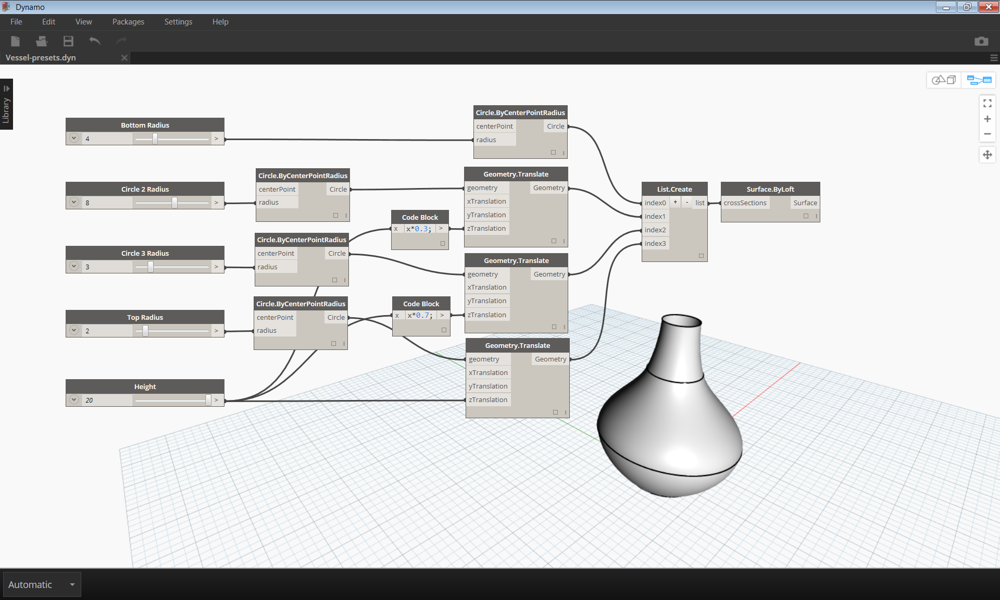
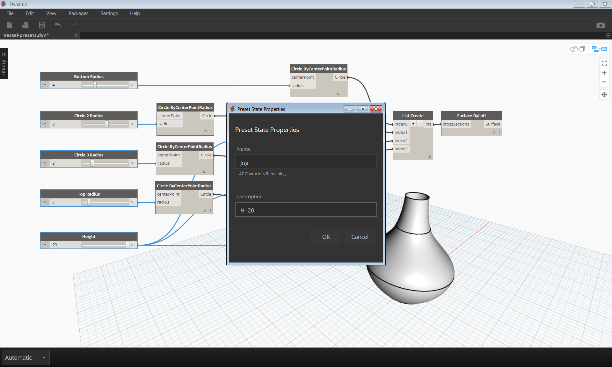
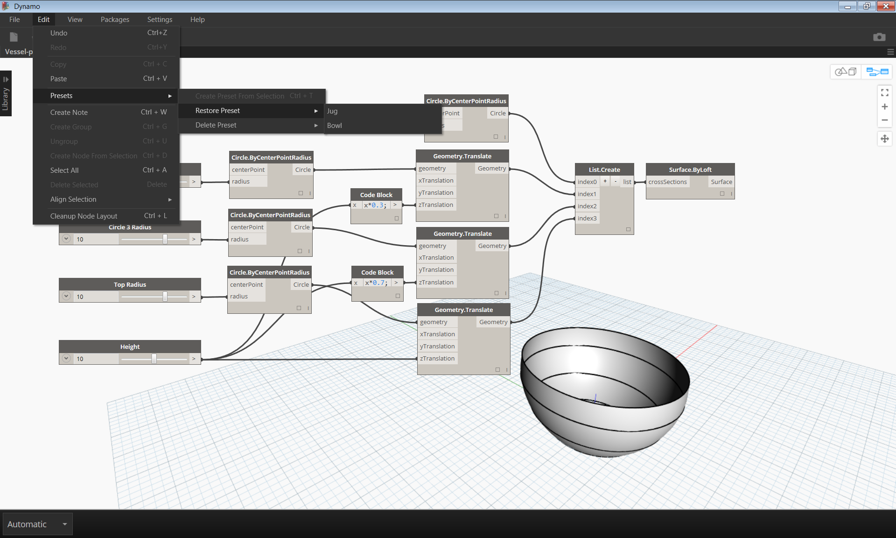
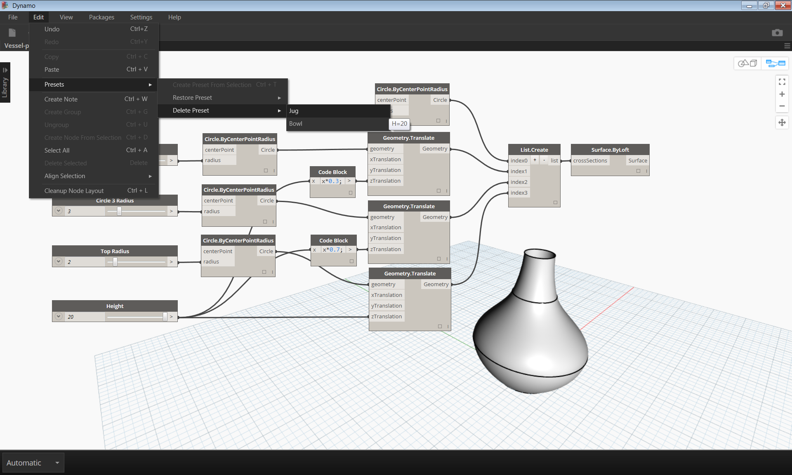

## Managing Your Data

###Presets

Presets are a way to take the current value of a selection of input nodes and save them as a preset state. These states can be restored through the Edit>Presets menu. Presets can be used to create and compare design iterations quickly.

###Creating Presets
To create a preset, select one or more input nodes such as numbers, strings, code blocks, selection nodes, and sliders. Right-click the canvas and select "Create Preset from Selection", or press Control+T. 
Let's take a look at an example. Below is a simple graph that creates a surface by lofting through a series of circles. 

>1. The inputs of the graph are a series of sliders controlling the height and radii

>Select the input sliders and type Control+T

>Enter a name and description for the saved state in the dialog. Create several states with different input values.

###Restoring Presets
To restore a saved preset, navigate to Edit>Presets>Restore Preset. This will set all the nodes in that state to the saved values. If a node in the state is no longer present in the graph (ie. if it has been deleted), all other nodes in the state will be set.

###Deleting Presets
To delete a preset, navigate to Edit>Presets>Delete Preset. This will remove a state from the list of saved states.

