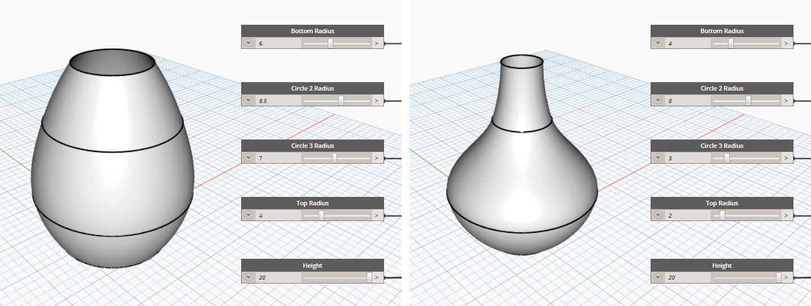
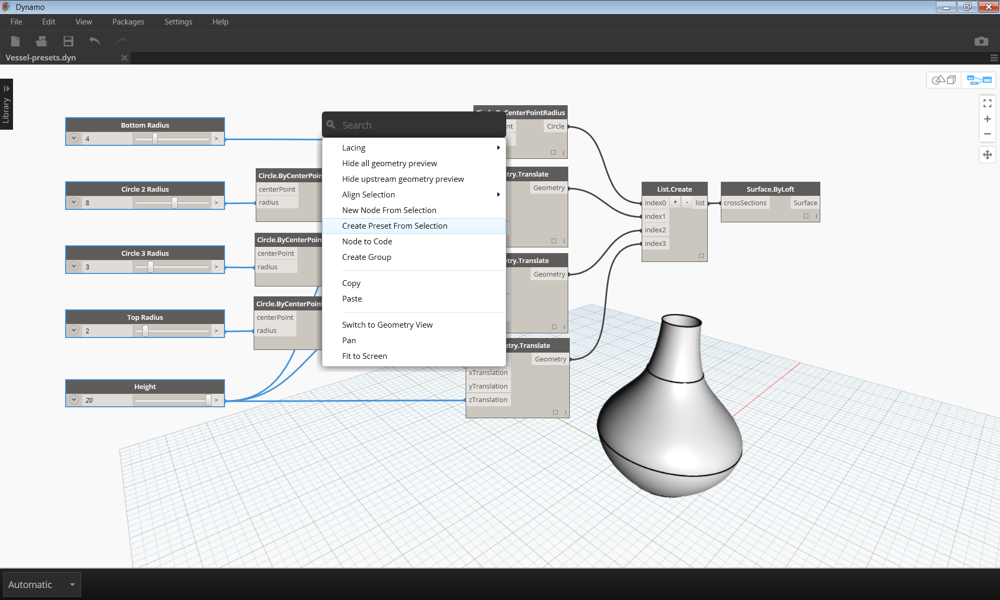

## Managing Your Data

In the previous section we looked at managing programs by aligning, grouping, and annotating nodes to organize the Workspace. These best practices help to reduce some of the visual complexity of your graph. Let's dive deeper and organize the complexity of content.  Often, a Dynamo graph has a wide range of parameters which offer countless design iterations.  We want to organize the range of options so that we can make real design decisions - and this is where Presets come in. 

Imagine that you've created a Dynamo graph to share with a team so that each team member can explore the parametric model. Before sharing, you want to be sure that the file is organized and legible for someone unfamiliar with the graph, or unfamiliar with visual programming at all. Inputs such as numbers, strings, code blocks, selection nodes, and sliders should be tidied up with formatting.  And further, the relationships between parameters can be organized into design schemes. The best way to do this is by saving Presets.

###Presets

Presets are a way to take the current value of a selection of input nodes and save them as a preset state. These states can be restored through the Edit>Presets menu. Presets can be used to create and compare design iterations. Presets are saved with the file, making them a useful tool for sharing or requesting feedback. They also allow another user to interact with the graph without having to search for the relevant inputs, or tune a set of values that work well together from a design perspective.

>1. Preset 1
>2. Preset 2

###Creating Presets
To create a preset, select one or more input nodes. Right-click the canvas and select "Create Preset from Selection", or press Control+T. 
Let's take a look at an example. Below is a simple graph that creates a surface by lofting through a series of circles. 

>1. The inputs of the graph are a series of sliders controlling the height and radii

>Select the input sliders and type Control+T

>Enter a name and description for the saved state in the dialog. Create several states with different input values.

###Restoring Presets
To restore a saved preset, navigate to Edit>Presets>Restore Preset. This will set all the nodes in that state to the saved values. If a node in the state is no longer present in the graph (ie. if it has been deleted), all other nodes in the state will be set.

###Deleting Presets
To delete a preset, navigate to Edit>Presets>Delete Preset. This will remove a state from the list of saved states.

