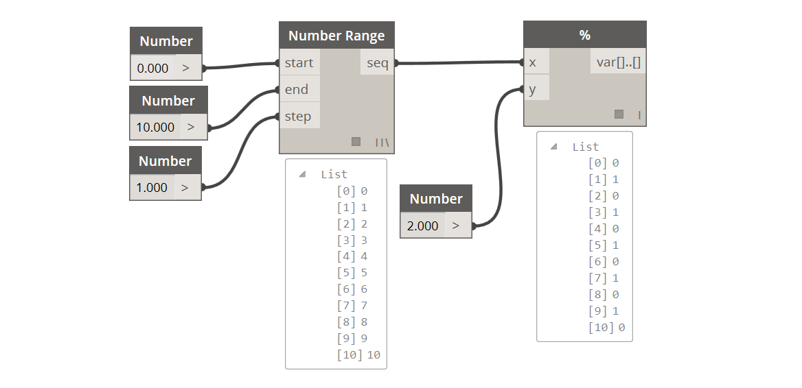

## 4.2.2 Arithmetic Operators
Operators are a set of components that use
algebraic functions with two numeric input values, which result in one output
value (addition, subtraction, multiplication, division, etc.).

You use the Math Operators to perform arithmetical
actions on a set of numbers. These can be found under Operators>Actions.

####Addition, Subtraction, Multiplication, Division


These four operators are commonplace.  Let's look at a few other operators which dive deeper:

####Exponent


Exponentiation, or the power operator, involves two numbers: the base number (x) and the power (y). The power of x to the y is defined as x repeatedly multiplied by itself for a total of y times.  For example:
```
2 ^ 3 = 2 x 2 x 2 = 8.```

####Square Root


The square root of x referes to the number z such that z^2=x.  This operator is commonplace in a wide-range of geometric applications, most notably the [Pythagorean Theorem](http://en.wikipedia.org/wiki/Pythagorean_theorem).  For example:
```
Sqrt(4) = 2```


####Absolute Value


The absolute value of a number refers to its non-negative value.  In other words
```
|-10| = 10 and |10| = 10```

This operator comes in handy when parametrically, especially when a calculation concerns itself with scalar values rather than vectors (ie speed vs. velocity).
####Modulo


The modulo operation refers to the remainder after a division. For example,
```
11 % 6 = 5 (6 goes into 11 once, and has a remainder, or modulo, of 5)```

While this may not seem like much, the modulo is a great tool for creating patterns.  The image below demonstrates how quickly one can parse out even and odd numbers with pure operations:

####Ceiling, Floor, Round
 


The ceiling, floor, and round operation refer to methods for reducing a decimal (or float) number to an integer.  In division, for example:
```
11/6 = 1.833```

The floor represents the lower bound of the integer within the decimal range.
```
Floor(11/6) = Floor(1.833) = 1```

The ceiling represents the upper bound.
```
Ceil(11/6) = Ceil(1.833) = 2```

The round operations will 'round' to the closest number in the range.
```
Round(11/6) = Round(1.833) = 2```


