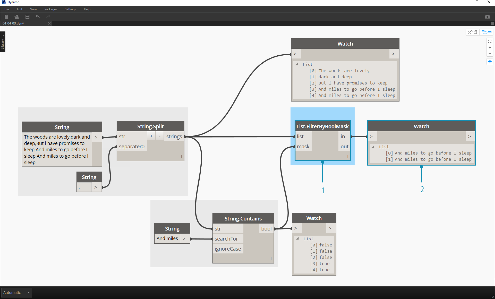

### 4.4.4 Strings Exercise
In this exercise, we're going to use methods of querying and manipulating strings to deconstruct the final stanza of Robert Frost's [Stopping By Woods on a Snowy Evening](http://www.poetryfoundation.org/poem/171621).  Not the most practical application, but it will help us to grasp conceptual string actions as we apply them to legible lines of rhythm and rhyme.

> Let's begin with a basic string split of the stanza.  We first notice that the writing is formatted based on commas.  We'll use this format to separate each line into individual items.
1. The base string is pasted into a string node.
2. Another string node is used to denote the separator.  In this case, we're using a comma.
3. A String.Split battery is added to the canvas and connected to the two strings.
4. The output shows that we've now separated the lines into individual elements.

> Now, let's get to the good part of the poem: the last two lines.  The original stanza was one item of data.  We separated this data into individual items in the first step. Now we need to do a search for the text we're looking for. And while we *can* do this by selecting the last two items of the list, if this were an entire book, we wouldn't want to read through everything and manually isolate the elements.
1. Instead of manually searching, we use a String.Contains battery to perform a search for a set of characters.  This is the similar to doing the "Find" command in a word processor.  In this case, we get a return of "true" or "false" if that substring is found within the item.
2. In the "searchFor" input, we define a substring that we're looking for within the stanza. Let's use a string node with the text "And miles".
3. The output gives us a list of falses and trues.  We'll use this boolean logic to filter the elements in the next step.

>1. List.FilterByBoolMask is the battery we want to use to cull out the falses and trues.  The "in" output return the statements with a "mask" input of "true, while the "out" output return those which are "false".
2. Our output from the "in" is as expected, giving us the final two lines of the stanza.

>Now, we want to drive home the repetition of the stanza by merging the two lines together.  When viewing the output of the previous step, we notice that there are two items in the list:
1. Using two List.GetItemAtIndex batteries, we can isolate the items using the values of 0 and 1 as the index input.
2. The output for each battery gives us, in order, the final two lines.

>To merge these two items into one, we use the String.Join battery:
1. After adding the String.Join battery, we notice that we need a separator.
2. To create the separator, we add a string node to the canvas and type in a comma.
3. The final output has merged the last two items into one.

This may seem like a lot of work to isolate the last two lines; and it's true, string operations often require some up front work.  But they are scalable, and they can be applied to large datasets with relative ease.  If you are working parametrically with spreadsheets and interoperability, be sure to keep string operations in mind.
