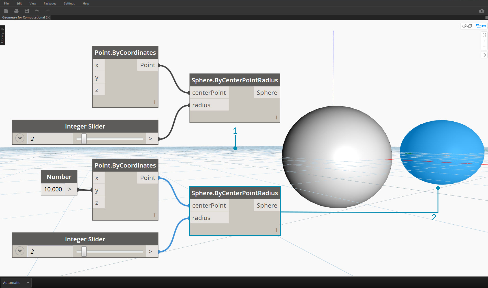

## Geometry Overview
**Geometry** is the language for design. When a programming language or environment has a geometry kernal at it's core, we can unlock the possibilities for designing precise and robust models, automating design routines, and generating design iterations with algorithms.

### The Basics
Geometry, traditionally defined, is the study of shape, size, relative position of figures, and the properties of space. This field has a rich history going back thousands of years. With the advent and popularization of the computer, we gained a powerful tool in defining, exploring, and generating geometry. It is now so easy to calculate the result of complex geometric interactions, the fact that we are doing so is almost transparent.

> If you're curious to see how diverse and complex geometry can get using the power of your computer, do a quick web search for the Stanford Bunny - a canonical model used to test algorithms.

Understanding geometry in the context of algorithms, computing, and complexity, may sound daunting; however, there are a few key, and relatively simple, principles that we can establish as fundamentals to start building towards more advanced applications:

1. Geometry is **Data** - to the computer and Dynamo, a Bunny not much different than a number.
2. Geometry relies on **Abstraction** - fundamentally, geometric elements are described by numbers, relationships, and formulas within a given spatial coordinate system
3. Geometry has a **Hierarchy** - points come together to make lines, lines come together to make surfaces, and so on
4.  Geometry simulataneously describes both **the Part and the Whole** - when we have a curve, it is both the shape as well as all the possible points along it

In practice, these principles mean that we need to be aware of what we are working with (what type of geometry, how was it created, etc.) so that we can fluidly compose, decompose, and recompose different geometries as we develop more complex models.

### Stepping through the Hierarchy
Let's take a moment to look at the relationship between the Abstract and Hierarchical descriptions of Geometry. Because these two concepts are related, but not always obvious at first, we can quickly arrive at a conceptual roadblock once we start developing deeper workflows or models. For starters, let's use dimensionality as an easy descriptor of the "stuff" we model. The number of dimensions required to describe a shape gives us a window into how Geometry is organized hierarchically.

> 1. A **Point** (defined by coordinates) doesn't have any dimensions to it - it's just numbers describing each coordinate
2. A **Line** (defined by two points) now has *one* dimension - we can "walk" the line either forward (positive direction) or backward (negative direction)
3. A **Plane** (defined by two lines) has *two* dimensions - walking more left or more right is now possible
4. A **Box** (defined by two planes) has *three* dimensions - we can define a position relative to up or down

Dimensionality is a convenient way to start categorizing Geometry but it's not necessarily the best. After all, we don't model with only Points, Lines, Planes, and Boxes - what if I want something curvy? Furthermore, there is a whole other category of Geometric types that are completely abstract ie. they define properties like orientation, volume, or relationships between parts. We can't really grab a hold of a Vector so how do we define it relative to what we see in space? A more detailed categorization of the geometric hierarchy should accommodate the difference between Abstract Types or "Helpers," each of which we can group by what they help do and types that help describe the shape of model elements.

### Geometry in Dynamo Studio
So what does this mean for using Dynamo? Understanding the Geometry types and how they are related will allow us to navigate the collection of **Geometry Nodes** available to us in the Library. The Geometry Nodes are organized alphabetically as opposed to hierarchically - here we've highlighted them relative to the chart above.

>1. Abstract Types
2. Points
3. Curves
4. Surfaces
5. Solids
6. Meshes

Additionally, making models in Dynamo and connecting the preview of what we see in the Background Preview to the flow of data in our graph should become more intuitive over time.

> 1. Note the assumed coordinate system rendered by the grid and colored axes
3. Selected Nodes will render the corresponding geometry (if the Node creates geometry) in the background the highlight color

### Going Further with Geometry
Creating models in Dynamo is not limited to what we can generate with Nodes. Here are some key ways to take your process to the next level with Geometry:

1. Dynamo allows you to import files - try using a CSV for point clouds or SAT for bringing in surfaces
2. When working with Revit, we can reference Revit elements to use in Dynamo
3. The Dynamo Package Manager offers additional functionality for extended geometry types and operations - check out the [Mesh Toolkit](https://github.com/DynamoDS/Dynamo/wiki/Dynamo-Mesh-Toolkit) package

