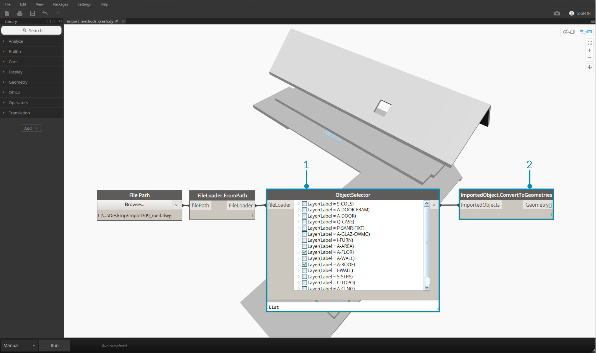

## ATF Translation Service
Nodes for importing a DWG into the Dynamo environment are found under the translation tab. The following examples demonstrate the series of components used to browse for a file, import the file contents, and convert it into usable Dynamo geometry. Dynamo also gives us the ability to filter through and select objects, so we are able to call specific objects within a DWG file.

###Get Imported Objects
The simplest way to import DWG date into Dynamo Studio is by importing the entire file into the workspace:

>1.	Use the File Path component to browse for the DWG file to be imported into Dynamo.
2.	Connect to **FileLoader.FromPath** to read the file.
3.	Use the **FileLoader.GetImportedObjects** component to parse the geometry into Dynamo Studio.
4.	**ImportedObject.ConvertToGeometries** will convert the objects into usable geometry in the Dyanamo workspace.

### Object Filter
A filtered geometry import is achieved by supplementing the definition with a **ObjectFilter** node. The **ObjectFilter** node is compatible with either a **FileLoader** or a list of **ImportedObject**, and outputs a list of **ImportedObject**.

The following images show stated conditions iin one or more **ObjectFilter** nodes — any **ImportedObject** that satisfies any of the listed conditions will pass through the filter. Filtering can be based on layer label (i.e. layer name), geometry type, diffuse color, etc.

>1.	Replace **FileLoader.GetImportedObjects** with **ObjectFilter** to search for specific conditions in the DWG file. – in this case only surface geometry will be imported, removing all curve and line geometry visible in the previous image.
2.	Connect Filter to **ImportedObject.ConvertToGeometries** to import the filtered geometry.

>1.	Replace **FileLoader.GetImportedObjects** with two **ObjectFilter** modules using different conditionals – this will separate the geometry from one file into two different streams.
2.	Connect Filter to **ImportedObject.ConvertToGeometries** to import the filtered geometry.
3.	Connect **ImportedObject.ConvertToGeometries** to **Display.ByGeometryColor** to visualize each stream in a different color. 

###Explicit Object Selection

>1.	Replace FileLoader.GetImportedObjects with ObjectSelector to call for specific layers and objects within a DWG file.
2.	Connect Filter to ImportedObject.ConvertToGeometries. 

