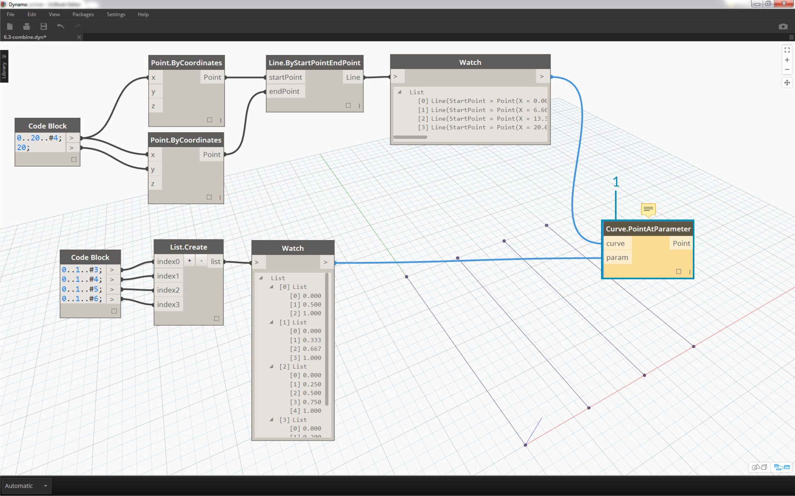
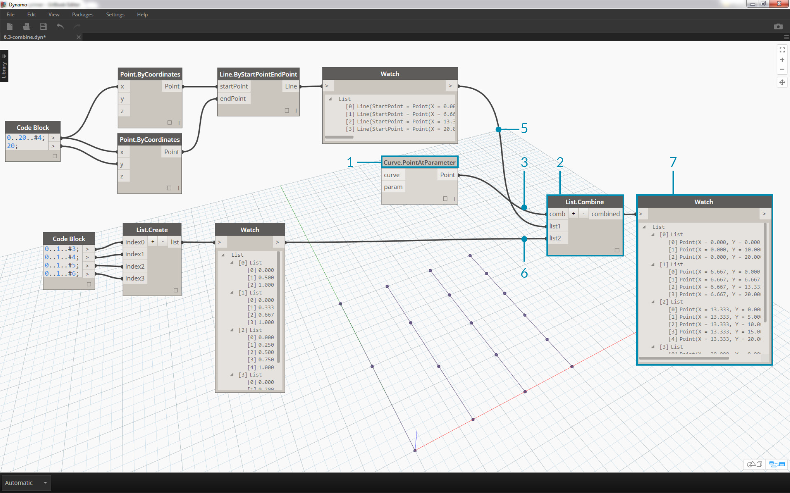
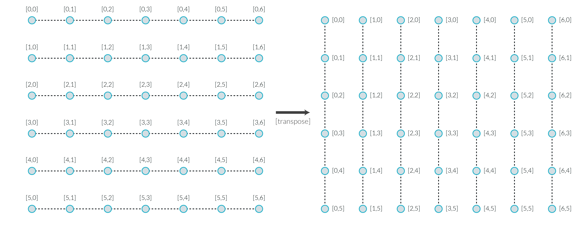

## Lists of Lists
Let's add one more tier to the hierarchy.  If we take the deck of cards from the original example and create a box which contains multiple decks, the box now represents a list of decks, and each deck represents a list of cards.  This is a list of lists.  For the analogy in this section, the red box below contains a list of coin rolls, and each roll contains a list of pennies.


> Photo by [Dori](https://commons.wikimedia.org/wiki/File:Stack_of_coins_0214.jpg).

What **queries** can we make from the list of lists? This accesses existing properties.
* Number of coin types? 2.
* Coin type values? $0.01 and $0.25.
* Material of quarters? 75% copper and 25% nickel.
* Material of pennies? 97.5% zinc and 2.5% copper.

What **actions** can we perform on the list of lists? This changes the list of lists based on a given operation.
* Select a specific stack of quarters or pennies.
* Select a specific quarter or penny.
* Rearrange the stacks of quarters and pennies.
* Shuffle the stacks together.

Again, Dynamo has an analagous node for each one of the operations above. Since we're working with abstract data and not physical objects, we need a set of rules to govern how we move up and down the data hierarchy.

When dealing with lists of lists, the data is layered and complex, but this provides an opportunity to do some awesome parametric operations.  Let's break down the fundamentals and discuss a few more operations in the lessons below.

##Top-Down Hierarchy

The fundamental concept to learn from this section: **Dynamo treats lists as objects in and of themselves**.  This top-down hierarchy is developed with object-oriented programming in mind.  Rather than selecting sub-elements with a command like List.GetItemAtIndex, Dynamo will select that index of the main list in the data structure.  And that item can be another list.  Let's break it down with an example image:

#### Exercise - Top-Down Hierarchy
>Download the example file that accompanies this exercise (Right click and "Save Link As..."): [Top-Down-Hierarchy.dyn](datasets/6-3/Top-Down-Hierarchy.dyn). A full list of example files can be found in the Appendix.


>1. With *code block*, we've defined two ranges:```
0..2;
0..3;
```
2. These ranges are connected to a *Point.ByCoordinates* node with lacing set to *"Cross Product"*.  This creates a grid of points, and also returns a list of lists as an output.
3. Notice that the *Watch* node gives 3 lists with 4 items in each list.
4. When using *List.GetItemAtIndex*, with an index of 0, Dynamo selects the first list and all of its contents.  Other programs may select the first item of every list in the data structure, but Dynamo employs a top-down hierarchy when dealing with data.

###Flatten and List.Flatten
Flatten removes all tiers of data from a data structure. This is helpful when the data hierarchies are not necessary for your operation, but it can be risky because it removes information.  The example below shows the result of flattening a list of data.

#### Exercise - Flatten
>Download the example file that accompanies this exercise (Right click and "Save Link As..."): [Flatten.dyn](datasets/6-3/Flatten.dyn). A full list of example files can be found in the Appendix.


> 1. Insert one line of code to define a range in *code block*:```
-250..-150..#4;
```
2. Plugging the *code block* into the *x* and *y* input of a *Point.ByCoordinates* node, we set the lacing to *"Cross Product"* to get a grid of points.
3. The *Watch* node shows that we have a list of lists.
4. A *PolyCurve.ByPoints* node will reference each list and create a respective polycurve.  Notice in the Dynamo preview that we have four polycurve representing each row in the grid.


>1. By inserting a *flatten* before the polycurve node, we've created one single list for all of the points.  The polycurve node references a list to create one curve, and since all of the points are on one list, we get one zig-zag polycurve which runs throughout the entire list of points.

There are also options for flattening isolated tiers of data.  Using the List.Flatten node, you can define a set number of data tiers to flatten from the top of the hierarchy.  This is a really helpful tool if you're struggling with complex data structures which are not necessarily relevant to your workflow.  And another option is to use the flatten node as a function in List.Map.  We'll discuss List.Map more below.

###Chop
When parametric modeling, there are also times where you'll want to add more data structure to an existing list.  There are many nodes available for this as well, and chop is the most basic version.  With chop, we can partition a list into sublists with a set number of items.

#### Exercise - List.Chop
>Download the example file that accompanies this exercise (Right click and "Save Link As..."): [Chop.dyn](datasets/6-3/Chop.dyn). A full list of example files can be found in the Appendix.


> A *List.Chop *with a *subLength* of 2 creates 4 lists with 2 items each.

The chop command divides lists based on a given list length. In some ways, chop is the opposite of flatten: rather than removing data structure, it adds new tiers to it.  This is a helpful tool for geometric operations like the example below.


###List.Map and List.Combine
A List.Map/Combine applies a set function to an input list, but one step down in the hierarchy. Combinations are the same as Maps, except combinations can have multiple inputs corresponding to the input of a given function.

#### Exercise - List.Map
>Download the example file that accompanies this exercise (Right click and "Save Link As..."): [Map.dyn](datasets/6-3/Map.dyn). A full list of example files can be found in the Appendix.

As a quick introduction, let's review the List.Count node from a previous section.


> The *List.Count* node counts all of the items in a list. We'll use this to demonstrate how *List.Map* works.


> 1. Insert two lines of code into the *code block*:
```
-50..50..#Nx;
-50..50..#Ny;
```
After typing in this code, the code block will create two inputs for Nx and Ny.
2. With two *integer sliders*, define the *Nx* and *Ny* values by connecting them to the *code block*.
3. Connect each line of the code block into the respective *X* and *Y* inputs of a *Point.ByCoordinates* node.  Right click the node, select "Lacing", and choose *"Cross Product"*.  This creates a grid of points.  Because we defined the range from -50 to 50, we are spanning the default Dynamo grid.
4. A *Watch* node reveals the points created.  Notice the data structure.  We've created a list of lists.  Each list represents a row of points of the grid.


> 1. Attach a *List.Count* node to the output of the watch node from the previous step.
2. Connect a *Watch* node to the List.Count output.

Notice that the List.Count node gives a value of 5.  This is equal to the "Nx" variable as defined in the code block.  Why is this?

* First, the Point.ByCoordinates node uses the "x" input as the primary input for creating lists.  When Nx is 5 and Ny is 3, we get a list of 5 lists, each with 3 items.
* Since Dynamo treats lists as objects in and of themselves, a List.Count node is applied to the main list in the hierarchy.  The result is a value of 5, or, the number of lists in the main list.


> 1. By using a *List.Map* node, we take a step down in the hierarchy and perform a *"function"* at this level.
2. Notice that the *List.Count* node has no input. It is being used as a function, so the *List.Count* node will be applied to every individual list one step down in the hierarchy.  The blank input of *List.Count* corresponds to the list input of *List.Map*.
3. The results of *List.Count* now gives a list of 5 items, each with a value of 3.  This represents the length of each sublist.

#### Exercise - List.Combine
>Download the example file that accompanies this exercise (Right click and "Save Link As..."): [Combine.dyn](datasets/6-3/Combine.dyn). A full list of example files can be found in the Appendix.

In this exercise, we'll use a similar logic to List.Map, but with multiple elements.  In this case, we want to divide a list of curves by a unique number of points.


> 1. Using the *code block*, define a range using the syntax: ```..20..#4;
``` and a value of ```20;
``` below that line.
2. Connect the *code block* to two *Point.ByCoordinates* nodes.
3. Create a *Line.ByStartPointEndPoint* from the *Point.ByCoordinates* nodes.
4. The *Watch* node shows four lines.


> 1. Below the graph for line creation, we want to use *code block *to create four distinct ranges to divide the lines uniquely. We do this with the following lines of code:
```
0..1..#3;
0..1..#4;
0..1..#5;
0..1..#6;
```
2. With a *List.Create* node, we merge the four lines from the *code block* into one list.
3. The *Watch* node reveals a list of lists.


> 1. *Curve.PointAtParameter* will not work by connecting the lines directly into the *parameter* values.  We need to step one level down on the hierarchy. For this, we'll use *List.Combine*.


> By using *List.Combine*, we can successfully divide each line by the given ranges.  This gets a little tricky, so we'll break it down in-depth.
1. First, add a *Curve.PointAtParameter* node to the canvas.  This will be the *"function" *or *"combinator"* that we apply to *List.Combine* node. More on that in a second.
2. Add a *List.Combine* node to the canvas.  Hit the *"+"* or *"-"* to add or subtract inputs. In this case, we'll use the default two inputs on the node.
3. We want to plug the *Curve.PointAtParameter* node into the *"comb"* input of *List.Combine*. And one more important node: be sure to right-click the *"param" *input of *Curve.PointAtParameter* and uncheck *"use default value"*. Default values in Dynamo inputs have to be removed when running a node as a function.  In other words, we should consider default values as having additional nodes wired to them.  Because of this, we need to remove the default values in this case.
4. We know we have two inputs, the lines and the parameters to create points. But how do we connect them to the *List.Combine* inputs and in what order?
5. The empty inputs of *Curve.PointAtParameter*, from top-to-bottom need to be filled in the combinator in the same order.  So, the lines are plugged into *list1* of *List.Combine*.
6. Following suit, the parameter values are plugged into the *list2* input of *List.Combine*.
7. The *Watch* node and the Dynamo preview shows us that we have 4 lines, each divided based on the *code block* ranges.

### List@Level

An alternative to List.Map, the List@Level feature allows you to directly select which level of list you want to work with right at the input port of the node. This feature can be applied to any incoming input of a node and will allow you access the levels of your lists quicker and easier than other methods. Just tell the node what level of the list you want to use as the input and let the node do the rest.

#### List@Level Exercise

In this exercise, we will use the List@Level feature to isolate a specific level of data.

> Download the example file that accompanies this exercise \(Right click and "Save Link As..."\): [UPDATE](datasets/6-3/Transpose.dyn). A full list of example files can be found in the Appendix.


>1. We will start with a simple 3D grid of points.
2. Since the grid is constructed with a Range for X, Y and Z, we know that the data is structured with 3 tiers: an X List, Y List and Z List.
3. These tiers exist at different **Levels**. The Levels are indicated at the bottom of the Preview Bubble. The list Levels columns correspond to the list data above to help identify which level to work within.
4. The List Levels are organized in reverse order so that the lowest level data is always in “L1”. This will help ensure that your graphs will work as planned, even if anything is changed upstream.


>1. To use the List@Level function, click “>”. Inside this menu, you will see two checkboxes.
2. **Use Levels** - This enables the List@Level functionality. After clicking on this option, you will be able to click through and select the input list levels you want the node to use. With this menu, you can quickly try out different level options by clicking up or down.
3. **Keep list structure** – If enabled, you will have the option to keep that input’s level structure. Sometimes, you may have purposefully organized your data into sublists. By checking this option, you can keep your list organization intact and not lose any information.

With our simple 3D grid, we can access and visualize the list structure by toggling through the List Levels. Each List Level and index combination will return a different set of points from our original 3D set.


>1. “@L2” in DesignScript allows us to select only the List at Level 2.
2. The List at Level 2 with the index 0 includes only the first set of Y points, returning only the XZ grid.
3. If we change the Level filter to “L1”, we will be able to see everything in the first List Level. The List at Level 1 with the index 0 includes all of our 3D points in a flat list.
4. If we try the same for “L3” we will see only the third List Level points. The List at Level 3 with the index 0 includes only the first set of Z points, returning only an XY grid.
5. If we try the same for “L4” we will see only the third List Level points. The List at Level 4 with the index 0 includes only the first set of X points, returning only an YZ grid.

###Transpose
Transpose is a fundamental function when dealing with lists of lists. Just as in spreadsheet programs, a transpose flips the columns and rows of a data structure. We'll demonstrate this with a basic matrix below, and in the following section, we'll demonstrate how a transpose can be use to create geometric relationships.



#### Exercise - List.Transpose
>Download the example file that accompanies this exercise (Right click and "Save Link As..."): [Transpose.dyn](datasets/6-3/Transpose.dyn). A full list of example files can be found in the Appendix.


> Let's delete the *List.Count* nodes from the previous exercise and move on to some geometry to see how the data structured.
1. Connect a *PolyCurve.ByPoints* to the output of the watch node from *Point.ByCoordinates*.
2. The output shows 5 polycurves, and we can see the curves in our Dynamo preview.  The Dynamo node is looking for a list of points (or a list of lists of points in this case) and creating a single polycurve from them.  Essentially, each list has converted to a curve in the data structure.


> 1. If we want to isolate one row of curves, we use the *List.GetItemAtIndex* node.
2. Using a *code block* value of 2, query the 3rd element in the main list.
3. The *PolyCurve.ByPoints* gives us one curve, since only one list is connected to the node.


> 1. A *List.Transpose* node will switch all of the items with all of the lists in a list of lists.  This sounds complicated, but it's the same logic as transpose in Microsoft Excel: switching columns with rows in a data structure.
2. Notice the abstract result: the transpose changed the list structure from a 5 lists with 3 items each to 3 lists with 5 items each.
3. Notice the geometric result: using *PolyCurve.ByPoints*, we get 3 polycurves in the perpendicular direction to the original curves.

###Code Block Creation
Code block shorthand uses "{}" to define a list.  This is a much faster and more fluid way to create list than the List.Create node. Code block is discussed in more detail in Chapter 7.  Reference the image below to note how a list with multiple expressions can be defined with code block.


###Code Block Query
Code block shorthand is uses "[]" as a quick and easy way to select specific items that you want from a complex data structure. Code blocks are discussed in more detail in Chapter 7.  Reference the image below to note how a list with multiple data types can be queried with code block.


###Exercise - Querying and Inserting Data
>Download the example file that accompanies this exercise (Right click and "Save Link As..."): [ReplaceItems.dyn](datasets/6-3/ReplaceItems.dyn). A full list of example files can be found in the Appendix.

This exercise uses some of the logic established in the previous one to edit a surface. Our goal here is intuitive, but the data structure navigation will be more involved.  We want to articulate a surface by moving a control point.


> 1. Begin with the string of nodes above. We are creating a basic surface which spans the default Dynamo grid.
2. Using *code block*, insert these two lines of code and connect to the *u* and *v* inputs of *Surface.PointAtParameter*, respectively:
```
-50..50..#3;
-50..50..#5;
```
3. Be sure to set the Lacing of *Surface.PointAtParameter* to *"Cross Product"*.
4. The *Watch* node show that we have a list of 3 lists, each with 5 items.


> In this step,  we want to query the central point in the grid we've created.  To do this we'll select the middle point in the middle list.  Makes sense, right?
1. To confirm that this is the correct point, we can also click through the watch node items to confirm that we're targeting the correct one.
2. Using *code block*, we'll write a basic line of code for querying a list of lists:
```points[1][2];```
3. Using *Geometry.Translate*, we'll move the selected point up in the *Z* direction by *20* units.


> 1. Let's also select the middle row of points with a *List.GetItemAtIndex* node.  Note: Similar to a previous step, we can also query the list with *code block*, using a line of ```points[1];```


> So far we've successfully queried the center point and moved it upward.  Now we want need to insert this moved point back into the original data structure.
1. First, we want to replace the item of the list we isolated in a previous step.
2. Using *List.ReplaceItemAtIndex*, we'll replace the middle item by using and index of *"2"*, with the replacement item connected to the moved point (*Geometry.Translate*).
3. The output shows that we've input the moved point into the middle item of the list.


> Now that we've modified the list, we need to insert this list back into the original data structure: the list of lists.
1. Following the same logic, use *List.ReplaceItemAtIndex* to replace the middle list with the our modified list.
2. Notice that the *code blocks* defining the index for these two nodes are 1 and 2, which matches the original query from the *code block* (*points[1][2]*).
3. By selecting the list at *index 1*, we see the data structure highlighted in the Dynamo preview.  We successfully merged the moved point into the original data structure.


> There are many ways to make a surface from this set of points.  In this case, we're going to create a surface by lofting curves together.
1. Create a *NurbsCurve.ByPoints* node and connect the new data structure to create three nurbs curves.


> 1. Connect a *Surface.ByLoft* to the output from *NurbsCurve.ByPoints*.  We now have a modified surface.  We can change the original *Z* value of Geometry. Translate and watch the geometry update!


