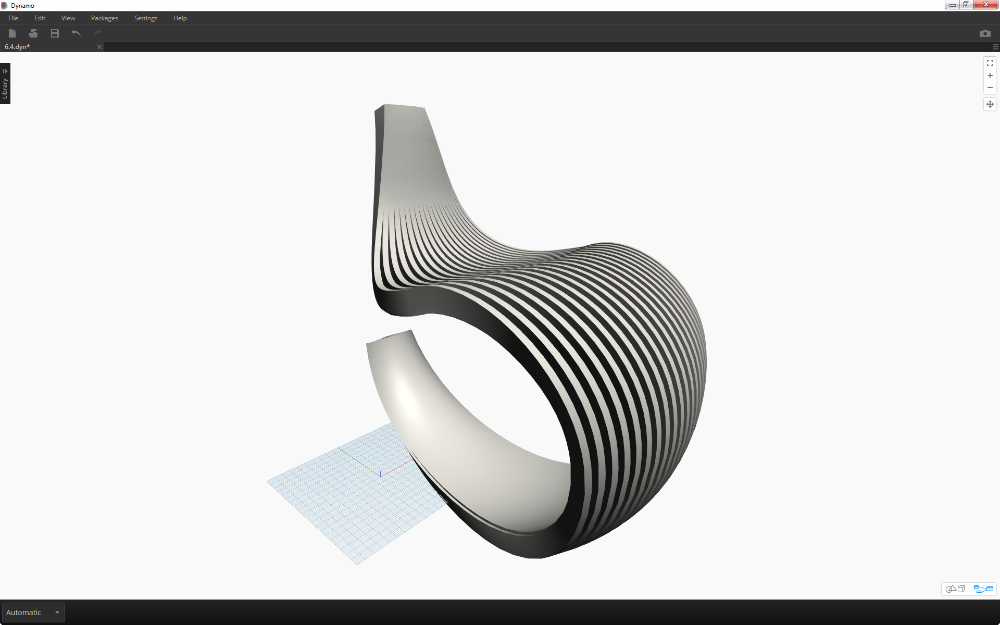
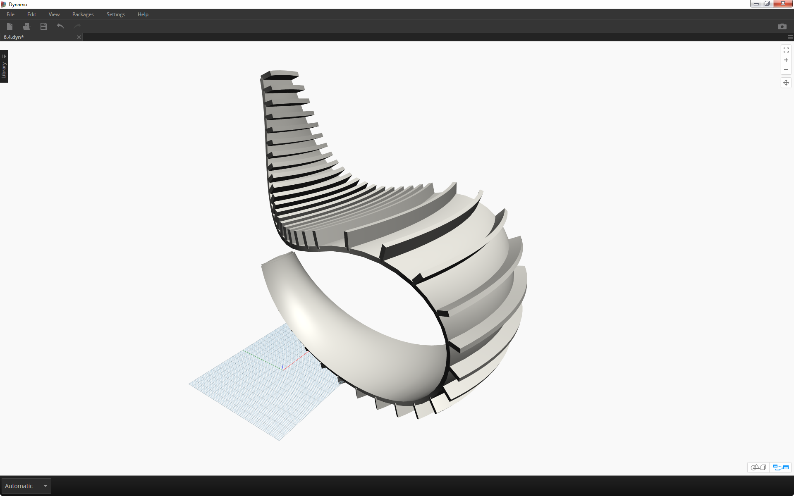

## n-Dimensional Lists
Text


###Exercise
This exercise is the first in a series of three which focuses on articulating imported geometry.  Each part in this series of exercises will increase in complexity in data structure.


> 1. Let's begin with the .sat file in the exercise file folder.  We can grab this file using the File Path node.
2. With Geometry.ImportFromSAT, the geometry is imported into our Dynamo preview as two surfaces.


> For this exercise, we want to keep it simple and work with one of the surface.
1. Let's select the index of 1 to grab the upper surface.  We do this with List.GetItemAtIndex node.


> The next step is to divide the surface into a grid of points.
1. Using code block, insert these two lines of code:
```
0..1..#10;
0..1..#5;
```
2. With the Surface.PointAtParmaeter, connect the two code block values to u and v.  Change the lacing of this node to "Cross Product".
3. The output reveals the data structure, which is also visible in the Dynamo preview.


> 1. To get a look at how the data structure is organized, let's connect a NurbsCurve.ByPoints to the output of Surface.PointAtParameter.
2. Notice we have ten curves running vertically along the surface.


> 1. A basic List.Transpose will flip the columns and rows of a list of lists.
2. Connecting the output of List.Transpose to NurbsCurve.ByPoints, we now get five curves running horizontally across the surface.


###Exercise
Let's increase the complexity.  Suppose we wanted to perform an operation on the curves created from the previous exercise.  Perhaps we want to relate these curves to another surface and loft between them.  This requires more attention to data structure, but the underlying logic is the same.


> 1. Begin with a step from the previous exercise, isolating the upper surface of the imported geometry with the List.GetItemAtIndex node.


> 1. Using Surface.Offset, offset the surface by a value of 10.


> 1. In the same manner as the previous exercise, define a code block with these two lines of code:
```
0..1..#10;
0..1..#5;
```
2. Connect these outputs to two Surface.PointAtParameter nodes, each with lacing set to "Cross Product".  One of these nodes is connected to the original surface, while the other is connected to the offset surface.


> 1. As in the previous exercise, connect the outputs to two NurbsCurve.ByPoints nodes.
2. Our Dynamo preview shows two curves, corresponding to two surfaces.


> 1. By using List.Create, we can combine the two sets of curves into one list of lists.
2.  Notice from the output, we have two lists with ten items each, representing each connect set of nurbs curves.
3. By performing a Surface.ByLoft, we can visually make sense of this data structure.  The node lofts all of the curves in each sublist.


> 1. By using List.Transpose, remember, we are flipping all of the columns and rows.  This node will transfer two lists of ten curves into ten lists of two curves.  We now have each nurbs curve related to the neighboring curve on the other surface.
2. Using Surface.ByLoft, we arrive at a ribbed structure.


> 1. An alternative to List.Transpose uses List.Combine. This will operate a "combinator" on each sublist.
2. In this case, we're using List.Create as the "combinator", which will create a list of each item in the sublists.
3. Using the Surface.ByLoft node, we get the same surfaces as in the previous step. Transpose is easier to use in this case, but when the data structure becomes even more complex, List.Combine is more reliable.


> 1. Stepping back a few steps, if we want to switch the orienation of the curves in the ribbed structure, we want to use a List.Transpose before before connect to NurbsCurve.ByPoints.  This will flip the columns and rows, giving us 5 horizontal ribs.


###Exercise
Now, we're going to go even one step further.  In this exercise, we'll work with both imported surfaces, creating a complex data hierarchy.  Still, our aim is to complete the same operation with the same underlying logic.


> 1. Begin with the imported file from previous exercise.


> 1. Descriptive Text
2. More descriptive Text


> 1. Descriptive Text
2. More descriptive Text


> 1. Descriptive Text
2. More descriptive Text


> 1. Descriptive Text
2. More descriptive Text


> 1. Descriptive Text
2. More descriptive Text


> 1. Descriptive Text
2. More descriptive Text


> 1. Descriptive Text
2. More descriptive Text


> 1. Descriptive Text
2. More descriptive Text


> 1. Descriptive Text
2. More descriptive Text


> 1. Descriptive Text
2. More descriptive Text


> 1. Descriptive Text
2. More descriptive Text


> 1. Descriptive Text
2. More descriptive Text


> 1. Descriptive Text
2. More descriptive Text


> 1. Descriptive Text
2. More descriptive Text


> 1. Descriptive Text
2. More descriptive Text

