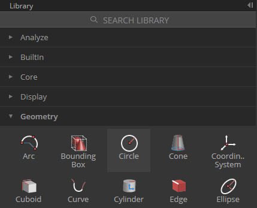
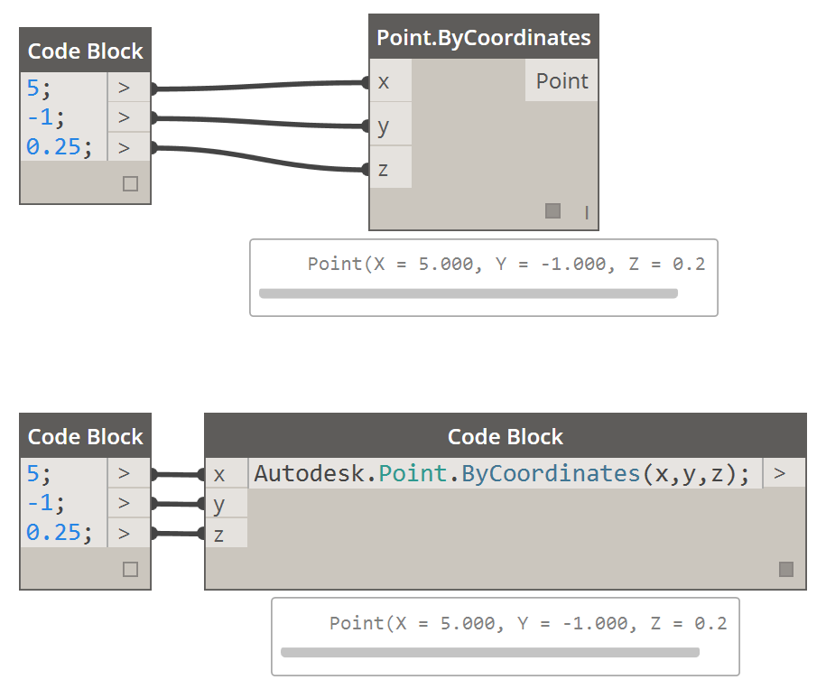
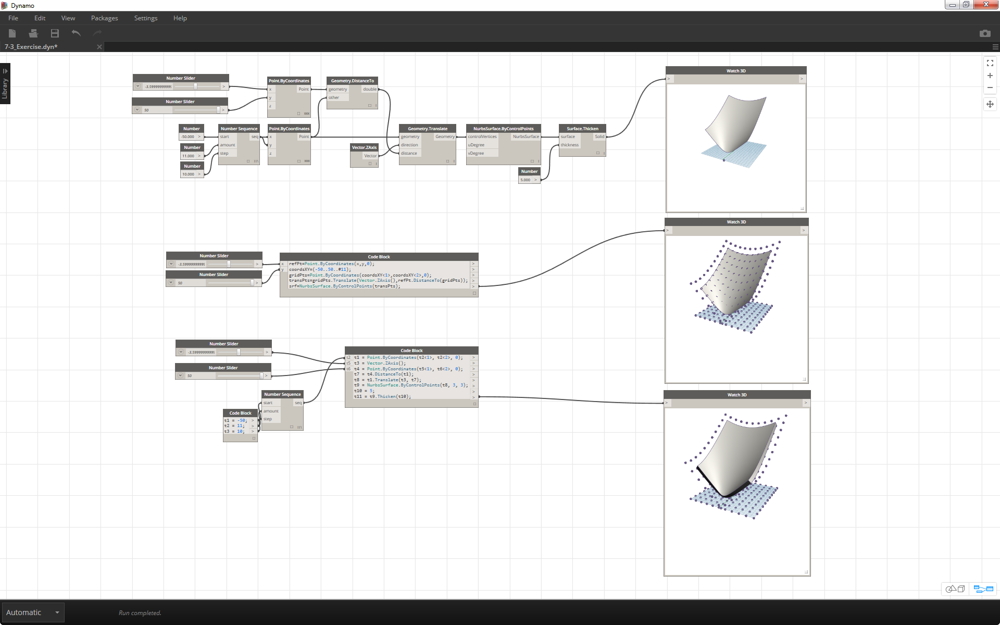
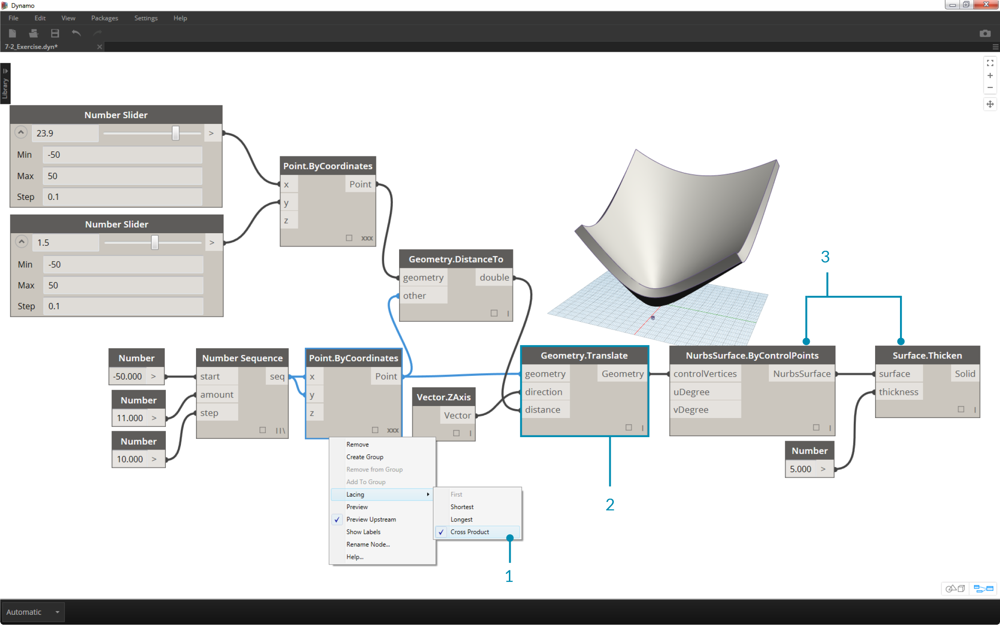
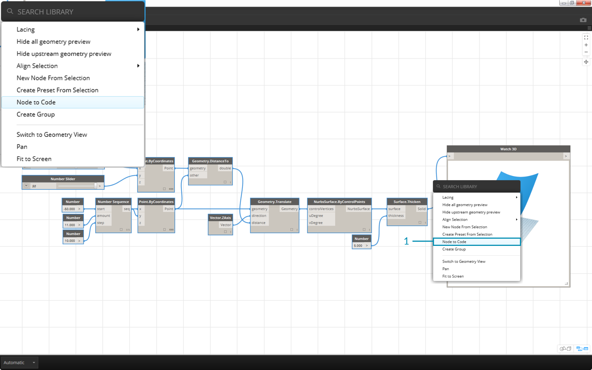

## Dynamo Language Syntax
Text

### Node Names
You can call any regular node in the library through a Code Block as long as the node isn’t a special “UI” node: those with a special user interface feature. For instance, you can call Circle.ByCenterPointRadius, but it wouldn’t make much sense to call a Watch 3D node.

Regular nodes (most of your library), generally come in three types:

Create:	Create something

Action:	Perform an action on something

Query:	Get a property of something that already exists

You’ll find that your library is organized with these categories in mind. Methods, or nodes, of these three types are treated differently when invoked within a Code Block.

### "." Format
Text

### Exercise
Text

>1. Descriptive Text
2. Second step of descriptive text

>1. Descriptive Text
2. Second step of descriptive text

>1. Descriptive Text
2. Second step of descriptive text

>1. Descriptive Text
2. Second step of descriptive text

>1. Descriptive Text
2. Second step of descriptive text

>1. Descriptive Text
2. Second step of descriptive text

>1. Descriptive Text
2. Second step of descriptive text

>1. Descriptive Text
2. Second step of descriptive text

>1. Descriptive Text
2. Second step of descriptive text

>1. Descriptive Text
2. Second step of descriptive text

>1. Descriptive Text
2. Second step of descriptive text

>1. Descriptive Text
2. Second step of descriptive text

