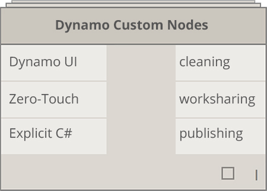
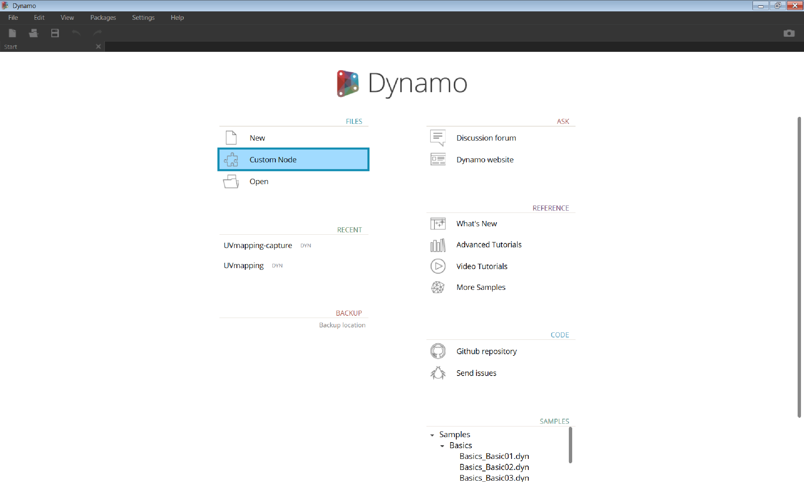
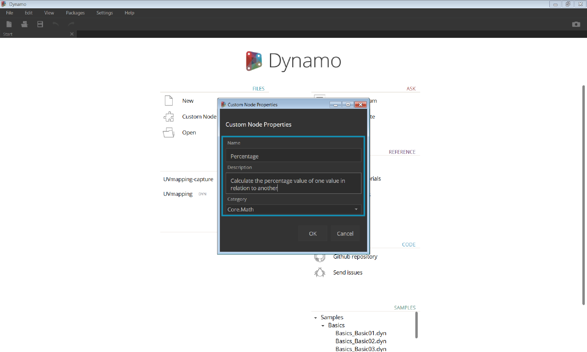
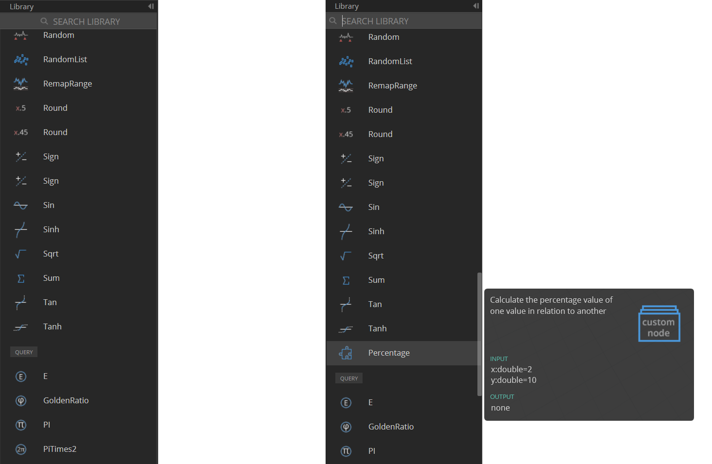

## Custom Nodes
Dynamo offers many core nodes for a wide-range of visual programming tasks. But sometimes a quicker, more elegant, and more easily shared solution is to build your own nodes. These can be reused among different projects, they make your program clearer and cleaner, and they can be pushed to the package manager and shared.

###Cleaning up Your Graph

Custom Nodes are constructed by nesting other nodes and custom nodes inside of a container. When this container node is executed in your graph, everything inside it will be executed.  This can help make your graph clearer and cleaner, as well as allow you to reuse and share a useful combination of nodes.

###Adapting to Change
By having multiple copies of one custom node in your graph, you can update all of them by editing the base custom nodes. This allows you to update your graph seamlessly by adapting to any changes that may occur in workflow or design.

###Worksharing
Arguably the best feature of custom nodes is their worksharing capabilities. If a *power user* creates a complex Dynamo graph and hands it off to a designer who is new to Dynamo, he/she can condense the graph to the bare essentials for design interaction.  The custom node can be opened to edit the guts of the graph, but the skin can be kept simple.  With this process, custom nodes allow Dynamo users to design a graph that is clean and intuitive.

###Many Ways to Build a Node
There is a wide variety of ways to build custom nodes in Dynamo. In the examples in this chapter, we'll create custom nodes directly from the Dynamo UI.  If you're a programmer and are interested in C# or Zero-Touch formatting, you can reference [this page ](https://github.com/DynamoDS/Dynamo/wiki/How-To-Create-Your-Own-Nodes)on the Dynamo Wiki for a more in depth review.

### Custom Node Environment
Let's jump into the custom node environment and make a simple node to calculate percentage.  The custom node environment is different from the Dynamo graph environment, but the interaction is fundamentally the same. Time to create our first custom node!

> To create a Custom Node from scratch, Launch Dynamo and select Custom Node, or type Ctrl + Shift + N from the canvas.

> Assign a name, description, and category in the Custom Node Properties dialog.

> This will open a canvas with a yellow background, indicating that you are working inside of a custom node. In this canvas you have access to all of the core Dynamo nodes, as well as the **Input** and **Output** nodes.

> 1. **Inputs:** input nodes create input ports on the custom node. The syntax for an input node is *input name : datatype = default value(optional)*
2. **Outputs:** Similar to inputs, these will create output ports on the custom node.

You can save this custom node as a .dyf file and add it to your session under  *File > Import Library*. Once you have imported the custom node, you should see it in the category specified when the node was created. 

> Left: The Core > Math category of the default library
Right: Core > Math with the new custom node

###Moving Forward
Now that we've created our first custom node, the next sections will dive deeper into custom node functionality and publication for generic workflows.  In the following section, we'll look at developing a package, using custom nodes, which transfers geometry from one surface to another.
