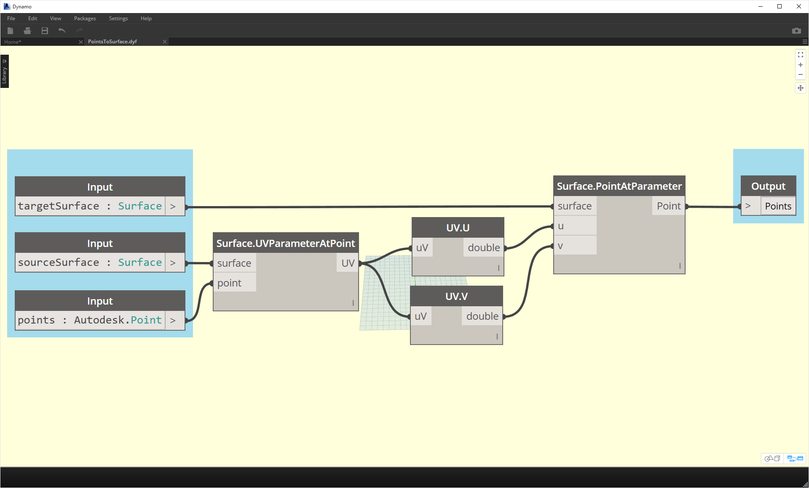
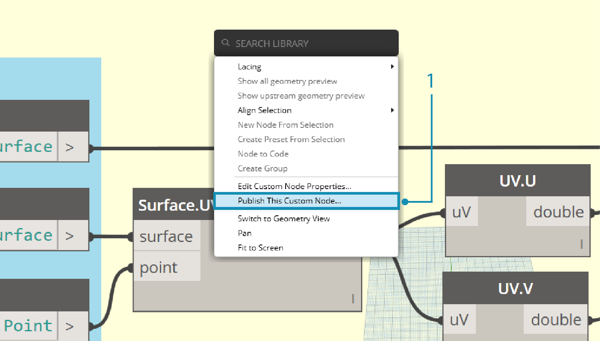
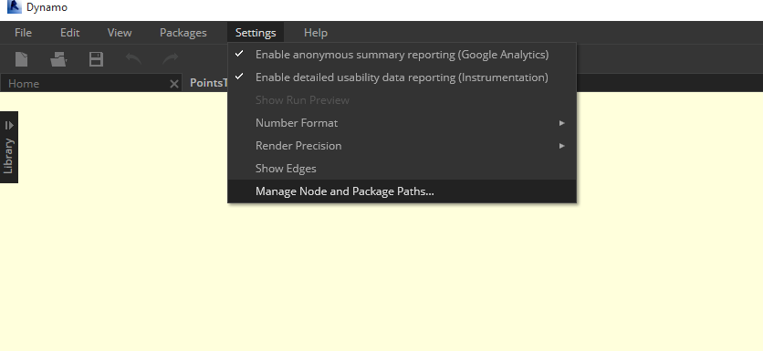
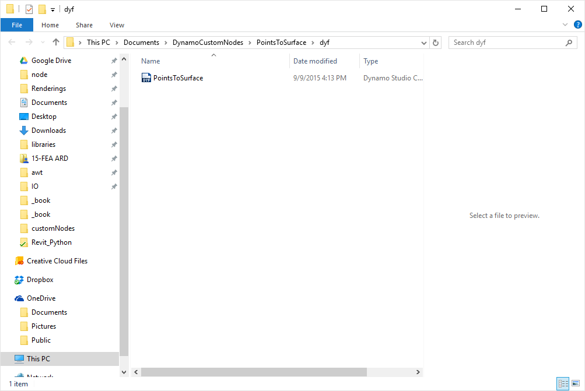

##Adding to Your Library
We've created a custom node and applied it to a specific process in the our Dynamo graph. And we like this node so much, we want to keep it in our Dynamo library to reference in other graphs.  To do this, we'll publish the node locally. This is the same process as publishing a package, which we'll walk through in more detail in the next chapter.

> After opening the PointsToSurface custom node, we see the graph above in the Dynamo Custom Node Editor.  You can also open up a custom node by double clicking on it in the Dynamo Graph Editor.

> 1. To Publish a custom node locally, simply right click on the canvas and select *"Publish This Custom Node..."*

> Fill out the relevant information similar to the image above and select *"Publish Locally".*

> Choose a folder to house all of the custom nodes that you plan on publishing locally. Dynamo will check this folder each time it loads, so make sure the folder is in a permanent place.  Navigate to this folder and choose *"Select Folder".* Your Dynamo node is now published locally, and will remain in your Dynamo Toolbar each time you load the program!

> 1. To check on the custom node folder location, go to *Settings > Manage Node and Package Paths...*

> In this window we see two paths: *AppData\Roaming\Dynamo...* refers to the default location of Dynamo Packages installed online. *Documents\DynamoCustomNodes...* refers to the location of custom nodes we've published locally.

> Navigating to this local folder, we can find the original custom node in the *".dyf"* folder, which the  extension for a Dynamo Custom Node file.  We can edit the file in this folder and the node will update in the UI. We can also add more nodes to the main *DynamoCustomNode* folder and Dynamo will add them to your library at restart!