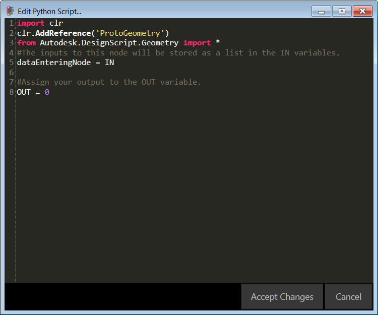
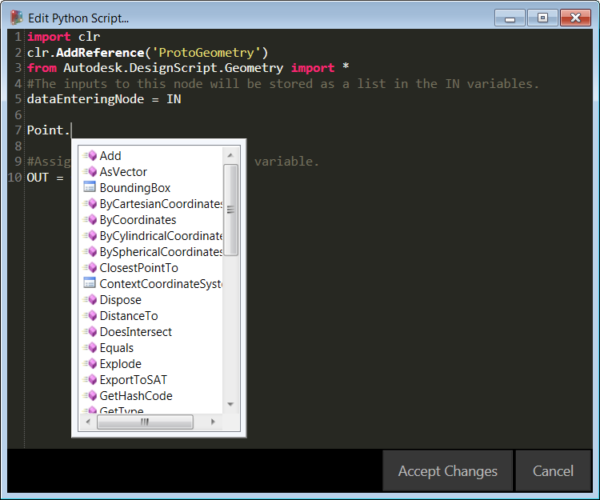
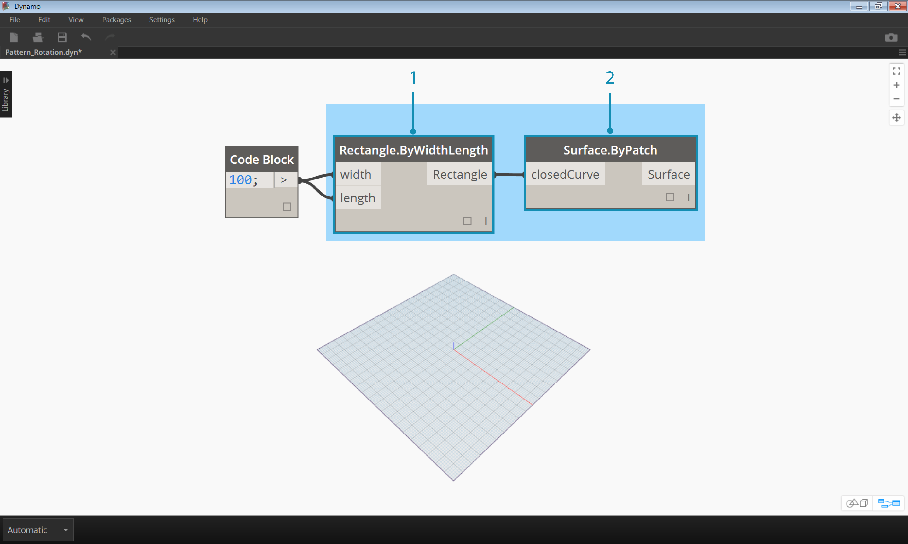
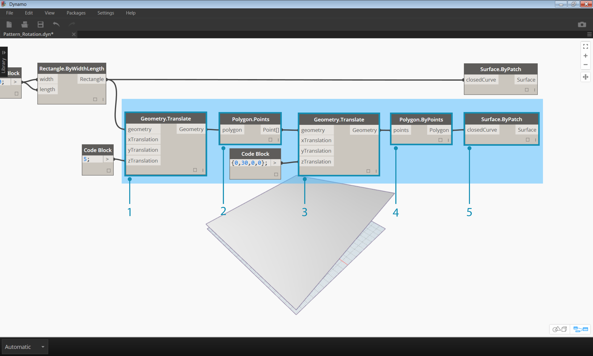
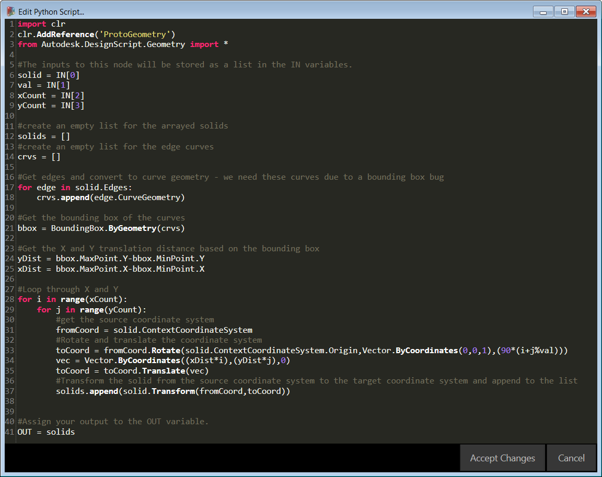
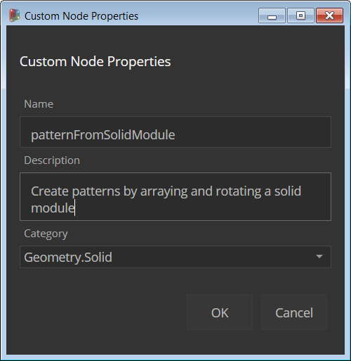
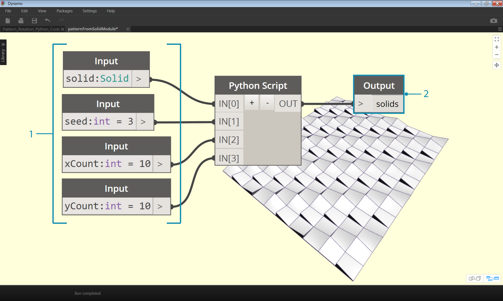

<style>
img{display:block;margin-left: auto;   margin-right: auto }
</style>

##Python

Python is a widely used programming language whose popularity has a lot to do with its style of syntax. It's highly readable, which makes it easier to learn than many other languages. Python supports modules and packages, and can be embedded into existing applications. The examples in this section assume a basic familiarity with Python. For information about how to get up and running with Python, a good resource is the ["Getting Started"](https://www.python.org/about/gettingstarted/) page on [Python.org](https://www.python.org/).

###Visual vs. Textual Programming
Why would you use textual programming in Dynamo's visual programming environment? As we discussed in chapter 1.1, visual programming has many advantages. It allows you to create programs without learning special syntax in an intuitive visual interface. However, a visual program can become cluttered, and can at times fall short in functionality. For example, Python offers much more achieveable methods for writing conditional statements (if/then) and looping.  Python is a powerful tool that can extend the capabilities of Dynamo and allow you to replace many nodes with a few concise lines of code. 

**Visual Program:**


**Textual Program:**
```
import clr
clr.AddReference('ProtoGeometry')
from Autodesk.DesignScript.Geometry import *

solid = IN[0]
seed = IN[1]
xCount = IN[2]
yCount = IN[3]

solids = []

yDist = solid.BoundingBox.MaxPoint.Y-solid.BoundingBox.MinPoint.Y
xDist = solid.BoundingBox.MaxPoint.X-solid.BoundingBox.MinPoint.X

for i in xRange:
	for j in yRange:
		fromCoord = solid.ContextCoordinateSystem
		toCoord = fromCoord.Rotate(solid.ContextCoordinateSystem.Origin,Vector.ByCoordinates(0,0,1),(90*(i+j%val)))
		vec = Vector.ByCoordinates((xDist*i),(yDist*j),0)
		toCoord = toCoord.Translate(vec)
		solids.append(solid.Transform(fromCoord,toCoord))

OUT = solids
```

###The Python Node
Like code blocks, Python nodes are a scripting interface within a visual programming environment.
The Python node can be found under *Core>Scripting* in the library. Double clicking the node opens the python script editor (you can also right click on the node and select *Edit...*).



> You’ll notice some boilerplate text at the top, which is meant to help you reference the libraries you’ll need. Inputs are stored in the IN array. Values are returned to Dynamo by assigning them to the OUT variable.

The Autodesk.DesignScript.Geometry library allows you to use dot notation similar to Code Blocks. For more information on Dynamo syntax, refer to chapter 7.2 as well as the [Dynamo Language Guide](http://dynamobim.org/wp-content/uploads/forum-assets/colin-mccroneautodesk-com/07/10/Dynamo_language_guide_version_1.pdf). Typing a geometry type such as 'Point.' will bring up a list of methods for creating and querying points.



> Methods include constructors such as *ByCoordinates*, actions like *Add*, and queries like *X*, *Y* and *Z* coordinates.


###Exercise

>Download the example file that accompanies this exercise (Right click and "Save Link As..."). A full list of example files can be found in the Appendix. [Python_Custom-Node.dyn](datasets/9-4/Python_Custom-Node.dyn)

In this example, we will write a python script that creates patterns from a solid module, and turn it into a custom node.
First, let’s create our solid module using Dynamo nodes. 



> 1. **Rectangle.ByWidthLength:** Create a rectangle that will be the base of our solid.
2.	**Surface.ByPatch:** Connect the rectangle to the ‘*closedCurve*’ input to create the bottom surface.


>1.	**Geometry.Translate:** Connect the rectangle to the ‘*geometry*’ input to move it up, using a code block to specify the base thickness of our solid.
2.	**Polygon.Points:** Query the translated rectangle to extract the corner points.
3.	**Geometry.Translate:** Use a code block to create a list of four values corresponding to the four points, translating one corner of the solid up.
4.	**Polygon.ByPoints:** Use the translated points to reconstruct the top polygon.
5.	**Surface.ByPatch:** Connect the polygon to create the top surface.

Now that we have our top and bottom surfaces, let’s loft between the two profiles to create the sides of the solid.


>1.	**List.Create:** Connect the bottom rectangle and the top polygon to the index inputs.
2.	**Surface.ByLoft:** Loft the two profiles to create the sides of the solid.
3.	**List.Create:** Connect the top, side, and bottom surfaces to the index inputs to create a list of surfaces.
4.	**Solid.ByJoinedSurfaces:** Join the surfaces to create the solid module.

Now that we have our solid, let’s drop a Python Script node onto the workspace. 


> To add additional inputs to the node, close the editor and click the + icon on the node. The inputs are named IN[0], IN[1], etc. to indicate that they represent items in a list.

Let’s start by defining our inputs and output. Double click the node to open the python editor. 


```
import clr
clr.AddReference('ProtoGeometry')
from Autodesk.DesignScript.Geometry import *

#The solid module to be arrayed
solid = IN[0]
#A number that determines which rotation pattern to use
seed = IN[1]
#The number of solids to array in the X and Y axes
xCount = IN[2]
yCount = IN[3]

#Create an empty list for the arrayed solids
solids = []

#Assign your output to the OUT variable.
OUT = solids
```

This code will make more sense as we progress in the exercise.  Next we need to think about what information is required in order to array our solid module. First, we will need to know the dimensions of the solid to determine the translation distance. Due to a bounding box bug, we will have to use the edge curve geometry to create a bounding box.


> A look at the Python node in Dynamo. Notice that we're using the same syntax as we see in the titles of the nodes in Dynamo. The commented code is below.

```
import clr
clr.AddReference('ProtoGeometry')
from Autodesk.DesignScript.Geometry import *

#Inputs
solid = IN[0]
seed = IN[1]
xCount = IN[2]
yCount = IN[3]

#Create an empty list for the arrayed solids
solids = []
# Create an empty list for the edge curves
crvs = []

#Loop through edges and append corresponding curve geometry to the list
for edge in solid.Edges:
	crvs.append(edge.CurveGeometry)
	
#Get the bounding box of the curves
bbox = BoundingBox.ByGeometry(crvs)

#Get the X and Y translation distance based on the bounding box
yDist = bbox.MaxPoint.Y-bbox.MinPoint.Y
xDist = bbox.MaxPoint.X-bbox.MinPoint.X

#Assign your output to the OUT variable.
OUT = solids
```

Since we will be both translating and rotating the solid modules, let’s use the Geometry.Transform operation. By looking at the Geometry.Transform node, we know that we will need a source coordinate system and a target coordinate system to transform the solid. The source is the context coordinate system of our solid, while the target will be a different coordinate system for each arrayed module. That means we will have to loop through the x and y values to transform the coordinate system differently each time. 


> A look at the Python node in Dynamo. The commented code is below.

```
import clr
clr.AddReference('ProtoGeometry')
from Autodesk.DesignScript.Geometry import *

#Inputs
solid = IN[0]
seed = IN[1]
xCount = IN[2]
yCount = IN[3]

#Create an empty list for the arrayed solids
solids = []
# Create an empty list for the edge curves
crvs = []

#Loop through edges and append corresponding curve geometry to the list
for edge in solid.Edges:
	crvs.append(edge.CurveGeometry)
	
#Get the bounding box of the curves
bbox = BoundingBox.ByGeometry(crvs)

#Get the X and Y translation distance based on the bounding box
yDist = bbox.MaxPoint.Y-bbox.MinPoint.Y
xDist = bbox.MaxPoint.X-bbox.MinPoint.X

#get the source coordinate system
fromCoord = solid.ContextCoordinateSystem
 
#Loop through X and Y
for i in range(xCount):
	for j in range(yCount):
		#Rotate and translate the coordinate system
		toCoord = fromCoord.Rotate(solid.ContextCoordinateSystem.Origin,Vector.ByCoordinates(0,0,1),(90*(i+j%seed)))
		vec = Vector.ByCoordinates((xDist*i),(yDist*j),0)
		toCoord = toCoord.Translate(vec)
		#Transform the solid from the source coord system to the target coord system and append to the list
		solids.append(solid.Transform(fromCoord,toCoord))
	
```


> Save the Python script by clicking ‘Accept Changes’ and plug the input values into the node. You should see a pattern of solids.


> Try changing the seed value to create different patterns. You can also change the parameters of the solid module itself for different effects.

Now that we have created a useful python script, let’s save it as a custom node. Select the python script node, right-click and select ‘New Node From Selection.’ 



> Assign a name, description, and category.

This will open a new workspace in which to edit the custom node. 



> 1. **Inputs:** Change the input names to be more descriptive and add data types and default values. 
2.	**Output:** Change the output name
Save the node as a .dyf file.


> The custom node reflects the changes we just made.


