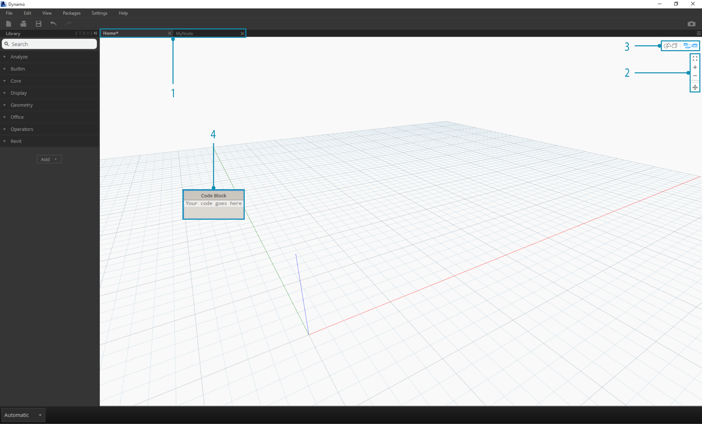
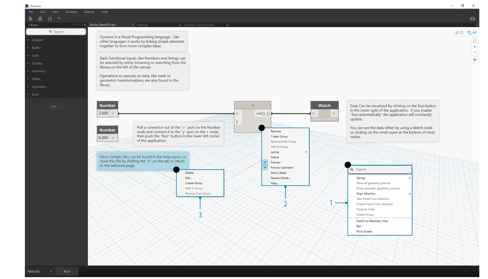

## Der Arbeitsbereich

Der Dynamo-**Arbeitsbereich** ist der Bereich, in dem Sie Ihre visuellen Programme entwickeln und eine Vorschau der resultierenden Geometrie anzeigen. Unabhängig davon, ob Sie im Start-Arbeitsbereich oder einem benutzerdefinierten Block arbeiten, können Sie mit der Maus oder über die Schaltflächen rechts oben navigieren. Über die Schaltfläche rechts unten können Sie den Vorschaumodus umschalten, in dem Sie navigieren.

> Hinweis: Die Blöcke und Geometrie weisen eine Zeichnungsreihenfolge auf, sodass Objekte möglicherweise übereinander gerendert werden. Dies kann unübersichtlich sein, wenn mehrere Blöcke nacheinander hinzugefügt werden, da sie möglicherweise im Arbeitsbereich in derselben Position gerendert werden.

> 1. Registerkarten
2. Schaltflächen Zoom/Schwenken
3. Vorschaumodus
4. In den Arbeitsbereich doppelklicken

### Registerkarten

Auf der aktiven Registerkarte des Arbeitsbereichs können Sie durch Ihr Programm navigieren und es bearbeiten. Beim Öffnen einer neuen Datei öffnen Sie standardmäßig einen neuen **Start**-Arbeitsbereich. Sie können auch einen neuen Arbeitsbereich für **benutzerdefinierten Block** über das Menü Datei oder über die Kontextmenüoption *Neuer Block aus Auswahl* öffnen, wenn Blöcke ausgewählt sind (weitere Informationen zu dieser Funktion weiter unten).

> Hinweis: Es kann jeweils nur ein Start-Arbeitsbereich geöffnet sein. Sie können daneben jedoch gleichzeitig mehrere Arbeitsbereiche für benutzerdefinierten Block auf zusätzlichen Registerkarten öffnen.

### Navigation in Diagrammen und in der 3D-Vorschau im Vergleich

In Dynamo werden sowohl das Diagramm als auch die 3D-Ergebnisse des Diagramms (wenn Sie Geometrie erstellen) im Arbeitsbereich gerendert. Standardmäßig ist das Diagramm die aktive Vorschau. Sie können das Diagramm durchlaufen, indem Sie es mithilfe der Navigationstasten oder der mittleren Maustaste schwenken oder zoomen. Zum Umschalten zwischen den aktiven Voransichten sind drei Möglichkeiten verfügbar:

> 1. Schaltflächen zum Umschalten der Vorschau im Arbeitsbereich
2. Mit der rechten Maustaste in den Arbeitsbereich klicken und *Zu ...ansicht wechseln* auswählen
3. Tastaturbefehl (Strg + B)

Der Modus Navigation in 3D-Vorschau bietet uns auch die Möglichkeit zur **Direktbearbeitung** von Punkten, wie im Abschnitt [Erste Schritte](http://dynamoprimer.com/de/02_Hello-Dynamo/2-6_the_quick_start_guide.html) veranschaulicht wird.

### Zoomen und neu zentrieren

Im Modus Navigation in 3D-Vorschau können Sie mühelos schwenken, zoomen und drehen. Sie können jedoch gezielt auf das von einem bestimmten Geometrieblock erstellte Objekt einzoomen, indem Sie den betreffenden Block auswählen und dann das Symbol Zoom alles verwenden.

> 1. Wählen Sie den Block für die Geometrie aus, die in der Ansicht zentriert werden soll.
2. Wechseln Sie zur Navigation in der 3D-Vorschau.

> 1. Klicken Sie auf das Symbol Zoom alles in der rechten oberen Ecke.
2. Die ausgewählte Geometrie wird in der Ansicht zentriert.

### Mausnavigation

Ihre Maustasten verhalten sich je nach dem aktiven Vorschaumodus unterschiedlich. Im Allgemeinen können Sie durch Klicken mit der linken Maustaste Eingaben auswählen und angegeben, durch Klicken mit der rechten Maustaste auf Optionen zugreifen und durch Klicken mit der mittleren Maustaste durch den Arbeitsbereich navigieren. Die Optionen, die durch Klicken mit der rechten Maustaste angezeigt werden, basieren auf dem Kontext, in dem Sie geklickt haben.

> 1. Mit der rechten Maustaste in den Arbeitsbereich klicken
2. Mit der rechten Maustaste auf einen Block klicken
3. Mit der rechten Maustaste auf eine Anmerkung klicken

Der folgenden Tabelle können Sie die Mausinteraktionen je nach Vorschau entnehmen:

|**Mausaktion**|**Diagrammvorschau**|**3D-Vorschau**|
| -- | -- | -- |
|Mit der linken Maustaste klicken|Auswählen|-|
|Mit der rechten Maustaste klicken|Kontextmenü|Zoomoptionen|
|Mit der mittleren Maustaste klicken|Schwenken|Schwenken|
|Bildlauf|Vergrößern/Verkleinern|Vergrößern/Verkleinern|
|Doppelklicken|Codeblock erstellen|-|

### Suche im Ansichtsbereich

Durch Einsatz der Funktion "Suche im Ansichtsbereich" können Sie die Geschwindigkeit Ihres Dynamo-Workflows erheblich steigern, indem Sie Zugriff auf Blockbeschreibungen und QuickInfos erhalten, ohne dass Sie die Position in Ihrem Diagramm verlassen müssen. Durch einfaches Klicken mit der rechten Maustaste können Sie von jeder beliebigen Position im Ansichtsbereich, an der Sie gerade arbeiten, auf alle nützlichen "Suchfunktionen der Bibliothek" zugreifen.

> 1. Klicken Sie mit der rechten Maustaste auf eine beliebige Stelle im Ansichtsbereich, um die Suchfunktion aufzurufen. Wenn die Suchleiste leer ist, werden im Dropdown-Menü Voransichten angezeigt.
2. Während Sie einen Suchbegriff in die Suchleiste eingeben, wird das Dropdown-Menü ständig aktualisiert, um die relevantesten Suchergebnisse anzuzeigen.
3. Bewegen Sie den Cursor auf die Suchergebnisse, um die zugehörigen Beschreibungen und QuickInfos anzuzeigen.

## Bereinigen von Blocklayouts

Das Organisieren Ihres Dynamo-Ansichtsbereichs wird zunehmend wichtig, je komplexer Ihre Dateien werden. Neben dem Werkzeug **Auswahl ausrichten** zum Arbeiten mit einer kleinen Anzahl an ausgewählten Blöcken ist in Dynamo auch das Werkzeug **Blocklayout bereinigen** verfügbar, das Sie generell bei der Dateibereinigung unterstützt.

#### Vor der Blockbereinigung

> 1. Aktivieren Sie die Blöcke, die automatisch organisiert werden sollen, oder lassen Sie alle Blöcke deaktiviert, um alle Blöcke in der Datei zu bereinigen.
2. Die Funktion Blocklayout bereinigen befindet sich unter der Registerkarte Bearbeiten.
#### Nach der Blockbereinigung

3. Die Blöcke werden automatisch neu verteilt und ausgerichtet, indem gestapelte oder überlappende Blöcke bereinigt und mit benachbarten Blöcken ausgerichtet werden.

