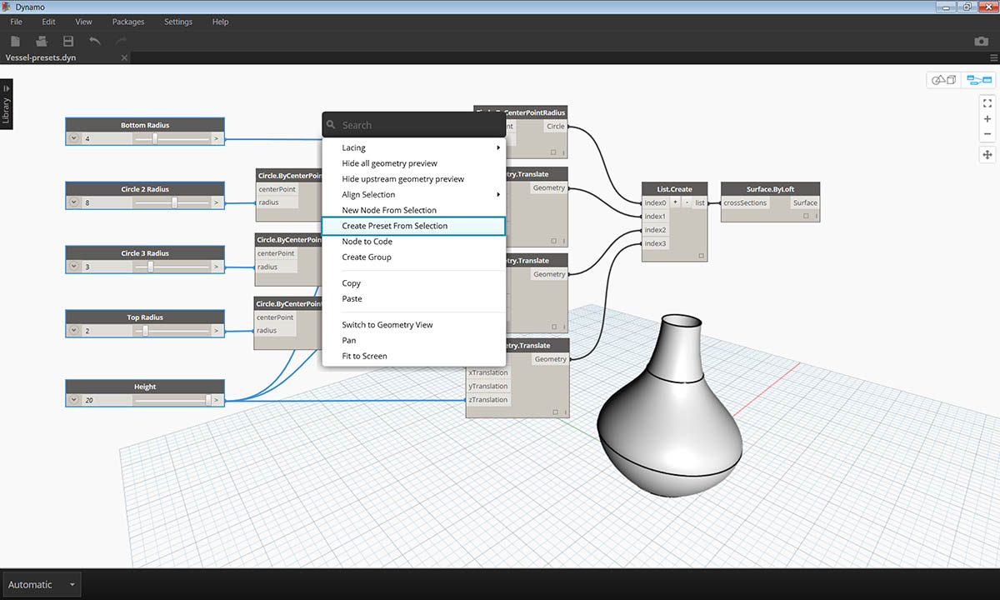
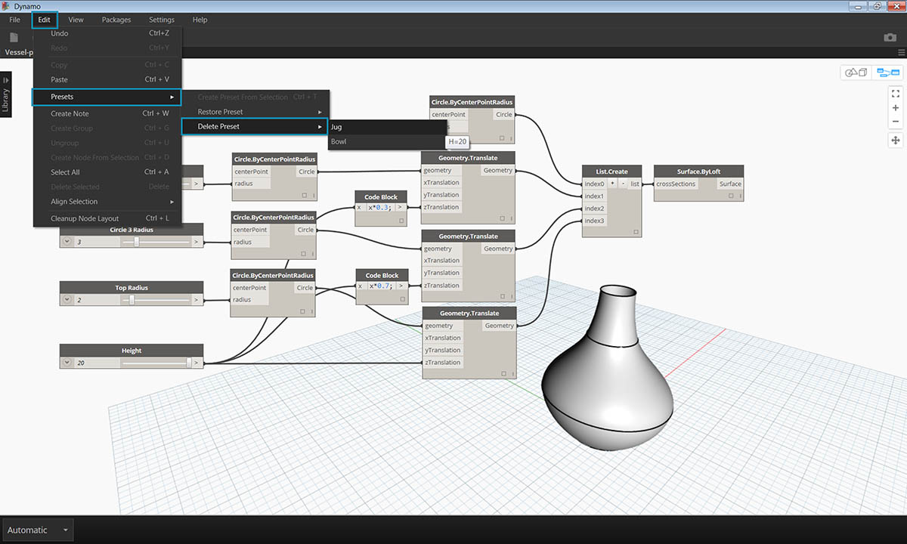

## Verwalten von Daten mit Voreinstellungen

Im vorherigen Abschnitt haben Sie sich mit dem Verwalten von Programmen durch Ausrichten, Gruppieren und Beschriften von Blöcken zum Organisieren des Arbeitsbereichs befasst. Diese bewährten Verfahren dienen der Verringerung der visuellen Komplexität Ihres Diagramms. Im Folgenden steigen Sie nun tiefer in die Materie ein und organisieren die Komplexität des Inhalts. Häufig weist ein Dynamo-Diagramm eine breite Palette an Parametern auf, die zahlreiche Iterationen bieten. Sie möchten diese Optionspalette organisieren, um reale Konstruktionsentscheidungen treffen zu können – und hier kommen Voreinstellungen ins Spiel.

Angenommen, Sie haben ein Dynamo-Diagramm erstellt, das Sie mit einem Team gemeinsam verwenden möchten, sodass jedes Teammitglied das parametrische Modell untersuchen kann. Ihre Teammitglieder weisen unterschiedliche Erfahrungsniveaus mit der visuellen Programmierung auf, sodass Sie sie bei der Untersuchung der unterschiedlichen Konstruktionsschemata unterstützen möchten. Die einfachste, benutzerfreundlichste Möglichkeit hierfür besteht in der Verwendung von Voreinstellungen: Sie können eine beliebige Anzahl an Parametern festlegen, um eine bestimmte Konstruktionsiteration zu definieren. Auf diese Weise können Sie vorherige Schemata neu laden und mit ihnen parametrisch arbeiten.

### Voreinstellungen

Voreinstellungen bieten die Möglichkeit, den aktuellen Wert einer Auswahl von Eingabeblöcken als vordefinierten Status zu speichern. Diese Status können über das Menü Bearbeiten > Voreinstellungen wiederhergestellt werden. Voreinstellungen können verwendet werden, um Konstruktionsiterationen zu erstellen und zu vergleichen. Voreinstellungen werden mit der Datei gespeichert und werden dadurch zu einem nützlichen Werkzeug zum Austauschen von Konstruktionen und Anfordern von Feedback. Sie ermöglichen auch anderen Benutzern, mit einem Diagramm zu interagieren, ohne nach den relevanten Eingaben suchen zu müssen, oder mehrere Werte zu optimieren, die aus Konstruktionsperspektive gut miteinander funktionieren.

> 1. Voreinstellung 1
2. Voreinstellung 2

### Erstellen von Voreinstellungen

> Laden Sie die zu dieser Übungslektion gehörige Beispieldatei herunter (durch Rechtsklicken und Wahl der Option Save Link As): [Presets.dyn](datasets/3-5/Presets.dyn). Eine vollständige Liste der Beispieldateien finden Sie im Anhang.

Um eine Voreinstellung zu erstellen, wählen Sie einen oder mehrere Blöcke aus. Klicken Sie mit der rechten Maustaste in den Ansichtsbereich, und wählen Sie "Voreinstellung aus Auswahl erstellen" aus, oder drücken Sie die Tastenkombination Strg+T. Betrachten Sie das folgende Beispiel. Unten ist ein einfaches Diagramm dargestellt, das eine Oberfläche durch Erhebung durch eine Reihe von Kreisen erstellt.

> 1. Bei den Eingaben dieses Diagramms handelt es sich um eine Reihe von Schiebereglern, die die Höhe und Radii steuern.

> Wählen Sie die Schieberegler für die Eingabe aus, und drücken Sie Strg+T.

> Geben Sie in dem Dialogfeld einen Namen und eine Beschreibung für den gespeicherten Status ein. Erstellen Sie mehrere Status mit unterschiedlichen Eingabewerten.

### Wiederherstellen von Voreinstellungen

Um eine gespeicherte Voreinstellung wiederherzustellen, navigieren Sie zu Bearbeiten > Voreinstellungen > Voreinstellung wiederherstellen. Dadurch werden alle Blöcke mit dem Status auf die gespeicherten Werte gesetzt. Wenn ein Block mit dem Status nicht mehr in dem Diagramm vorhanden ist (d. h. gelöscht wurde), werden alle anderen Blöcke mit dem Status festgelegt.

### Löschen von Voreinstellungen

Um eine Voreinstellung zu löschen, navigieren Sie zu Bearbeiten > Voreinstellungen > Voreinstellung löschen. Dadurch wird der entsprechende Status aus der Liste der gespeicherten Status entfernt.

