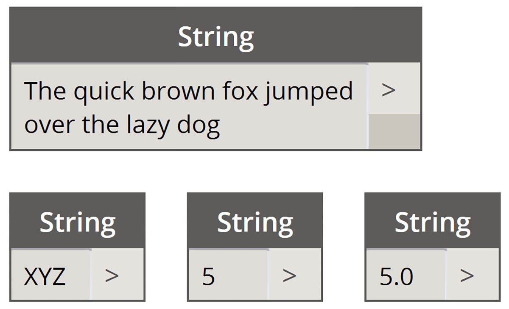
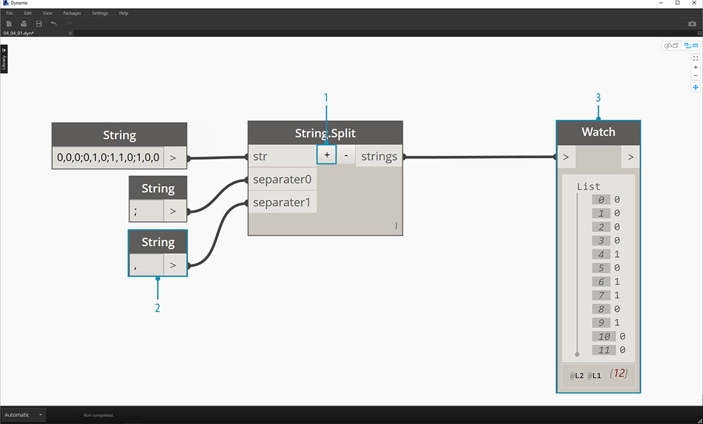
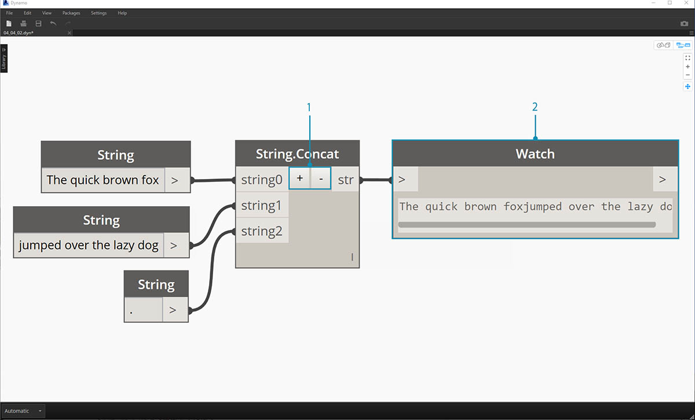
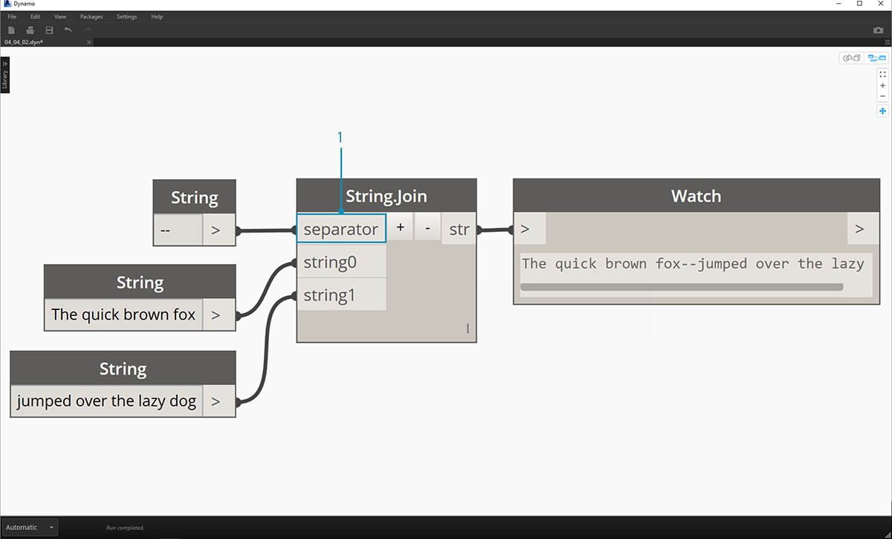
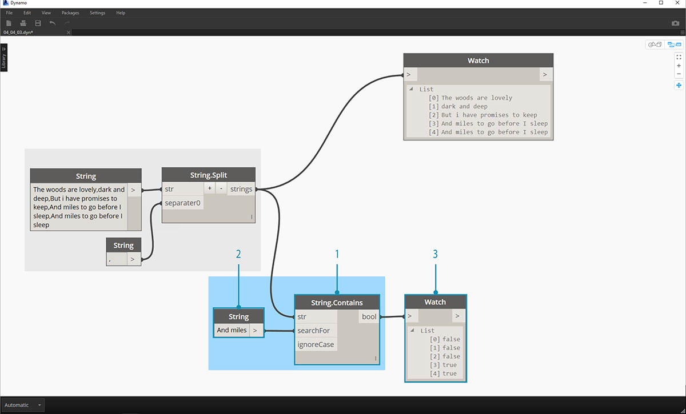
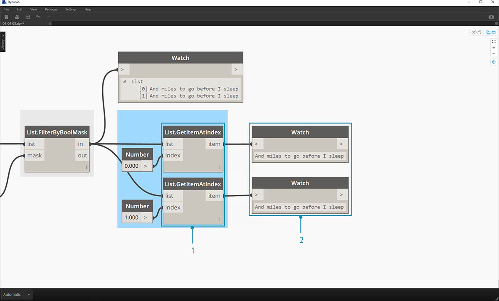

## Zeichenfolgen

Eine **Zeichenfolge** ist in der Fachsprache eine Folge von Zeichen, die für eine Literalkonstante oder verschiedene Typen von Variablen steht. Im Zusammenhang mit Programmierung ist "Zeichenfolge" eine Bezeichnung für Text. Sie haben bereits Zahlen (Ganzzahlen und Dezimalzahlen) zur Steuerung von Parametern verwendet. Dasselbe ist auch mit Text möglich.

### Erstellen von Zeichenfolgen

Zeichenfolgen können auf vielfältige Weise eingesetzt werden. Dazu gehören das Definieren benutzerdefinierter Parameter, Beschriftungen für Dokumentation sowie die Analyse mithilfe textbasierter Datensätze. Der String-Block befindet sich in der Kategorie Core > Input.

> Die oben gezeigten Blöcke sind Zeichenfolgen. Zeichenfolgen können Zahlen, Buchstaben oder ganze Textabschnitte sein.

### Abfragen von Zeichenfolgen

> Laden Sie die Beispieldatei für diese Übungslektion herunter (durch Rechtsklicken und Wahl von "Save Link As..."): [Building Blocks of Programs - Strings.dyn](datasets/4-5/Building Blocks of Programs - Strings.dyn). Eine vollständige Liste der Beispieldateien finden Sie im Anhang.

Sie können große Datenmengen rasch analysieren, indem Sie Zeichenfolgen abfragen. In diesem Abschnitt werden einige grundlegende Vorgänge behandelt, die Arbeitsabläufe beschleunigen und die Interoperabilität von Software verbessern können.

Die folgende Abbildung zeigt eine Folge von Daten aus einer externen Kalkulationstabelle. Diese Zeichenfolge steht für die Scheitelpunkt eines Rechtecks in der xy-Ebene. In dieser kurzen Übung wird die Zeichenfolge geteilt:

> 1. Das Trennzeichen ";" trennt die einzelnen Scheitelpunkte des Rechtecks voneinander. Dadurch erhalten Sie eine Liste mit vier Einträgen für die einzelnen Scheitelpunkte.

> 1. Durch Klicken auf "*+*" in der Mitte des Blocks erstellen Sie ein neues Trennzeichen.
2. Fügen Sie einen String-Block mit der Angabe "*,*" in den Ansichtsbereich ein und verbinden Sie ihn mit der neuen separator-Eingabe.
3. Als Ergebnis erhalten Sie jetzt eine Liste mit zehn Einträgen. In diesem Block wird die Liste zuerst entsprechend *separator0* und dann entsprechend *separator1* geteilt.

Die Einträge in der oben gezeigten Liste sehen zwar wie Zahlen aus, werden jedoch in Dynamo nach wie vor als einzelne Zeichen betrachtet. Damit Sie Punkte erstellen können, müssen Sie ihren Datentyp aus Zeichenfolgen in Zahlen konvertieren. Dazu verwenden Sie den Block String.ToNumber.

> 1. Dieser Block ist einfach zu verwenden. Verbinden Sie das Ergebnis von String.Split mit der Eingabe. Die Ausgabe sieht genau so aus wie zuvor, der Datentyp ist jetzt jedoch *number* anstelle von *string*.

> 1. Mit einigen weiteren grundlegenden Operationen wird am Ursprungspunkt ein Rechteck gezeichnet, dem die Zeichenfolge aus der ursprünglichen Eingabe zugrunde liegt.

### Bearbeiten von Zeichenfolgen

Da Zeichenfolgen allgemeine Textobjekte sind, eignen sie sich für eine Vielzahl von Verwendungszwecken. In diesem Abschnitt werden einige der wichtigsten Aktionen in der Kategorie Core > String in Dynamo beschrieben:

Die folgende Methode verbindet zwei Zeichenfolgen in der angegebenen Reihenfolge. Dabei werden die einzelnen Literalzeichenfolgen in einer Liste zu einer einzigen Zeichenfolge zusammengeführt.

> Die Abbildung oben zeigt die Verkettung dreier Zeichenfolgen.

> 1. Mithilfe der Schaltflächen + und - in der Mitte des Blocks können Sie der Verkettung weitere Zeichenfolgen hinzufügen oder sie daraus entfernen.
2. Die Ausgabe zeigt die aus der Verkettung resultierende Zeichenfolge einschließlich Leerzeichen und Satzzeichen.

Die Verbindung ist der Verkettung ähnlich, wobei das Ergebnis jedoch zusätzlich gegliedert wird.

Aus der Arbeit mit Excel sind Sie wahrscheinlich mit CSV-Dateien vertraut. Dies steht für kommagetrennte Werte. Sie könnten im Join-Block ein Komma (oder in diesem Fall zwei Bindestriche) als Trennzeichen verwenden, um eine ähnliche Datenstruktur zu erhalten: 

> Die Abbildung oben zeigt die Verbindung zweier Zeichenfolgen:

> 1. Die separator-Eingabe ermöglicht es, eine Zeichenfolge zu erstellen, die als Trennzeichen zwischen den verbundenen Zeichenfolgen steht.

### Arbeiten mit Zeichenfolgen

In dieser Übungslektion zerlegen Sie die letzte Strophe von Robert Frosts Gedicht [Stopping By Woods on a Snowy Evening](http://www.poetryfoundation.org/poem/171621) mithilfe von Methoden zum Abfragen und Bearbeiten von Zeichenfolgen. Diese zugegebenermaßen nicht unbedingt praxisnahe Anwendung verdeutlicht die grundlegenden Aktionen für Zeichenfolgen durch Anwendung auf die Zeilen mit ihrem Rhythmus und Reim, wie sie im Gedicht erscheinen.

> Als Erstes teilen Sie einfach die Zeichenfolge, die die Strophe bildet. Zunächst fällt auf, dass der Text durch Kommas gegliedert ist. Anhand dieses Formats definieren Sie jede Zeile als eigenen Eintrag.

> 1. Fügen Sie die Ausgangszeichenfolge in einen String-Block ein.
2. Legen Sie mithilfe eines zweiten String-Blocks das Trennzeichen fest. Verwenden Sie in diesem Fall ein Komma.
3. Fügen Sie im Ansichtsbereich einen String.Split-Block hinzu und verbinden Sie ihn mit den beiden String-Blöcken.
4. Die Ausgabe zeigt die einzelnen Zeilen als separate Einträge.

> Betrachten Sie jetzt den besten Teil des Gedichts – die letzten beiden Zeilen. Die ursprüngliche Strophe war ein einziges Datenelement. Diese Daten haben Sie im ersten Schritt in einzelne Einträge aufgeteilt. Als Nächstes müssen Sie nach dem gewünschten Text suchen. In diesem Fall *können* Sie dies zwar erreichen, indem Sie die letzten beiden Einträge in der Liste auswählen. In einem ganzen Buch wäre es jedoch unrealistisch, dieses komplett durchzulesen und die Elemente manuell zu isolieren.

> 1. Verwenden Sie daher, anstatt manuell zu suchen, einen String.Contains-Block für die Suche nach einer Gruppe von Zeichen. Diese Funktion ist dem Befehl Suchen in Textverarbeitungsprogrammen ähnlich. In diesem Falle erhalten Sie True oder False als Ergebnis, je nachdem, ob die betreffende Teilzeichenfolge in einem Eintrag gefunden wurde.
2. Definieren Sie in der searchFor-Eingabe die Teilzeichenfolge, nach der Sie in der Strophe suchen. Verwenden Sie dazu einen String-Block mit dem Text "And miles".
3. Die Ausgabe zeigt eine Liste von True- und False-Werten. Im nächsten Schritt filtern Sie die Elemente mithilfe dieser Booleschen Logik.

> 1. Mit einem List.FilterByBoolMask-Block bereinigen Sie die True- und False-Werte. Die in-Ausgabe gibt die Aussagen mit dem Wert True für die mask-Eingabe zurück, die out-Ausgabe diejenigen mit dem Wert False.
2. Die in-Ausgabe zeigt wie erwartet die letzten beiden Zeilen der Strophe.

> Heben Sie jetzt die Wiederholung in der Strophe hervor, indem Sie diese beiden Zeilen zusammenführen. In der Ausgabe aus dem vorigen Schritt sehen Sie eine Liste mit zwei Einträgen.

> 1. Mithilfe zweier List.GetItemAtIndex-Blöcke können Sie die Einträge durch Angabe der Werte 0 bzw. 1 für die index-Eingabe isolieren.
2. Die Ausgabe jedes Blocks zeigt die letzten beiden Zeilen in der angegebenen Reihenfolge.

> Verwenden Sie zum Zusammenführen der beiden Einträge einen String.Join-Block:

> 1. Nachdem Sie String.Join hinzugefügt haben, zeigt sich, dass ein Trennzeichen benötigt wird.
2. Fügen Sie zum Erstellen des Trennzeichens im Ansichtsbereich einen String-Block hinzu und geben Sie ein Komma ein.
3. In der letzten Ausgabe wurden beide Einträge zu einem zusammengeführt.

Dieser Vorgang zum Isolieren der letzten beiden Zeilen mag recht aufwendig erscheinen. Für Operationen mit Zeichenfolgen sind in der Tat zuweilen einige Vorarbeiten nötig. Diese Operationen sind jedoch skalierbar und können relativ leicht auf große Datensätze angewendet werden. Berücksichtigen Sie bei der parametrischen Arbeit mit Kalkulationstabellen und Interoperabiltät die Operationen für Zeichenfolgen.

