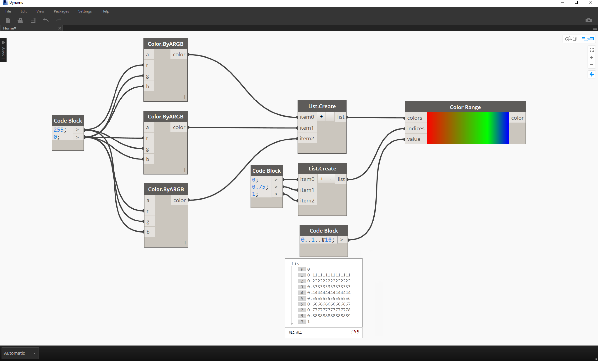
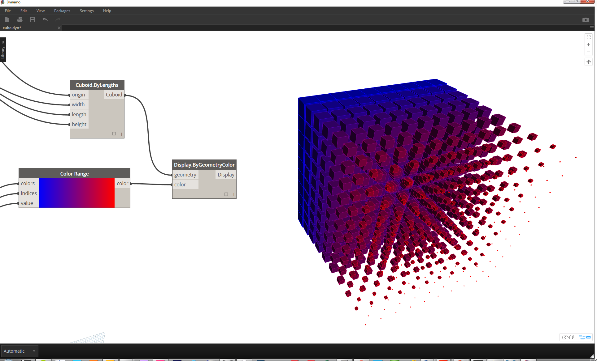
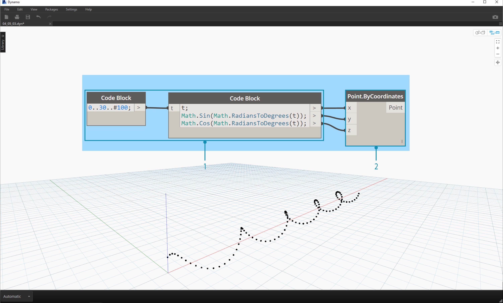
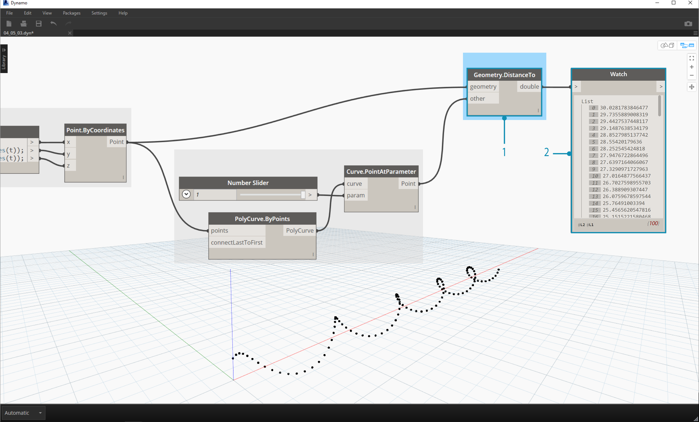
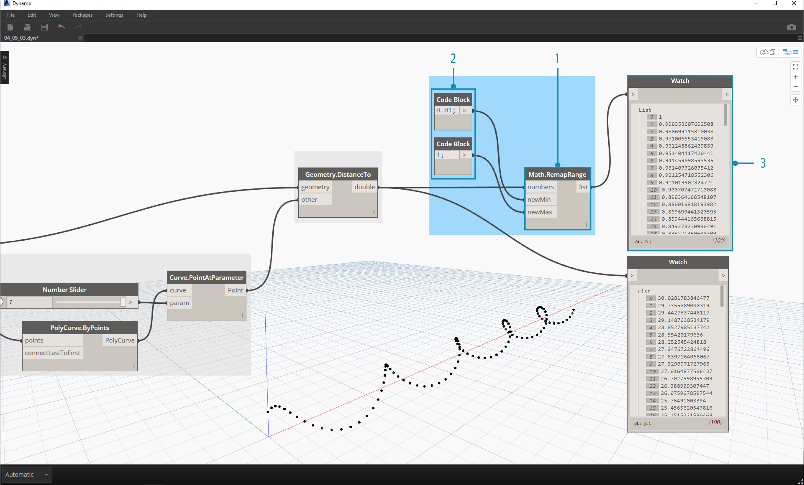
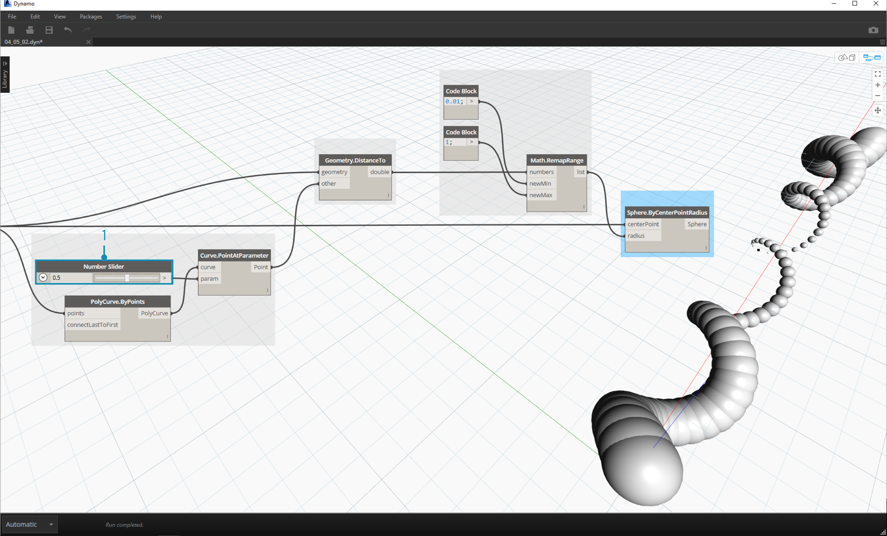
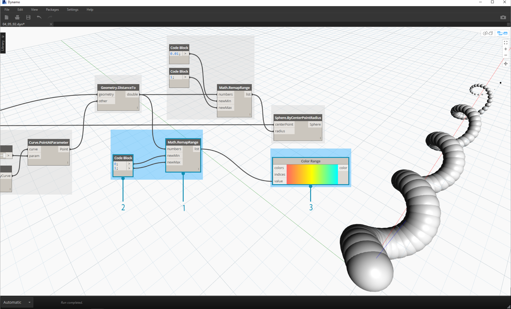
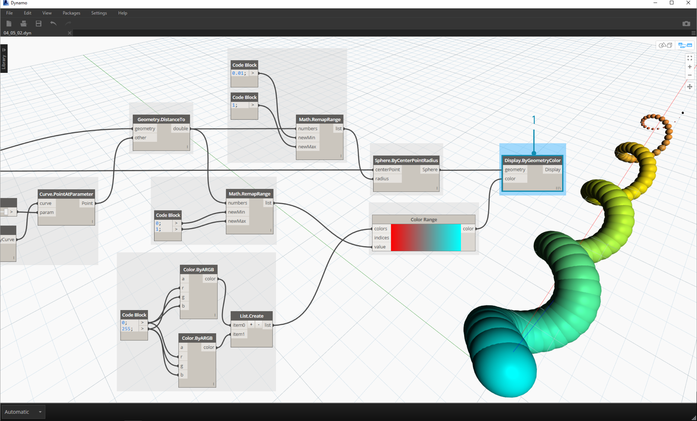
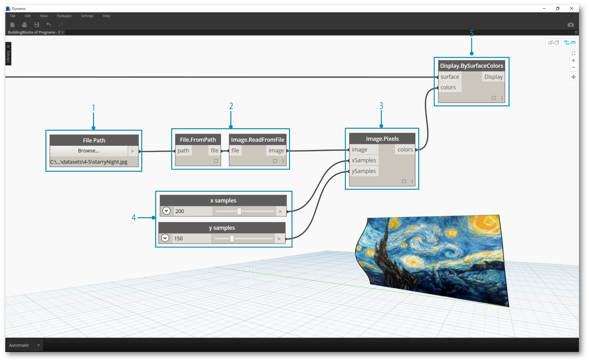
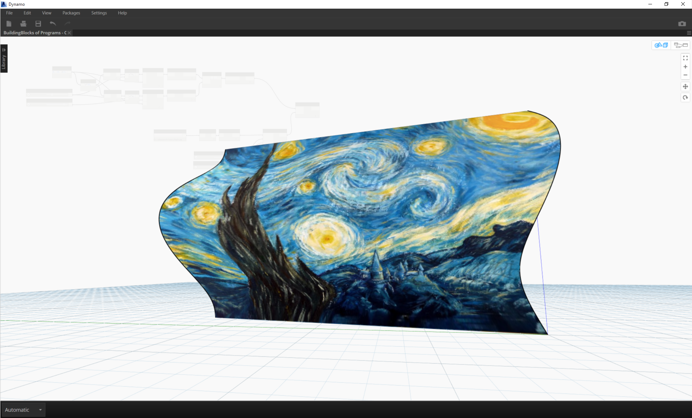

## Farbe

Der Datentyp Farbe eignet sich ausgezeichnet zum Erstellen beeindruckender Präsentationen sowie zur Darstellung von Unterschieden in der Ausgabe Ihres Grafikprogramms. Bei der Arbeit mit abstrakten Daten und veränderlichen Zahlen ist es zuweilen schwierig, zu erkennen, was sich in welchem Umfang verändert. Dies ist ein nützlicher Anwendungsbereich für Farben.

### Erstellen von Farben

Farben werden in Dynamo mithilfe von ARGB-Eingaben erstellt. Dies entspricht den Angaben Alpha, Rot, Grün und Blau. Der Alpha-Kanal gibt die *Transparenz* der Farbe an, während die drei anderen Angaben als Primärfarben zur Darstellung des gesamten Farbspektrums verwendet werden.

|Symbol|Name|Syntax|Eingaben|Ausgaben|
| -- | -- | -- | -- | -- |
||ARGB-Farbe|Color.ByARGB|A, R, G, B|color|

### Abfragen von Farbwerten

Mithilfe der Farben in der Tabelle unten werden die Eigenschaften zum Definieren von Farben abgefragt: Alpha, Rot, Grün und Blau. Beachten Sie, dass der Block Color.Components alle vier unterschiedlichen Ausgaben bereitstellt. Diesem Block ist daher für die Abfrage der Eigenschaften einer Farbe der Vorzug zu geben.

|Symbol|Name|Syntax|Eingaben|Ausgaben|
| -- | -- | -- | -- | -- |
||Alpha|Color.Alpha|color|A|
||Rot|Color.Red|color|R|
||Grün|Color.Green|color|G|
||Blau|Color.Blue|color|B|
||Komponenten|Color.Components|color|A, R, G, B|

Die Farben in der Tabelle unten entsprechen dem **HSB-Farbraum**. Die Interpretation einer anhand von Farbton, Sättigung und Helligkeit definierten Farbe mag intuitiver scheinen: Welche Farbe ist gemeint? Wie intensiv soll sie sein? Wie hell oder dunkel soll die Farbe sein? Dies ist die Differenzierung nach Farbton, Sättigung und Helligkeit.

|Symbol|Abfragename|Syntax|Eingaben|Ausgaben|
| -- | -- | -- | -- | -- |
||Farbton|Color.Hue|color|Hue|
||Sättigung|Color.Saturation|color|Saturation|
||Helligkeit|Color.Brightness|color|Brightness|

### Farbbereich

Der Farbbereich ist dem **Remap Range**-Block aus Abschnitt 4.2 ähnlich: Eine Liste von Zahlen wird in einer anderen Domäne neu zugeordnet. Allerdings wird sie nicht einer *number*-Domäne, sondern anhand eingegebener Zahlenwerte zwischen 0 und 1 einem *Farbverlauf* zugeordnet.

Der derzeit verwendete Block funktioniert problemlos, seine Funktionsweise ist jedoch anfangs möglicherweise sehr ungewohnt. Die beste Möglichkeit, mit dem Farbverlauf vertraut zu werden, besteht darin, ihn in der Praxis auszuprobieren. Die folgende kurze Übung zeigt, wie Sie einen Farbverlauf mit Ausgabe der Farben anhand von Zahlen erstellen können.

> 1. **Farben definieren**: Definieren Sie mithilfe eines Codeblock-Blocks *Rot, Grün* und *Blau*, indem Sie die jeweiligen Kombinationen von *0* und *255* verbinden.
2. **Liste erstellen**: Führen Sie die drei Farben zu einer Liste zusammen.
3. **Definieren Sie Indizes: **Erstellen Sie eine Liste zum Definieren der Griffpositionen für jede Farbe (von 0 bis 1). Beachten Sie, dass für Grün der Wert 0.75 festgelegt wurde. Dadurch wird die Farbe Grün an der Position bei 3/4 der Strecke des horizontalen Verlaufs im Schieberegler für den Farbbereich platziert.
4. **Code Block**: Geben Sie Werte (zwischen 0 und 1) zum Versetzen der Farben ein.

### Farbvorschau

Der **Display.ByGeometry**-Block ermöglicht die farbige Darstellung von Geometrie im Ansichtsfenster. Dies ist hilfreich zur Unterscheidung verschiedenartiger Geometrie, zur Verdeutlichung eines parametrischen Konzepts oder zum Definieren einer Analyselegende für die Simulation. Die Eingaben sind einfach: geometry und color. Um einen Farbverlauf wie in der Abbildung oben gezeigt zu erstellen, wird die color-Eingabe mit dem **Color Range**-Block verbunden.

### Übung zu Farben

> Laden Sie die Beispieldatei für diese Übungslektion herunter (durch Rechtsklicken und Wahl von "Save Link As..."): [Building Blocks of Programs - Color.dyn](datasets/4-5/Building Blocks of Programs - Color.dyn). Eine vollständige Liste der Beispieldateien finden Sie im Anhang.

In dieser Übung soll Farbe zusammen mit Geometrie parametrisch gesteuert werden. Die Geometrie ist eine einfache, wie unten gezeigt in einem **Code Block** (3.2.3) definierte Schraubenform. Dies ist ein schnelles und einfaches Verfahren zum Erstellen parametrischer Funktionen. Da das Thema dieses Abschnitts nicht Geometrie, sondern Farbe ist, wird die Helix auf effiziente Weise mithilfe des Codeblocks erstellt, ohne dass zu viel Platz im Ansichtsbereich beansprucht wird. Codeblöcke werden in den weiteren Kapiteln dieses Handbuchs bei der Behandlung komplexerer Themen häufiger verwendet.

> 1. **Code Block**: Definieren Sie die beiden Codeblöcke mit den oben gezeigten Formeln. Dies ist eine schnelle parametrische Methode zum Erstellen einer Helix.
2. **Point.ByCoordinates**: Verbinden Sie die drei Ausgaben des Codeblocks mit den Koordinaten dieses Blocks.

Daraufhin wird ein Array aus Punkten angezeigt, das eine Helixform bildet. Im nächsten Schritt erstellen Sie zur Visualisierung der Helix eine Kurve durch diese Punkte.

> 1. **PolyCurve.ByPoints**: Verbinden Sie die *Point.ByCoordinates*-Ausgabe mit der *points*-Eingabe für den Block. Sie erhalten eine schraubenförmige Kurve.
2. **Curve.PointAtParameter:** Verbinden Sie die *PolyCurve.ByPoints*-Ausgabe mit der *curve*-Eingabe. Mithilfe dieses Schritts erstellen Sie einen geometrischen Attraktorpunkt, der entlang der Kurve verschoben werden kann. Da die Kurve einen Punkt an einer Parameterposition auswertet, müssen Sie einen *param*-Wert zwischen 0 und 1 eingeben.
3. **Number Slider**: Nachdem Sie diesen Block im Ansichtsbereich hinzugefügt haben, ändern Sie seinen *min*-Wert in *0.0*, den *max*-Wert in *1.0* und den *step*-Wert in *.01*. Verbinden Sie die Ausgabe des Schiebereglers mit der *param*-Eingabe für *Curve.PointAtParameter*. Daraufhin wird auf der Helix ein Punkt angezeigt, dessen Position durch die Prozentangabe im Schieberegler definiert wird (0 am Startpunkt, 1 am Endpunkt).

Nachdem Sie den Referenzpunkt erstellt haben, vergleichen Sie die Abstände vom Referenzpunkt zu den Originalpunkten, durch die die Helix definiert ist. Der Wert für diesen Abstand bestimmt sowohl die Geometrie als auch die Farbe.

> 1. **Geometry.DistanceTo**: Verbinden Sie die Ausgabe von *Curve.PointAtParameter* mit der *other*-Eingabe. Verbinden Sie *Point.ByCoordinates* mit der *geometry-Eingabe.
2. **Watch**: Die Ausgabe zeigt als Ergebnis eine Liste der Abstände von jedem der Punkte auf der Helix zum Referenzpunkt.

Im nächsten Schritt soll die Liste der Abstände zwischen den Helixpunkten und dem Referenzpunkt zur Steuerung von Parametern genutzt werden. Mithilfe dieser Werte werden die Radien einer Reihe von Kugeln entlang der Kurve definiert. Damit die Kugeln die richtige Größe annehmen, müssen Sie die Werte der Abstände mithilfe von *remap* neu zuordnen.

> 1. **Math.RemapRange**: Verbinden Sie die Ausgabe von *Geometry.DistanceTo* mit der numbers-Eingabe.
2. **Code Block**: Verbinden Sie einen Codeblock mit dem Wert *0.01* mit der *newMin*-Eingabe und einen zweiten Codeblock mit dem Wert *1* mit der *newMax*-Eingabe.
3. **Watch**: Verbinden Sie die Ausgabe von *Math.RemapRange* mit einem solchen Block und die Ausgabe von *Geometry.DistanceTo* mit einem zweiten. Vergleichen Sie die Ergebnisse.

Mit diesem Schritt haben Sie die Liste der Abstände auf einen kleineren Bereich reduziert. Sie können die Werte für *newMin* und *newMax* wie gewünscht bearbeiten. Die Werte werden neu zugeordnet, wobei ihre *proportionale Verteilung* im Bereich erhalten bleibt.

> 1. **Sphere.ByCenterPointRadius**: Verbinden Sie die Ausgabe von *Math.RemapRange* mit der *radius*-Eingabe und die ursprüngliche Ausgabe von *Point.ByCoordinates* mit der *centerPoint*-Eingabe.

> 1. **Number Slider**: Ändern Sie den Wert im Schieberegler und beobachten Sie, wie die Größe der Kugeln aktualisiert wird. Damit haben Sie eine parametrische Schablone erstellt.

Die Größe der Kugeln zeigt das parametrische Array, das durch den Referenzpunkt entlang der Kurve definiert wird. Als Nächstes soll die Farbe der Kugeln nach demselben Prinzip wie ihr Radius bestimmt werden.

> 1. **Color Range**: Fügen Sie diesen Block im Ansichtsbereich hinzu. Wenn Sie den Mauszeiger auf die *value*-Eingabe setzen, fällt auf, dass die angeforderten Zahlenwerte zwischen 0 und 1 liegen. Sie müssen die Zahlen aus der *Geometry.DistanceTo*-Ausgabe neu zuordnen, damit sie mit diesem Bereich kompatibel sind.
2. **Sphere.ByCenterPointRadius**: Deaktivieren Sie vorübergehend die Vorschau für diesen Block (*Rechtsklick > Vorschau*).

> 1. **Math.RemapRange**: Dieser Vorgang ist inzwischen bekannt. Verbinden Sie die Ausgabe von *Geometry.DistanceTo* mit der numbers-Eingabe.
2. **Code Block**: Erstellen Sie ähnlich wie in einem der vorigen Schritte den Wert *0* für die *newMin*-Eingabe und den Wert *1* für die *newMax*-Eingabe. In diesem Fall können Sie zwei Ausgaben aus demselben Codeblock erstellen.
3. **Color Range**: Verbinden Sie die *Math.RemapRange*-Ausgabe mit der *value*-Eingabe.

> 1. **Color.ByARGB**: Mithilfe dieses Blocks erstellen Sie zwei Farben. Dieser Prozess wirkt eventuell etwas umständlich, unterscheidet sich jedoch nicht von den RGB-Farben in anderen Programmen. Er wird hier lediglich mithilfe visueller Programmierung durchgeführt.
2. **Code Block**: Erstellen Sie die beiden Werte *0* und *255*. Verbinden Sie die beiden Ausgaben mit den Eingaben der beiden *Color.ByARGB*-Blöcke wie in der Abbildung oben gezeigt (oder definieren Sie ganz nach Wunsch Ihre eigenen Farben).
3. **Color Range**: Für die *colors*-Eingabe ist eine Liste von Farben erforderlich. Diese Liste müssen Sie aus den beiden im vorigen Schritt erstellten Farben erstellen.
4. **List.Create**: Führen Sie die beiden Farben zu einer Liste zusammen. Verbinden Sie die Ausgabe mit der *colors*-Eingabe von *Color Range*.

> 1. **Display.ByGeometryColor**: Verbinden Sie *Sphere.ByCenterPointRadius* mit der *geometry*-Eingabe und *Color Range* mit der *color*-Eingabe. Damit erhalten Sie einen fließenden Farbübergang über die Länge der Kurve.

> Wenn Sie den Wert im *Number Slider* aus einem früheren Schritt in der Definition ändern, werden die Farben und Größen aktualisiert. Zwischen den Farben und den Radien besteht in diesem Fall ein direkter Zusammenhang: Damit haben Sie eine visuelle Verknüpfung zweier Parameter erstellt.

### Farbe auf Oberflächen

Der **Display.BySurfaceColors**-Block ermöglicht die Zuordnung von Daten auf einer Oberfläche mithilfe von Farben. Mithilfe dieser Funktion können Sie durch diskrete Auswertung gewonnene Daten, etwa zu Sonneneinstrahlung, Energie und Entfernung, überzeugend veranschaulichen. Die Anwendung von Farben auf eine Oberfläche in Dynamo ist der Anwendung von Texturen auf Materialien in anderen CAD-Umgebungen ähnlich. Die folgende kurze Übung demonstriert die Verwendung dieses Werkzeugs.

### Übungslektion: Farbe auf Oberflächen

> Laden Sie die Beispieldatei für diese Übungslektion herunter (durch Rechtsklicken und Wahl von "Save Link As..."): [Building Blocks of Programs - ColorOnSurface.zip](datasets/4-5/BuildingBlocks of Programs - ColorOnSurface.zip). Eine vollständige Liste der Beispieldateien finden Sie im Anhang.

> Als Erstes müssen Sie eine Oberfläche erstellen (oder referenzieren), die als Eingabe für den **Display.BySurfaceColors**-Block verwendet werden soll. In diesem Beispiel wird dies durch Erhebung zwischen einer Sinus- und einer Kosinuskurve erreicht.

> 1. Die oben gezeigte **Gruppe** von Blöcken erstellt Punkte entlang der z-Achse und verschiebt sie anschließend unter Verwendung von Sinus- und Kosinusfunktionen. Aus den beiden Punktlisten werden anschließend Nurbs-Kurven erstellt.
2. **Surface.ByLoft**: Dieser Block erstellt eine interpolierte Oberfläche zwischen den Nurbs-Kurven in der Kurvenliste.

> 1. **File Path**: Wählen Sie die Bilddatei, aus der Samples für die in den folgenden Schritten zu verwendenden Pixeldaten entnommen werden sollen.
2. Konvertieren Sie mithilfe von **File.FromPath** den Dateipfad in eine Datei und übergeben Sie diese an **Image.ReadFromFile**, sodass ein Bild für das Sampling ausgegeben wird.
3. **Image.Pixels**: Geben Sie ein Bild ein und legen Sie die Sample-Werte für die x- und y-Richtung des Bilds fest.
4. **Schieberegler**: Verwenden Sie diese zum Angeben der Sample-Werte für **Image.Pixels**.
5. **Display.BySurfaceColors**: Dieser Block ordnet das Array der Farbwerte den Positionen auf der Oberfläche in x- und y-Richtung zu.

> Detailansicht: Vorschau der ausgegebenen Oberfläche mit der Auflösung 400 x 300 Samples

