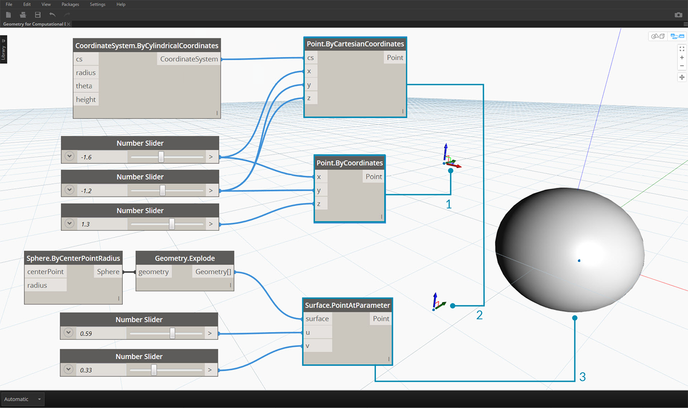

## Punkte

Wenn Geometrie gewissermaßen die Sprache für ein Modell ist, sind Punkte das Alphabet. Punkte sind die Grundlage für die Erstellung aller anderen Geometrie: Sie benötigen mindestens zwei Punkte, um eine Kurve zu erstellen, mindestens drei Punkte für ein Polygon oder eine Netzfläche usw. Indem Sie die Position, Anordnung und Beziehung zwischen Punkten angeben (z. B. mithilfe einer Sinusfunktion), können Sie Geometrie höherer Ordnung definieren, die etwa als Kreise oder Kurven zu erkennen ist.


> 1. Kreis mit den Funktionen ```x=r*cos(t)``` und ```y=r*sin(t)```
2. Sinuskurve mit den Funktionen ```x=(t)``` und ```y=r*sin(t)```
### Was ist ein Punkt?

Ein Punkt wird lediglich durch einen oder mehrere Werte, die sogenannten Koordinaten, definiert. Die Anzahl der Koordinatenwerte, die zum Definieren des Punkts benötigt werden, ist vom Koordinatensystem oder Kontext abhängig, in dem er sich befindet. In Dynamo werden größtenteils Punkte verwendet, die sich im dreidimensionalen Weltkoordinatensystem befinden und drei Koordinaten [x,y,z] aufweisen.


### Punkt als Koordinaten

Punkte können auch in zweidimensionalen Koordinatensystemen vorhanden sein. Für unterschiedliche Räume bestehen unterschiedliche Notationskonventionen: So wird etwa bei einer Ebene [X,Y], bei einer Oberfläche jedoch [U,V] verwendet.


> 1. Punkt in euklidischen Koordinatensystem: [x,y,z]
2. Punkt in einem Koordinatensystem mit Kurvenparameter: [t]
3. Punkt in Koordinatensystem mit Oberflächenparametern: [U,V]

Parameter für Kurven und Oberflächen sind – auch wenn dies nicht intuitiv verständlich wirkt – kontinuierlich und erstrecken sich über die Grenzen der gegebenen Geometrie hinaus. Da die Formen, die den Parameterraum definieren, sich im dreidimensionalen Weltkoordinatensystem befinden, können parametrische Koordinaten jederzeit in Weltkoordinaten konvertiert werden. Der Punkt [0.2, 0.5] auf der Oberfläche entspricht beispielsweise dem Punkt [1.8, 2.0, 4.1] in Weltkoordinaten.



> 1. Punkt in angenommenen Weltkoordinaten (xyz)
2. Punkt relativ zu einem angegebenen Koordinatensystem (zylindrisch)
3. Punkt in UV-Koordinaten auf einer Oberfläche
> Laden Sie die Beispieldatei für dieses Bild herunter (durch Rechtsklicken und Wahl von "Save Link As..."): [Geometry for Computational Design - Points.dyn](datasets/5-3/Geometry for Computational Design - Points.dyn). Eine vollständige Liste der Beispieldateien finden Sie im Anhang.

