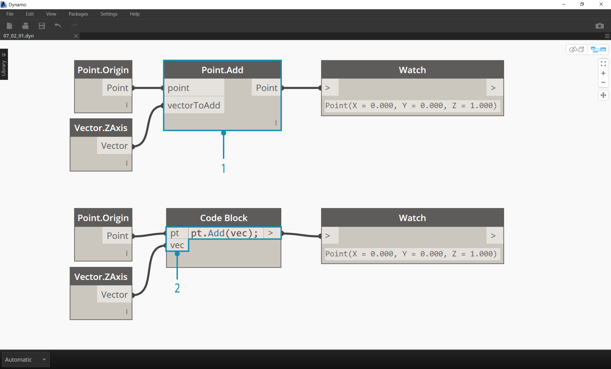
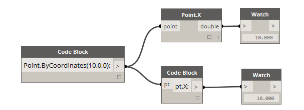
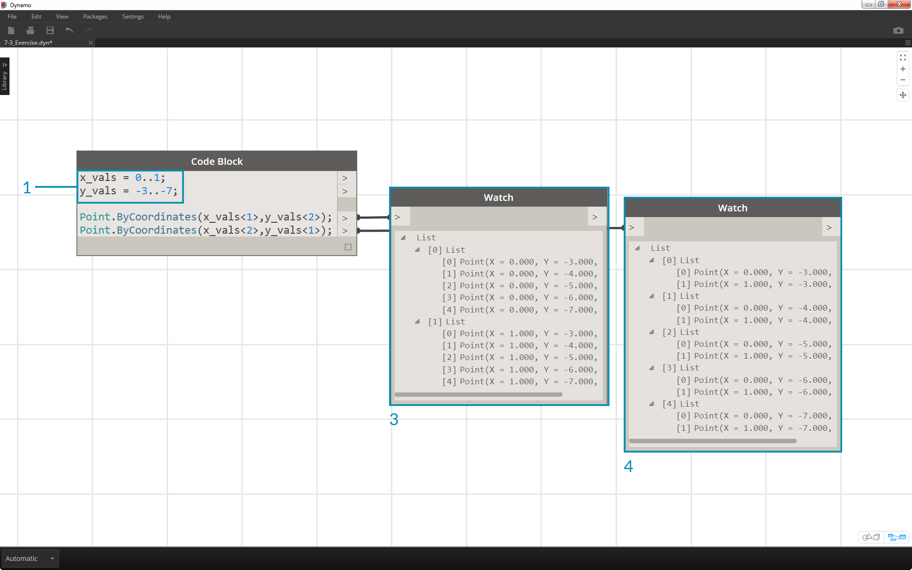
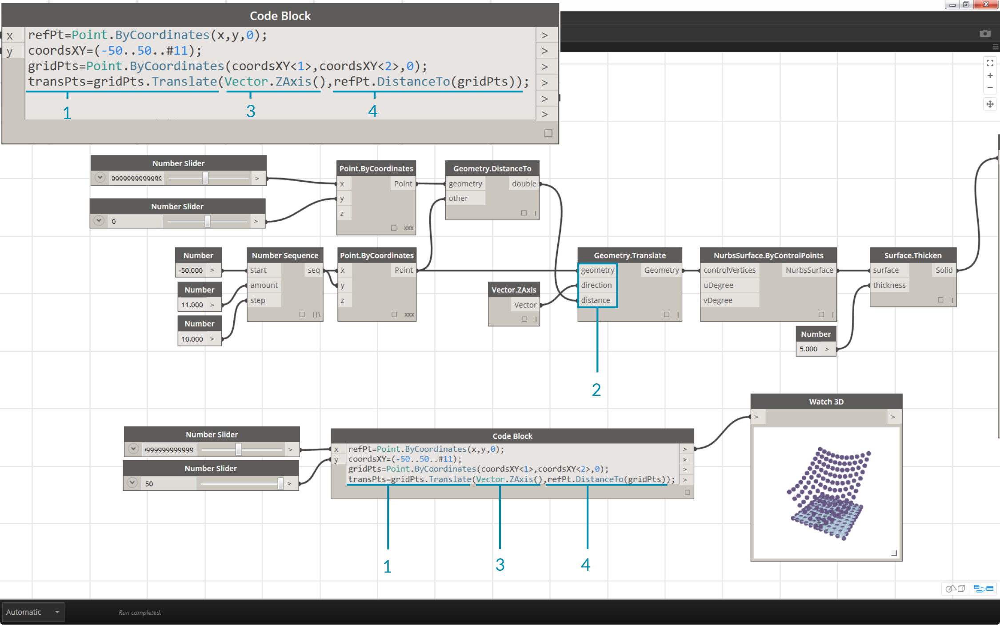
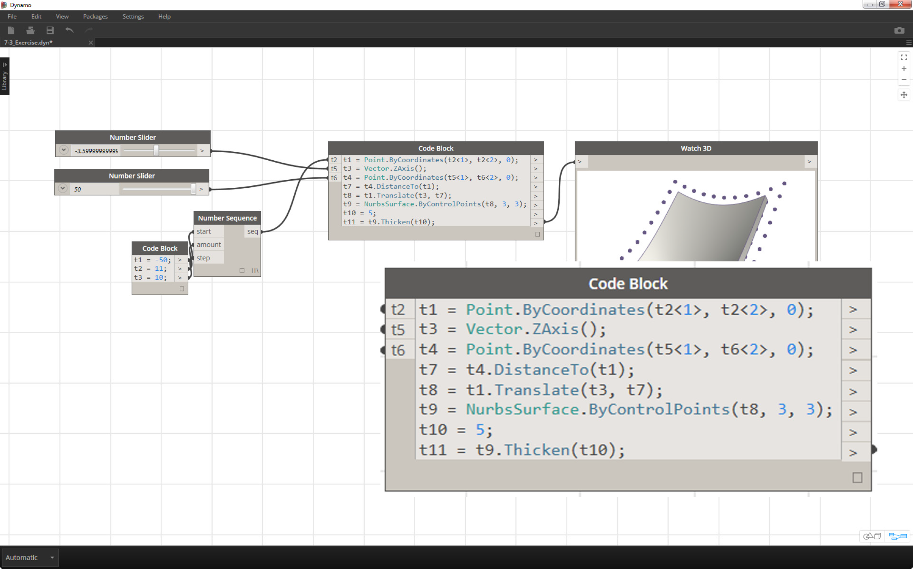

## DesignScript-Syntax

Die Namen von Blöcken in Dynamo weisen ein gemeinsames Merkmal auf: Sie enthalten einen Punkt *"."* ohne Leerzeichen. Der Grund dafür ist, dass als Text oben in jedem Block dessen Syntax in der Skriptsprache angegeben wird. Der Punkt (*"."*) in der sogenannten *Punktnotation* trennt dabei das Element von den möglichen Methoden, die für dieses aufgerufen werden können. Dies vermittelt auf einfache Weise zwischen visueller und textbasierter Skripterstellung.


Zur allgemeinen Veranschaulichung der Punktnotation dient hier die parametrische Behandlung eines Apfels in Dynamo. Im Folgenden werden einige "Methoden" betrachtet, die Sie für den Apfel ausführen können (bevor Sie ihn essen). (Anmerkung: Diese Methoden sind keine echten Dynamo-Methoden.)

|Klartext|Punktnotation|Ausgabe|
| -- | -- | -- |
|Welche Farbe hat der Apfel?|Apfel.Farbe|Rot|
|Ist der Apfel reif?|Apfel.istReif|Wahr|
|Wie viel wiegt der Apfel?|Apfel.Gewicht|170 g|
|Woher kommt der Apfel?|Apfel.Übergeordnet|Baum|
|Was kann aus dem Apfel entstehen?|Apfel.Untergeordnet|Kerne|
|Wurde der Apfel hier in der Gegend angebaut?|Apfel.EntfernungVonObstgarten|100 km|

Die Ausgabedaten in der Tabelle lassen darauf schließen, dass dieser Apfel schmackhaft ist. Ich glaube, ich *Apfel.Essen()*.

### Punktnotation in Codeblöcken

Behalten Sie dieses anschauliche Beispiel im Gedächtnis, wenn jetzt anhand von *Point.ByCoordinates* gezeigt wird, wie Sie mithilfe von Codeblöcken einen Punkt erstellen können:


> Die *Code Block*-Syntax ```Point.ByCoordinates(0,10);``` gibt dasselbe Ergebnis aus wie der *Point.ByCoordinates*-Block in Dynamo, allerdings genügt ein Block, um den Punkt zu erstellen. Dieses Verfahren ist effizienter als die Verbindung separater Blöcke mit *x* und *y*.

> 1. Indem Sie *Point.ByCoordinates* im Codeblock verwenden, legen Sie die Eingabewerte in derselben Reihenfolge fest wie im vorgegebenen Block *(x, y)*.

### Aufrufen von Blöcken

Sie können beliebige Blöcke aus der Bibliothek mithilfe eines Codeblocks aufrufen. Ausgenommen hiervon sind spezielle *Blöcke für die Benutzeroberfläche*, d. h. Blöcke mit einer speziellen Funktion in der Benutzeroberfläche. So können Sie beispielsweise *Circle.ByCenterPointRadius* aufrufen; einen *Watch 3D*-Block aufzurufen, wäre jedoch wenig sinnvoll.

Es gibt generell drei Typen normaler Blöcke (dies umfasst die meisten Blöcke in der Bibliothek):

* **Erstellen**: Erstellt bzw. konstruiert ein Objekt.
* **Aktion**: Führt einen Vorgang für ein Objekt aus.
* **Abfrage**: Ruft eine Eigenschaft eines bestehenden Objekts ab.

Die Bibliothek ist anhand dieser Kategorien geordnet. Methoden bzw. Blöcke dieser drei Typen werden beim Aufruf in einem Codeblock unterschiedlich behandelt.


#### Erstellen

Mit Blöcken aus der Kategorie Erstellen wird völlig neue Geometrie konstruiert. Die Werte werden von links nach rechts in den Codeblock eingegeben. Dabei wird dieselbe Reihenfolge für die Eingaben eingehalten wie im eigentlichen Block von oben nach unten: 

> Der Vergleich des *Line.ByStartPointEndPoint*-Blocks und der entsprechenden Syntax im Codeblock zeigt, dass Sie dieselben Ergebnisse erhalten.

#### Aktion

Eine Aktion ist ein Vorgang, den Sie für ein Objekt des gegebenen Typs ausführen. In Dynamo wird die vielen Programmiersprachen gemeinsame *Punktnotation* zum Anwenden von Aktionen auf Objekte verwendet. Dabei geben Sie zuerst das Objekt, dann einen Punkt und schließlich den Namen der Aktion ein. Die Eingabewerte für Aktionsmethoden werden genau wie bei Erstellungsmethoden in Klammern gesetzt, wobei Sie jedoch die erste Eingabe aus dem entsprechenden Block nicht angeben müssen. Stattdessen geben Sie das Element an, für Sie die Aktion durchführen:



> 1. Der *Point.Add*-Block ist ein Aktionsblock, d. h., die Syntax funktioniert anders als zuvor.
2. Die Eingaben sind: 1. der *point* und 2. der hinzuzufügende *vector*. Im *Code Block* hat der Punkt (das Objekt) die Bezeichnung *"pt"*. Um einen Vektor *"vec"* zu *"pt"* hinzuzufügen, müssen Sie *pt.Add(vec)* schreiben: Objekt, Punkt, Aktion. Die Aktion Add benötigt nur eine Eingabe, d. h. alle Eingaben aus dem *Point.Add*-Block ausgenommen die erste. Die erste Eingabe für den *Point.Add*-Block ist der Punkt selbst.

#### Abfrage

Abfragemethoden rufen eine Eigenschaft eines Objekts ab. Da das Objekt selbst die Eingabe ist, müssen Sie keine weiteren Eingaben angeben. Es sind keine Klammern erforderlich.



### Wie funktioniert die Vergitterung?

Die Funktionsweise der Vergitterung in Blöcken unterscheidet sich von derjenigen in Codeblöcken. In Blöcken klickt der Benutzer mit der rechten Maustaste auf den jeweiligen Block und wählt die benötigte Vergitterungsoption. Codeblöcke bieten wesentlich mehr Kontrolle über die Strukturierung der Daten. In der Codeblock-Kurzschreibweise wird die Zuordnung mehrerer eindimensionaler Listen mithilfe von *Replikationsanleitungen* festgelegt,. Die Hierarchie innerhalb der resultierenden verschachtelten Liste wird durch Zahlen in spitzen Klammern "< >" definiert:<1>,<2>,<3> usw. </3></2></1>

> 1. In diesem Beispiel werden mithilfe der Kurzschreibweise zwei Bereiche definiert. (Genauere Informationen zu Kurzschreibweisen erhalten Sie im folgenden Abschnitt dieses Kapitels.) Kurz gefasst: ```0..1;``` entspricht ```{0,1}``` und ```-3..-7```entspricht ```{-3,-4,-5,-6,-7}```. Als Ergebnis erhalten Sie Listen mit zwei x- und 5 y-Werten. Ohne Replikationsanleitungen wird aus diesen nicht übereinstimmenden Listen eine Liste mit zwei Punkten erstellt, was der Länge der kürzesten Liste entspricht. Mithilfe der Replikationsanleitungen werden sämtliche möglichen Kombinationen aus zwei und fünf Koordinaten (d. h. ihr **Kreuzprodukt**) ermittelt.
2. Mit der Syntax ```Point.ByCoordinates(x_vals<1>,y_vals<2>);``` erhalten Sie **zwei** Listen mit je **fünf** Einträgen.
3. Mit der Syntax ```Point.ByCoordinates(x_vals<2>,y_vals<1>);``` erhalten Sie **fünf** Listen mit je **zwei** Einträgen.

Diese Notation ermöglicht es außerdem, welche der Listen der anderen übergeordnet sein soll, d. h., ob zwei Listen mit fünf Einträgen oder fünf Listen mit zwei Einträgen ausgegeben werden sollen. In diesem Beispiel bewirkt die Änderung der Reihenfolge der Replikationsanleitungen, dass als Ergebnis eine Liste entweder mit Zeilen von Punkten oder mit Spalten von Punkten ausgegeben wird.

### Block zu Code

Für die oben beschriebenen Codeblock-Methoden ist eventuell eine gewisse Einarbeitung nötig. In Dynamo steht die Funktion Block zu Code zur Verfügung, die dies erleichtert. Um diese Funktion zu verwenden, wählen Sie eine Gruppe von Blöcken in Ihrem Dynamo-Diagramm aus, klicken mit der rechten Maustaste in den Ansichtsbereich und wählen Block zu Code. Dynamo fasst daraufhin diese Blöcke einschließlich aller Ein- und Ausgaben in einem Codeblock zusammen. Dies ist nicht nur ideal zum Erlernen von Codeblock, sondern ermöglicht darüber hinaus die Arbeit mit effizienteren und stärker parametrischen Dynamo-Diagrammen. Die unten folgende Übungslektion wird mit einem Abschnitt zu Block zu Code abgeschlossen. Sie sollten sie daher vollständig bearbeiten.


### Übungslektion

> Laden Sie die zu dieser Übungslektion gehörige Beispieldatei herunter (durch Rechtsklicken und Wahl der Option Save Link As). Eine vollständige Liste der Beispieldateien finden Sie im Anhang. [Dynamo-Syntax_Attractor-Surface.dyn](datasets/7-2/Dynamo-Syntax_Attractor-Surface.dyn)

Zur Demonstration der Effizienz von Codeblock wird hier eine bestehende Definition eines Attraktorfelds in Codeblockform übertragen. Die Verwendung einer bestehenden Definition zeigt die Beziehung zwischen Codeblock und visuellem Skript und erleichtert das Erlernen der Design Script-Syntax. 

> Erstellen Sie zuerst die in der Abbildung oben gezeigte Definition (oder öffnen Sie die Beispieldatei).

> 1. Als Vergitterung für *Point.ByCoordinates* wurde *Kreuzprodukt* eingestellt.
2. Die einzelnen Punkte eines Rasters werden in Abhängigkeit von ihrer Entfernung zum Referenzpunkt in z-Richtung nach oben verschoben.
3. Eine Oberfläche wird erstellt und verdickt, sodass die Geometrie relativ zur Entfernung vom Referenzpunkt ausgebeult wird.


> 1. Als Erstes wird der Referenzpunkt definiert: ```Point.ByCoordinates(x,y,0);```. Dabei kommt dieselbe Syntax für *Point.ByCoordinates* zum Einsatz, die auch oben im Block für den Referenzpunkt angegeben ist.
2. Die Variablen *x* und *y* werden in den Codeblock eingefügt, sodass sie mithilfe von Schiebereglern dynamisch aktualisiert werden können.
3. Fügen Sie *Schieberegler* für die Eingaben im *Code Block* hinzu, mit denen Bereiche von *-50* bis *50* definiert werden. Dies erstreckt sich über das gesamte Vorgaberaster von Dynamo.


> 1. Definieren Sie in der zweiten Zeile des *Codeblocks* eine Kurzschreibweise für den Zahlenfolgenblock: ```coordsXY = (-50..50..#11);```. Dies wird im nächsten Abschnitt genauer behandelt. Halten Sie zunächst fest, dass diese Kurzschreibweise dem *Number Sequence*-Block im visuellen Skript entspricht.


> 1. Als Nächstes erstellen Sie ein Raster aus Punkten aus der *coordsXY*-Folge. Hierfür soll die Syntax *Point.ByCoordinates* verwendet werden, Sie müssen jedoch außerdem genau wie im visuellen Skript das *Kreuzprodukt* aus der Liste erstellen. Geben Sie zu diesem Zweck die folgende Zeile ein: ```gridPts = Point.ByCoordinates(coordsXY<1>,coordsXY<2>,0);```. Die spitzen Klammern geben die Referenz im Kreuzprodukt an.
2. Im *Watch3D*-wird jetzt ein Raster von Punkten über das gesamte Dynamo-Raster angezeigt.



> 1. Jetzt folgt der schwierige Teil: Die Punkte des Rasters sollen in Abhängigkeit von ihrer Entfernung zum Referenzpunkt nach oben verschoben werden. Diese neue Punktgruppe soll den Namen *transPts* erhalten. Eine Verschiebung ist eine Aktion, die für ein bestehendes Element durchgeführt wird. Verwenden Sie daher nicht ```Geometry.Translate...```, sondern ```gridPts.Translate```.
2. Im Block, der im Ansichtsbereich gezeigt wird, sind drei Eingaben zu sehen. Die zu verschiebende Geometrie ist bereits deklariert, da die Aktion für dieses Element durchgeführt wird (mithilfe von *gridPts.Translate*). Die beiden verbleibenden Eingaben werden in die Klammern der Funktion eingegeben: *direction* und *distance*.
3. Die Richtung ist leicht anzugeben: Sie geben ```Vector.ZAxis()``` für die vertikale Verschiebung an.
4. Die Abstände zwischen dem Referenzpunkt und den einzelnen Rasterpunkten müssen jedoch noch berechnet werden. Dies erreichen Sie auf dieselbe Weise wie zuvor durch eine Aktion für den Referenzpunkt: ```refPt.DistanceTo(gridPts)```
5. Mit der letzten Codezeile erhalten Sie die verschobenen Punkte: ```transPts = gridPts.Translate(Vector.ZAxis(),refPt.DistanceTo(gridPts));```


> 1. Damit haben Sie ein Raster aus Punkten mit einer geeigneten Datenstruktur zum Erstellen einer Nurbs-Oberfläche erstellt. Diese Oberfläche konstruieren Sie mithilfe von ```srf = NurbsSurface.ByControlPoints(transPts);```


> 1. Fügen Sie der Oberfläche schließlich eine Tiefendimension hinzu, indem Sie einen Volumenkörper konstruieren: ```solid = srf.Thicken(5);```. In diesem Fall beträgt die Verdickung 5 Einheiten im Code. Sie können dies jedoch jederzeit als Variable (z. B. mit der Bezeichnung *thickness*) definieren, deren Wert anschließend über einen Schieberegler gesteuert wird.

### Vereinfachen des Diagramms mit Block zu Code

Die Funktion Block zu Code führt die gesamte eben behandelte Übung durch einen einfachen Mausklick aus. Sie ermöglicht damit nicht nur die Erstellung benutzerdefinierter Definitionen und wiederverwendbarer Codeblöcke, sondern ist auch ein äußerst nützliches Hilfsmittel beim Erlernen der Skripterstellung in Dynamo:


> 1. Beginnen Sie mit dem bestehenden visuellen Skript aus Schritt 1 dieser Übungslektion. Wählen Sie sämtliche Blöcke aus, klicken Sie mit der rechten Maustaste in den Ansichtsbereich und wählen Sie *Block zu Code*. Dieser einfache Schritt genügt.



> Dynamo hat automatisch eine Textversion des visuellen Diagramms einschließlich Vergitterung und aller anderen Angaben erstellt. Probieren Sie dies mit Ihren visuellen Skripts aus und schöpfen Sie die Möglichkeiten von Codeblöcken voll aus!

