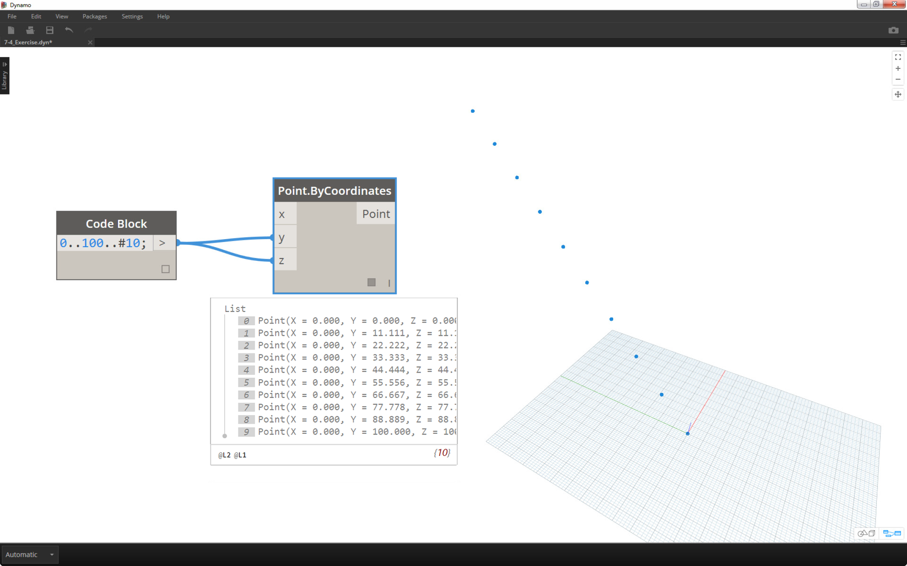
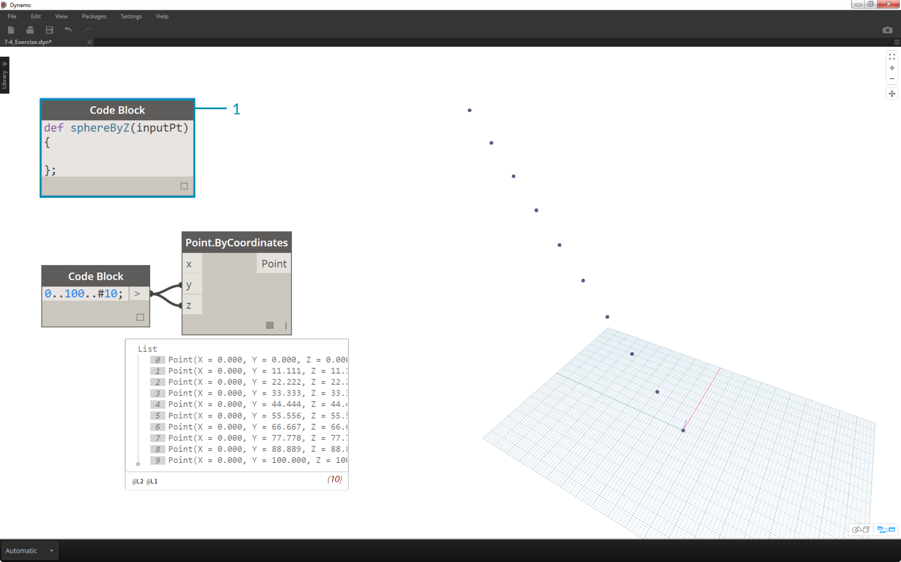
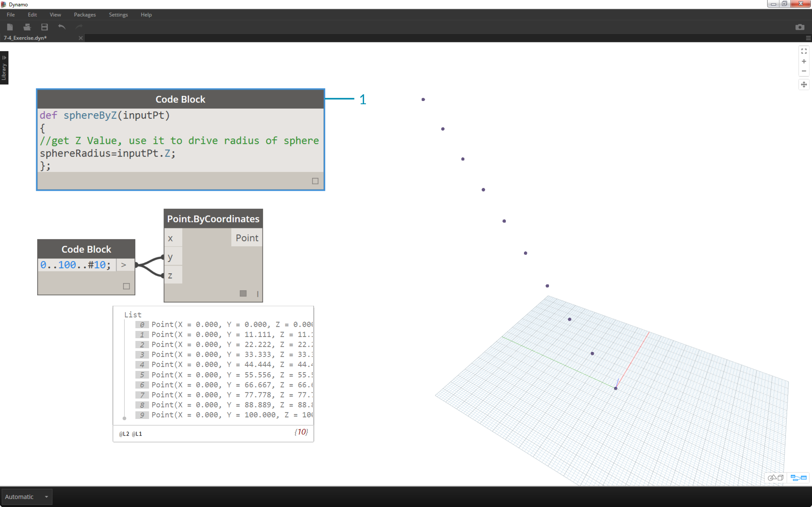
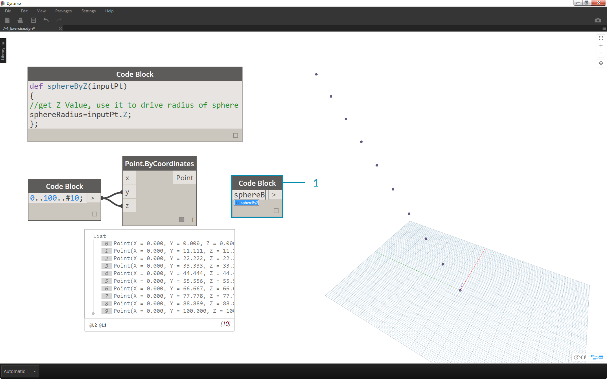
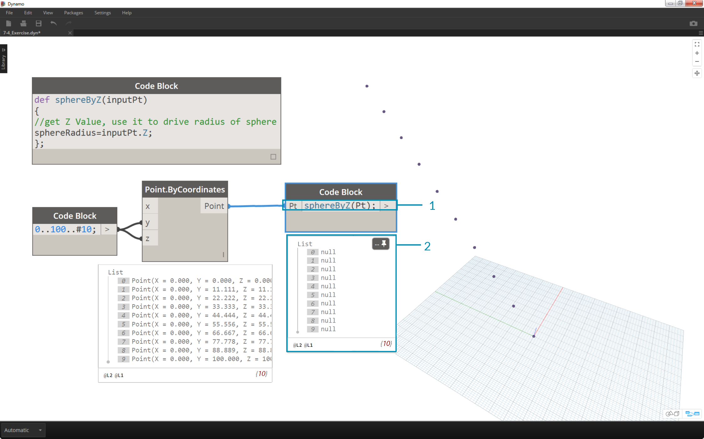
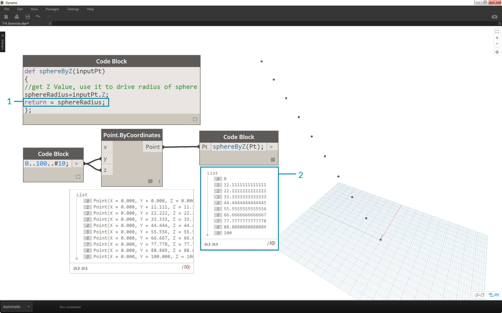
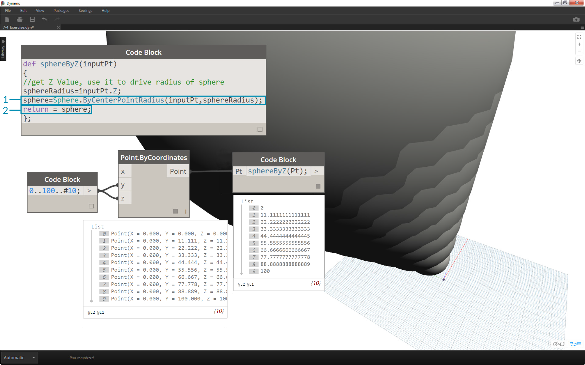
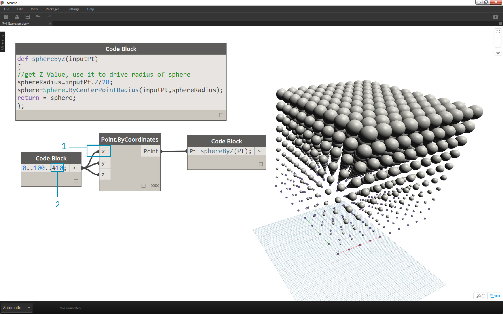

## Codeblock-Funktionen

Funktionen können in einem Codeblock erstellt und an anderer Stelle in einer Dynamo-Definition erneut aufgerufen werden. Dadurch erhalten Sie eine weitere Steuerungsmöglichkeit in parametrischen Dateien. Sie stellt eine Textversion eines benutzerdefinierten Blocks dar. In diesem Fall ist der übergeordnete Block problemlos verfügbar und kann sich an beliebiger Stelle im Diagramm befinden. Hierfür sind keine Verbindungen erforderlich.

### Übergeordneter Block

Die erste Zeile besteht aus dem Schlüsselwort "def" und dem Namen der Funktion mit den Namen der Eingaben in Klammern. Der Hauptteil der Funktion wird in geschweiften Klammern angegeben. Verwenden Sie zum Ausgeben eines Werts "return =". In Codeblöcken, die eine Funktion definieren, sind keine Eingabe- oder Ausgabeverbindungen vorhanden, da sie über andere Codeblöcke aufgerufen werden. 

```
/*This is a multi-line comment,
which continues for
multiple lines*/

def FunctionName(input1,input2)
{
//This is a comment
sum = input1+input2;
return = sum;
};
```

### Untergeordnete Blöcke

Sie können die Funktion in einem anderen Codeblock in derselben Datei aufrufen, indem Sie ihren Namen und dieselbe Anzahl von Argumenten angeben. Dies funktioniert auf dieselbe Weise wie die vordefinierten Blöcke aus der Bibliothek.


```
FunctionName(in1,in2);
```

### Übungslektion

> Laden Sie die zu dieser Übungslektion gehörige Beispieldatei herunter (durch Rechtsklicken und Wahl der Option Save Link As). Eine vollständige Liste der Beispieldateien finden Sie im Anhang. [Functions_SphereByZ.dyn](datasets/7-4/Functions_SphereByZ.dyn)

In dieser Übung erstellen Sie eine allgemeine Definition zum Erstellen von Kugeln aus einer eingegebenen Liste von Punkten. Der Radius dieser Kugeln wird durch die z-Eigenschaft des jeweiligen Punkts gesteuert.



> Sie beginnen mit einem Zahlenbereich, der zehn Werte von 0 bis 100 umfasst. Verbinden Sie diesen mit einem *Point.ByCoordinates*-Block, um eine diagonale Linie zu erhalten.



> 1. Erstellen Sie einen *Code Block* und geben Sie mithilfe der folgenden Codezeile die Definition ein:
```
def sphereByZ(inputPt){
};
```

Dabei ist *inputPt* der Name, den Sie für die Punkte zuweisen, über die die Funktion gesteuert werden soll. Bis hierher hat die Funktion keine Wirkung. Dies entwickeln Sie jedoch in den folgenden Schritten.



> 1. Fügen Sie der *Code Block*-Funktion einen Kommentar und die Variable *sphereRadius* hinzu, die die *Z*-Position der einzelnen Punkte abfragt. Beachten Sie, dass die Methode *inputPt.Z* keine Klammern benötigt. Da es sich um eine *Abfrage* von Eigenschaften eines bestehenden Elements handelt, sind keine Eingaben erforderlich.
```
def sphereByZ(inputPt,radiusRatio)
{
//get Z Value, use it to drive radius of sphere
sphereRadius=inputPt.Z;
};
```



> 1. Als Nächstes rufen Sie die eben erstellte Funktion in einem anderen *Code Block* auf. Wenn Sie im Ansichtsbereich doppelklicken, um einen neuen *Code Block* zu erstellen, und *sphereB* eingeben, schlägt Dynamo die eben definierte *sphereByZ*-Funktion vor: Die Funktion wurde der IntelliSense-Bibliothek hinzugefügt. Dieser Mechanismus ist sehr hilfreich.



> 1. Als Nächstes erstellen Sie eine Variable mit dem Namen *Pt*, um die Verbindung zu den Punkten herzustellen, die Sie in den vorherigen Schritten erstellt haben: ```sphereByZ(Pt)```.
2. Die Ausgabe zeigt lediglich Nullwerte. Dies geschieht aus dem folgenden Grund: Beim Definieren der Funktion wurde festgelegt, dass die Variable *sphereRadius* berechnet werden soll, Sie haben jedoch noch nicht definiert, was die Funktion als *Ausgabe* *zurückgeben* soll. Dies beheben Sie im nächsten Schritt.



> 1. In diesem wichtigen Schritt müssen Sie die Ausgabe der Funktion definieren. Fügen Sie die Zeile ```return = sphereRadius;``` in die *sphereByZ*-Funktion ein.
2. Jetzt zeigt die Ausgabe im *Code Block* die z-Koordinaten der einzelnen Punkte an.



> Als Nächstes erstellen Sie die Kugeln, indem Sie die *übergeordnete* Funktion bearbeiten.

> 1. Definieren Sie zunächst eine Kugel mit der folgenden Codezeile: ```sphere=Sphere.ByCenterPointRadius(inputPt,sphereRadius);```
2. Ändern Sie dann den return-Wert in *sphere* anstelle von *sphereRadius*: ```return = sphere;```. Als Ergebnis erhalten Sie einige sehr große Kugeln in der Dynamo-Vorschau.


> 1. Um Kugeln von angemessenerer Größe zu erhalten, aktualisieren Sie den Wert von *sphereRadius*, indem Sie ihn dividieren: ```sphereRadius = inputPt.Z/20;```. Jetzt sind die einzelnen Kugeln getrennt sichtbar und die Beziehung zwischen dem Radius und dem z-Wert wird erkennbar.


> 1. Indem Sie im *Point.ByCoordinates*-Block die Vergitterung von *Kürzeste* in *Kreuzprodukt* ändern, erstellen Sie ein Raster aus Punkten. Die *sphereByZ*-Funktion ist weiterhin uneingeschränkt wirksam, d. h., für alle Punkte werden Kugeln mit von ihren z-Werten abhängigen Radien erstellt.



> 1. Verbinden Sie jetzt als weiteren Test die ursprüngliche Zahlenliste mit der x-Eingabe von *Point.ByCoordinates*. Dadurch entsteht ein Würfel aus Kugeln.
2. Anmerkung: Wenn diese Berechnung auf Ihrem Computer viel Zeit in Anspruch nimmt, ändern Sie den Wert *#10* in einen kleineren Wert, z. B. *#5*.


> 1. Beachten Sie, dass die von Ihnen erstellte Funktion *sphereByZ* eine allgemeine Funktion ist. Sie können daher die Helix aus einer der vorigen Lektionen erneut öffnen und die Funktion darauf anwenden.


> In einem letzten Schritt steuern Sie das Radienverhältnis über einen benutzerdefinierten Parameter. Zu diesem Zweck müssen Sie eine neue Eingabe für die Funktion erstellen und den Teiler *20* durch einen Parameter ersetzen.

> 1. Aktualisieren Sie die Definition von *sphereByZ* wie folgt:
```
def sphereByZ(inputPt,radiusRatio)
{
//get Z Value, use it to drive radius of sphere
sphereRadius=inputPt.Z/radiusRatio;
//Define Sphere Geometry
sphere=Sphere.ByCenterPointRadius(inputPt,sphereRadius);
//Define output for function
return = sphere;
};
```

2. Aktualisieren Sie die untergeordneten Codeblöcke, indem Sie der Eingabe die Variable *ratio* hinzufügen: ```sphereByZ(Pt,ratio);```. Verbinden Sie einen Schieberegler mit der neu erstellten Codeblock-Eingabe und ändern Sie die Größe der Radien anhand des Radienverhältnisses.

