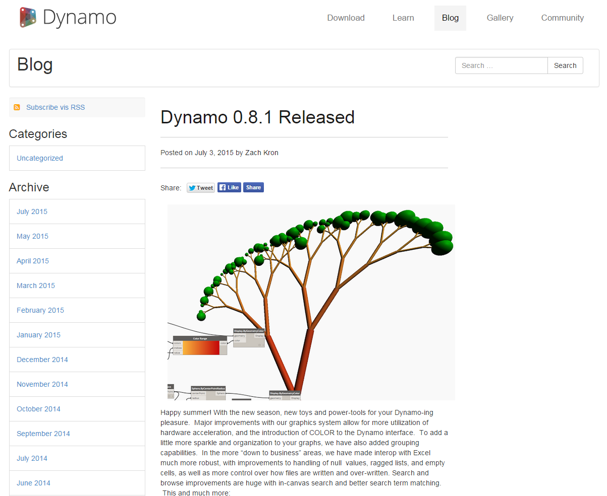

## Verbindung zu Revit

 Dynamo for Revit ergänzt die Gebäudemodellierung (Building Information Modelling) um die Daten- und Logikumgebung einen grafischen Algorithmeneditors. Die Flexibilität dieser Umgebung eröffnet zusammen mit einer robusten Revit-Datenbank neue Perspektiven für BIM.

Dieses Kapitel behandelt die Dynamo-Arbeitsabläufe für BIM. Die einzelnen Abschnitte enthalten im Wesentlichen Übungen, da sich ein grafischer Algorithmeneditor für BIM am besten anhand konkreter Projekte vorstellen lässt. Zunächst erhalten Sie hier jedoch eine Einführung in die Ursprünge dieses Programms.

#### Entwicklung von Dynamo

> Ein spezialisiertes Entwicklerteam und eine engagierte Community haben dafür gesorgt, dass das Projekt seit seinen Anfängen kaum wiederzuerkennen ist.

Dynamo wurde ursprünglich zur Rationalisierung von AEC-Arbeitsabläufen in Revit entwickelt. In Revit wird für jedes Projekt eine robuste Datenbank erstellt. Für den durchschnittlichen Benutzer kann jedoch der Zugriff auf diese Informationen über die Benutzeroberfläche mit ihren Einschränkungen hinaus problematisch sein. In Revit steht eine umfassende API (Application Program Interface) zur Verfügung, über die externe Entwickler eigene Werkzeuge erstellen können. Programmierer nutzen diese API schon seit Jahren. Textbasierte Skripterstellung ist jedoch nicht für jeden Benutzer möglich. Dynamo soll die Arbeit mit Revit-Daten gewissermaßen demokratisieren, indem ein leichter verständlicher grafischer Algorithmeneditor bereitgestellt wird.

Die Core-Dynamo-Blöcke ermöglichen es in Verbindung mit speziellen Revit-Blöcken dem Benutzer, parametrische Arbeitsabläufe für Interoperabilität, Dokumentation, Analyse und Erstellung erheblich zu erweitern. Mit Dynamo können Sie lästige Arbeitsabläufe automatisieren und erfolgreich mit Entwürfen experimentieren.

### Ausführen von Dynamo in Revit

> 1. Navigieren Sie im Familieneditor eines Revit-Projekts zu Zusatzmodule und klicken Sie auf *Dynamo*. Beachten Sie: Dynamo wird nur in der Datei ausgeführt, in der es geöffnet wurde.

> 1. Wenn Sie Dynamo in Revit öffnen, wird eine neue Kategorie namens *Revit* angezeigt. In dieser umfassenden Erweiterung der Benutzeroberfläche stehen spezielle Blöcke für Revit-Arbeitsabläufe zur Verfügung.

**Anmerkung: Da die für Revit spezifische Familie von Blöcken verwendet wird, kann das Dynamo-Diagramm nur verwendet werden, wenn Sie es in Dynamo for Revit öffnen. Wenn Sie ein Diagramm aus Dynamo for Revit beispielsweise in Dynamo Sandbox öffnen, fehlen die Revit-Blöcke.*

### Anhalten von Blöcken

Revit ist eine Plattform mit robusten Funktionen zum Projektmanagement. Aus diesem Grund sind parametrische Operationen in Dynamo eventuell komplex und ihre Berechnung kann viel Zeit beanspruchen. Falls die Berechnung von Blöcken in Dynamo sehr lange dauert, können Sie die Blockfunktionen anhalten ("einfrieren") und damit die Ausführung von Revit-Vorgängen unterbrechen, während Sie Ihr Diagramm entwickeln. Weitere Informationen zum Anhalten von Blöcken finden Sie im entsprechenden Abschnitt im Kapitel [Körper](../05_Geometry-for-Computational-Design/5-6_solids.md#freezing).

### Community

Da Dynamo ursprünglich für AEC erstellt wurde, bietet seine große und weiter wachsende Community ausgezeichnete Ressourcen, die es ermöglichen, von Experten der Branche zu lernen und sich mit ihnen auszutauschen. Die Dynamo-Community setzt sich zusammen aus Architekten, Ingenieuren, Programmierern und Designern, denen die Leidenschaft für Austausch und Entwicklung gemeinsam ist.

Dynamo ist ein Open Source-Projekt und entwickelt sich daher ständig weiter. Ein großer Teil dieser Entwicklungen steht in Verbindung mit Revit. Wenn Sie neu hinzugekommen sind, können Sie damit beginnen, im Diskussionsforum [Fragen zu stellen](http://dynamobim.org/forums/forum/dyn/). Programmierer, die sich an der Entwicklung von Dynamo beteiligen möchten, finden auf der [GitHub-Seite das Nötige.](https://github.com/DynamoDS/Dynamo). Eine hervorragende Ressource für Bibliotheken externer Beteiligter ist auch der [Dynamo Package Manager](http://dynamopackages.com/). Viele dieser Pakete werden für die Verwendung mit AEC entwickelt. In diesem Kapitel werden solche extern entwickelten Pakete für die Unterteilung von Oberflächen in Felder vorgestellt.

> Für Dynamo steht auch ein aktives [Blog](http://dynamobim.com/blog/) zur Verfügung. Lesen Sie die neuesten Posts, um sich über neue Entwicklungen auf dem Laufenden zu halten!

