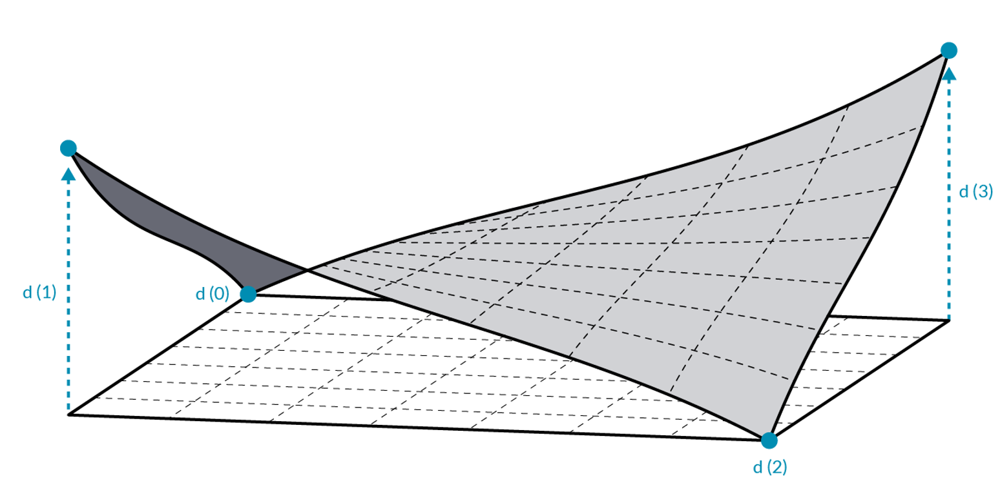
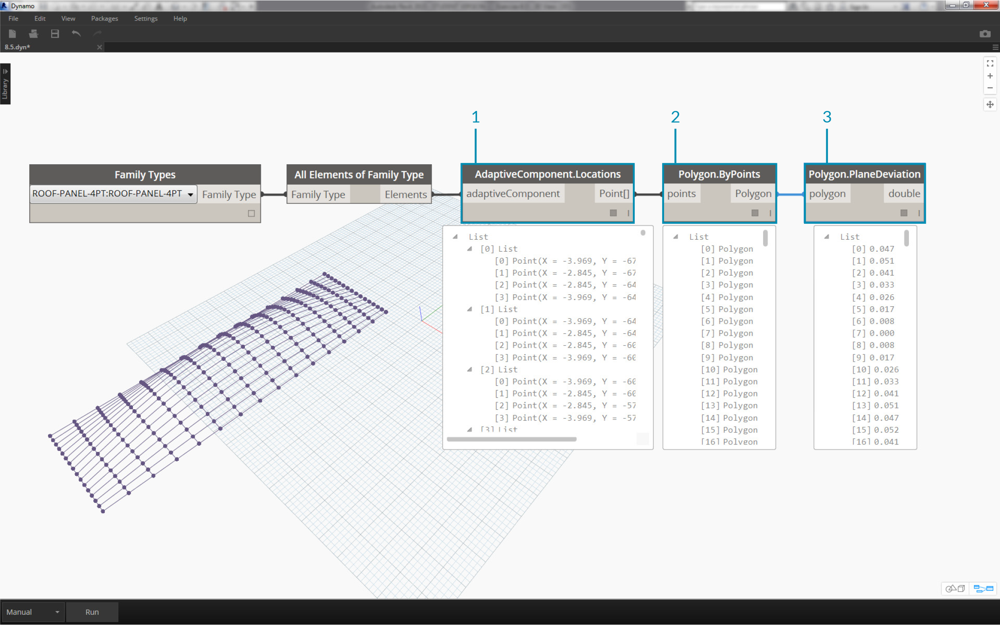
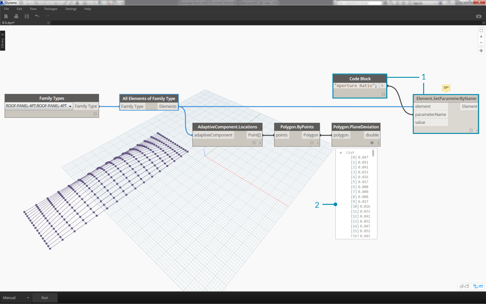
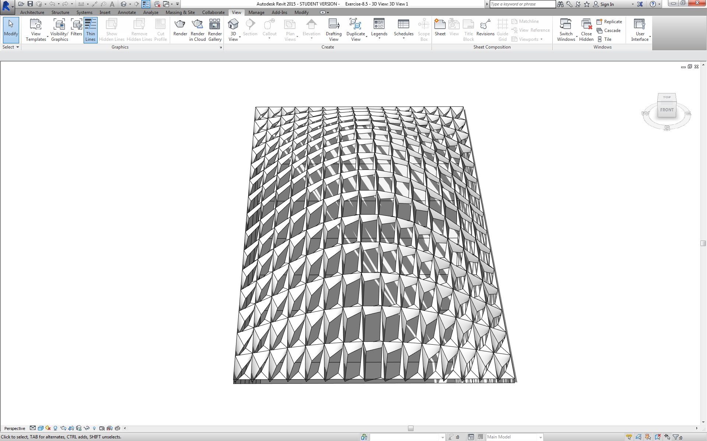
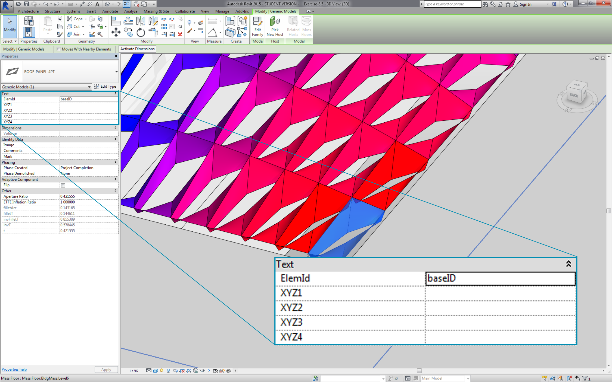
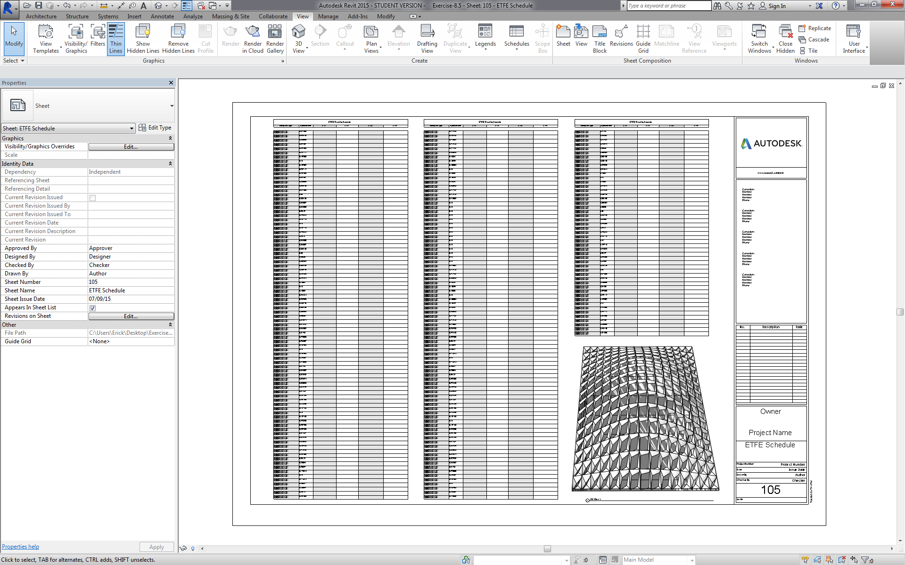
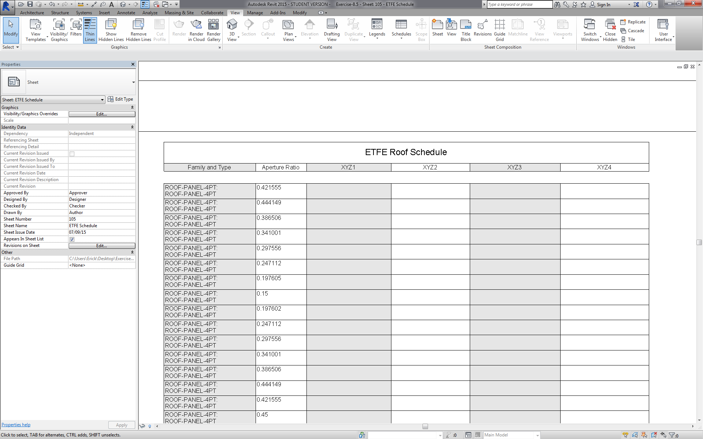
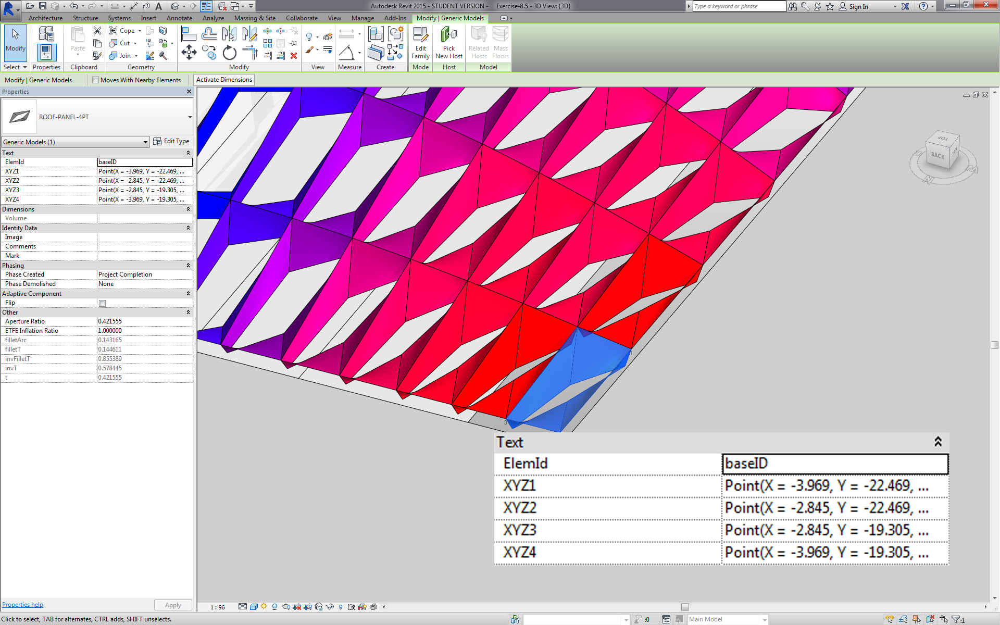
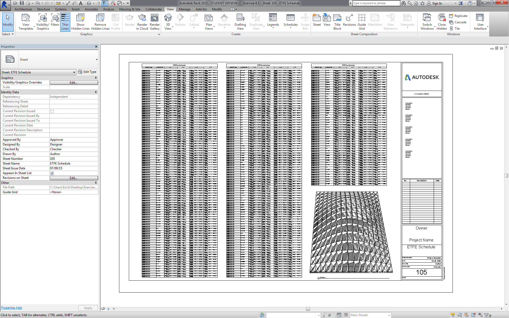
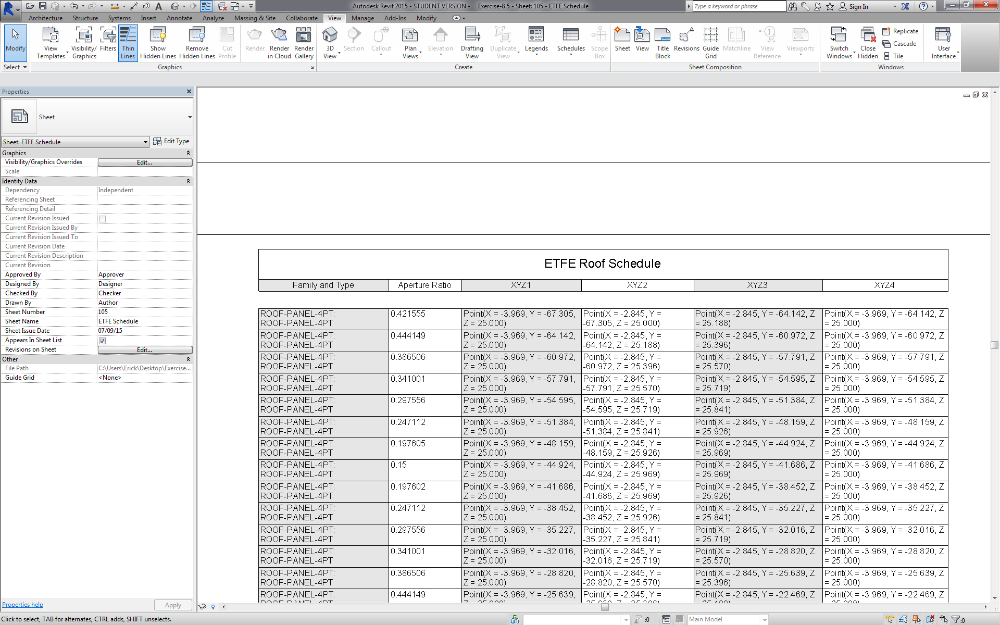

## Dokumentation

Die Bearbeitung von Parametern für die Dokumentation schließt sich an die in den vorigen Abschnitten behandelten Aufgaben an. In diesem Abschnitt bearbeiten Sie Parameter, mit deren Hilfe Sie nicht die geometrischen Eigenschaften von Elementen steuern, sondern eine Revit-Datei für die Konstruktionsunterlagen erstellen können.

#### Abweichung

In der folgenden Übung verwenden Sie einen einfachen Block für die Abweichung von der Ebene, um einen Revit-Plan für die Dokumentation zu erstellen. Die einzelnen Elemente der parametrisch definierten Dachkonstruktion weisen unterschiedliche Abweichungswerte auf. Die Werte innerhalb dieses Bereichs sollen mithilfe von Farben gekennzeichnet und die adaptiven Punkte in einer Bauteilliste ausgegeben werden, sodass die Daten an einen Fassadenspezialisten, Bauingenieur oder Subunternehmer weitergegeben werden können.



> Der Block für die Abweichung von der Ebene berechnet, in welchem Grad die Gruppe aus vier Punkten von der optimalen Ebene zwischen ihnen abweicht. Dies ist eine schnelle und einfache Möglichkeit zur Untersuchung der Realisierbarkeit.

### Übungslektion

> Laden Sie die zu dieser Übungslektion gehörigen Beispieldateien herunter (durch Rechtsklicken und Wahl der Option Save Link As). Eine vollständige Liste der Beispieldateien finden Sie im Anhang.

> 1. [Documenting.dyn](datasets/8-6/Documenting.dyn)
2. [ARCH-Documenting-BaseFile.rvt](datasets/8-6/ARCH-Documenting-BaseFile.rvt)

Beginnen Sie mit der Revit-Datei für diesen Abschnitt (oder verwenden Sie weiterhin die Datei aus dem vorigen Abschnitt). Diese Datei zeigt eine Gruppe von EFTE-Elementen auf dem Dach. Diese Elemente werden in dieser Übung referenziert.


> 1. Fügen Sie einen *Family Types*-Block in den Ansichtsbereich ein und wählen Sie *"ROOF-PANEL-4PT"*.
2. Verbinden Sie diesen Block mit einem *All Elements of Family Type*-Block, um alle diese Elemente auszuwählen und aus Revit in Dynamo zu übernehmen.



> 1. Rufen Sie die Positionen der adaptiven Punkte für die einzelnen Elemente mithilfe eines *AdaptiveComponent.Locations*-Blocks ab.
2. Erstellen Sie mithilfe eines *Polygon.ByPoints*-Blocks Polygone jeweils aus den vier Eckpunkten. Dadurch erhalten Sie eine abstrakte Version des aus Einzelelementen bestehenden Systems in Dynamo, ohne dass die vollständige Geometrie des Revit-Elements importiert werden muss.
3. Berechnen Sie die planare Abweichung mithilfe des *Polygon.PlaneDeviation*-Blocks.



> In der folgenden kurzen Zusatzübung legen Sie den *Öffnungsgrad* der einzelnen Elemente anhand ihrer planaren Abweichung fest.

> 1. Fügen Sie im Ansichtsbereich einen *Element.SetParameterByName*-Block hinzu und verbinden Sie die adaptiven Bauteile mit der *element*-Eingabe. Verbinden Sie einen *Code Block* mit der Angabe *"Aperture Ratio"* mit der *parameterName*-Eingabe.
2. Die Ergebnisse der Abweichungsberechnung können nicht direkt mit der value-Eingabe verbunden werden, da die Werte zunächst dem Parameterbereich neu zugeordnet werden müssen.


> 1. Ordnen Sie mithilfe von *Math.RemapRange* die Abweichungswerte einer Domäne zwischen *.15* und *.45* zu.
2. Verbinden Sie diese Ergebnisse mit der value-Eingabe von *Element.SetParameterByName*.


> In Revit ist die Veränderung der Öffnungen in der Oberfläche *ungefähr* zu erkennen.



> Die vergrößerte Darstellung zeigt deutlicher, dass die weniger weit geöffneten Elemente sich näher an den Ecken befinden. Die weit geöffneten Elemente befinden sich hingegen ganz oben. Die Eckbereiche weisen stärkere Abweichungen, der Scheitel der Wölbung dagegen die geringste Krümmung auf. Das Ergebnis ist daher überzeugend.

### Farben und Dokumentation

Durch Festlegen des Öffnungsgrads wird die Abweichung der Elemente des Dachs nicht präzise dargestellt. Zudem kommt es zu Änderungen an der Geometrie des Elements selbst. Angenommen, Sie möchten lediglich die Abweichung unter dem Gesichtspunkt der Realisierbarkeit analysieren. In diesem Fall wäre es hilfreich, für die Dokumentation die Elemente in Abhängigkeit von Abweichungsbereichen farbig zu kennzeichnen. Dies ist mithilfe der folgenden Schritte möglich, wobei der Vorgang dem oben beschriebenen sehr ähnlich ist.


> 1. Entfernen Sie *Element.SetParameterByName* und die dazugehörigen Blöcke und fügen Sie *Element.OverrideColorInView* hinzu.
2. Fügen Sie im Ansichtsbereich einen *Color Range*-Block hinzu und verbinden Sie ihn mit der color-Eingabe von *Element.OverrideColorInView*. Um den Farbverlauf zu erstellen, müssen Sie noch die Abweichungswerte mit dem Farbbereich verbinden.
3. Wenn Sie den Mauszeiger auf die *value*-Eingabe setzen, wird angezeigt, dass Werte zwischen *0* und *1* für die Zuordnung von Farben zu Werten erforderlich sind. Sie müssen daher die Abweichungswerte für diesen Bereich neu zuordnen.


> 1. Ordnen Sie mithilfe von *Math.RemapRange* die Werte für die planare Abweichung dem Bereich zwischen *0* und *1* zu. (Anmerkung: Sie können die Quelldomäne auch mithilfe eines *MapTo*-Blocks definieren.)
2. Verbinden Sie die Ergebnisse mit einem *Color Range*-Block.
3. Dadurch erhalten Sie als Ausgabe einen Bereich von Farben anstelle eines Bereichs von Zahlen.
4. Falls Manuell eingestellt ist, klicken Sie auf *Ausführen*. Für den Rest dieses Vorgangs können Sie die Einstellung Automatisch verwenden.


> In Revit ist jetzt eine wesentlich übersichtlichere Darstellung mit einem Farbverlauf zu sehen, der die planare Abweichung unter Verwendung des Farbbereichs zeigt. Die Farben müssen jedoch möglicherweise angepasst werden. Momentan werden die Werte für die kleinste Abweichung in Rot angezeigt: Dies scheint das Gegenteil des erwarteten Resultats zu sein. Stattdessen soll der Höchstwert der Abweichung in Rot dargestellt werden, während für die kleinste Abweichung eine ruhigere Farbe verwendet wird. Kehren Sie zu Dynamo zurück, um dies zu korrigieren.


> 1. Geben Sie in einem *Code Block* zwei Zahlen in zwei getrennten Zeilen ein: ```0;``` und ```255;```.
2. Erstellen Sie die Farben Rot und Blau, indem Sie die entsprechenden Werte mit zwei *Color.ByARGB*-Blöcken verbinden.
3. Erstellen Sie eine Liste aus diesen beiden Farben.
4. Verbinden Sie diese Liste mit der *colors*-Eingabe des *Color Range* und beobachten Sie die Aktualisierung dieses benutzerdefinierten Farbbereichs.


> In Revit ist die Darstellung der Bereiche mit maximaler Abweichung in den Ecken jetzt besser verständlich. Mithilfe dieses Blocks werden Farben in einer Ansicht überschrieben. Aus diesem Grund kann es sehr hilfreich sein, wenn unter den Zeichnungen ein bestimmter Plan für einen bestimmten Analysetyp vorhanden ist.

### Bauteillisten



> 1. Wenn Sie eines der ETFE-Elemente in Revit auswählen, werden vier Exemplarparameter angezeigt: *XYZ1, XYZ2, XYZ3* und *XYZ4*. Diese sind nach korrekter Erstellung leer. Diese Parameter sind textbasiert und benötigen Werte. Sie schreiben mithilfe von Dynamo die Positionen der adaptiven Punkte in die einzelnen Parameter. Dies verbessert die Interoperabilität, falls die Geometrie an einen Bauingenieur oder Fassadenspezialisten weitergegeben werden soll.



> Der Beispielplan zeigt eine große, leere Bauteilliste. Die XYZ-Parameter sind gemeinsam genutzte Parameter in der Revit-Datei und können daher in die Bauteilliste aufgenommen werden.



> Die vergrößerte Darstellung zeigt, dass die XYZ-Parameter noch ausgefüllt werden müssen. Die ersten beiden Parameter werden von Revit vorgegeben.


> Um diese Werte zu schreiben, ist eine komplexe Listenoperation erforderlich. Das Diagramm selbst ist recht einfach, nutzt jedoch in großem Umfang die Listenzuordnung wie im Kapitel zu Listen beschrieben.

> 1. Wählen Sie mithilfe der oben gezeigten Blöcke alle adaptiven Bauteile aus.
2. Extrahieren Sie die Positionen der einzelnen Punkte mithilfe von *AdaptiveComponent.Locations*.
3. Konvertieren Sie diese Punkte in Zeichenfolgen. Beachten Sie, dass Sie hier textbasierte Parameter verwenden, und achten Sie darauf, den richtigen Datentyp einzugeben.
4. Erstellen Sie eine Liste mit den vier Zeichenfolgen, die die zu ändernden Parameter definieren: *XYZ1, XYZ2, XYZ3* und *XYZ4*.
5. Verbinden Sie diese Liste mit der *parameterName*-Eingabe von *Element.SetParameterByName*.
6. Verbinden Sie *Element.SetParameterByName* mit der *combinator*-Eingabe von *List.Combine*.
7. Verbinden Sie die *adaptiven Bauteile* mit *list1*.
8. Verbinden Sie*String from Object* mit *list2*.
9. In diesem Vorgang werden Listen zugeordnet: Für jedes Element werden vier Werte geschrieben, wodurch eine komplexe Datenstruktur entsteht. Der *List.Combine*-Block definiert eine Operation, die eine Stufe tiefer in der Datenhierarchie abläuft. Aus diesem Grund wurden die Eingaben für Element und Wert leer gelassen. *List.Combine* verbindet die Unterlisten aus seinen Eingaben mit den leeren Eingaben von *List.SetParameterByName* in der Reihenfolge, in der sie verbunden wurden.



> Wenn Sie jetzt ein Element in Revit auswählen, werden die Werte der einzelnen Parameter als Zeichenfolgen angezeigt. In der Praxis würden Sie ein einfacheres Format zum Schreiben von Punkten (x, y, z) erstellen. Sie könnten dies mithilfe von Zeichenfolgenoperationen in Dynamo erreichen. Da dies jedoch den Rahmen dieses Kapitels sprengen würde, wird dieses Verfahren hier nicht behandelt.



> Ansicht der Bauteilliste mit ausgefüllten Parametern



> Für jedes EFTE-Element sind jetzt die xyz-Koordinaten der adaptiven Punkte an seinen Ecken angegeben und können für die Fertigung der Elemente verwendet werden.

