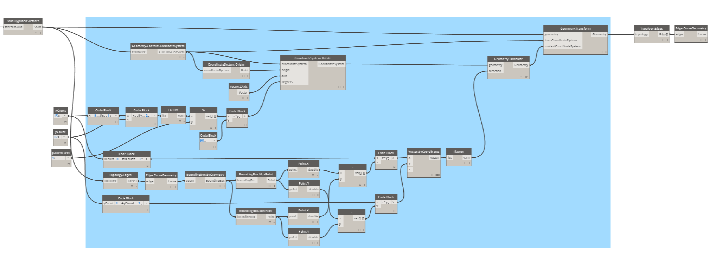
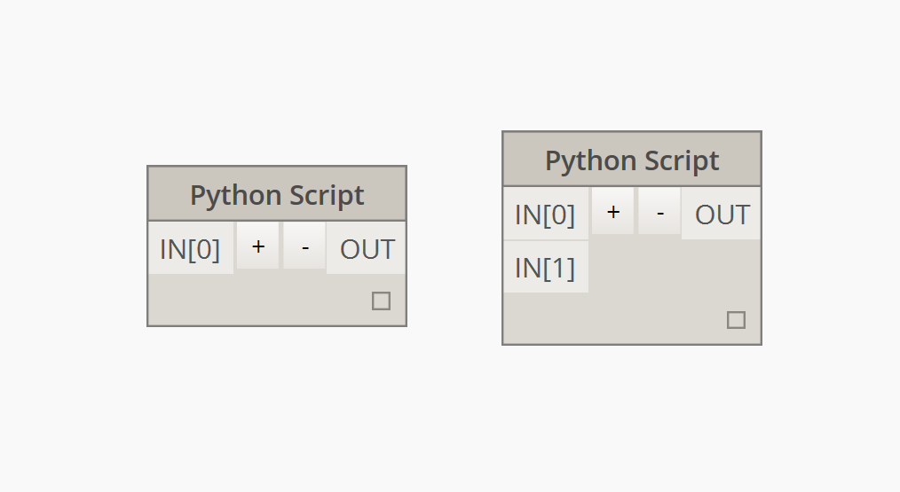
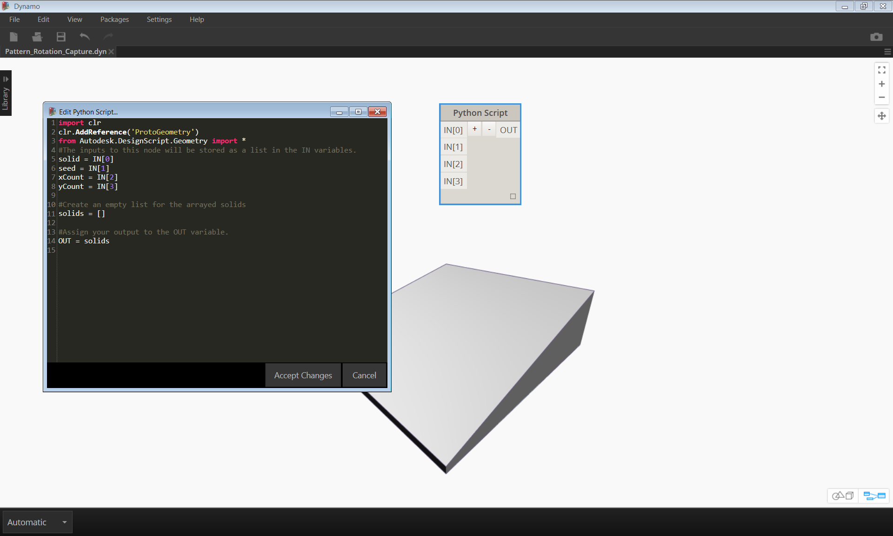
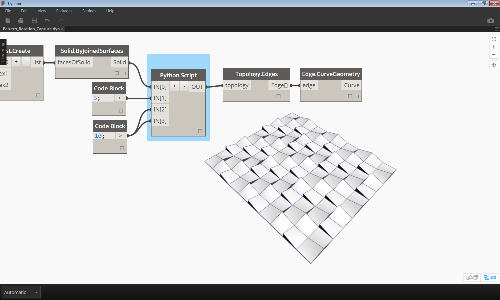
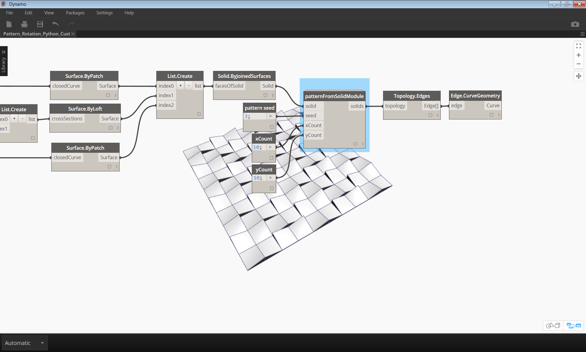

## Python

 Python ist eine häufig verwendete Programmiersprache, die sich aufgrund ihrer Syntax großer Beliebtheit erfreut. Sie ist leicht zu lesen und damit leichter zu erlernen als viele andere Sprachen. Python unterstützt Module und Pakete und kann in bestehende Anwendungen eingebettet werden. Für die Beispiele in diesem Abschnitt werden Python-Grundkenntnisse vorausgesetzt. Eine geeignete Ressource für den Einstieg in Python finden Sie auf der Seite [Getting Started](https://www.python.org/about/gettingstarted/) auf [Python.org](https://www.python.org/).

### Visuelle und Textprogrammierung im Vergleich

Wozu dient die Textprogrammierung in der visuellen Programmierumgebung von Dynamo? Die visuelle Programmierung bietet, wie in Kapitel 1.1 beschrieben, zahlreiche Vorteile. Sie ermöglicht es, in einer intuitiven visuellen Oberfläche Programme zu entwickeln, ohne spezielle Syntax zu erlernen. Visuelle Programme können jedoch recht unübersichtlich werden und enthalten zuweilen nicht genügend Funktionen. So stehen in Python beispielsweise wesentlich praktischere Methoden zum Schreiben von Bedingungsanweisungen (if/then) und für Schleifen zur Verfügung. Python ist ein leistungsstarkes Werkzeug, das das Funktionsspektrum von Dynamo erweitern und Ihnen die Möglichkeit geben kann, eine große Gruppe von Blöcken durch einige wenige präzise Codezeilen zu ersetzen.

**Visuelles Programm:**

**Textprogramm :**

```
import clr
clr.AddReference('ProtoGeometry')
from Autodesk.DesignScript.Geometry import *

solid = IN[0]
seed = IN[1]
xCount = IN[2]
yCount = IN[3]

solids = []

yDist = solid.BoundingBox.MaxPoint.Y-solid.BoundingBox.MinPoint.Y
xDist = solid.BoundingBox.MaxPoint.X-solid.BoundingBox.MinPoint.X

for i in xRange:
for j in yRange:
fromCoord = solid.ContextCoordinateSystem
toCoord = fromCoord.Rotate(solid.ContextCoordinateSystem.Origin,Vector.ByCoordinates(0,0,1),(90*(i+j%val)))
vec = Vector.ByCoordinates((xDist*i),(yDist*j),0)
toCoord = toCoord.Translate(vec)
solids.append(solid.Transform(fromCoord,toCoord))

OUT = solids
```

### Python-Block

Python-Blöcke sind genau wie Codeblöcke eine Scripting-Oberfläche innerhalb einer Umgebung für die visuelle Programmierung. Der Python-Block befindet sich unter *Core > Scripting* in der Bibliothek. Durch Doppelklicken auf den Block wird der Python-Skript-Editor geöffnet. (Sie können auch mit der rechten Maustaste auf den Block klicken und *Bearbeiten* wählen.)


> Oben auf dem Bildschirm befindet sich vorgegebener Text, der es Ihnen erleichtern soll, die benötigten Bibliotheken zu referenzieren. Eingaben werden im IN-Array gespeichert. Werte werden durch Zuweisung zur OUT-Variablen an Dynamo zurückgegeben.

In der Autodesk.DesignScript.Geometry-Bibliothek können Sie Punktnotation ähnlich wie in Codeblöcken verwenden. Weitere Informationen zur Dynamo-Syntax finden Sie in Kapitel 7.2 sowie im [DesignScript-Handbuch](http://dynamobim.org/wp-content/uploads/forum-assets/colin-mccroneautodesk-com/07/10/Dynamo_language_guide_version_1.pdf). Wenn Sie einen Geometrietyp, z. B. 'Point.' eingeben, wird eine Liste mit den Methoden zum Erstellen und Abfragen von Punkten angezeigt.


> Zu den Methoden gehören Konstruktoren, wie *ByCoordinates*, Aktionen wie *Add* und Abfragen wie *X*-, *Y*- und *Z*-Koordinaten.

### Übungslektion

> Laden Sie die zu dieser Übungslektion gehörige Beispieldatei herunter (durch Rechtsklicken und Wahl der Option Save Link As). Eine vollständige Liste der Beispieldateien finden Sie im Anhang. [Python_Custom-Node.dyn](datasets/9-4/Python-CustomNode.dyn)

In diesem Beispiel schreiben Sie ein Python-Skript zum Erstellen von Mustern aus einem Körpermodul und wandeln das Skript in einen benutzerdefinierten Block um. Zuerst erstellen Sie das Körpermodul mithilfe von Dynamo-Blöcken.


> 1. **Rectangle.ByWidthLength**: Erstellen Sie ein Rechteck, das als Basis für den Körper verwendet werden soll.
2. **Surface.ByPatch**: Verbinden Sie das Rechteck mit der *closedCurve*-Eingabe, um die untere Oberfläche zu erstellen.


> 1. **Geometry.Translate**: Verbinden Sie das Rechteck mit der *geometry*-Eingabe, um es nach oben zu verschieben, wobei Sie mithilfe eines Codeblocks die allgemeine Dicke des Körpers festlegen.
2. **Polygon.Points**: Fragen Sie die Eckpunkte des verschobenen Rechtecks ab.
3. **Geometry.Translate**: Erstellen Sie mithilfe eines Codeblocks eine Liste mit vier Werten für die vier Punkte, wobei Sie eine Ecke des Körpers nach oben verschieben.
4. **Polygon.ByPoints**: Erstellen Sie das obere Polygon aus den verschobenen Punkten erneut.
5. **Surface.ByPatch**: Schließen Sie das Polygon, um die obere Oberfläche zu erstellen.

Damit haben Sie die obere und untere Oberfläche erstellt. Erstellen Sie jetzt durch eine Erhebung zwischen den beiden Profilen die Seiten des Körpers.


> 1. **List.Create**: Verbinden Sie das Rechteck unten und das Polygon oben mit den index-Eingaben.
2. **Surface.ByLoft**: Erstellen Sie über eine Erhebung die Seiten des Körpers.
3. **List.Create**: Verbinden Sie die obere und untere sowie die seitlichen Oberflächen mit den index-Eingaben, um eine Liste der Oberflächen zu erhalten.
4. **Solid.ByJoinedSurfaces**: Verbinden Sie die Flächen, um das Körpermodul zu erstellen.

Damit haben Sie den Körper erstellt. Fügen Sie jetzt einen Block für Python-Skript in den Arbeitsbereich ein.



> Um dem Block weitere Eingaben hinzuzufügen, schließen Sie den Editor und klicken Sie auf das +-Symbol im Block. Die Eingaben erhalten die Namen IN[0], IN[1] usw., um anzuzeigen, dass sie für die Einträge einer Liste stehen.

Sie beginnen, indem Sie die Ein- und Ausgaben definieren. Doppelklicken Sie auf den Block, um den Python-Editor zu öffnen.



```
import clr
clr.AddReference('ProtoGeometry')
from Autodesk.DesignScript.Geometry import *

#The solid module to be arrayed
solid = IN[0]
#A number that determines which rotation pattern to use
seed = IN[1]
#The number of solids to array in the X and Y axes
xCount = IN[2]
yCount = IN[3]

#Create an empty list for the arrayed solids
solids = []

#Assign your output to the OUT variable.
OUT = solids
```

Dieser Code wird im weiteren Verlauf der Übung leichter verständlich. Als Nächstes müssen Sie überlegen, welche Informationen Sie zum Erstellen eines Arrays aus dem Körpermodul benötigen. Als Erstes müssen Sie die Maße des Körpers kennen, um die Entfernung für die Verschiebung zu ermitteln. Wegen eines Fehlers bei Begrenzungsrahmen müssen Sie diesen anhand der Kurvengeometrie der Kanten erstellen.


> Ein Blick auf den Python-Block in Dynamo. Dieselbe Syntax wie in den Titeln der Blöcke in Dynamo wird auch hier verwendet. Im Folgenden sehen Sie den kommentierten Code.

```
import clr
clr.AddReference('ProtoGeometry')
from Autodesk.DesignScript.Geometry import *

#Inputs
solid = IN[0]
seed = IN[1]
xCount = IN[2]
yCount = IN[3]

#Create an empty list for the arrayed solids
solids = []
# Create an empty list for the edge curves
crvs = []

#Loop through edges and append corresponding curve geometry to the list
for edge in solid.Edges:
crvs.append(edge.CurveGeometry)

#Get the bounding box of the curves
bbox = BoundingBox.ByGeometry(crvs)

#Get the X and Y translation distance based on the bounding box
yDist = bbox.MaxPoint.Y-bbox.MinPoint.Y
xDist = bbox.MaxPoint.X-bbox.MinPoint.X

#Assign your output to the OUT variable.
OUT = solids
```

Da die Körpermodule sowohl verschoben als auch gedreht werden sollen, verwenden Sie hier die Geometry.Transform-Operation. Wenn Sie den Geometry.Transform-Block genauer betrachten, sehen Sie, dass für die Transformation des Körpers ein Quell- und ein Zielkoordinatensystem benötigt werden. Die Quelle ist das Koordinatensystem, das den Kontext für den Ausgangskörper bildet, während als Ziel ein eigenes Koordinatensystem für jedes Modul im Array verwendet wird. Das bedeutet, dass Sie die x- und y-Werte in einer Schleife verarbeiten müssen, um das Koordinatensystem jedes Mal auf andere Weise zu transformieren.


> Ein Blick auf den Python-Block in Dynamo. Im Folgenden sehen Sie den kommentierten Code.

```
import clr
clr.AddReference('ProtoGeometry')
from Autodesk.DesignScript.Geometry import *

#Inputs
solid = IN[0]
seed = IN[1]
xCount = IN[2]
yCount = IN[3]

#Create an empty list for the arrayed solids
solids = []
# Create an empty list for the edge curves
crvs = []

#Loop through edges and append corresponding curve geometry to the list
for edge in solid.Edges:
crvs.append(edge.CurveGeometry)

#Get the bounding box of the curves
bbox = BoundingBox.ByGeometry(crvs)

#Get the X and Y translation distance based on the bounding box
yDist = bbox.MaxPoint.Y-bbox.MinPoint.Y
xDist = bbox.MaxPoint.X-bbox.MinPoint.X

#get the source coordinate system
fromCoord = solid.ContextCoordinateSystem

#Loop through X and Y
for i in range(xCount):
for j in range(yCount):
#Rotate and translate the coordinate system
toCoord = fromCoord.Rotate(solid.ContextCoordinateSystem.Origin,Vector.ByCoordinates(0,0,1),(90*(i+j%seed)))
vec = Vector.ByCoordinates((xDist*i),(yDist*j),0)
toCoord = toCoord.Translate(vec)
#Transform the solid from the source coord system to the target coord system and append to the list
solids.append(solid.Transform(fromCoord,toCoord))
```



> Speichern Sie das Python-Skript, indem Sie auf Änderungen übernehmen klicken, und verbinden Sie die Eingabewerte mit dem Block. Dadurch sollte ein Muster aus Körpern entstehen.


> Ändern Sie den Wert für die Ausgangszahl, um verschiedene Muster zu erstellen. Indem Sie die Parameter des Körpermoduls selbst ändern, erzielen Sie ebenfalls unterschiedliche Wirkungen.

Damit haben Sie ein nützliches Python-Skript erstellt. Speichern Sie dieses jetzt als benutzerdefinierten Block. Wählen Sie den Python-Skript-Block aus, klicken Sie mit der rechten Maustaste und wählen Sie Block aus Auswahl erstellen.


> Weisen Sie einen Namen, eine Beschreibung und eine Kategorie zu.

Dadurch wird ein neuer Arbeitsbereich geöffnet, in dem Sie den benutzerdefinierten Block bearbeiten können.


> 1. **Eingaben**: Geben Sie den Eingaben aussagekräftigere Namen und fügen Sie Datentypen und Vorgabewerte hinzu.
2. **Ausgabe**: Ändern Sie den Namen der Ausgabe und speichern Sie den Block als DYF-Datei.



> Die eben vorgenommenen Änderungen werden in den benutzerdefinierten Block übernommen.

