## Entwickeln von Paketen

In Dynamo steht eine Reihe von Verfahren zum Entwickeln von Paketen zur Verfügung, die Sie für Ihre eigenen Zwecke verwenden oder für die Dynamo-Community bereitstellen können. In der folgenden Fallstudie wird ein bestehendes Paket zerlegt, um den Aufbau von Paketen zu demonstrieren. Dabei werden Lektionen aus dem vorigen Kapitel zugrunde gelegt: Eine Gruppe benutzerdefinierter Blöcke zum Zuordnen von Geometrie aus einer Dynamo-Oberfläche zu einer anderen mithilfe von UV-Koordinaten wird bereitgestellt.

### MapToSurface

Sie arbeiten mit einem Beispielpaket, das die UV-Zuordnung von Punkten aus einer Oberfläche zu einer anderen zeigt. Sie haben die Grundfunktionen dieses Werkzeugs bereits im Abschnitt [Erstellen eines benutzerdefinierten Blocks](../09_Custom-Nodes/9-2_Creating.md) in diesem Leitfaden erstellt. In den folgenden Dateien wird gezeigt, wie Sie die UV-Zuordnung weiterentwickeln und eine Gruppe von Werkzeugen für eine Bibliothek erstellen können, die anschließend veröffentlicht werden kann.

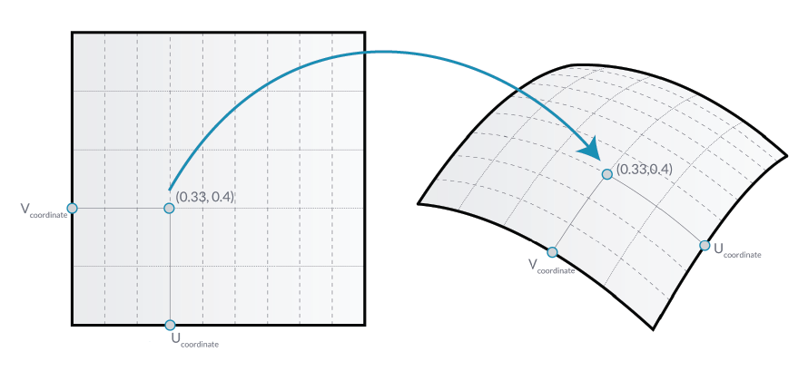

> In der unten gezeigten Abbildung wird ein Punkt aus einer Oberfläche mithilfe von UV-Koordinaten einer anderen zugeordnet. Dem Paket liegt dasselbe Prinzip zugrunde, es wird jedoch komplexere Geometrie verwendet.

### Installieren des Pakets

Im vorigen Kapitel wurden in Dynamo verfügbare Methoden vorgestellt, mit denen eine Oberfläche mithilfe in der xy-Ebene definierter Kurven in Felder unterteilt werden kann. In dieser Fallstudie wird dies auf mehrdimensionale Geometrie erweitert. Dabei installieren Sie das fertige Paket und es wird gezeigt, wie dieses entwickelt wurde. Im nächsten Abschnitt wird gezeigt, wie dieses Paket veröffentlicht wurde.

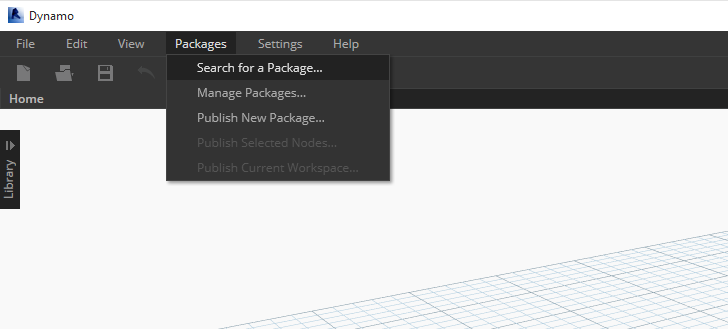

> Dies ist der einfache Teil. Navigieren Sie in Dynamo zu *Pakete > Suchen nach Paket*.

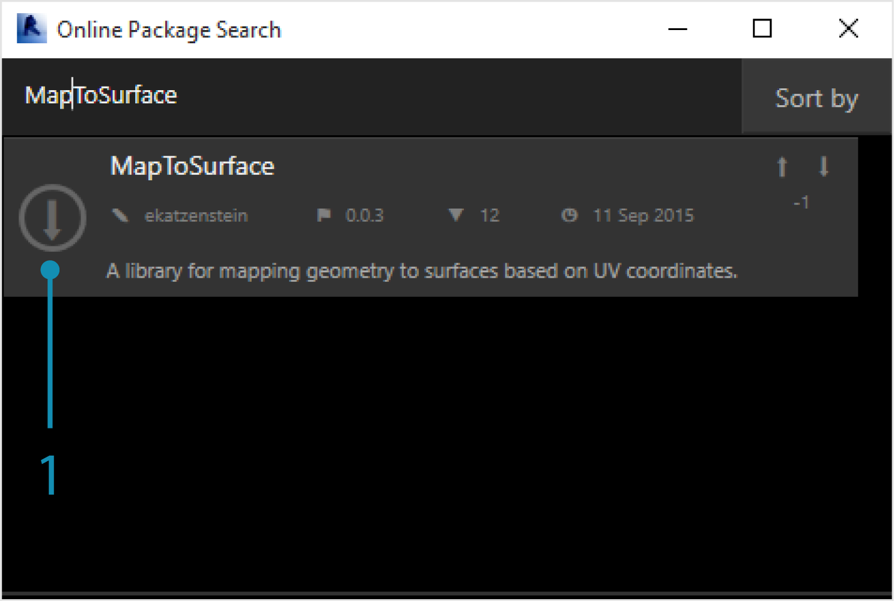

> Suchen Sie nach dem Paket *MapToSurface* (in einem Wort).

> 1. Wenn Sie das Paket gefunden haben, klicken Sie auf den Download-Pfeil links neben dem Paketnamen. Dadurch wird das Paket in Dynamo installiert.

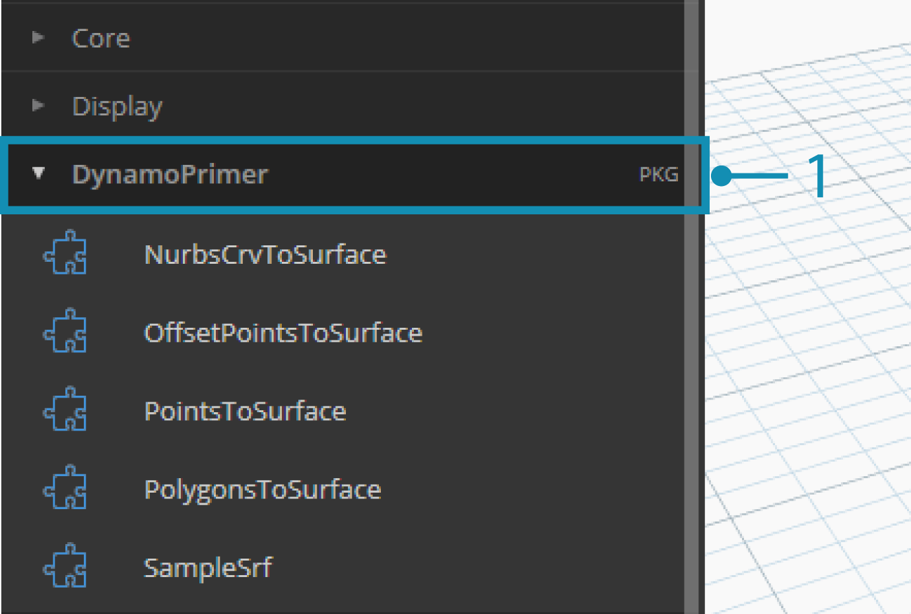

> 1. Nach der Installation werden die benutzerdefinierten Blöcke in der Gruppe DynamoPrimer oder in Ihrer Dynamo-Bibliothek angezeigt. Nachdem Sie das Paket installiert haben, analysieren Sie dieses jetzt.

### Benutzerdefinierte Blöcke

Für das Paket, das Sie hier erstellen, werden fünf benutzerdefinierte Blöcke verwendet. Diese Blöcke sind hier als Referenz bereits definiert. Im Folgenden analysieren Sie die Funktionen der einzelnen Blöcke. Einige der benutzerdefinierten Blöcke wurden ihrerseits unter Verwendung benutzerdefinierter Blöcke erstellt. Das Layout der Diagramme soll anderen Benutzern das Verständnis erleichtern.

> Dieses Paket ist mit fünf benutzerdefinierten Blöcken recht einfach konstruiert. In den nachfolgenden Schritten wird der Aufbau der einzelnen Blöcke kurz erläutert.

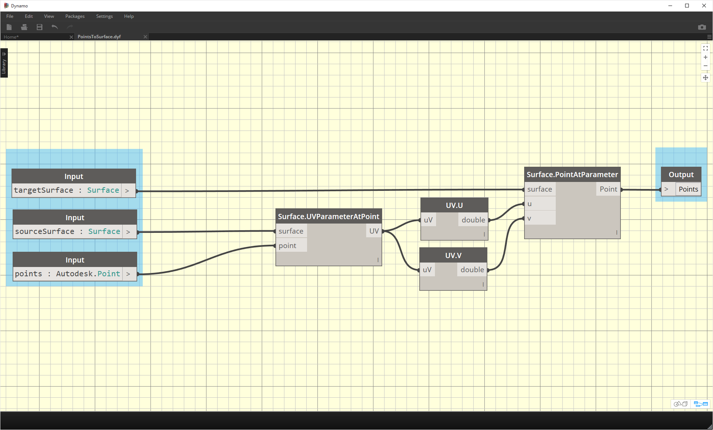

> **PointsToSurface**: Dieser recht einfache benutzerdefinierte Block bildet die Grundlage für alle anderen Zuordnungsblöcke. Dieser Block ordnet, einfach ausgedrückt, einen Punkt mit UV-Koordinaten auf einer Quelloberfläche der Position mit den entsprechenden UV-Koordinaten auf der Zieloberfläche zu. Punkte sind das einfachste Geometrieelement, aus dem komplexere Geometrie erstellt wird. Aus diesem Grund können Sie mithilfe dieser Logik 2D- und sogar 3D-Geometrie von einer Oberfläche einer anderen zuweisen.

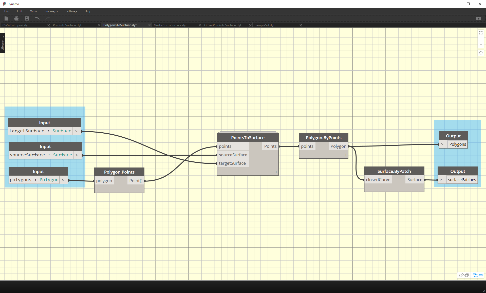

> **PolygonsToSurface**: Die Logik zum Erweitern der Punktzuordnung von 1D- auf 2D-Geometrie wird hier auf einfache Weise anhand von Polygonen gezeigt. Beachten Sie, dass der *PointsToSurface*-Block in diesem Block verschachtelt ist. Dadurch können Sie Punkte jedes Polygons der Oberfläche zuordnen und dann das Polygon aus den zugeordneten Punkten rekonstruieren. Durch Verwendung der geeigneten Datenstruktur (eine Liste aus Listen von Punkten) bleiben die Polygone nach ihrer Umwandlung in eine Punktsammlung als separate Polygone erhalten.

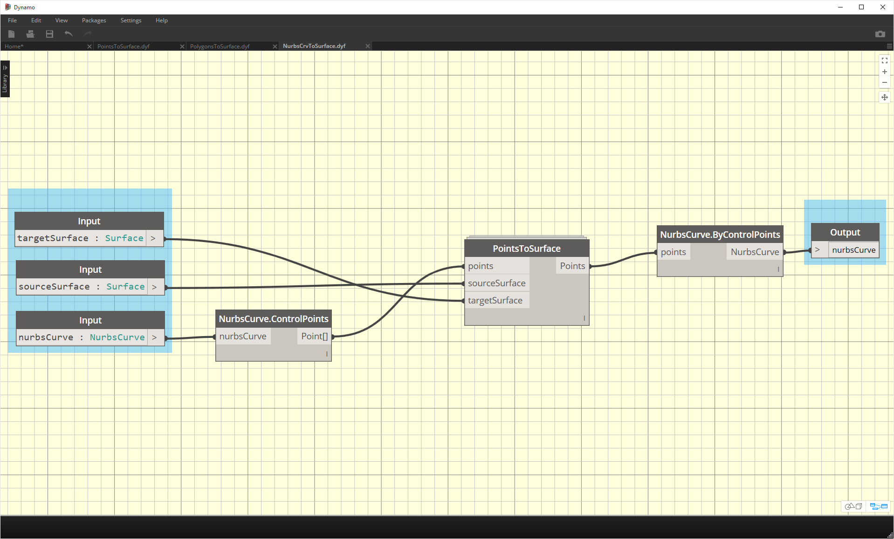

> **NurbsCrvtoSurface**: Hier kommt dieselbe Logik zum Einsatz wie beim *PolygonsToSurface*-Block. Dabei werden allerdings keine Punkte für Polygone, sondern Steuerpunkte für Nurbs-Kurven zugeordnet.

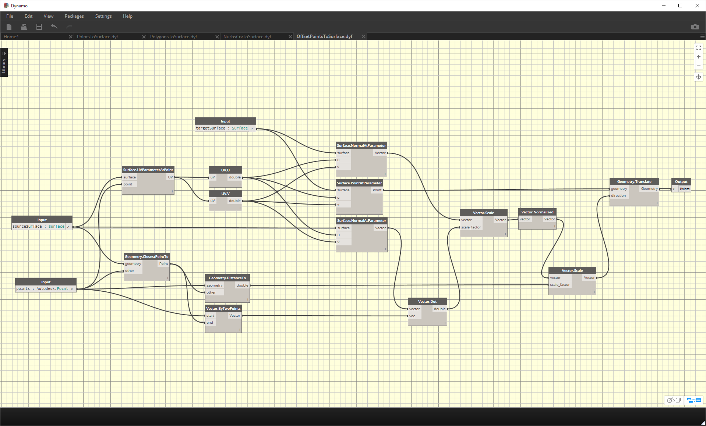

> **OffsetPointsToSurface**: Dieser Block ist etwas komplexer, wobei jedoch ein einfaches Prinzip zugrunde liegt: Mit diesem Block werden genau wie beim *PointsToSurface*-Block Punkte aus einer Oberfläche einer anderen zugeordnet. Dabei werden jedoch auch Punkte berücksichtigt, die nicht auf der ursprünglichen Quelloberfläche liegen. Für diese Punkte wird ihr Abstand zum nächstgelegenen UV-Parameter abgerufen und dieser Abstand wird der Normalen an der entsprechenden UV-Koordinatenposition der Zieloberfläche zugeordnet. Bei der Bearbeitung der Beispieldateien wird dies leichter verständlich.

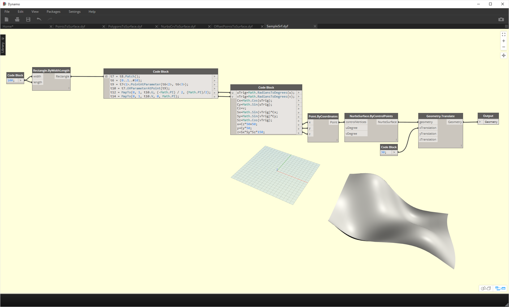

> **SampleSrf**: Mit diesem einfachen Block wird eine parametrische Oberfläche erstellt, die aus dem Quellraster einer gewellten Oberfläche in den Beispieldateien zugeordnet werden kann.

### Beispieldateien

Die Beispieldateien befinden sich im Stammordner des Pakets. Navigieren Sie in Dynamo über *Pakete > Pakete verwalten* zu diesem Ordner.

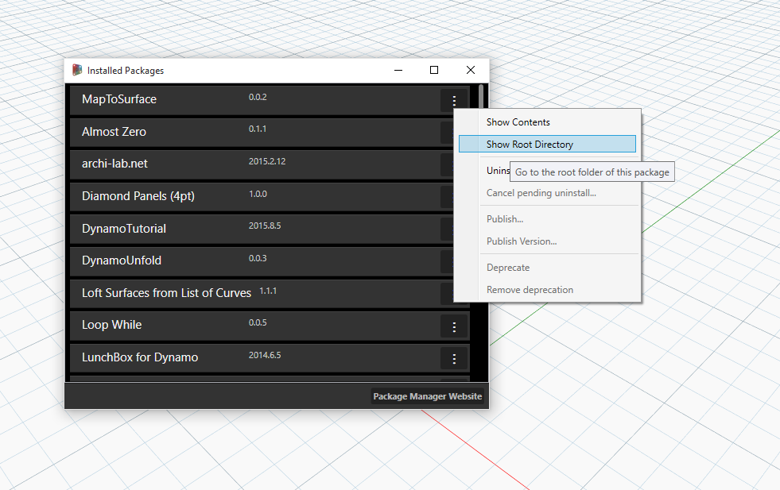

> Klicken im Fenster zur Verwaltung von Paketen auf die drei senkrechten Punkte rechts neben *MapToSurface* und wählen Sie *Stammverzeichnis anzeigen*.

Navigieren Sie im geöffneten Stammverzeichnis zum Ordner *extra*, in dem sich alle Dateien des Pakets befinden, die keine benutzerdefinierten Blöcke sind. Hier werden Beispieldateien (sofern vorhanden) für Dynamo-Pakete abgelegt. Mit den im Folgenden gezeigten Abbildungen werden die in den einzelnen Beispieldateien gezeigten Konzepte erläutert.

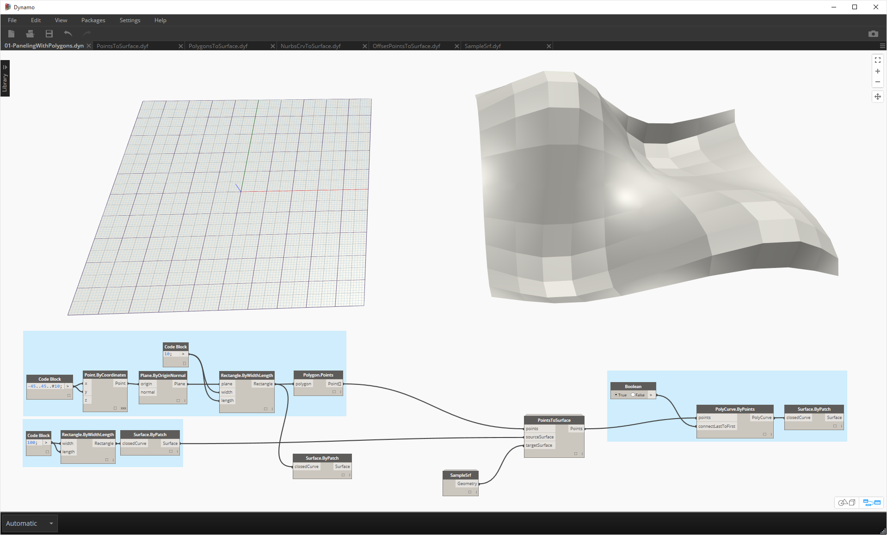

> **01-PanelingWithPolygons:** Dieses Beispiel zeigt die Unterteilung einer Oberfläche anhand eines Rasters aus Rechtecken mithilfe von *PointsToSurface*. Dieser Vorgang ist Ihnen wahrscheinlich vertraut, da ein ähnlicher Arbeitsablauf im [vorigen Kapitel](../09_Custom-Nodes/9-2_Creating.md) gezeigt wurde.

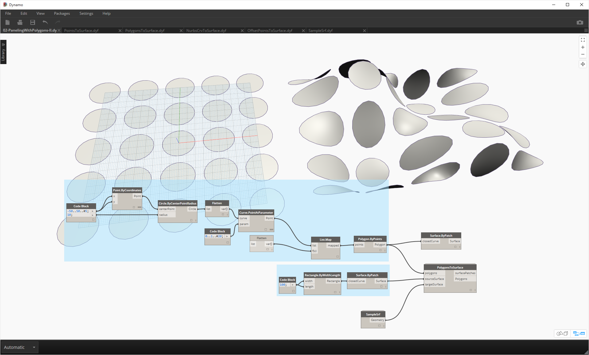

> **02-PanelingWithPolygons-II**: In dieser Übungsdatei wird eine Einrichtung zum Zuordnen von Kreisen (bzw. Polygonen, die Kreise repräsentieren) von einer Oberfläche zu einer anderen gezeigt. Hierfür wird der *PolygonsToSurface*-Block verwendet.

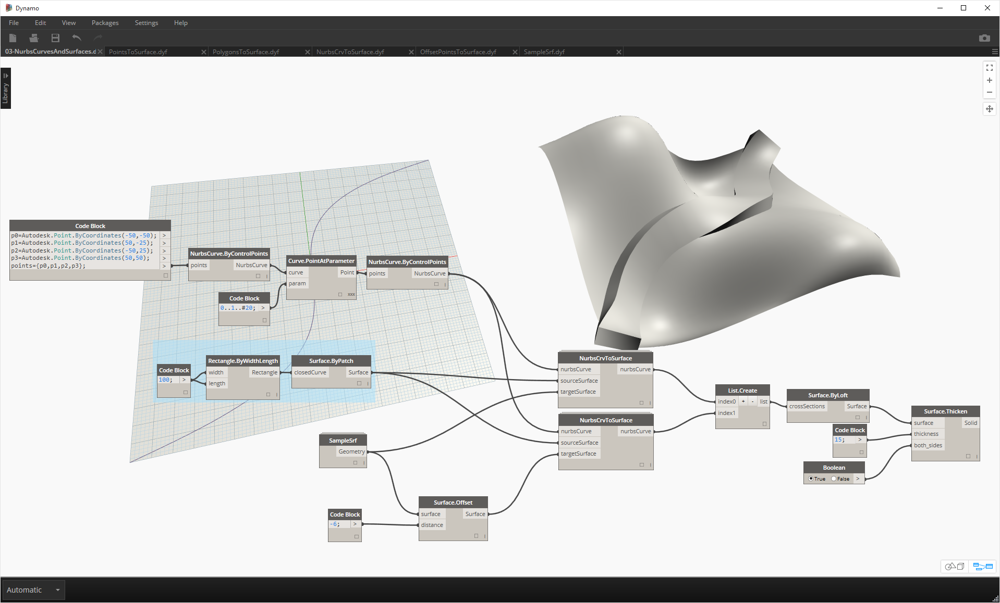

> **03-NurbsCrvsAndSurface**: Diese Beispieldatei zeigt einen komplexeren Vorgang unter Verwendung des NurbsCrvToSurface-Blocks. Die Zieloberfläche wird um eine angegebene Strecke versetzt und die Nurbs-Kurve wird sowohl der ursprünglichen Zieloberfläche als auch der versetzten Oberfläche zugeordnet. Die beiden zugeordneten Kurven werden anschließend durch eine Erhebung verbunden, sodass eine Oberfläche entsteht, die anschließend verdickt wird. Der resultierende Körper weist eine gewellte Form auf, die den Normalen der Zieloberfläche folgt.

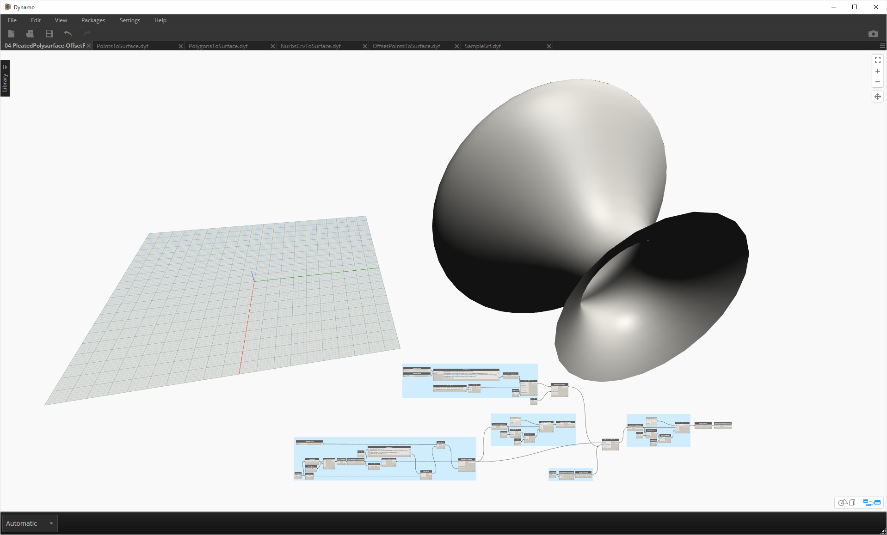

> **04-PleatedPolysurface-OffsetPoints**: In dieser Beispieldatei wird die Zuordnung einer gefalteten Polysurface von einer Quell- zu einer Zieloberfläche gezeigt. Die Quell- und Zieloberfläche sind eine rechteckige, das ganze Raster umfassende Oberfläche und ein Rotationskörper.

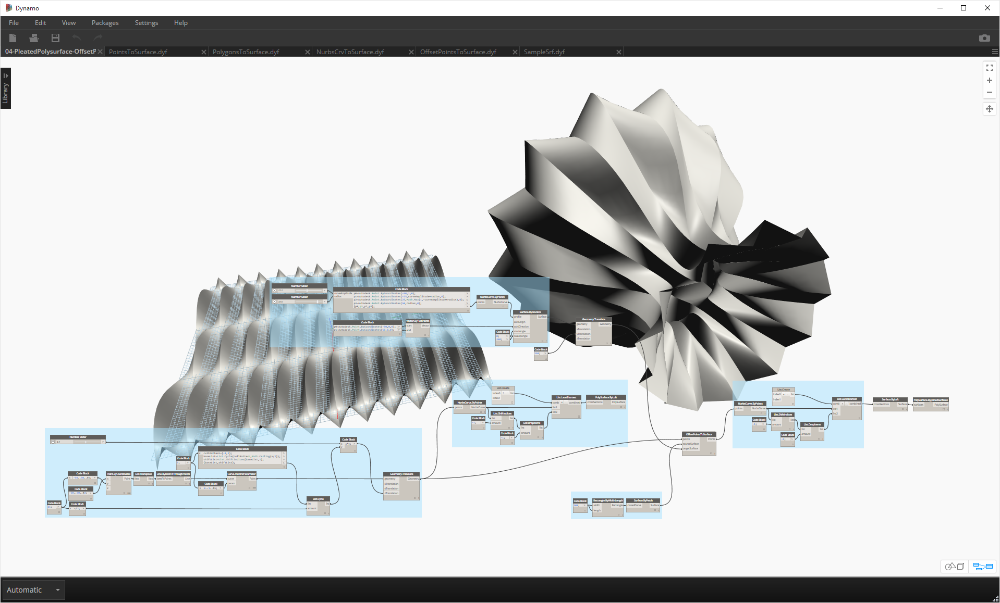

> **04-PleatedPolysurface-OffsetPoints**: Zuordnung der Quell-Polysurface von der Quell- zur Zieloberfläche.

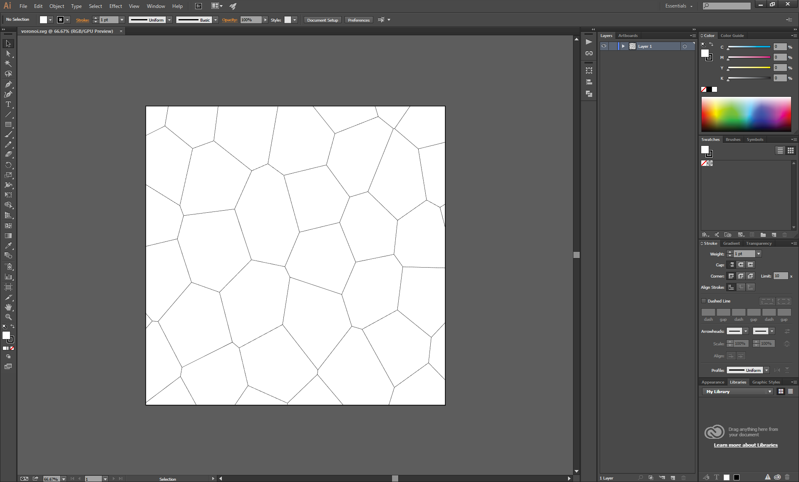

> **05-SVG-Import**: Mithilfe der benutzerdefinierten Blöcke können Kurven unterschiedlicher Typen zugeordnet werden. In dieser letzten Datei wird daher eine aus Illustrator exportierte SVG-Datei referenziert und die importierten Kurven werden einer Zieloberfläche zugeordnet.

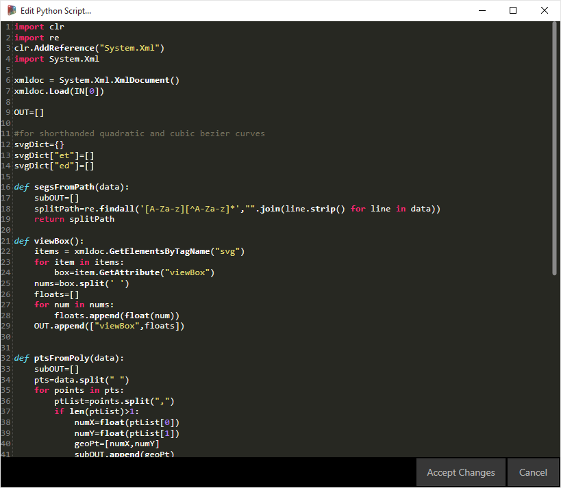

> **05-SVG-Import**: Durch Analyse der Syntax einer SVG-Datei werden die Kurven aus dem XML-Format in Dynamo-Polykurven konvertiert.

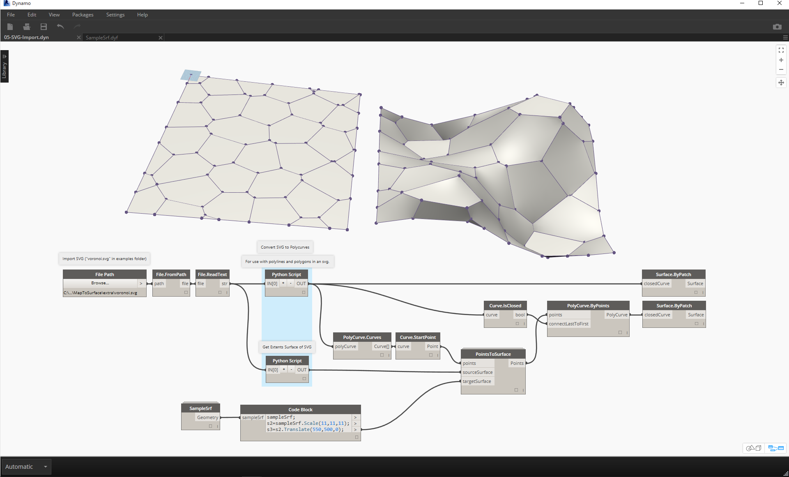

> **05-SVG-Import**: Die importierten Kurven werden einer Zieloberfläche zugeordnet. Dieser Vorgang ermöglicht es, eine Unterteilung explizit (durch Zeigen und Klicken) in Illustrator zu entwerfen, und sie anschließend in Dynamo zu importieren und auf eine Zieloberfläche anzuwenden.

