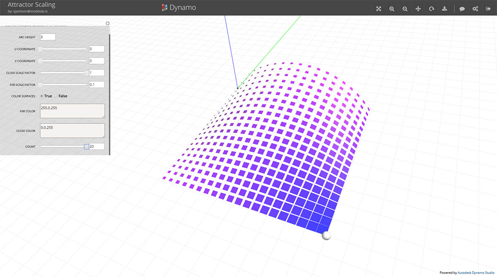
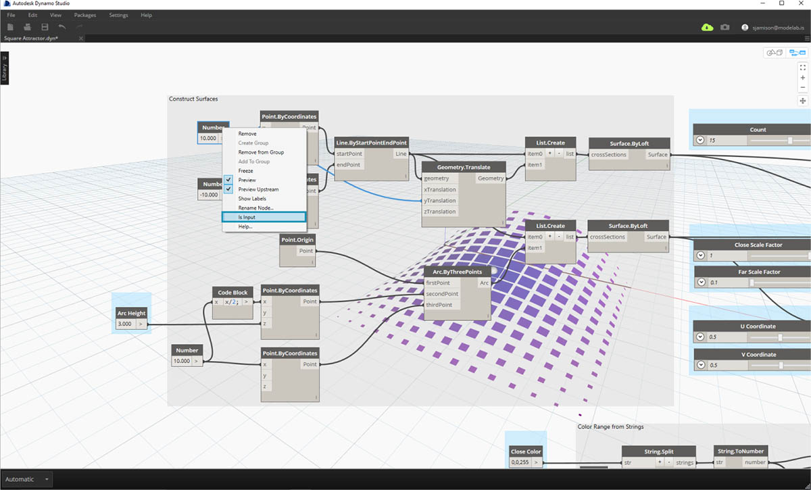
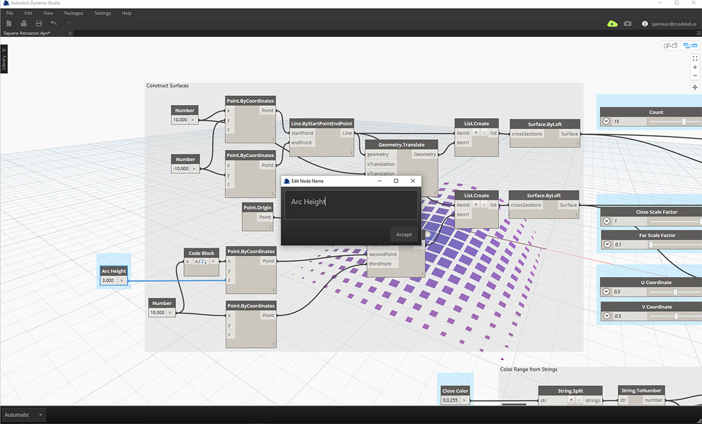
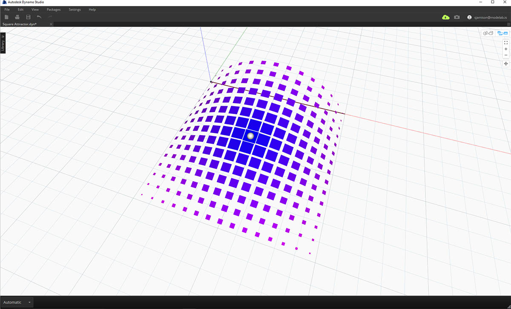
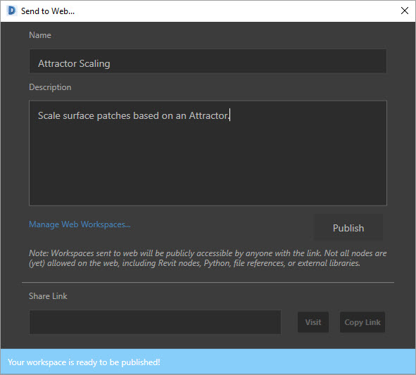

## Ins Internet senden (mit Dynamo Studio)

Mit Dynamo Studio können Sie Ihre Dateien schnell und leicht im Internet veröffentlichen. Sie sollten sich jedoch eventuell etwas Zeit nehmen, um Ihre Eingaben auszuwählen und zu beschriften und Ihre Datei benutzerfreundlich zu gestalten. Wenn Sie Dynamo Studio herunterladen müssen, besuchen Sie die [Website von Autodesk](http://www.autodesk.com/products/dynamo-studio/overview), wo Sie weitere Informationen erhalten.

### Übung: Vorbereiten der Übermittlung ins Internet.

> Laden Sie die zu dieser Übungslektion gehörigen Beispieldateien herunter (durch Rechtsklicken und Wahl der Option Save Link As). Eine vollständige Liste der Beispieldateien finden Sie im Anhang. [Attractor Scale-Beispiel herunterladen](datasets/Attractor Scale.dyn)

In dieser Übung veröffentlichen Sie ein Dynamo-Diagramm im Internet. In dieser Datei wird ein Raster aus Rechtecken erstellt, die mithilfe eines Attraktors skaliert und von einer Basisoberfläche ausgehend einer Zieloberfläche zugeordnet werden. Aus den einzelnen Rechtecken werden Oberflächenfelder erstellt und in Abhängigkeit von ihrer Entfernung zum Attraktor eingefärbt.

> Dies ist der Customizer, den Sie hier erstellen. Sehen Sie dieses Beispiel im [Internet](dynamo.autodesk.com/share/572a49033a47345a0407e803) an.

Um Ihr Skript für die Veröffentlichung vorzubereiten, entscheiden Sie zunächst, welche Eingaben für die Benutzer zugänglich sein sollen. Zu den zulässigen Eingaben gehören Schieberegler, Zahlen, Zeichenfolgen und boolesche Werte. Codeblöcke und Dateipfade können nicht als Eingaben verwendet werden. Deaktivieren Sie über das Kontextmenü die Option Ist Eingabe für alle Eingaben, die nicht in der Customizer-Ansicht angezeigt werden sollen. Achten Sie darauf, in allen Schieberegler-Eingaben angemessene Minimal- und Maximalwerte anzugeben.

> Deaktivieren Sie über das Kontextmenü die Option Ist Eingabe für alle Eingaben, die nicht im Customizer angezeigt werden sollen.

Zweitens müssen Sie sicherstellen, dass alle Eingaben unmissverständlich beschriftet sind.

> Beschriften Sie die Eingaben, indem Sie auf den Namen des Blocks doppelklicken, um ihn zu bearbeiten.

Beziehen Sie Vorschaugeometrie ein, um Ihr Skript leichter verständlich zu machen. In diesem Beispiel wird die Position des Attraktors durch eine Kugel markiert und die Oberflächen werden in Abhängigkeit von ihrer Entfernung zum Attraktor gefärbt. Dadurch ist die Wirkung des Attraktors leicht zu visualisieren und zu verstehen.

### Datei veröffentlichen

Wenn Ihre Datei zur Veröffentlichung bereit ist, wählen Sie im Menü Datei die Option zum Senden ins Internet.

Geben Sie eine Beschreibung der Datei sowie gegebenenfalls Anweisungen zum Einstieg ein. Nachdem Sie Ihre Datei veröffentlicht haben, können Sie einen Link an beliebige Benutzer senden, die über ein Autodesk-Konto verfügen. Die Datei wird mit den aktuellen Eingabewerten und Vorschauen veröffentlicht.

> Beispiel im [Internet](dynamo.autodesk.com/share/572a49033a47345a0407e803) anzeigen

### Verwalten veröffentlichter Dateien

Um Ihre veröffentlichten Skripts zu verwalten, besuchen Sie [https://dynamo.autodesk.com](https://dynamo.autodesk.com) und melden Sie sich bei Ihrem Konto an. Wählen Sie in der Dropdown-Liste rechts oben die Option Manage. Auf dieser Seite können Sie Arbeitsbereiche, die Sie bereits veröffentlicht haben, bearbeiten, freigeben oder löschen. Sie können diese Seite auch über die Option zum Verwalten von Web-Arbeitsbereichen im Menü Datei von Dynamo Studio aufrufen.

> 1. Arbeitsbereich bearbeiten
2. Arbeitsbereich löschen
3. Link freigeben

