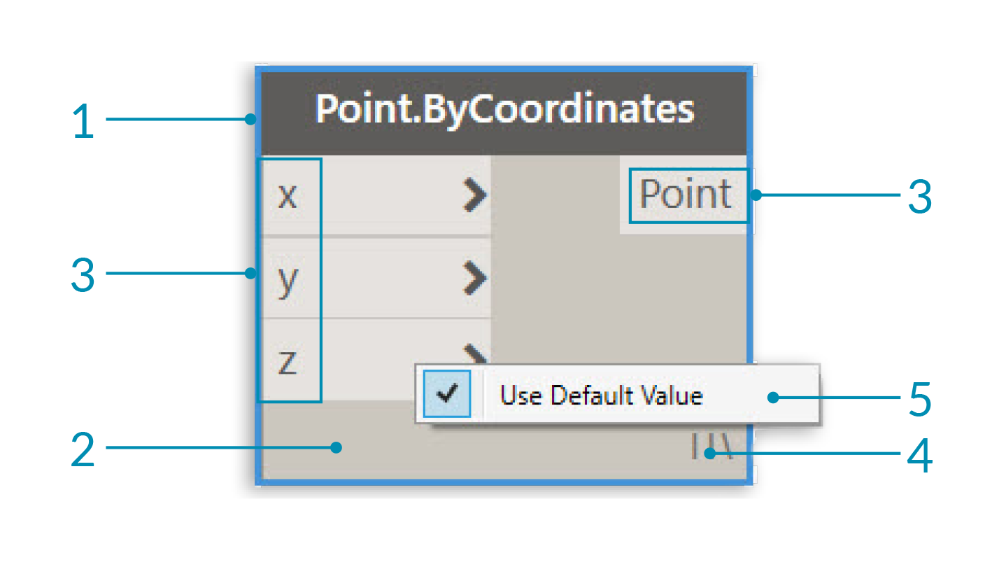
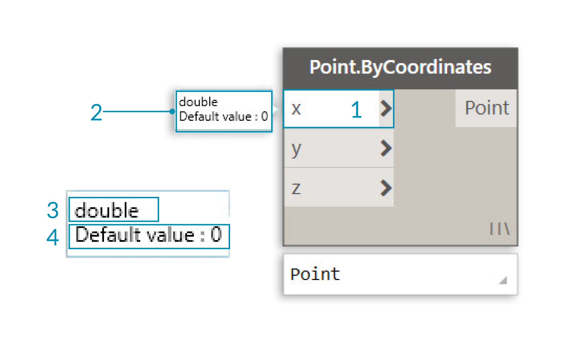
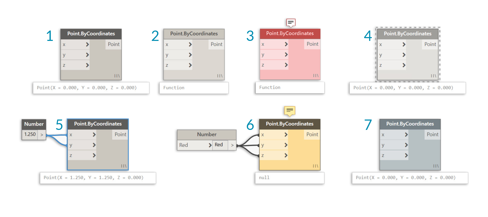

## ノード

Dynamo の**ノード**は、ビジュアル プログラムを形成するために接続するオブジェクトです。 各**ノード**は、特定の操作を実行します。操作には、数値の保存といった単純なものもあれば、ジオメトリの作成やクエリーの実行といった複雑なものもあります。

### ノードの構造

Dynamo のほとんどのノードは、5 つのパーツで構成されています。入力ノードなどの例外はありますが、各ノードの構造は次のようになります。

> 1. 名前 - Category.Name の命名規則に準拠したノードの名前。
2. メイン - ノードの本体。ここを右クリックすると、ノード全体レベルのオプションが表示されます。
3. ポート(入力および出力) - ワイヤの出入り口。ノードに入力データを渡し、ノードのアクションの結果を出力します。
4. データ プレビュー - ここにカーソルを合わせるかクリックすると、ノードのアクションの結果を説明するツールチップが表示されます。
5. レーシング アイコン - 一致する list 入力に対して指定されているレーシング オプションを示します(後で詳しく説明します)

### ポート

ノードの入力と出力はポートと呼ばれ、ワイヤの出入り口として機能します。データは左側のポートを経由して入力され、操作が実行されるとノードの右側から出力されます。ポートは、特定のタイプのデータを受信するように設定されています。たとえば、*2.75* という数値を Point.ByCoordinates ノードのポートに接続すると、点が正常に作成されます。ただし、同じポートに対して「*Red*」を指定すると、エラーが発生します。

> ヒント: ポートにカーソルを合わせると、そのポートの正しいデータ タイプを示すツールチップが表示されます。

> 1. ポートのラベル
2. ツールチップ
3. データ タイプ

### 状態

Dynamo は、各ノードのステータスに基づいて異なるカラー スキームでノードをレンダリングすることにより、ビジュアル プログラムの実行状態を示します。また、名前やポートにカーソルを合わせるか右クリックすると、追加の情報やオプションが表示されます。

> 1. 非アクティブ - グレーのノードは非アクティブになっているため、ワイヤで接続してアクティブなワークスペースのプログラム フローに追加する必要があります
2. アクティブ - ノード名の背景がダーク グレーになっているノードは正常に接続されており、すべての入力が正常に接続されています。
3. 警告 - 黄色いノードはエラー状態になっています。
4. 選択済み - 現在選択されているノードは、境界が水色でハイライト表示されます。
5. 既定値 - 入力ポートを右クリックすると、一部のノードでは既定値が表示されます。既定値は、使用しても使用しなくてもかまいません。

ビジュアル プログラムに警告やエラーが含まれている場合、その問題に関する追加情報が表示されます。また、黄色のノードでも、ノード名の上にツールチップが表示されます。このツールチップにカーソルを合わせると、ツールチップの内容が展開表示されます。

> ヒント: このツールチップ情報を使用して上流のノードを検査することにより、必要なデータ タイプまたはデータ構造にエラーがないかどうかを確認することができます。

> 1. 警告ツールチップ - 「Null」を指定した場合、またはデータを指定しなかった場合、倍精度浮動小数点数(数値)として認識されません。
2. Watch ノードを使用して入力データを検査します。
3. 上流の Number ノードに数値ではなく「Red」が指定されています。

