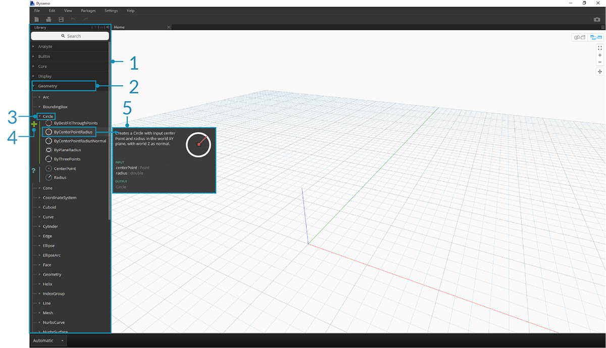

## Dynamo ライブラリ

**Dynamo ライブラリ**には、ワークスペースに追加するノードが含まれています。これらのノードを使用して、実行するビジュアル プログラムを定義します。 ライブラリでは、ノードの検索と参照を行うことができます。ライブラリには、インストール済みの基本ノード、ユーザが定義したカスタム ノード、Dynamo に追加された Package Manager のノードが格納されます。これらのノードは、カテゴリによって階層的に編成されます。 ここでは、この編成を確認して、頻繁に使用する主要なノードを見ていきます。

### ライブラリのライブラリ

アプリケーションで使用する Dynamo **ライブラリ**は、実際には関数ライブラリの集合です。各ライブラリには、カテゴリ別にグループ化されたノードが含まれています。 最初は、この仕組みを不便だと感じるかもしれませんが、Dynamo の既定のインストールに付属しているノードを整理するための柔軟な仕組みです。また、この基本機能をカスタム ノードや追加パッケージを使用して拡張すると、さらに便利になります。

#### 編成スキーム

Dynamo UI の**[ライブラリ]**セクションは、階層構造のライブラリで構成されています。 ライブラリの階層は、ライブラリ、ライブラリのカテゴリ、カテゴリのサブカテゴリ、ノードという順序で構成されています。



> 1. ライブラリ - Dynamo のインタフェース領域
2. ライブラリ - **Geometry** などの関連カテゴリの集合
3. カテゴリ - **Circle** に関連するすべてのノードなど、関連ノードの集合
4. サブカテゴリ - カテゴリ内のノードの内容(通常、**Create**、**Action**、または **Query**)
5. ノード - アクションを実行するための、ワークスペースに追加されたオブジェクト

#### 命名規則

各ライブラリの階層は、ワークスペースに追加されたノードの名前に反映されます。この階層は、[検索]フィールドまたは(*Dynamo テキスト言語*を使用する)コード ブロックで使用することもできます。 ノードを検索する場合は、キーワードを使用するだけでなく、ピリオドで区切った階層名を入力して検索することもできます。

ライブラリ階層内のノードの場所の任意の部分を ```library.category.nodeName``` という形式で入力すると、次のように異なる結果が返されます。


> 1. ```library.category.nodeName```
2. ```category.nodeName```
3. ```nodeName``` または ```keyword```

通常、ワークスペース内のノードの名前は ```category.nodeName``` という形式で表示されますが、いくつかの例外があります。特に注意が必要な例外は、Input カテゴリと View カテゴリです。 ノードの名前は同じですが、カテゴリが異なっていることに注意してください。


> 1. ```Point.ByCoordinates``` ノードと ```UV.ByCoordinates``` ノードは、名前は同じですがカテゴリが異なっています。
2. ほとんどのライブラリのノードには、カテゴリ形式が含まれています。
3. 注意する例外としては、Built-in Functions、Core.Input、Core.View、Operators などがあります。

### 頻繁に使用されるノード

Dynamo の既定のインストールには、数百個のノードが付属しています。では、ビジュアル プログラムを作成するために必要なノードはどれでしょうか。ここでは、プログラムのパラメータを定義するノード(**Input**)に注目し、ノードのアクション(**Watch**)の結果を確認して、ショートカット(**Code Block**)を使用して入力や機能を定義してみましょう。

#### Input ノード

Input ノードは、ビジュアル プログラムのユーザが重要なパラメータを使用する場合の主要な手段です。次の図は、Core ライブラリの Input カテゴリで使用可能なノードを示しています。


> 1. Boolean
2. Number
3. String
4. Number Slider
5. Integer Slider
6. Directory Path
7. File Path

#### Watch ノード

Watch ノードは、ビジュアル プログラムを経由してやり取りされるデータを管理するために必要なノードです。ノードの結果はノード データのプレビューで表示できますが、**Watch** ノードで継続的に表示するか、**Watch3D** ノードでジオメトリの結果を表示することをお勧めします。 これらのノードは、どちらも Core ライブラリの View カテゴリに含まれています。

> ヒント: ビジュアル プログラムに多数のノードが含まれている場合、3D プレビューの表示が見にくくなることがあります。その場合は、[設定]メニューの[背景 3D プレビューの表示]オプションの選択を解除し、Watch3D ノードを使用してジオメトリをプレビューすることをお勧めします。


> 1. Watch ノードで項目を選択すると、Watch3D プレビューと 3D プレビューでその項目がタグ付けされます。
2. Watch3D ノードの右下のグリップをグラブすると、3D プレビューの場合と同様にマウスを使用してサイズの変更とナビゲートを行うことができます。

#### Code Block ノード

**Code Block** ノードでセミコロン区切りの行を使用して、コード ブロックを定義することができます。 これは、```X/Y``` を使用する場合と同じくらいに簡単です。 また、Code Block ノードをショートカットとして使用して Number Input ノードを定義したり、別のノードの機能を呼び出すこともできます。これを実行するための構文は、7.2 で紹介している Dynamo テキスト言語 DesignScript の命名規則に準拠します。では、このショートカットを使用して円を作成してみましょう。


> 1. ダブルクリックして **Code Block** ノードを作成します。
2. ```Circle.ByCenterPointRadius(x,y);``` と入力します。
3. ワークスペースをクリックして選択項目をクリアすると、```x``` 入力と ```y``` 入力が自動的に追加されます。
4. **Point.ByCoordinates** ノードと **Number Slider** ノードを作成して Code Block の入力に接続します。
5. ビジュアル プログラムを実行すると、3D プレビューに円が表示されます。

