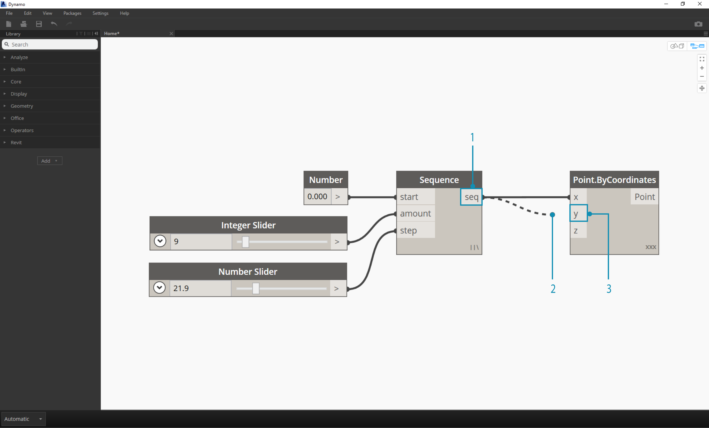
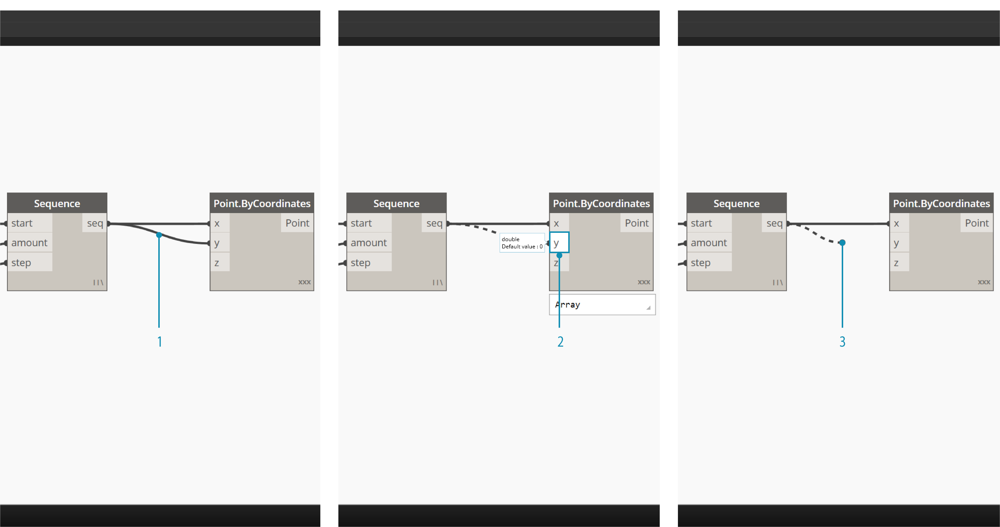
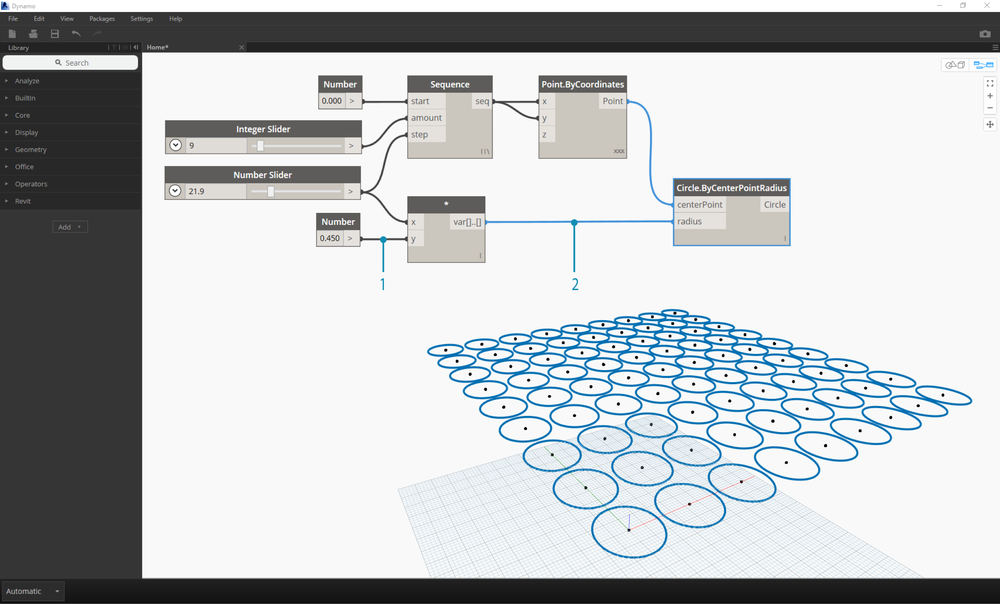
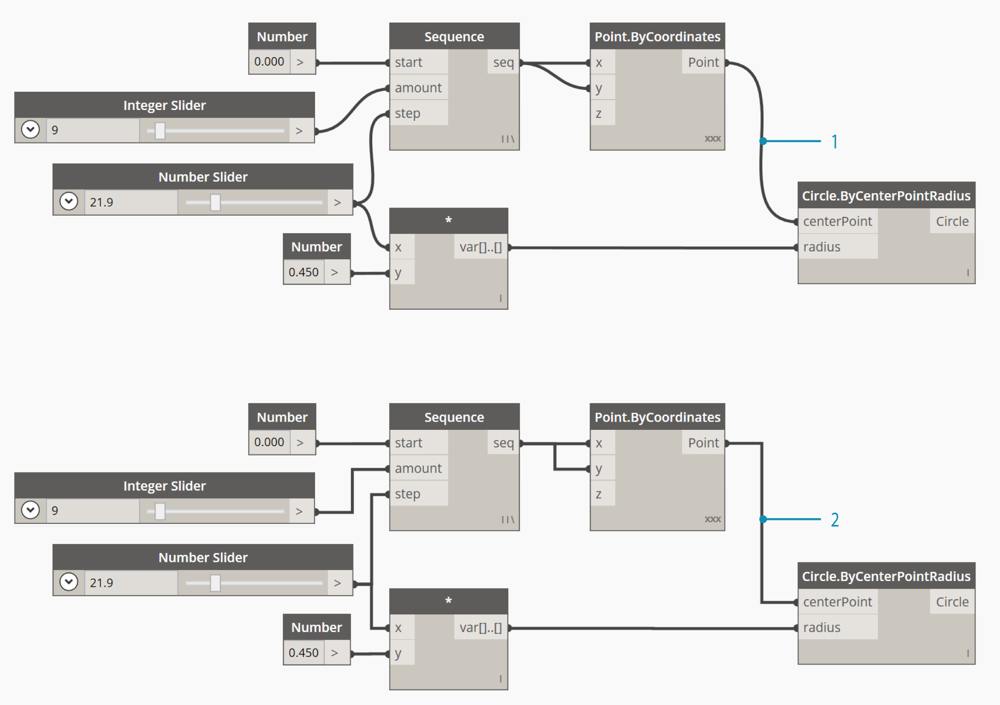

## ワイヤ

ワイヤは各ノードを接続してノード間の関係を作成し、ビジュアル プログラムのフローを確立します。ワイヤはその名前のとおり、特定のオブジェクトから次のオブジェクトにデータ パルスを送信するための電線と考えることができます。

### プログラム フロー

ワイヤは、特定のノードの出力ポートを別のノードの入力ポートに接続します。この接続により、ビジュアル プログラムの**データ フロー**が確立します。 ワークスペースではノードを自由に配置できますが、出力ポートはノードの右側、入力ポートはノードの左側に配置されているため、プログラム フローの方向は、通常、左から右になります。


### ワイヤを作成する

ワイヤを作成するには、特定のポート上でマウスを左クリックし、次に別のノードのポート上で左クリックします。この操作により、これらのポート間の接続が作成されます。接続の作成中、ワイヤは破線で表示され、正常に接続されると実線に変わります。データは常にこのワイヤを経由して出力から入力へと移動します。ただし、接続されている一連のポートをクリックすると、どちらの方向にもワイヤを作成できます。

> ヒント: 2 回目のクリックで接続を完了する前に、ワイヤをポートにスナップしてカーソルを合わせると、そのポートのツールチップが表示されます。



> 1. Sequence ノードの ```seq``` 出力ポートをクリックします。
2. マウスを別のポートに移動させる間、ワイヤは破線で表示されます。
3. Point.ByCoordiantes ノードの ```y``` 入力ポートをクリックして接続を完了します。

### ワイヤを編集する

多くの場合、ワイヤで表示されている接続を編集して、ビジュアル プログラムのプログラム フローを調整する必要が生じます。ワイヤを編集するには、既に接続されているノードの入力ポートを左クリックします。ワイヤを編集する場合の方法は 2 つあります。



> 1. 既存のワイヤを選択します。
2. 入力ポートへの接続を変更するには、別の入力ポートを左クリックします。
3. ワイヤを削除するには、ワイヤを入力ポートから離してワークスペースを左クリックします。

### ワイヤのプレビュー

既定では、ワイヤはグレーのストロークでプレビュー表示されます。特定のノードを選択すると、接続されているワイヤがそのノードと同じ水色でハイライト表示されます。



> 1. 既定のワイヤ
2. ハイライト表示されているワイヤ

また、[ビュー] > [コネクタ]メニューを使用することにより、ワークスペース内でワイヤを表示する方法をカスタマイズできます。曲線やポリラインのワイヤを切り替えたり、すべてのワイヤをまとめてオフにすることができます。



> 1. コネクタ タイプ: 曲線
2. コネクタ タイプ: ポリライン

