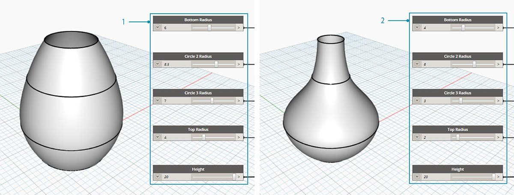
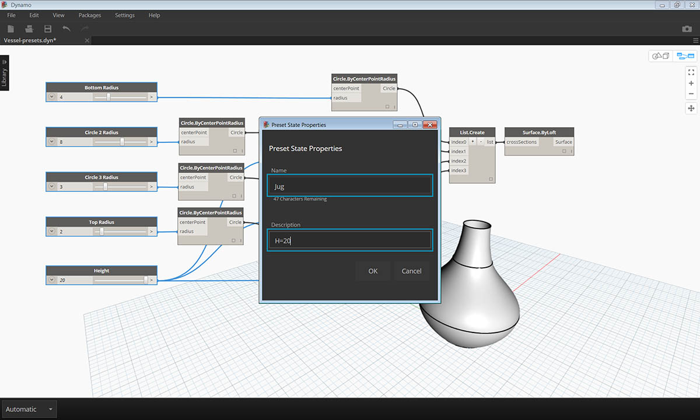
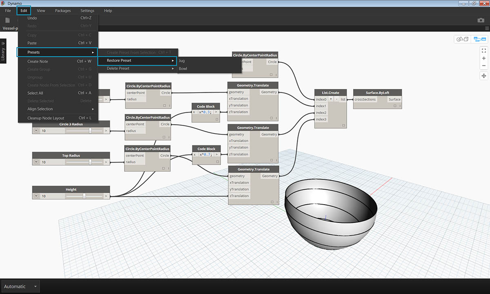

## プリセットを使用してデータを管理する

前のセクションでは、ノードの位置合わせ、グループ化、注釈付けによってワークスペースを編成し、プログラムを管理する方法を学習しました。前のセクションで紹介したベスト プラクティスを実行すると、グラフが見やすくなることを確認しました。このセクションでは、コンテンツの複雑さを軽減する方法についてさらに詳しく見ていきましょう。多くの場合、Dynamo グラフには無数の反復を実行するさまざまなパラメータが含まれています。設計に関する実際の決定を行うには、オプションの範囲を設定する必要があります。その際、プリセットを使用すると便利です。

ここでは、各チーム メンバーがパラメトリック モデルを使用できるように、Dynamo グラフを作成してチーム間で共有していると仮定しましょう。ビジュアル プログラミングの経験はチーム メンバーによってさまざまです。そのため、各チーム メンバーが異なる設計スキームを確認できるようにする必要があります。これを最も簡単な方法で行うことができるのが、プリセットです。プリセットを使用すれば、任意の数のパラメータを設定して、特定の設計の反復を定義することができます。これにより、以前のスキームを再ロードし、パラメータを使用してそのスキームを操作できるようになります。

### プリセット

プリセットを使用すると、選択した入力ノードの現在の値を取得してプリセット状態として保存できます。これらの状態は、[編集] > [プリセット]メニューを使用して復元できます。プリセットを使用すると、設計の反復を作成して比較できます。プリセットはファイルに保存できるため、フィードバックの共有やリクエストを行う場合に使用すると便利です。また、別のユーザは、関連する入力値を検索することなくグラフを使用したり、設計的に正しく機能する値セットを調整することができます。

> 1. プリセット 1
2. プリセット 2

### プリセットを作成する

> この演習に付属しているサンプル ファイルをダウンロードしてください(右クリックして[名前を付けてリンク先を保存...]を選択): [Presets.dyn](datasets/3-5/Presets.dyn)。 すべてのサンプル ファイルの一覧については、付録を参照してください。

プリセットを作成するには、1 つまたは複数の入力ノードを選択します。キャンバスを右クリックして[選択からプリセットを作成]を選択するか、[Ctrl]+[T]を押します。例を見てみましょう。次の図は、一連の円を通過するようにロフトしてサーフェスを作成する単純なグラフを示しています。

> 1. グラフ内の入力値は、高さと半径をコントロールする一連のスライダです。

> 各入力スライダを選択し、[Ctrl]+[T]を押します。

> ダイアログで、保存する状態の名前と説明を入力します。異なる入力値を使用して、状態をいくつか作成します。

### プリセットを復元する

保存したプリセットを復元するには、[編集] > [プリセット] > [プリセットを復元]にナビゲートします。これにより、この状態のすべてのノードが、保存時の値に設定されます。この状態のノードがグラフに存在しない場合は(削除された場合など)、この状態の他のすべてのノードが、保存時の値に設定されます。

### プリセットを削除する

プリセットを削除するには、[編集] > [プリセット] > [プリセットを削除]にナビゲートします。これにより、保存された状態の一覧から目的の状態が削除されます。

