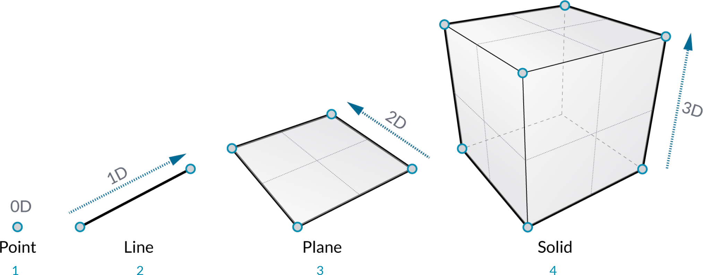
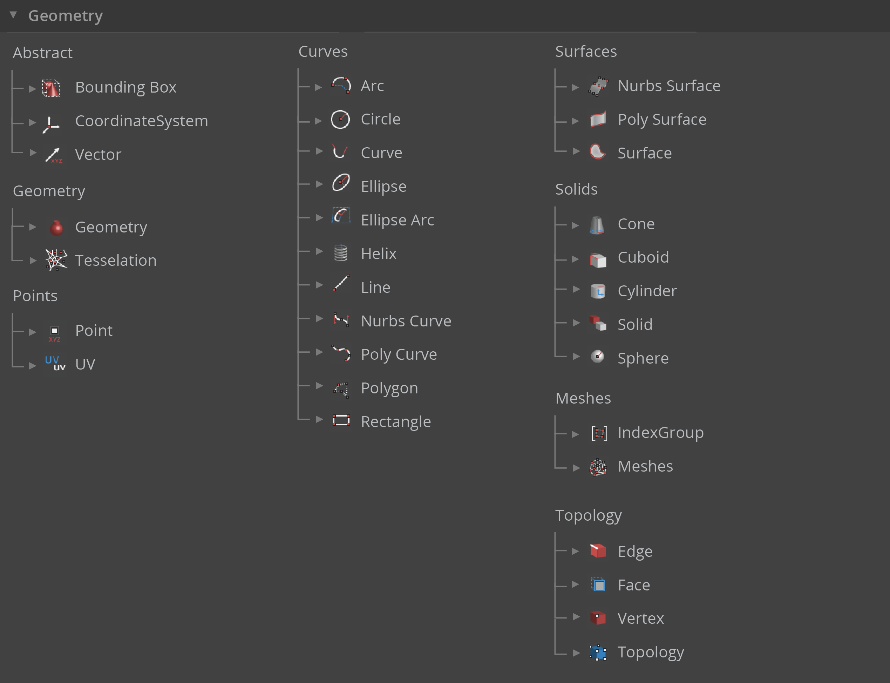

## ジオメトリの概要

**ジオメトリ**は、設計用の言語です。 プログラミング言語やプログラミング環境の核心部分でジオメトリ カーネルを使用している場合は、設計ルーチンを自動化し、アルゴリズムを使用して設計の繰り返し部分を生成することにより、正確で安定したモデルを設計することができます。

### 基本的な概念

ジオメトリとは、古典的な定義によれば、形状の外形、サイズ、相対的な位置、空間上の特性に関する研究(幾何学)のことです。この分野には、数千年にもおよぶ豊かな歴史があります。コンピュータの出現と普及により、私たちは、ジオメトリの定義、研究、生成を行うための強力な手段を手に入れました。現在では、ジオメトリの複雑な相互作用の結果を簡単に計算できるようになりました。

> コンピュータを利用してどれほど多様で複雑なジオメトリを作成できるかということを確かめるには、「Stanford Bunny」という文字列で Web を検索してみてください。「Stanford Bunny」とは、アルゴリズムのテストで使用されている標準モデルのことです。

アルゴリズム、コンピューティング、複雑性という観点からジオメトリを理解するのは、難しそうだと感じるかもしれません。しかし、比較的単純ないくつかの重要な原則を理解すれば、それをベースとしてより高度なケースに適用することができます。

1. ジオメトリは**データ**です。コンピュータや Dynamo にとって、Stanford Bunny と数値に大きな違いはありません。
2. ジオメトリは、**抽象化**に依存します。基本的に、ジオメトリの要素は、特定の空間座標系内で、数値、関係、計算式によって記述されます。
3. ジオメトリには**階層**があります。点が集まって線が構成され、線が集まって面が構成されます。
4. ジオメトリは、**細部と全体**の両方を同時に記述します。たとえば曲線が存在する場合、その曲線は曲線の形状を表すと同時に、その曲線を構成する点群も表します。

実際の作業では、複雑なモデルの開発においてさまざまなジオメトリの構成、解体、再構成を柔軟に実行できるように、作業の内容(ジオメトリのタイプやジオメトリの構成など)について理解しておく必要があります。

### 階層とは

ここで、ジオメトリの抽象と階層との関係について簡単に説明します。これら 2 つの概念は相互に関係していますが、この関係を最初から明確に理解するのは必ずしも簡単なことではありません。そのため、複雑なワークフローやモデルの開発を開始すると、すぐに理解の壁に直面することがあります。ここでは、入門者向けに次元という概念を使用して、モデリングについて簡単に説明します。1 つの形状を記述するためにいくつの次元が必要になるかを考えると、ジオメトリの階層構成を理解する手がかりになります。

> 1. 座標によって定義される**点**には、次元は存在しません。点は、各座標を示す単なる数字に過ぎません。
2. 2 つの点によって定義される**線**には、*1* つの次元が存在します。線の上では、前方(正の方向)または後方(負の方向)に向かって移動することができます。
3. 複数の線によって定義される**面**には、*2* つの次元が存在します。面の上では、前後だけでなく左右に移動することもできます。
4. 複数の面によって定義される**直方体**には 、*3* つの次元が存在します。ボックスの中では、前後左右に加えて、高低の位置関係を定義することができます。

ジオメトリを分類する場合、次元という概念は役に立ちますが、必ずしもそれが最適な概念というわけではありません。なぜなら、点、線、面、直方体だけを使用してモデルを作成することはほとんどないからです。曲線や曲面を使用する場合を考えてみれば、それは明らかです。また、方向、体積、パーツ間の関係などを定義する、完全に抽象的なジオメトリ タイプのまったく異なるカテゴリもあります。ベクトルを実際にこの手でつかむことはできません。では、空間内に見えているものに対してベクトルを定義するにはどうすればいいでしょうか。ジオメトリの階層をさらに細分化すると、抽象的なジオメトリ タイプを「補助的なジオメトリ タイプ」とみなすべきだということがわかります。各タイプは、その機能と、モデル要素の形状を記述するタイプを基準として、グループ化することができます。

### Dynamo Studio におけるジオメトリ

ジオメトリの階層は、Dynamo の使用に関してどのような意味を持つでしょうか。ジオメトリのタイプとその相互関係を理解すれば、ライブラリ内で使用できる**ジオメトリ ノード**のグループをナビゲートできるようになります。 ジオメトリ ノードは、階層別ではなくアルファベット順に整理されています。Dynamo のユーザ インタフェース内のレイアウトに似たイメージで表示されます。

Dynamo でモデルを作成し、[背景プレビュー]でプレビュー表示される内容をグラフ内のデータ フローに接続する作業は、時間の経過に伴ってより直感的に行うことができるようになります。

> 1. 仮の座標系が色付きのグリッド ラインによってレンダリングされています。
2. ノードを選択すると、そのノードによってジオメトリが作成される場合は、対応するジオメトリが背景内でハイライト表示されます。
> この画像に付属しているサンプル ファイルをダウンロードしてください(右クリックして[名前を付けてリンク先を保存...]を選択): [Geometry for Computational Design - Geometry Overview.dyn](datasets/5-1/Geometry for Computational Design - Geometry Overview.dyn)。 すべてのサンプルファイルの一覧については、付録を参照してください。

### ジオメトリの詳細を確認する

Dynamo で作成するモデルは、ノードを使用して生成されるモデルだけではありません。ジオメトリでの作業を次のレベルに進めるには、キーとなる方法がいくつかあります。

1. Dynamo では、CSV ファイルを使用して点群を読み込んだり、SAT ファイルを読み込んでサーフェスを作成するなど、ファイルを読み込んでさまざまな操作を行うことができます。
2. Dynamo を Revit と組み合わせると、Revit の要素を参照して Dynamo で使用することができます。
3. Dynamo Package Manager には、ジオメトリのタイプや操作を拡張するための追加の機能が用意されています。[Mesh Toolkit](https://github.com/DynamoDS/Dynamo/wiki/Dynamo-Mesh-Toolkit) パッケージを確認してください。

