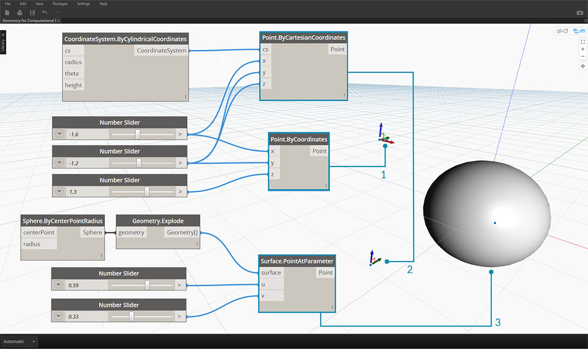

## 点

ジオメトリがモデルの言語だと仮定すると、点はアルファベットにあたります。点は、点以外のすべてのジオメトリを作成するための基礎になります。たとえば、1 本の曲線を作成するには、少なくとも 2 つの点が必要です。また、1 つのポリゴンまたはメッシュ面を作成するには、少なくとも 3 つの点が必要です。正弦関数を使用して点群の位置、順序、関係を定義すると、円や曲線など、高次元のジオメトリを定義することができます。


> 1. ```x=r*cos(t)``` 関数と ```y=r*sin(t)``` 関数を使用すると、円が作成されます。
2. ```x=(t)``` 関数と ```y=r*sin(t)``` 関数を使用すると、正弦曲線が作成されます。

### 点の概要

点は、座標と呼ばれる 1 つまたは複数の値によって定義されます。点を定義するために必要な座標値の数は、その点が存在する座標系やコンテキストによって異なります。Dynamo で使用される最も一般的な種類の点は、3 次元のワールド座標系内に存在します。それらの点には、[X,Y,Z]の 3 つの座標があります。


### 座標としての点

点は、2 次元の座標系内にも存在することができます。通常は、使用する空間に応じて異なる文字表記を使用します。この手引では、平面上では[X,Y]を使用し、サーフェス上では[U,V]を使用します。


> 1. ユークリッド座標系上の点: [X,Y,Z]
2. 曲線パラメータの座標系上の点: [t]
3. サーフェス パラメータの座標系上の点: [U,V]

直感的に理解できないかもしれませんが、曲線とサーフェスのパラメータは連続的で、指定されたジオメトリのエッジの外側にも存在します。パラメータ空間を定義する形状は 3 次元のワールド座標系内に存在しているため、パラメータ座標をいつでも「ワールド」座標に変換することができます。たとえば、サーフェス上の点[0.2, 0.5]は、ワールド座標系の点[1.8, 2.0, 4.1]と同一です。



> 1. ワールド XYZ 座標とみなされる座標で表された点
2. 指定された座標系(円柱座標)で表された点
3. サーフェス上の UV 座標で表された点
> この画像に付属しているサンプル ファイルをダウンロードしてください(右クリックして[名前を付けてリンク先を保存]を選択): [Geometry for Computational Design - Points.dyn](datasets/5-3/Geometry for Computational Design - Points.dyn)。 すべてのサンプル ファイルの一覧については、付録を参照してください。

