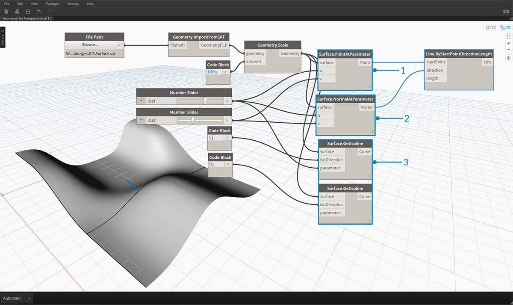

## サーフェス

ここまでは、モデル内で曲線を使用するケースを見てきました。ここからは、モデル内でサーフェスを使用するケースを見ていきます。サーフェスを使用することにより、オブジェクトを 3 次元の世界で表現できるようになります。曲線は常に平らというわけではありません。曲線は 3 次元のオブジェクトですが、曲線が定義する空間は必ず 1 次元になります。サーフェスを定義すると、次元をもう 1 つ増やし、別のプロパティの集合を他のモデリング操作で使用できるようになります。

### サーフェスの概要

サーフェスは、1 つの関数と 2 つのパラメータによって定義される数学的な形状です。曲線を定義する ```t``` ではなく、サーフェスでは ```U``` と ```V``` を使用してパラメータ空間を定義します。 そのため、このタイプのジオメトリを使用すると、より多くのジオメトリ データを描画することができます。たとえば、曲線には法線ベクトルと接平面があり、接平面は曲線に沿って回転させることができます。一方、サーフェスの法線ベクトルと接平面は、方向が固定されています。


> 1. サーフェス
2. U アイソカーブ
3. V アイソカーブ
4. UV 座標
5. 接平面
6. 法線ベクトル

**サーフェスの範囲**: サーフェスの範囲は、そのサーフェス上の 3 次元の点を指定する(U,V)パラメータの範囲として定義されます。 各次元(U または V)の範囲は、通常 2 つの数値(U の最小値から U の最大値までの数値と、V の最小値から V の最大値までの数値)で表されます。


サーフェスの形状が「長方形」に見えない場合や、サーフェスのローカルのアイソカーブの密度が高い場合や低い場合がありますが、サーフェスの範囲によって定義される「空間」は常に 2 次元になります。Dynamo におけるサーフェスの範囲は、U 方向と V 方向の両方向で、最小値 0.0 から最大値 1.0 までの範囲内で定義する必要があります。ただし、平らなサーフェスやトリム サーフェスについては、範囲が異なる場合があります。

**アイソカーブ**(アイソパラメトリック曲線): サーフェス上の U 定数値または V 定数値と、対応するもう一方の U 方向または V 方向の値の範囲によって定義される曲線です。

**UV 座標**: U と V (場合によってはさらに W)を使用して定義される、UV パラメータ空間内の点です。


**接平面**: 特定の UV 座標において、U アイソカーブと V アイソカーブの両方に接する平面です。

**法線ベクトル**: 接平面に対して相対的に「上」方向を定義するベクトルです。

### NURBS サーフェス

**NURBS サーフェス**は、NURBS 曲線によく似ています。 NURBS サーフェスは、2 つの方向に向かう NURBS 曲線のグリッドとして考えることができます。NURBS サーフェスの形状は、制御点の数と、そのサーフェスの U 方向および V 方向の次数によって定義されます。制御点、ウェイト、次元を使用して、形状、法線、接線、曲率などのプロパティを計算する場合にも、同じアルゴリズムが使用されます。


NURBS サーフェスの場合、ジオメトリによって 2 つの方向が暗黙的に定義されます。これは、表示される形状に関係なく、NURBS サーフェスは制御点から構成される長方形のグリッドであるためです。これらの方向は、多くの場合、ワールド座標系に対して任意の方向が相対的に設定されています。このチュートリアルでは、これらの方向を頻繁に使用し、サーフェスに基づいてモデルの解析や他のジオメトリの生成を行います。


> 1. Degree (U,V) = (3,3)
2. Degree (U,V) = (3,1)
3. Degree (U,V) = (1,2)
4. Degree (U,V) = (1,1)

### ポリサーフェス

**ポリサーフェス**は、エッジで結合されているサーフェスによって構成されます。 ポリサーフェスのトポロジを経由して結合された形状間を移動できるため、ポリサーフェスは 2 次元の UV 定義よりも多くの機能を持っています。

> 一般的にトポロジとは、パーツの結合や関連についての概念を指しますが、Dynamo におけるトポロジとは、一種のジオメトリでもあります。具体的には、トポロジは、サーフェス、ポリサーフェス、ソリッドの親カテゴリにあたります。


このような方法でサーフェスを結合することにより、複雑な形状を作成したり、継ぎ目の形状の詳細を定義することができます。このように結合されたサーフェスは、パッチと呼ばれる場合もあります。ポリサーフェスのエッジに対して、フィレット操作や面取り操作を簡単に適用することができます。

Dynamo のパラメータにサーフェスを読み込んで評価し、どのような情報を抽出できるかを確認してみましょう。



> 1. *Surface.PointAtParameter* ノードは、指定された UV 座標における点を返します。
2. *Surface.NormalAtParameter* ノードは、指定された UV 座標における法線ベクトルを返します。
3. *Surface.GetIsoline* ノードは、U 座標または V 座標におけるアイソパラメトリック曲線を返します。入力が isoDirection であることに注意してください。
> この画像に付属しているサンプル ファイルをダウンロードしてください(右クリックして[名前を付けてリンク先を保存]を選択)。すべてのサンプルファイルの一覧については、付録を参照してください。

> 1. [Geometry for Computational Design - Surfaces.dyn](datasets/5-5/Geometry for Computational Design - Surfaces.dyn)
2. [Surface.sat](datasets/5-5/Surface.sat)

