## リストのリスト

ここでは、階層にもう 1 つの層を追加してみましょう。「リストの操作」の章で例として取り上げたトランプを、ここでも例として使用します。たとえば、複数のデッキ(デッキとは 1 組のトランプのこと)が含まれたボックスを作成したとすると、そのボックスはデッキを格納するリストで、各デッキはカードのリストということになります。これが、「リストのリスト」という考え方です。たとえば次の図では、赤いボックスに硬貨の山のリストが入っていて、それぞれの山には硬貨のリストが含まれています。


> 写真: [Dori](https://commons.wikimedia.org/wiki/File:Stack_of_coins_0214.jpg)

リストのリストに関する質問(**クエリー**)を作成する場合、次のような質問が考えられます。 これにより、リストの特性(プロパティ)がわかります。

* Q: 硬貨は何種類?2.
* Q: 各硬貨の価値は?A: $0.01 と $0.25
* Q: 25 セント硬貨の材質は?A: 銅 75%、ニッケル 25%
* Q: 1 セント硬貨の材質は?A: 亜鉛 97.5%、銅 2.5%

リストのリストに対して実行できる操作(**アクション**)としては、次のような操作が考えられます。 この場合、実行する操作に応じてリストのリストが変化します。

* 25 セント硬貨または 1 セント硬貨の特定の山を選ぶ。
* 特定の 25 セント硬貨または 1 セント硬貨を選ぶ。
* 25 セント硬貨の山と 1 セント硬貨の山の配置を変える。
* 25 セント硬貨の山と 1 セント硬貨の山をすべて入れ替える。

前の章でも説明したように、Dynamo の各ノードを使用して、上記の操作に似た操作を実行することができます。ここでは、物理的な物体ではなく抽象的なデータを操作するため、データ階層を上下に移動する方法をコントロールするための一連のルールが必要になります。

リストのリストを操作する場合、データは複雑な階層構造になっていますが、この複雑な構造により、非常に高度なパラメータ操作を実行することができます。これ以降の各演習では、基礎的な概念といくつかの操作方法を確認していきます。

## トップダウン階層

このセクションで説明する基本的な概念は、「**Dynamo は、リストをオブジェクトとして処理する**」ということです。 トップダウン階層は、オブジェクト指向プログラミングをベースとして開発されています。Dynamo は、List.GetItemAtIndex などのコマンドでサブ要素を選択するのではなく、データ構造内でメイン リストのインデックスを選択します。リスト中で選択したその項目が、別のリストである場合もあります。ここからは、サンプルの図を使用して詳しく説明していきます。

#### 演習 - トップダウン階層

> この演習に付属しているサンプル ファイルをダウンロードしてください(右クリックして[名前を付けてリンク先を保存...]を選択): [Top-Down-Hierarchy.dyn](datasets/6-3/Top-Down-Hierarchy.dyn)。 すべてのサンプル ファイルの一覧については、付録を参照してください。

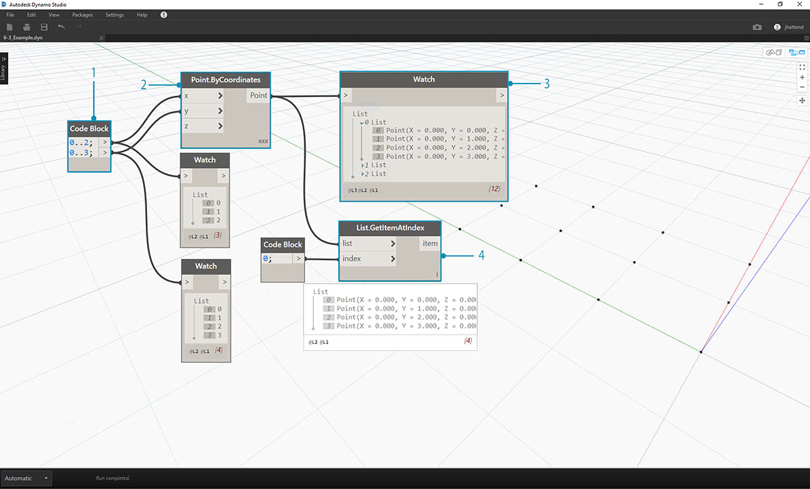

> 1. *Code Block* ノードを使用して、0..2; 0..3; という 2 つの範囲が定義されています。
2. これらの範囲は、レーシングが「*外積*」に設定された *Point.ByCoordinates* ノードに接続されています。 これにより、点のグリッドが作成され、リストのリストが出力として返されます。
3. *Watch* ノードの各リストで、4 つの項目を持つ 3 つのリストが指定されていることに注意してください。
4. インデックス値 0 を指定して *List.GetItemAtIndex* ノードを使用した場合、Dynamo は、最初のリストとそのリスト内のすべてのコンテンツを選択します。 他のプログラムでは、データ構造内のすべてのリストの最初の項目だけが選択される場合がありますが、Dynamo は、トップダウン階層を使用してデータの処理を行います。

### フラット化と List.Flatten ノード

フラット化を行うと、データ構造からすべてのデータ層が削除されます。この機能は、操作にデータ階層が必要ない場合に便利ですが、情報が削除される可能性があります。次の図は、データのリストをフラット化した結果を示しています。

#### 演習 - フラット化

> この演習に付属しているサンプル ファイルをダウンロードしてください(右クリックして[名前を付けてリンク先を保存...]を選択): [Flatten.dyn](datasets/6-3/Flatten.dyn)。 すべてのサンプル ファイルの一覧については、付録を参照してください。

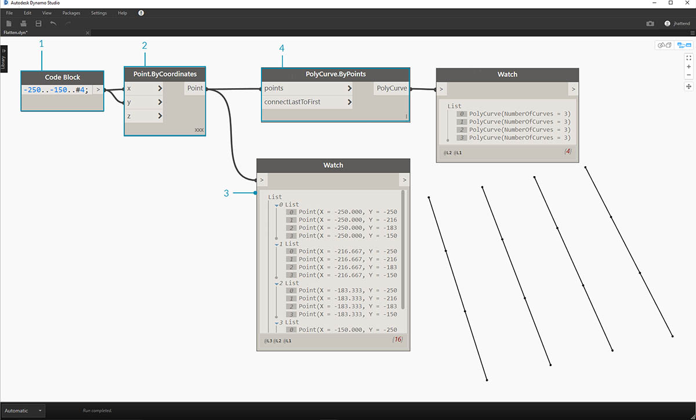

> 1. *Code Block* ノードで -250..-150..#4; というコード行を挿入して範囲を定義します。
2. *Code Block* ノードを *Point.ByCoordinates* ノードの *x* 入力と *y* 入力に接続します。これにより、点のグリッドを取得するための「*外積*」に対するレーシングが設定されます。
3. *Watch* ノードに、リストのリストが表示されます。
4. *PolyCurve.ByPoints* ノードは、各リストを参照して個別のポリカーブを作成します。 Dynamo のプレビューに 4 つのポリカーブが表示されます。それぞれのポリカーブが、グリッド内の各行を表しています。


> 1. PolyCurve.ByPoints ノードの前に *Flatten* ノードを挿入して、すべての点を含む単一のリストを作成します。 PolyCurve.ByPoints ノードは、リストを参照して 1 つのカーブを作成しますが、すべての点が 1 つのリスト上に存在しているため、点のリスト全体を通過するジグザクのポリカーブが 1 つだけ作成されます。

独立したデータ層をフラット化する方法も用意されています。List.Flatten ノードを使用すると、データ層の数を定義して、最上位の階層からデータ層をフラット化することができます。このノードは、現在のワークフローに必ずしも関係しない複雑なデータ構造を操作する場合に特に便利です。別の方法として、List.Flatten ノードを関数として List.Map ノードで使用することもできます。[List.Map](#listmap-and-listcombine) ノードについては、これ以降のセクションで詳しく説明します。

### 分割

パラメトリック モデリングを行う際に、既存のリストにデータ構造を追加したい場合があります。その場合、さまざまなノードを使用できますが、List.Chop ノードが最も基本的なノードです。List.Chop ノードで設定された数の項目を使用すると、1 つのリストを複数のサブリストに分割することができます。

#### 演習 - List.Chop ノード

> この演習に付属しているサンプル ファイルをダウンロードしてください(右クリックして[名前を付けてリンク先を保存...]を選択): [Chop.dyn](datasets/6-3/Chop.dyn)。 すべてのサンプルファイルの一覧については、[付録](../Appendix/A_appendix.md)を参照してください。


> *List.Chop ノードの subLength* の値を 2 に設定すると、2 つの項目を持つ 4 つのリストが作成されます。

Chop コマンドを実行すると、指定されたリストの長さに従ってリストが分割されます。List.Chop ノードは、データ構造を削除するのではなく新しいデータ層をデータ構造に追加するなど、いくつかの点で List.Flatten ノードとは逆の動作を行います。List.Chop ノードは、次の例のようなジオメトリに関する操作を実行する場合に便利です。

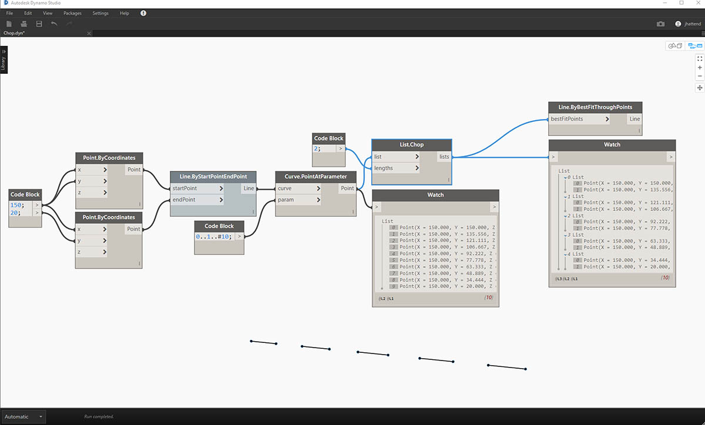

### List.Map ノードと List.Combine ノード

List.Map ノードと List.Combine ノードは、階層内の 1 段階下の層で、設定された関数を入力リストに適用します。リストの組み合わせとリストのマップはほとんど同じ操作ですが、組み合わせの場合は、特定の関数の入力に対応する複数の入力を使用できる点が、マップとは異なっています。

#### 演習 - List.Map ノード

*注: この演習は前バージョンの Dynamo を使用して作成されました。 List.Map の機能に関する問題の大半は、List@Level 機能の追加によって解決されました。詳細については、後述の *[*List@Level*](#listlevel)* を参照してください。*

> この演習に付属しているサンプル ファイルをダウンロードしてください(右クリックして[名前を付けてリンク先を保存...]を選択): [Map.dyn](datasets/6-3/Map.dyn)。 すべてのサンプル ファイルの一覧については、[付録](../Appendix/A_appendix.md)を参照してください。

簡単な例として、前のセクションで説明した List.Count ノードをもう一度確認してみましょう。


> *List.Count* ノードは、リスト内のすべての項目をカウントします。 ここでは、List.Count ノードを使用して、*List.Map* ノードの仕組みについて説明します。

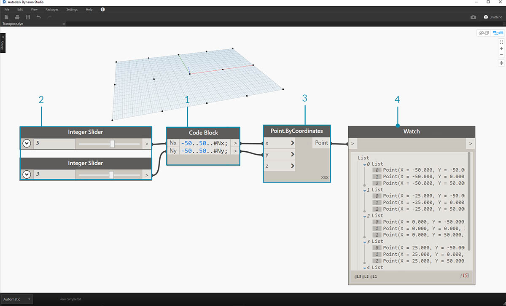

> 1. *Code Block* ノードで、次の 2 行を挿入します。

```
-50..50..#Nx;
-50..50..#Ny;
```

このコードを入力すると、Code Block ノードに Nx と Ny という 2 つの入力が作成されます。

2. 2 つの *Integer Slider* ノードを使用して *Nx* の値と *Ny* の値を *Code Block* ノードに接続すると、これらの値が定義されます。
3. 次に、Code Block ノードの各行を *Point.ByCoordinates* ノードの *x* 入力と *y* 入力に接続します。 このノードを右クリックして「レーシング」と「*外積*」を続けて選択します。 この操作により、点のグリッドが作成されます。-50 から 50 までの範囲が定義されているため、ここでは既定の Dynamo グリッド全体を使用しています。
4. *Watch* ノードに、作成された点が表示されます。 データ構造を確認すると、リストのリストが作成されていることがわかります。それぞれのリストが、グリッドの点の 1 行を表しています。

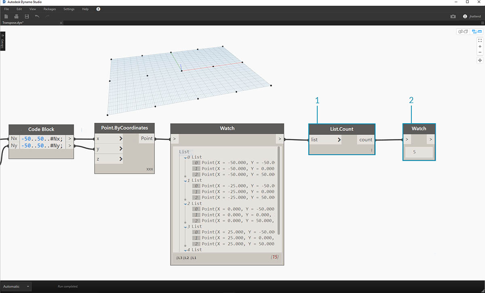

> 1. 前の手順の Watch ノードの出力に *List.Count* ノードを接続します。
2. 別の *Watch* ノードを List.Count ノードの int 出力に接続します。

List.Count ノードによって 5 という値が生成されていることに注意してください。これは、Code Block ノードで定義されている「Nx」変数と同じ値です。こうなる理由は次のとおりです。

* Point.ByCoordinates ノードは、リストを作成するための主要な入力として「x」入力を使用します。Nx の値が 5 で Ny の値が 3 の場合、3 つの項目を持つ 5 つのリストが含まれた 1 つのリストが作成されます。
* Dynamo は、リストをオブジェクトとして処理するため、List.Count ノードは、階層内のメインのリストに適用されます。その結果、メインのリストに含まれているリストの数である 5 という値が生成されることになります。

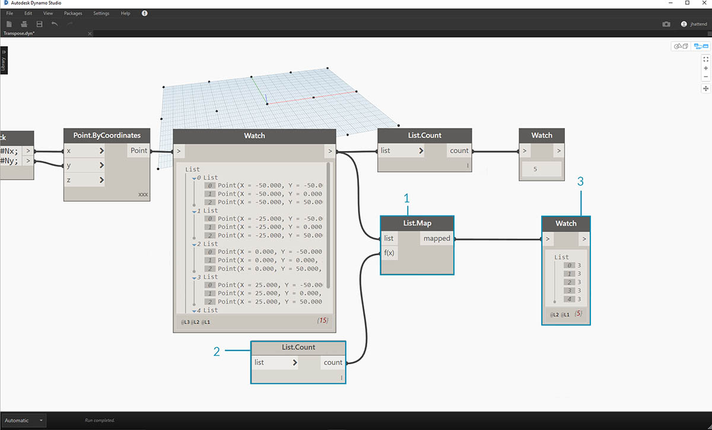

> 1. *List.Map* ノードを使用して、階層内の 1 段階下の層で「*関数*」を実行します。
2. *List.Count* ノードには入力がないことに注意してください。 *List.Count* ノードは関数として使用されるため、このノードは階層内の 1 段階下の層にあるすべてのリストに適用されます。 *List.Count* ノードの空の入力は、*List.Map* ノードの list 入力に対応しています。
3. *List.Count* ノードにより、5 つの項目を持つリストが 1 つ作成されます。それぞれの項目の値は 3 になります。 この値は、各サブリストの長さを表しています。

#### 演習 - List.Combine ノード

*注: この演習は前バージョンの Dynamo を使用して作成されました。 List.Combine の機能に関する問題の大半は、List@Level 機能の追加によって解決されました。詳細については、後述の *[*List@Level*](#listlevel)* を参照してください。*

> この演習に付属しているサンプル ファイルをダウンロードしてください(右クリックして[名前を付けてリンク先を保存......]を選択): [Combine.dyn](datasets/6-3/Combine.dyn)。 すべてのサンプルファイルの一覧については、[付録](../Appendix/A_appendix.md)を参照してください。

この演習では、List.Map ノードの場合と似た方法で、複数の要素を処理します。具体的には、点の固有の番号を使用して、曲線のリストを操作します。

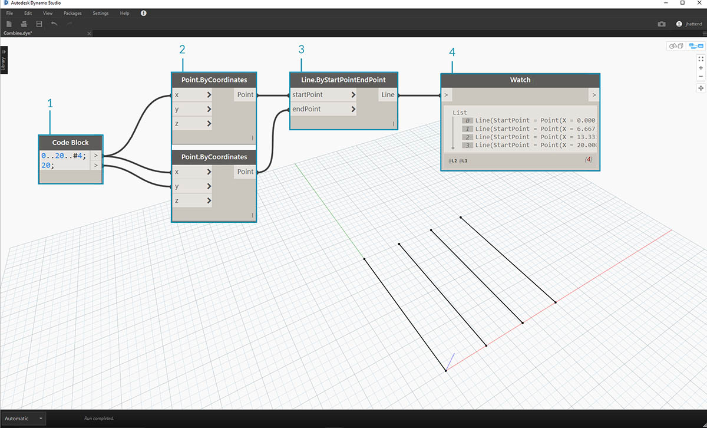

> 1. *Code Block* ノードで ..20..#4; という構文を使用し、このコード行の下で 20; という値を指定して範囲を定義します。
2. *Code Block* ノードを 2 つの *Point.ByCoordinates* ノードに接続します。
3. 2 つの *Point.ByCoordinates* ノードから *Line.ByStartPointEndPoint* ノードを作成します。
4. *Watch* ノードに 4 つの行が表示されます。


> 1. 線分作成用グラフの下で Code Block ノードを使用して、各線分を分割するための 4 つの異なる範囲を作成します。 これを行うには、次のコード行を入力します。
```
0..1..#3;
0..1..#4;
0..1..#5;
0..1..#6;
```

2. *List.Create* ノードを使用して、*Code Block* ノードの 4 つのコード行を 1 つのリストにマージします。
3. *Watch* ノードに、リストのリストが表示されます。


> 1. 線分を直接 *parameter* の値に接続しても、*Curve.PointAtParameter* ノードは機能しません。 階層内の 1 段階下の層で操作を行う必要があります。この場合、*List.Combine* ノードを使用します。


> *List.Combine* ノードを使用すると、指定した範囲で各線分を正しく分割することができます。 この操作は少し複雑であるため、手順を追って詳しく説明します。

> 1. 最初に、*Curve.PointAtParameter* ノードをキャンバスに追加します。 このノードが、*List.Combine ノードに適用される**関数*またはコンビネータになります。 詳細については、これ以降で説明します。
2. 次に、*List.Combine* ノードをキャンバスに追加し、 「*+*」符号または「*-*」符号をクリックして加算または減算を実行します。 ここでは、既定の 2 つの入力を List.Combine ノードで使用します。
3. 次に、*Curve.PointAtParameter* ノードを *List.Combine* ノードの *comb* 入力に接続します。 その際、*Curve.PointAtParameter ノードの param 入力*を右クリックし、*[既定値を使用]*オプションの選択を解除してください。 ノードを関数として実行する場合は、Dynamo 入力の既定値を削除する必要があります。つまり、既定値とは、入力ポートに追加のノードが接続されているものと考えてください。そのため、ここでは既定値を削除する必要があります。
4. 点を作成するには 2 つの入力(線分とパラメータ)が必要ですが、それらの入力をどのような方法と順序で *List.Combine* の入力に接続すればよいでしょうか。
5. *Curve.PointAtParameter* の空の入力を、上から下の順序でコンビネータに入力する必要があります。 この操作により、各線分が *List.Combine* ノードの *list1* 入力に接続されます。
6. 同様に、各パラメータの値が *List.Combine* ノードの *list2* 入力に接続されます。
7. *Watch* ノードと Dynamo のプレビューに、*Code Block* ノードで指定した範囲に基づいて分割された 4 つの線分が表示されます。

### List@Level

List.Map の代わりに List@Level 機能を使用すると、ノードの入力ポートに使用するリストのレベルを直接選択することができます。この機能は、入力ポートに指定されたあらゆる入力値に使用できます。使用すると、もっともすばやく簡単にリストのレベルにアクセスすることができます。ノードの入力として使用するリストのレベルを指定するだけで、後はすべてをノードに任せることができます。

#### List@Level の演習

この演習では、List@Level 機能を使用して特定のデータ レベルを分離してみましょう。

> この演習に付属しているサンプル ファイルをダウンロードしてください(右クリックして[名前を付けてリンク先を保存...]を選択): [List@Level](datasets/6-3/Listatlevel.dyn)。 すべてのサンプルファイルの一覧については、[付録](../Appendix/A_appendix.md)を参照してください。

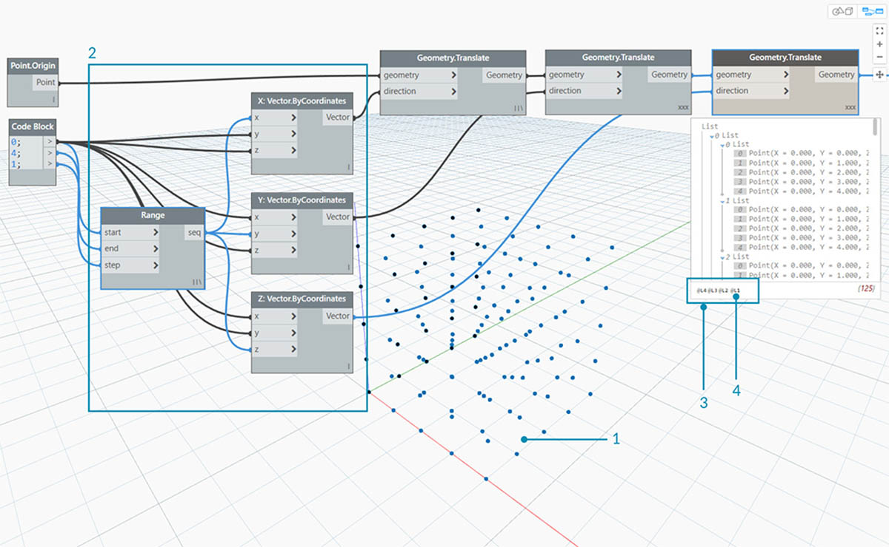

> 1. 点によって構成される単純な 3D グリッドから始めることにします。
2. X、Y、Z に Range ノードを接続することでグリッドが構成されています。したがって、データの構造は X リスト、Y リスト、Z リストの 3 層から成ることがわかります。
3. これらの層は、異なる**レベル**に存在します。 レベルは、プレビュー バルーンの下に表示されます。リスト レベルの列はリスト データに対応しています。ここで、作業中のレベルを確認することができます。
4. リスト レベルは逆順で階層化されているので、最低レベルのデータは常に「L1」にあります。これにより、上流で何かが変更されたとしても、グラフを意図したとおりに動作させることができます。

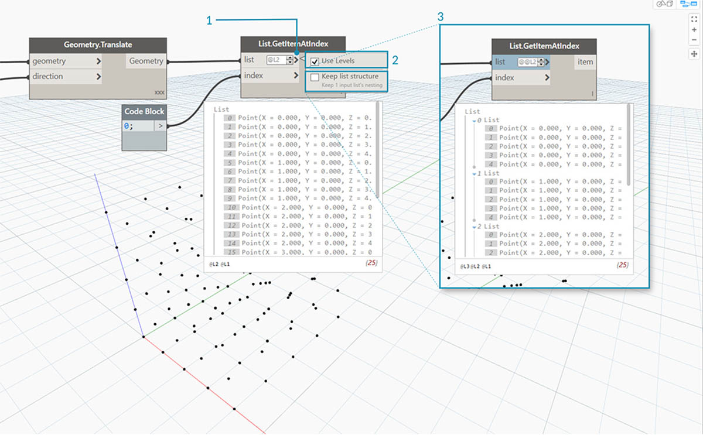

> 1. List@Level 機能を使用するには、「>」をクリックします。このメニュー内部では、2 つのチェックボックスが表示されます。
2. **レベルを使用** - このオプションをオンにすると、List@Level の機能が有効になります。 このオプションをクリックした後で、ノードで使用する入力リスト レベルをすべてクリックして選択することができます。このメニューで上矢印か下矢印をクリックすることにより、さまざまなレベル オプションを試すことができます。
3. **リスト構造を保持** - オンにしていると、その入力のレベル構造を保持することができます。 意図的にデータを複数のサブリストに整理している場合は、このオプションをオンにしておくと、いかなる情報も失わずにリスト構造をそのまま保持しておくことができます。

リスト レベル全体を切り替えることにより、単純な 3D グリッド上でリスト構造を視覚的に確認することができます。リスト レベルとインデックスの組み合わせを変更すると、元の 3D セットとは異なる点のセットが返されます。

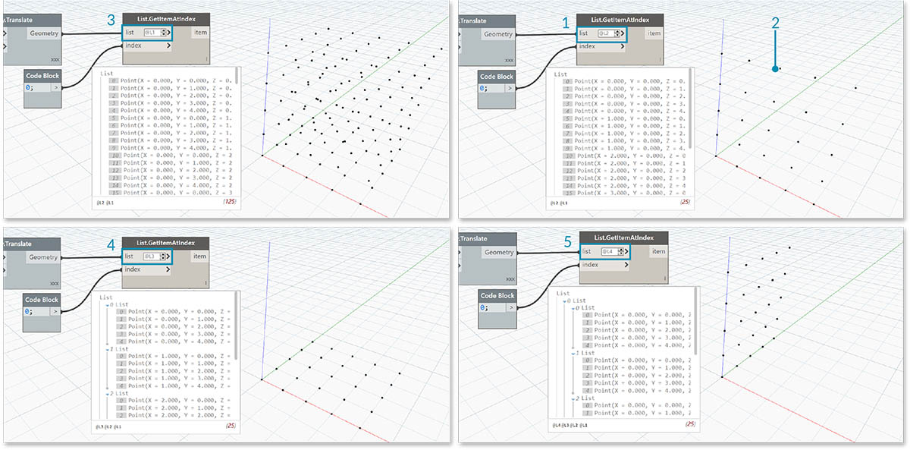

> 1. DesignScript で「@L2」を選択すると、レベル 2 のリストのみを選択することができます。
2. index に 0 が入力されているとき、レベル 2 のリストには Y を 0 とする点のセットのみが含まれているので、XZ のグリッド面のみが返されます。
3. レベル フィルタを「@L1」に変更すると、リスト レベル 1 に含まれるすべての点を確認することができます。index に 0 が入力されているとき、レベル 1 のリストにはフラット リストの 3D ポイントがすべて含まれています。
4. 同様に「@L3」に変更すると、リスト レベル 3 の点のみが表示されます。index に 0 が入力されているとき、レベル 3 のリストには Z を 0 とする点のセットのみが含まれているので、XY のグリッド面のみが返されます。
5. 同様に「@L4」に変更すると、リスト レベル 4 の点のみが表示されます。index に 0 が入力されているとき、レベル 4 のリストには X を 0 とする点のセットのみが含まれているので、YZ のグリッド面のみが返されます。

今回の例は List.Map でも作成できますが、List@Level を使用すると、動作を単純化して簡単にノード データにアクセスできるようになります。次に List.Map と List@Level の比較をご覧ください。

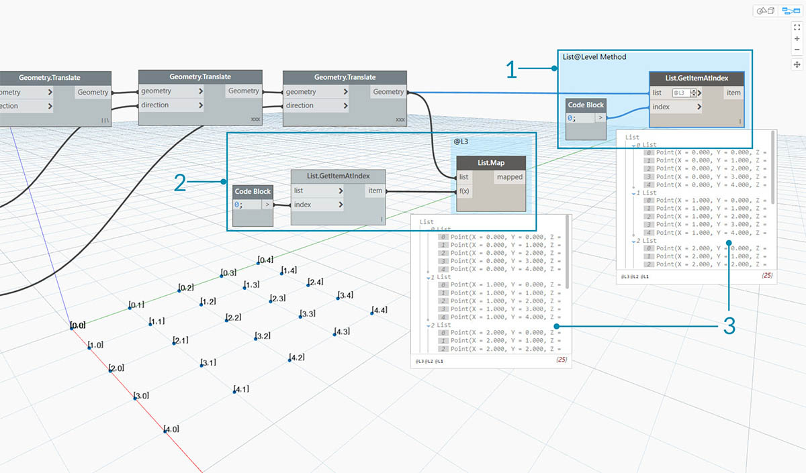

> 1. どちらの方法でも同じ点にアクセスすることができますが、List@Level を使用するとたった 1 個のノードだけでデータのレイヤを簡単に切り替えることができます。
2. List.Map を使用して点構成のグリッドにアクセスするには、List.Map の隣に List.GetItemAtIndex ノードを配置する必要があります。レベルの階層を下りていくたびに、List.Map ノードを追加していく必要があります。リストが複雑になればなるほど、目的の情報レベルにアクセスするには、多数の List.Map ノードをグラフに追加しなければなりません。
3. この例では、List.GetItemAtIndex ノードを List.Map ノードに接続することにより、List.GetItemAtIndex で「@L3」を選択したときと同じリスト構造を持つ同じ点のセットを取得しています。

### 転置

転置は、リストのリストを操作する場合の基本的な機能です。転置を実行すると、スプレッドシート プログラムの場合と同様に、データ構造内の列と行の位置が反転します。次の基本的な行列を使用して、転置の仕組みを説明します。また、次のセクションでは、転置機能を使用して幾何学的な関係を作成する方法について説明します。


#### 演習 - List.Transpose ノード

> この演習に付属しているサンプル ファイルをダウンロードしてください(右クリックして[名前を付けてリンク先を保存...]を選択): [Transpose.dyn](datasets/6-3/Transpose.dyn)。 すべてのサンプル ファイルの一覧については、付録を参照してください。


> 最初に、前の演習で使用した *List.Count* ノードを削除して別のジオメトリに移動し、データ構造がどのようになっているかを確認します。

> 1. *Point.ByCoordinates* ノードから続く Watch ノードの出力に、*PolyCurve.ByPoints* ノードを接続します。
2. 出力として 5 つのポリカーブが作成され、Dynamo のプレビューにそれらのポリカーブが表示されます。Dynamo ノードは点のリスト(この場合は、点のリストのリスト)を検索し、そのリストから 1 つのポリカーブを作成します。原則として、各リストはデータ構造内で曲線に変換されます。

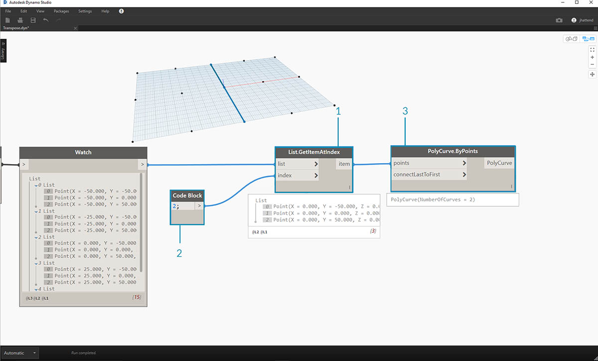

> 1. 曲線のいずれか 1 つの行を分離するには、*List.GetItemAtIndex* ノードを使用します。
2. *Code Block* ノードで値 2 を指定して、メイン リスト内の 3 番目の要素をクエリーします。
3. *PolyCurve.ByPoints* ノードによって曲線が 1 つだけ作成されます。これは、このノードに接続されているリストが 1 つしかないためです。

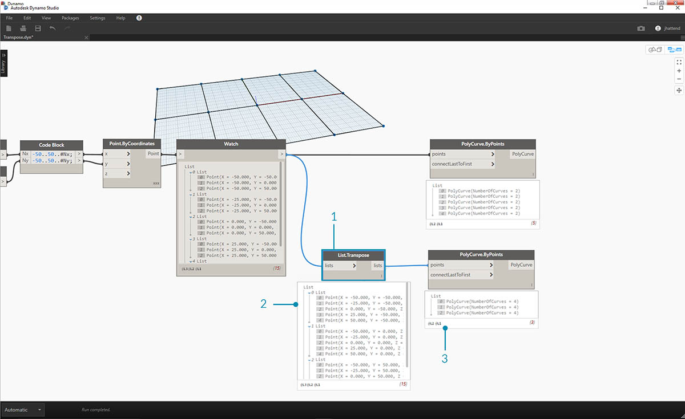

> 1. *List.Transpose* ノードは、すべての項目をメイン リスト内のすべてのリストと切り替えます。 この動作は少し複雑に感じるかもしれませんが、データ構造内の列と行を入れ替える Microsoft Excel と同じ仕組みです。
2. 転置により、リストの構造が変更されていることを確認します。転置前は 3 つの項目を持つ 5 つのリストだったのに対して、転置後は 5 つの項目を持つ 3 つのリストに変わっています。
3. *PolyCurve.ByPoints* ノードにより、元の曲線に対して垂直方向に 3 つのポリカーブが作成されます。

### コード ブロックの作成

コード ブロックでは、「{}」という省略表記を使用してリストを定義します。この方法を使用すると、List.Create ノードを使用するよりも素早く柔軟にリストを作成することができます。コード ブロックについては、第 7 章で詳しく説明します。次の図は、コード ブロックを使用して、複数の式を持つリストを作成する方法を示しています。


### コード ブロックのクエリー

コード ブロックで「[]」という省略表記を使用すると、複雑なデータ構造で特定の項目を素早く簡単に選択することができます。コード ブロックについては、第 7 章で詳しく説明します。次の図は、コード ブロックを使用して、複数のデータ タイプが存在するリストのクエリーを実行する方法を示しています。

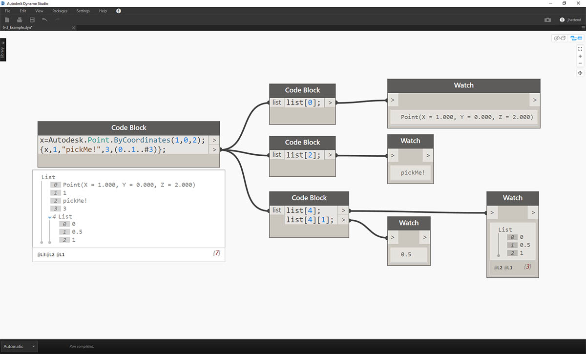

### 演習 - データのクエリーと挿入

> この演習に付属しているサンプル ファイルをダウンロードしてください(右クリックして[名前を付けてリンク先を保存...]を選択): [ReplaceItems.dyn](datasets/6-3/ReplaceItems.dyn)。 すべてのサンプル ファイルの一覧については、付録を参照してください。

この演習では、前の演習で作成したロジックを使用してサーフェスを編集します。この演習の目的は直感的な操作を行うことですが、データ構造のナビゲーションは少し複雑な操作です。ここでは、制御点を移動することにより、サーフェスの編集を行います。

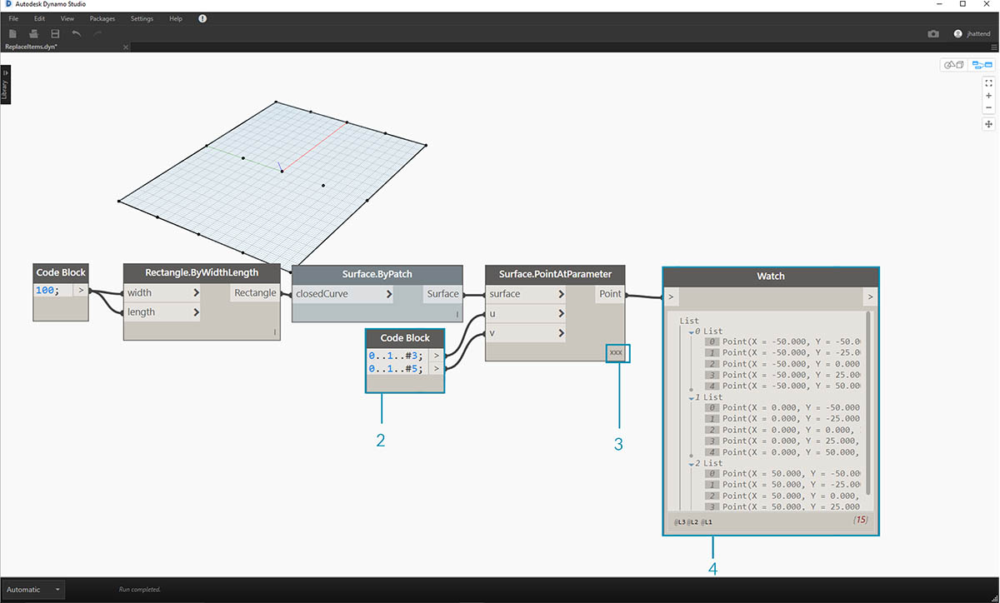

> 1. 最初に、上図の各ノードの文字列を操作します。既定の Dynamo グリッド全体にわたる基本的なサーフェスを作成します。
2. *Code Block* ノードを使用して次の 2 つのコード行を入力し、*Surface.PointAtParameter* ノードの *u* 入力と *v* 入力にそれぞれのコード行を接続します。
```
-50..50..#3;
-50..50..#5;
```

3. *Surface.PointAtParameter* ノードのレーシングを「*外積*」に設定します。
4. *Watch* ノードに、5 つの項目を持つ 3 つのリストが含まれた 1 つのリストが表示されます。


> この演習では、作成したグリッドの中心点のクエリーを実行します。これを行うには、中央のリストの中心点を選択します。

> 1. 正しい点を選択するには、Watch ノードの各項目をクリックして、正しい点が選択されているかどうかを確認します。
2. *Code Block* ノードを使用して、リストのリストをクエリーするための基礎となるコード行を次の形式で指定します。<br xmlns="http://www.w3.org/1999/xhtml"/>```points[1][2];```
3. *Geometry.Translate* ノードを使用して、選択した点を *Z* の正の向きに *20* 単位移動します。

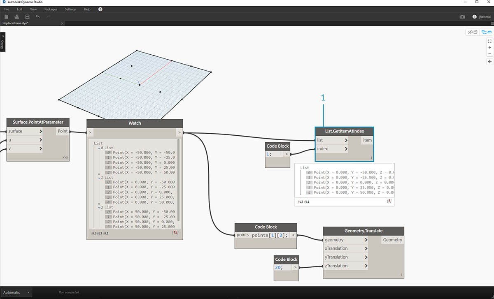

> 1. *List.GetItemAtIndex* ノードを使用して、点の中央の行を選択します。 前の手順と同様に、*Code Block* ノードで ```points[1];``` というコード行を指定してクエリーを実行することもできます。

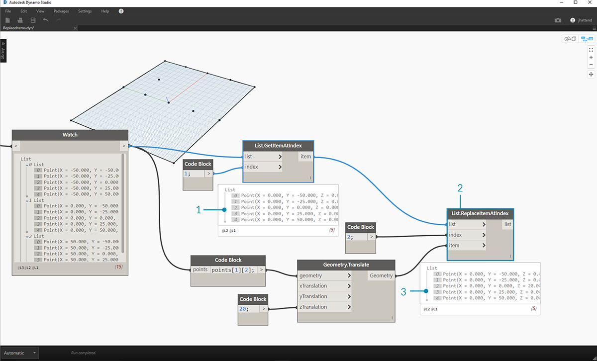

> ここまでの手順で、中心点のクエリーを実行し、中心点を上方向に移動しました。ここでは、この中心点を元のデータ構造に戻します。

> 1. 最初に、前の手順で分離したリストの項目を置き換えます。
2. *List.ReplaceItemAtIndex* ノードで「*2*」というインデックス値を使用し、置き換える項目を対象となる点(*Geometry.Translate* ノードの Geometry 出力)に接続して、中心点を置き換えます。
3. 対象の点がリストの中央の項目に入力されたことが出力として表示されます。

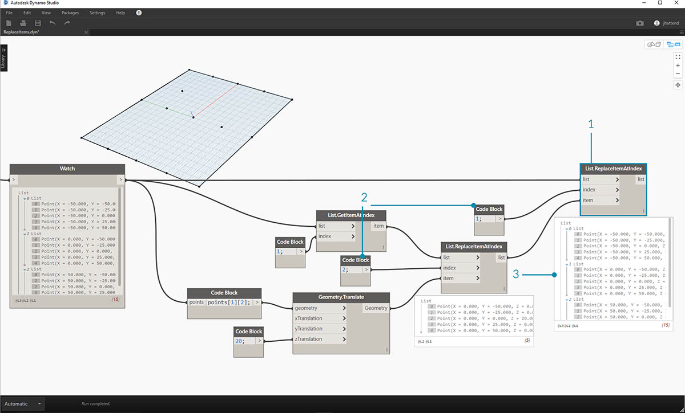

> ここでは、前の演習で変更したリストを、元のデータ構造であるリストのリストに戻します。

> 1. 前の演習と同様に、*List.ReplaceItemAtIndex* ノードを使用して、中央のリストを変更したリストで置き換えます。
2. これら 2 つのノードのインデックスを定義する *Code Block* ノードの値は、それぞれ 1 と 2 であることに注意してください。これらの値は、*Code Block* ノードで指定した元のクエリー(*points[1][2]*)に対応しています。
3. *インデックス 1* の位置でリストを選択すると、Dynamo のプレビューでデータ構造がハイライト表示されます。 これで、対象の点が元のデータ構造に正しく移動されたことになります。

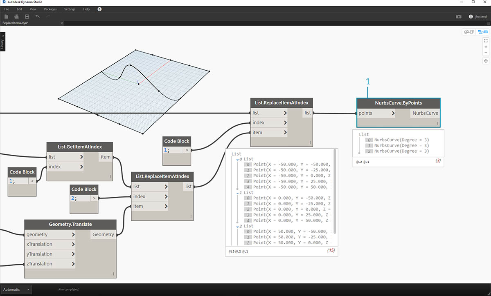

> 上図の点のセットからサーフェスを作成する方法はいくつかあります。ここでは、複数の曲線をまとめてロフトしてサーフェスを作成してみましょう。

> 1. *NurbsCurve.ByPoints* ノードを作成し、新しいデータ構造を接続して、3 つの NURBS 曲線を作成します。

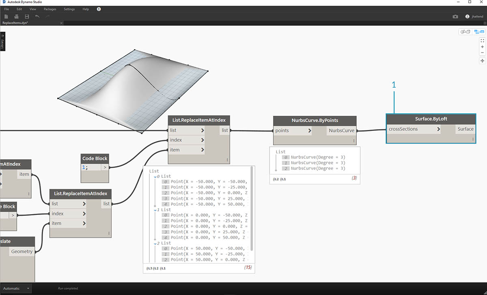

> 1. *Surface.ByLoft* ノードを *NurbsCurve.ByPoints* ノードの出力に接続します。 これで、サーフェスが変更されました。ジオメトリの元の *Z* 値を変更することができます。 この値を変更して、ジオメトリがどのように変化するかを確認してください。

