## DesignScript 構文

Dynamo のノード名に共通の形式があることにお気付きでしょうか。各ノードはスペースなしの「*.*」構文を使用しています。 各ノードの最上部の文字列がスクリプトの実際の構文を表しており、「*.*」(*ドット表記*)が呼び出し可能なメソッドと要素を区切っています。 これにより、ビジュアル スクリプトから文字ベースのスクリプトに簡単に変換することができます。


ドット表記の一般的な使用例として、apple (リンゴ)というパラメータが Dynamo でどのように処理されるか見てみましょう。以下は、リンゴを食べる前にリンゴに対して実行するいくつかのメソッドを示しています。(注意: これらは Dynamo の実際のメソッドではありません)。

|説明|ドット表記|出力|
| -- | -- | -- |
|リンゴは何色ですか?|Apple.color|red|
|リンゴは熟していますか?|Apple.isRipe|true|
|リンゴの重さはどのくらいですか?|Apple.weight|6 oz|
|リンゴはどこで生まれましたか?|Apple.parent|tree(木)|
|リンゴは何を作りますか?|Apple.children|seeds(種)|
|このリンゴは地元で育てられましたか?|Apple.distanceFromOrchard|60 mi.|

読者がどう思われるかはわかりませんが、上記の表の出力から判断すると、私にはおいしいリンゴのように見えます。*Apple.eat() *を実行しようと思います。

### コード ブロックのドット表記

リンゴの例を念頭に置きながら、*Point.ByCoordinates* ノードでコード ブロックを使用して点を作成する方法を見てみましょう。

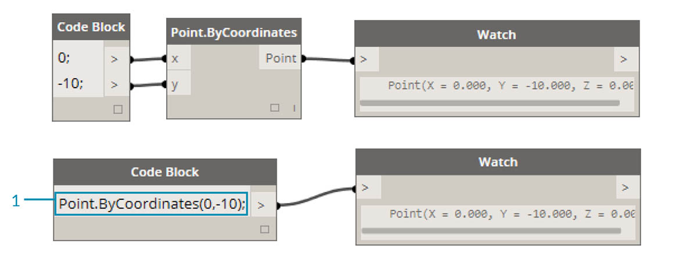

> *Code Block* ノードの構文 ```Point.ByCoordinates(0,10);``` は、Dynamo の *Point.ByCoordinates* ノードと同じ結果を生成します。ただし、1 つのノードを使用して点を作成できるという違いがあります。 *x* 入力と *y* 入力に異なるノードを接続する必要がないため、より効率的です。

> 1. コード ブロックで *Point.ByCoordinates* を使用することにより、初期設定のままのノード*(x,y)*と同じ順番で入力を指定します。

### ノードを呼び出す

ライブラリ内の通常のノードは、Code Block を通じて呼び出すことができます。ただし、特別なユーザ インタフェース機能を持つ特別な *UI ノード*は呼び出すことができません。 たとえば、*Circle.ByCenterPointRadius* を呼び出すことはできますが、*Watch 3D* ノードを呼び出すことは意味がありません。

通常の(ライブラリのほとんどの)ノードは一般的に 3 つのタイプに分けられます。

* **Create** - 何かを作成(または構築)します
* **Action** - 何かに対してアクションを実行します
* **Query** - 既に存在する何かのプロパティを取得します

ライブラリはこれらのカテゴリに基づいて編成されています。これらの 3 つのタイプのメソッド(ノード)では、Code Block で呼び出されるときの処理がそれぞれ異なります。


#### Create

[Create]カテゴリはジオメトリを一から構築します。コード ブロックには値を左から右に入力します。これらの入力の順番は、上から下に入力するノードの入力の順序と同じです。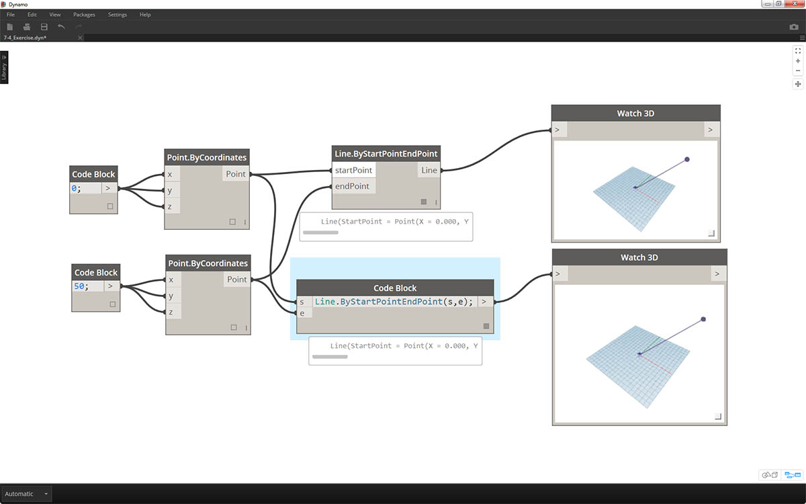

> *Line.ByStartPointEndPoint* ノードと、コード ブロック内の対応する構文とでは、同じ結果が生成されます。

#### Action

このタイプのオブジェクトに対してはアクションを行います。Dynamo は(多くのコーディング言語で一般的な)*ドット表記*を使用して、対象に対してアクションを適用します。 対象とするオブジェクトを決めたら、ドットに続けてアクション名を入力します。Action タイプのメソッドの入力は、Create タイプのメソッドと同様、括弧で囲んで指定されます。ただし、対応するノードの最初の入力を指定する必要はありません。代わりに、アクションの実行対象の要素を指定します。

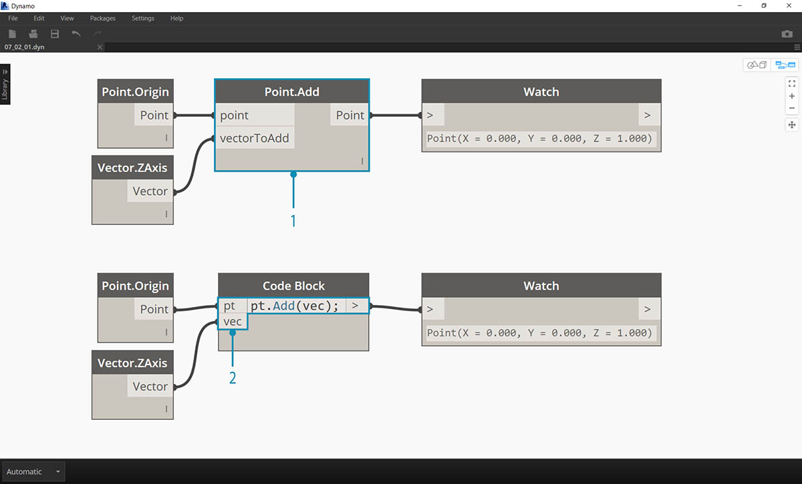

> 1. *Point.Add *ノードは Action タイプのノードであるため、構文の動作が多少異なります。
2. 入力は(1) *point* と、(2)その点に追加する *vector* の 2 つです。 *Code Block* では、点(対象)に「*pt*」という名前を付けています。 「*vec*」という名前のベクトルを「*pt*」に追加するには、*pt.Add(vec)*、つまり「対象、ドット、アクション」の形式で書き込みます。 Add アクションの入力は 1 つのみであるか、または *Point.Add *ノードの最初の入力を除くすべての入力になります。 *Point.Add *ノードの最初の入力は点自体です。

#### Query

Query タイプのメソッドはオブジェクトのプロパティを取得します。オブジェクト自体が入力であるため、入力を指定する必要はありません。括弧は必要ありません。


### レーシングを適用する

ノードを使用するレーシングと、コード ブロックを使用するレーシングとは少々異なります。ノードを使用する場合、ユーザはノードを右クリックして、実行するレーシング オプションを選択します。コード ブロックを使用する場合、ユーザはデータを構築する方法をより詳しくコントロールできます。コード ブロックの省略表記では、*複製ガイド*を使用して、複数の 1 次元リストをペアリングする方法を設定します。 山括弧「<>」内の数値(<1>、<2>、<3> など)は、生成するネストされたリストの階層を設定します。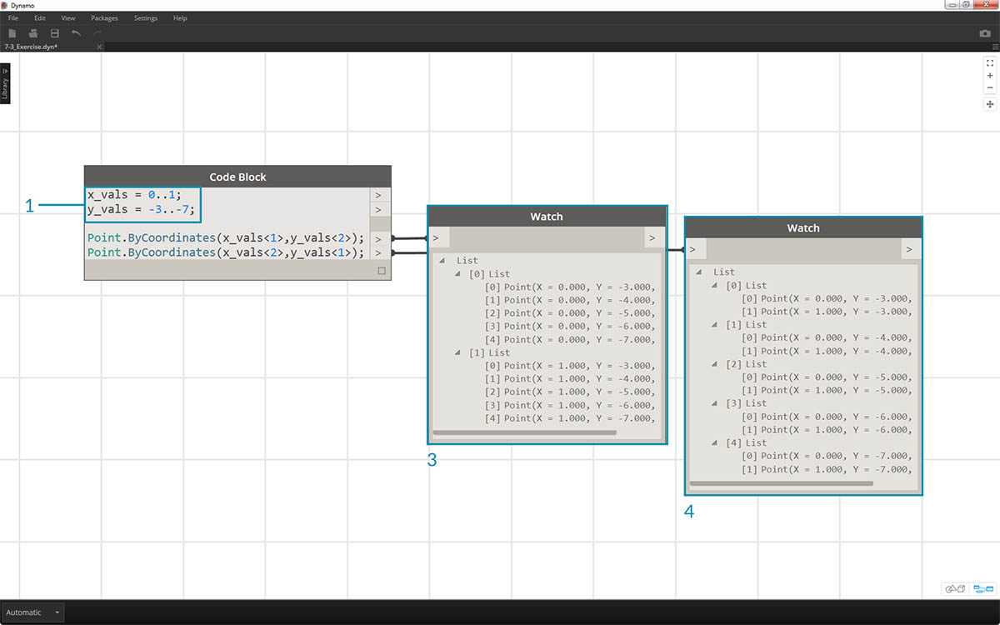</3></2></1>

> 1. この例では、省略表記で 2 つの範囲を設定します(省略表記については、この章の次のセクションで詳しく説明します)。簡単に説明すると、```0..1;``` は```{0,1}```に相当し、```-3..-7``` は```{-3,-4,-5,-6,-7}```に相当します。 この結果、2 つの x 値と 5 つの y 値のリストが返されます。このような範囲が一致していないリストを持つ複製ガイドを使用しない場合は、2 つの点が含まれるリストが返され、リストの長さは短い方の長さになります。複製ガイドを使用すると、2 つの値と 5 つの値を組み合わせたすべての座標(または**外積**)を表示できます。
2. 構文 ```Point.ByCoordinates(x_vals<1>,y_vals<2>);``` を使用すると、**5** つの項目を含む **2** つのリストが生成されます。
3. 構文 ```Point.ByCoordinates(x_vals<2>,y_vals<1>);``` を使用すると、**2** つの項目を含む **5** つのリストが生成されます。

この表記では、5 つの項目を持つ 2 つのリストと 2 つの項目を持つ 5 つのリストのどちらを優先リストにするか指定することもできます。例では、複製ガイドの順番を変更することにより、グリッドの点の行のリストまたは列のリストを生成できます。

### ノードをコード化

コード ブロックを使用する上記の方法を使用するには多少の慣れが必要ですが、Dynamo には処理を容易にする[ノードをコード化]という機能があります。この機能を使用するには、Dynamo グラフでノードの配列を選択し、キャンバスを右クリックして、[ノードをコード化]を選択します。Dynamo はこれらのノードを、すべての入力と出力を含め、1 つのコード ブロックに統合します。このツールはコード ブロックの学習に役立つだけでなく、より効率的でパラメトリックな Dynamo グラフの使用を可能にします。次の演習では最後に[ノードをコード化]を使用します。

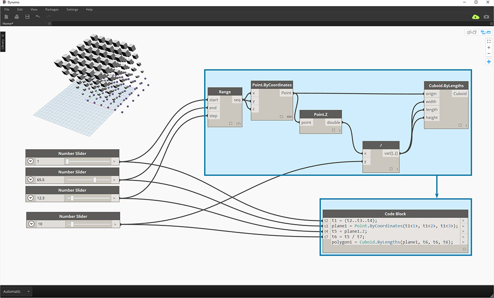

### 演習

> この演習に付属しているサンプル ファイルをダウンロードしてください(右クリックして[名前を付けてリンク先を保存]を選択)。すべてのサンプル ファイルの一覧については、付録を参照してください。[Dynamo-Syntax_Attractor-Surface.dyn](datasets/7-2/Dynamo-Syntax_Attractor-Surface.dyn)

コード ブロックの性能を紹介するため、既存のアトラクタ フィールドの設定をコード ブロックの形式に変換します。既存の設定を使用することにより、コード ブロックがビジュアル スクリプトとどのように関連付けられているかを確認し、DesignScript 構文について学習します。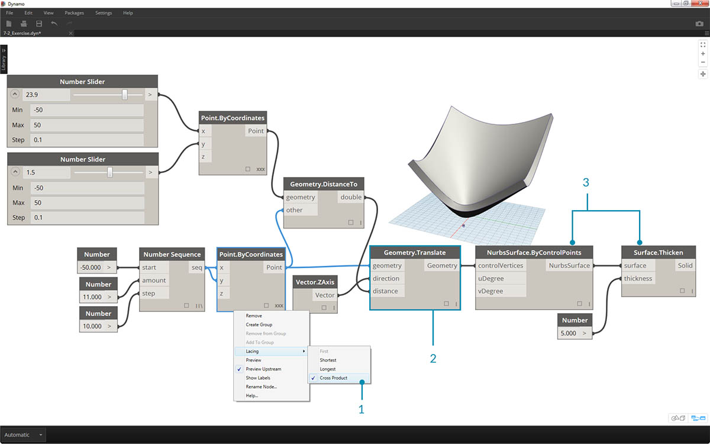

> まず、上記の画像の設定を再作成します(またはサンプル ファイルを開きます)。

> 1. *Point.ByCoordinates* ノードのレーシングが*外積*に設定されていることに注目してください。
2. グリッド内の各点は、参照点までの距離に基づいて Z の正の向きに移動します。
3. サーフェスが再作成されて厚みが付けられ、参照点までの距離を基準にしてジオメトリ内にふくらみが作成されます。


> 1. 初めからやり直して、まず参照点 ```Point.ByCoordinates(x,y,0);``` を設定しましょう。 参照点ノードの最上部で指定したものと同じ *Point.ByCoordinates* 構文を使用します。
2. コード ブロックに変数*x*と*y*が挿入され、スライダを使用してこれらを動的に更新できます。
3. *-50*から*50*までの範囲の *Number Slider* ノードをいくつか *Code Block* ノードの入力に追加します。 これにより、既定の Dynamo グリッド全体を使用できます。


> 1. *Code Block* ノードの 2 行目では、数値シーケンス ノードを置き換える省略表記を設定します: ```coordsXY = (-50..50..#11);```。 次のセクションではこの方法について詳しく説明します。ここでは、この省略表記がビジュアル スクリプトの *Number Sequence* ノードに相当していることを確認してください。

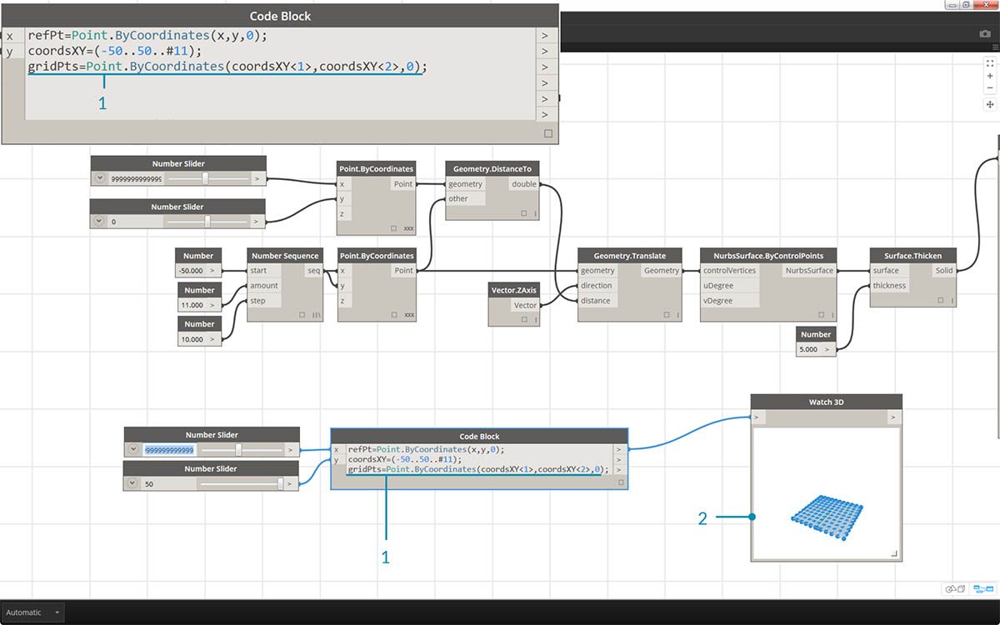

> 1. 次に、*coordsXY* シーケンスから点のグリッドを作成します。 これを行うには *Point.ByCoordinates* 構文を使用します。ただし、ビジュアル スクリプトで実行した場合と同様、リストにある*外積*を作成する必要もあります。 これを行うには、次の行を入力します: ```gridPts = Point.ByCoordinates(coordsXY<1>,coordsXY<2>,0);```。 山括弧は外積参照を意味します。
2. *Watch3D* ノードには Dynamo のグリッド全体に点のグリッドが表示されます。

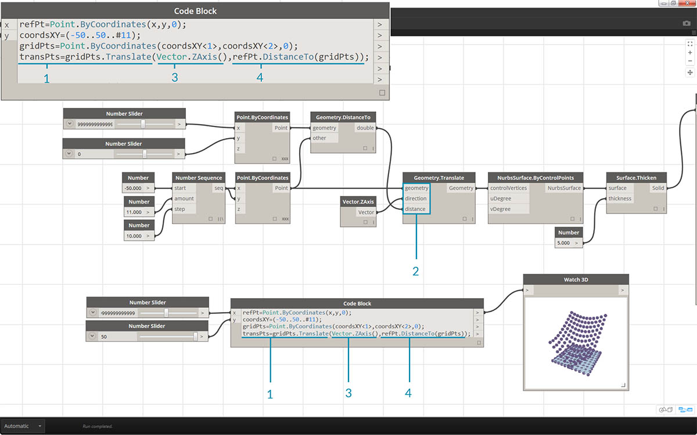

> 1. 少し難しくなってきますが、ここで、点のグリッドを参照点までの距離に基づいて上方向に移動する必要があります。まず新しい点のセット *transPts* を呼び出しましょう。 変換は既存の要素に対するアクションであるため、```Geometry.Translate...``` を使用する代わりに ```gridPts.Translate``` を使用します。
2. キャンバス上の実際のノードから、3 つの入力があることが読み取れます。変換するジオメトリは既に宣言されています。この要素に対して、*gridPts.Translate* を使用してアクションを実行しているためです。 残りの 2 つの入力は関数 *direction* と *distance* の括弧内に挿入されます。
3. 方向の指定は簡単です。```Vector.ZAxis()``` を使用して垂直方向に移動します。
4. 参照点と各グリッド間の距離は計算する必要があります。これは同様に、参照点に対するアクションとして実行します: ```refPt.DistanceTo(gridPts)```。
5. コードの最終行 ```transPts = gridPts.Translate(Vector.ZAxis(),refPt.DistanceTo(gridPts));``` によって変換された点が返されます。


> 1. これで適切なデータ構造を持つ点のグリッドを使用して NURBS サーフェスを作成できます。サーフェスは ```srf = NurbsSurface.ByControlPoints(transPts);``` を使用して構築します。

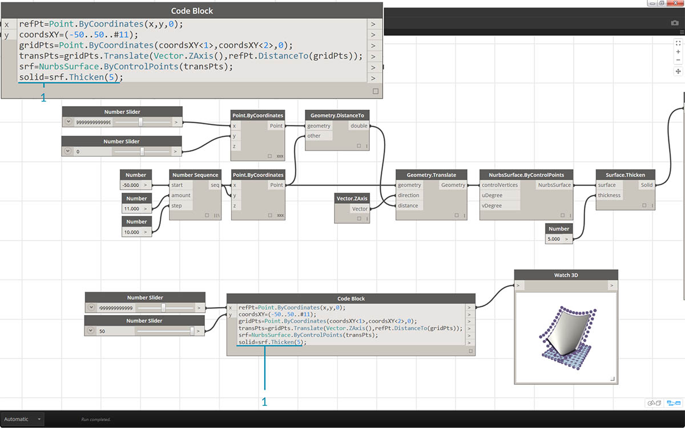

> 1. 最後に、サーフェスに深さを追加するため、```solid = srf.Thicken(5);``` を使用してソリッドを構築します。ここではコードで 5 単位を指定して厚みを付けますが、これを変数として(*thickness* などの名前を付けて)宣言し、スライダを使用して値をコントロールすることも可能です。

### [ノードをコード化]を使用してグラフを単純化する

[ノードをコード化]機能を使用すると、先ほど終了した演習全体を、ボタンをクリックするだけで自動化できます。このツールはカスタム設定や再利用可能なコード ブロックの作成に優れているだけでなく、Dynamo でスクリプトを作成する方法を学習するのにも役立ちます。

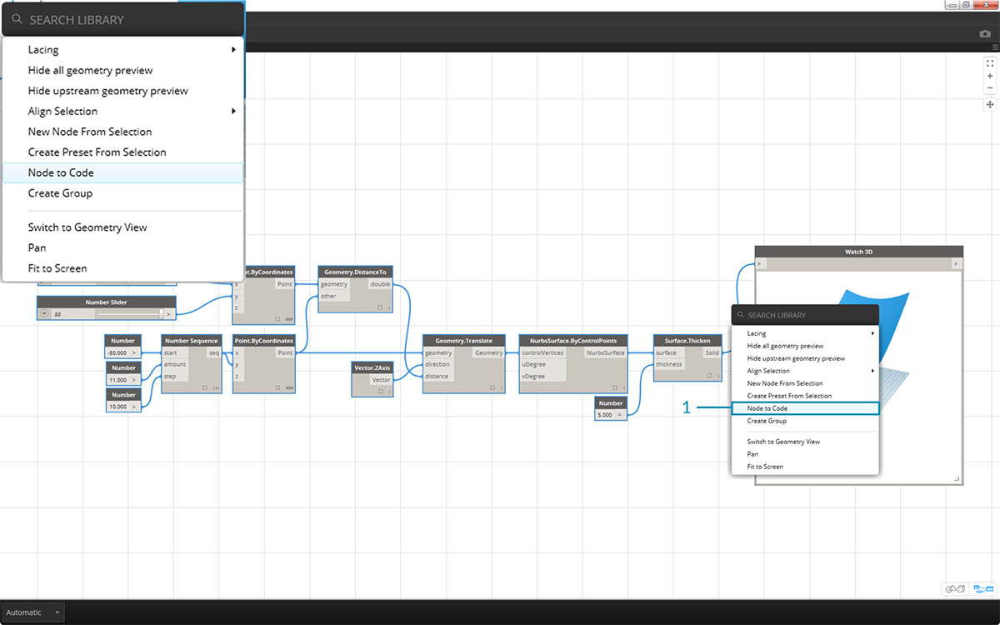

> 1. まず、この演習の手順 1 で使用したビジュアル スクリプトを操作してみます。すべてのノードを選択し、キャンバスを右クリックして、[*ノードをコード化*]を選択します。 非常に簡単です。

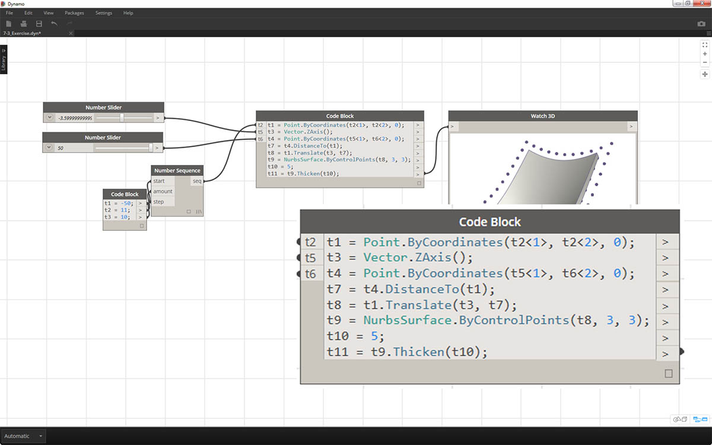

> Dynamo はビジュアル グラフ、レーシングなどの文字ベースのバージョンを自動化しています。これをビジュアル スクリプトでテストして、コード ブロックの性能をお試しください。

