## 設計図書の作成

ここまでのセクションの演習に続けて、パラメータを編集して設計図書を作成してみましょう。このセクションでは、パラメータを編集することで、要素のジオメトリの特性を左右するのではなく、Revit ファイルから設計図書を作成できるようにする方法について紹介します。

#### 偏差

以降の演習では、水平面からの基本的な偏差を使用して、設計図書作成用に Revit のシートを作成します。パラメータで定義した屋根構造上のパネルにはそれぞれ異なる偏差の値が与えられています。そこで、色分けによって値の範囲をわかりやすく表示し、アダプティブ点を集計表に書き出してファサード設計の監修者、設計者、または施工業者に渡すことができるようにしましょう。


> 水平面からの偏差を取得するノードにより、4 つの点群と最適な水平面の間の距離が計算されます。これで施工性をすばやく簡単に検討することができます。

### 演習

> この演習に付属しているサンプル ファイルをダウンロードしてください(右クリックして[名前を付けてリンク先を保存]を選択)。すべてのサンプル ファイルの一覧については、付録を参照してください。

> 1. [Documenting.dyn](datasets/8-6/Documenting.dyn)
2. [ARCH-Documenting-BaseFile.rvt](datasets/8-6/ARCH-Documenting-BaseFile.rvt)

このセクション用の Revit ファイルを使用して(または前のセクションからの続きとして)演習を開始しましょう。このファイルには、屋根上の ETFE パネルの配列が収録されています。以降の演習でこれらのパネルを参照します。


> 1. *Family Types* ノードをキャンバスに追加し、[*ROOF-PANEL-4PT*]を選択します。
2. このノードを *All Elements of Family Type* ノードに接続することで、すべての要素を Revit から Dynamo に取得します。


> 1. *AdaptiveComponent.Locations* ノードにより、各要素のアダプティブ点の位置をクエリーします。
2. *Polygon.ByPoints* ノードを使用して、これら 4 点から 1 つのポリゴンを作成します。 これにより、Revit 要素のジオメトリをすべて読み込むことなく、パネル システムの抽象化されたバージョンを Dynamo で取得することができます。
3. *Polygon.PlaneDeviation* ノードを使用して、水平面からの偏差を計算します。


> 前の演習と同様に、各パネルの*開口率*を水平面からの偏差に基づいて設定してみましょう。

> 1. *Element.SetParameterByName* ノードをキャンバスに追加して、その *element* 入力にアダプティブ コンポーネントを接続します。 [*開口率*]を読み取っている *Code Block* ノードを、*parameterName* 入力に接続します。
2. 偏差の出力を直接 value 入力に接続することはできません。なぜなら、複数の値をパラメータ範囲にマッピングし直す必要があるからです。

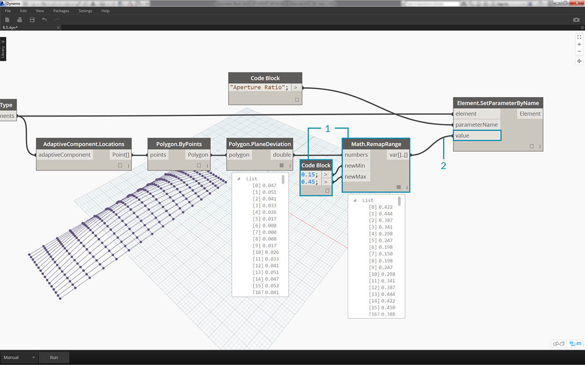

> 1. *Math.RemapRange* ノードを使用して、偏差の値を .15* から *.45* までの範囲にマッピングし直します。
2. そのノードの出力を *Element.SetParameterByName* の value 入力に接続します。


> Revit に戻ると、サーフェス全体の開口率が*多少*変化したことがわかります。

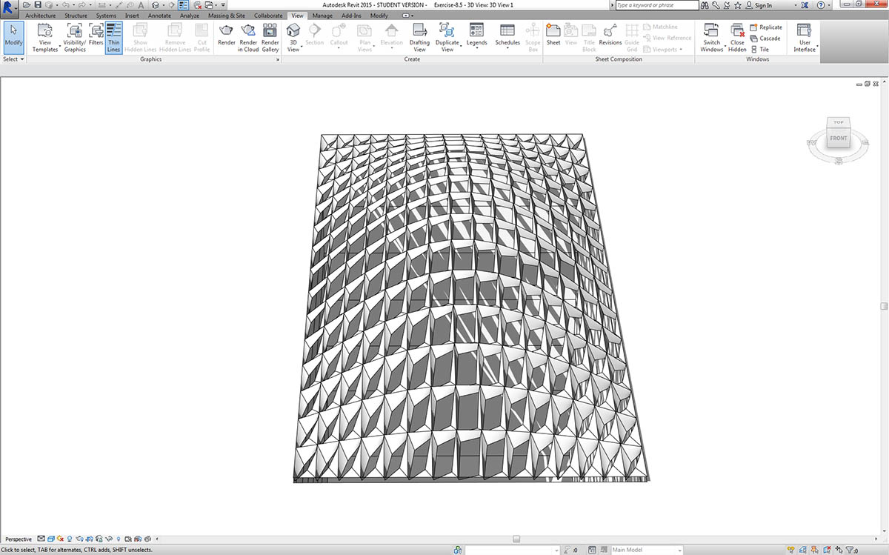

> 拡大表示するとはっきりわかるように、サーフェスの四隅に近付くほどパネルが閉じていく傾向にあり、また隆起の頂点へ近付くほどパネルが開いていく傾向にあります。これは、四隅のあたりでは水平面からの偏差が大きく、ふくらみの部分では水平に近くになっているためです。

### 色分けと設計図書作成

[開口率]の設定では、屋根上のパネルの偏差があまりよくわかりません。また、実際の要素のジオメトリが変更されてしまいます。単に製造性の観点から偏差を検討するだけであれば、設計図書作成の際に、偏差の範囲に基づいてパネルを色分けするとよいでしょう。下記の一連の手順によってそのような色分けを行うことができます。これは上記の手順にとてもよく似ています。

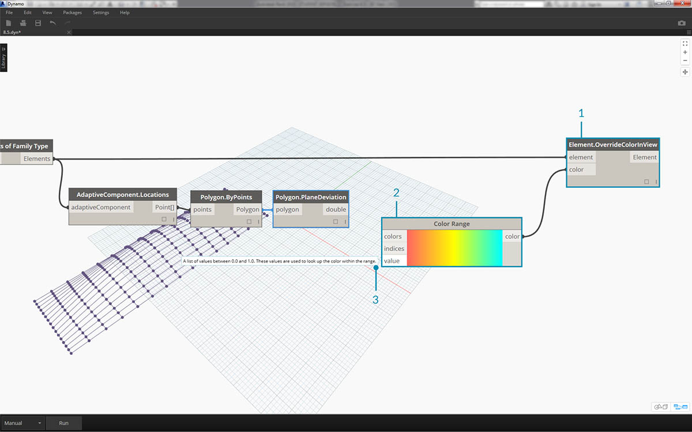

> 1. *Element.SetParameterByName* ノードを削除し、*Element.OverrideColorInView* ノードを追加します。
2. *Color Range* ノードをキャンバスに追加して、そのノードを *Element.OverrideColorInView* の color 入力に接続します。 さらに、グラデーションを作成するために偏差の値を Color Range ノードに接続する必要があります。
3. *value* 入力にカーソルを合わせると、その入力の値が*0* から *1* までの範囲で表示されます。この値は、値ごとに色をマッピングするのに使用されます。 偏差の値をこの範囲にマッピングし直す必要があります。

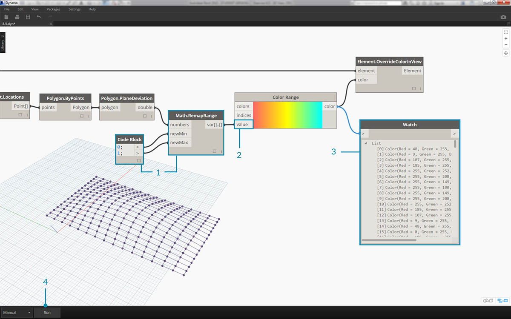

> 1. *Math.RemapRange* を使用して、水平面からの偏差を * 0* から *1* までの範囲にマッピングし直します(注記: なお、*MapTo* ノードを使用してソースの範囲を設定することもできます)。
2. その出力結果を *Color Range* ノードに接続します。
3. ここでの出力は、数値の範囲ではなく、色の範囲です。
4. [手動]に設定している場合は[*実行*]をクリックします。 これ以降の手順では、[自動]に設定しないように注意してください。


> Revit に戻ると、かなり見やすいグラデーションが表示されます。これは、ユーザが指定した色の範囲に基づいて、水平面からの偏差を表しています。色分けをカスタマイズするには、どうすればよいでしょうか。 いま偏差の最小値は赤色で表示されていますが、これとは逆の色分けに変更してみましょう。つまり、偏差の最大値を赤色に、偏差の最小値をもっと落ちついた色に設定することにします。Dynamo に戻ってこの修正を行ってみましょう。

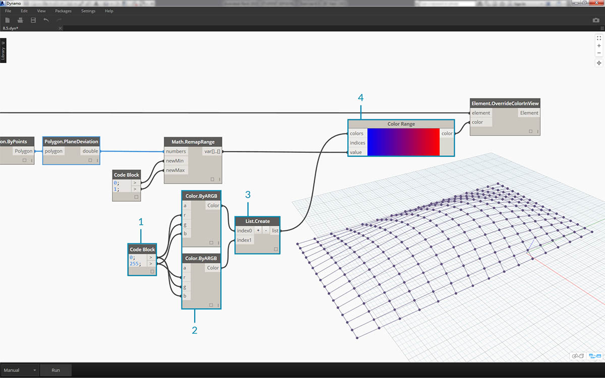

> 1. *Code Block* ノードを使用して、```0;``` と ```255;``` という 2 つの数値を、2 行に分けて追加します。
2. 2 つ の *Color.ByARGB* ノードに適切な値を接続することで、赤色と青色を作成します。
3. これらの 2 色から 1 つのリストを作成します。
4. このリストを *Color Range* ノードの *colors* 入力に接続し、カスタマイズした色の範囲が更新されていることを確認します。

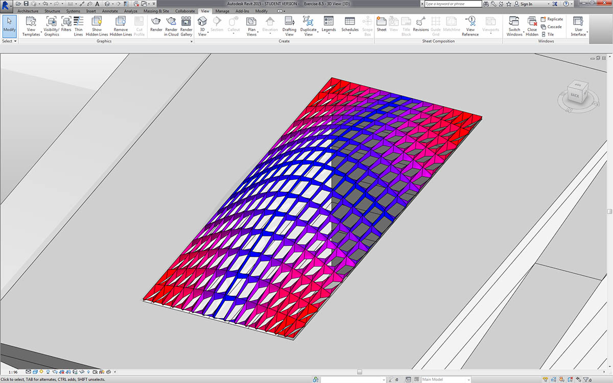

> Revit に戻ると、水平面からの偏差が四隅の領域で最大になっていることがよりはっきり確認できます。なお、このノードはビュー内の色の優先設定に使用されます。したがって、一連の図面のなかで特定のシートが特定のタイプの解析を目的としている場合に、とても役に立ちます。

### 集計表の作成

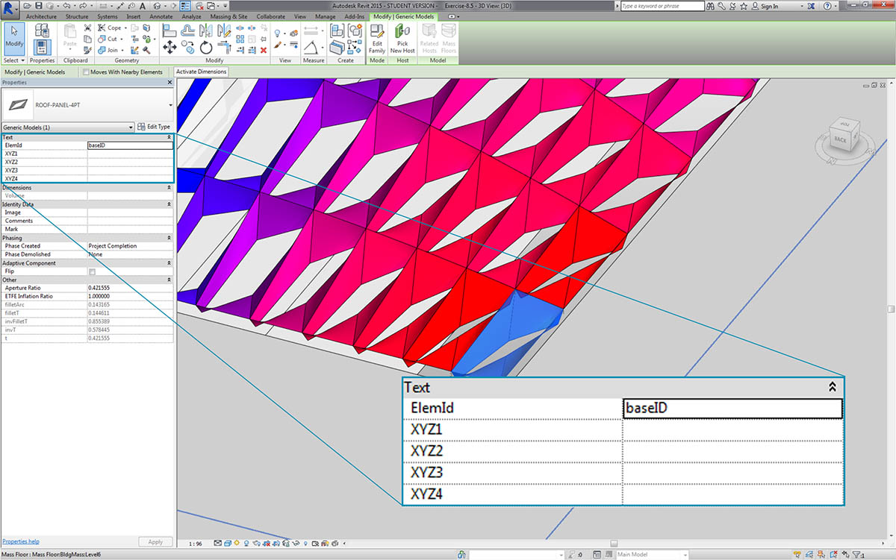

> 1. Revit で ETFE パネルを選択すると、*XYZ1、XYZ2、XYZ3、XYZ4* という 4 つのインスタンス パラメータが表示されます。 正しく作成されている場合、これらのパラメータはすべて空になっています。これらは文字ベースのパラメータであり、値を必要とします。Dynamo を使用して、各パラメータにアダプティブ点の位置を入力します。この機能は、ジオメトリをファサード設計の監修者に送信する必要がある場合に、相互運用性の確保に役立ちます。


> サンプルのシートには大規模な空の集計表が含まれています。XYZ パラメータは Revit ファイルでも使用される共有パラメータであり、このファイルによってパラメータを集計表に追加することができます。


> 拡大表示すると、XYZ パラメータはまだ入力されていません。左側 2 つのパラメータは Revit によって処理されています。

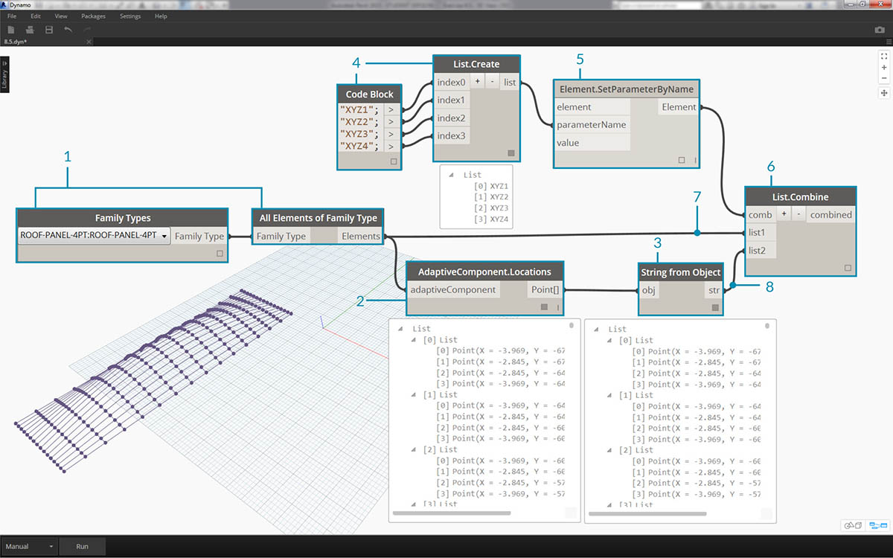

> これらのパラメータに値を入力するために、これから複雑なリスト操作を行います。グラフそれ自体は単純ですが、考え方はリストの章で紹介したリストのマッピングを大いに活用しています。

> 1. 2 つのノードを使用してアダプティブ コンポーネントをすべて選択します。
2. *AdaptiveComponent.Locations* ノードを使用して、各点の位置を抽出します。
3. これらの点群を文字列に変換します。なお、パラメータはテキストベースですから、正しいデータ タイプを入力する必要があることに注意してください。
4. 変更するパラメータを定義する 4 つの文字列 *XYZ1、XYZ2、XYZ3、XYZ4* から、1 つのリストを作成します。
5. このリストを *Element.SetParameterByName* ノードの *parameterName* 入力に接続します。
6. *Element.SetParameterByName* ノードを *List.Combine* ノードの *combinator* 入力に接続します。
7. *アダプティブ コンポーネント*を *list1* 入力に接続します。
8. *String from Object* ノードを *list2* 入力に接続します。
9. ここでリスト マッピングを行います。各要素につき 4 つのパラメータに値を入力することで、複雑なデータ構造を作成するためです。*List.Combine* ノードはデータ階層内の 1 段階下の層で操作を定義します。 element 入力と value の入力が空のままになっているのはこのためです。*List.Combine* ノードは、入力のサブリストを、接続された順番に基づいて *List.SetParameterByName* ノードの空の入力に接続します。

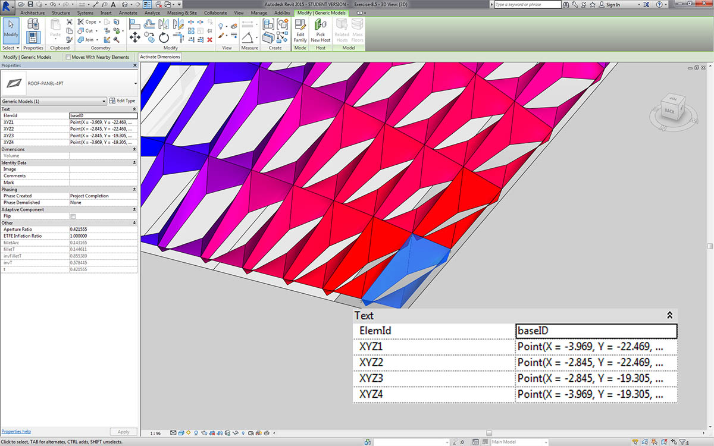

> Revit でパネルを選択すると、各パラメータに文字列値が入力された状態で表示されます。実際のプログラミングでは、(X,Y,Z)のようにより単純な形式で 1 つの点を作成するものです。これは Dynamo の文字列操作で可能ですが、この章で取り扱う範囲から逸脱しないようにするために、その方法はここでは紹介しません。

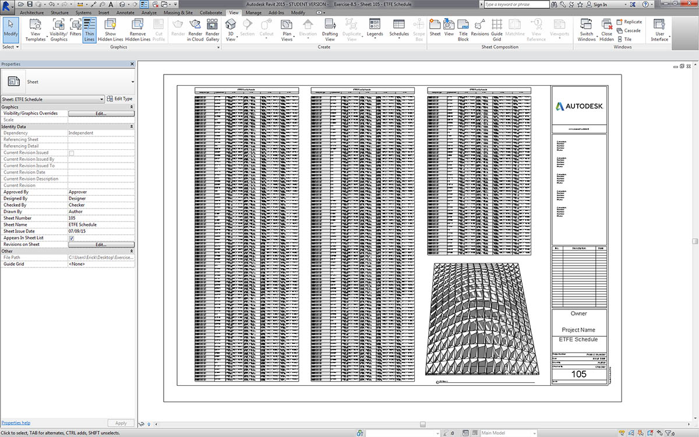

> パラメータへの入力が完了しているサンプル集計表のビューです。

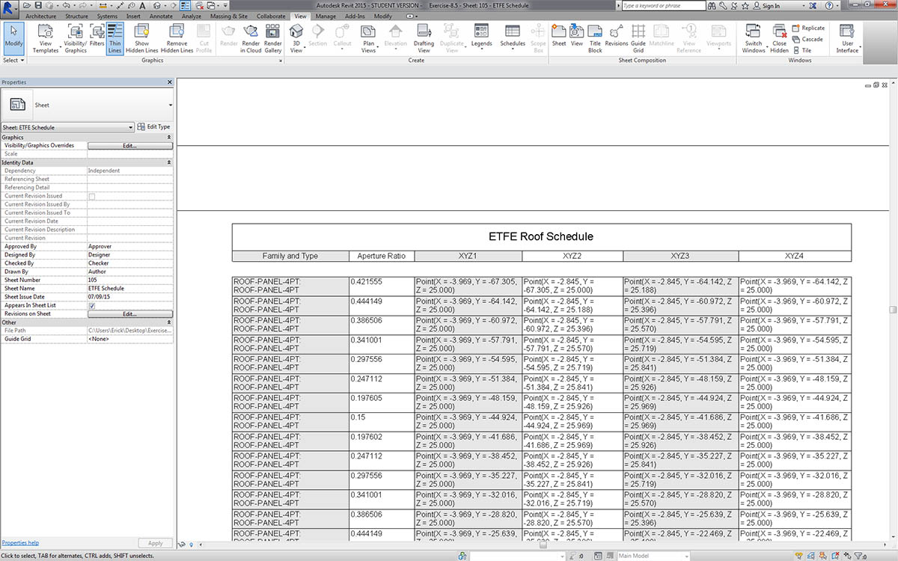

> 各 ETFE パネルを構成するすべてのアダプティブ点について XYZ 座標が記入されています。これらが製造用の各パネルの四隅を表します。

