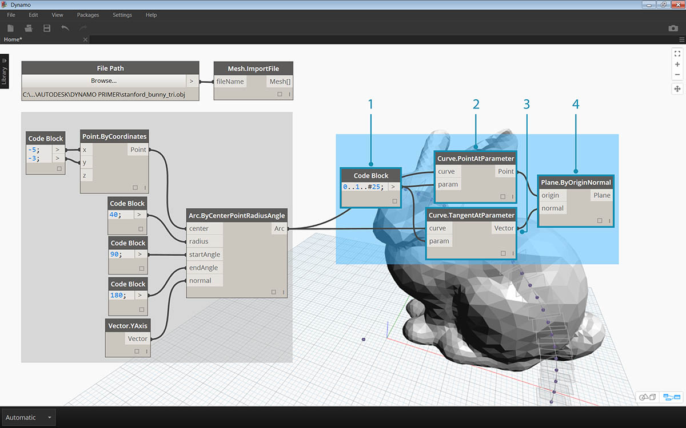

## パッケージのケーススタディ - Mesh Toolkit

Dynamo Mesh Toolkit は、外部ファイル形式からメッシュを読み込む機能、Dynamo のジオメトリ オブジェクトからメッシュを作成する機能、頂点とインデックスからメッシュを手動で作成する機能を提供するライブラリです。このライブラリには、メッシュの変更や修復を行うためのツールや、製造処理で使用する水平方向のスライスを抽出するためのツールも用意されています。

Dynamo Mesh Toolkit は、オートデスクによるメッシュ研究の一環として開発されているため、今後も成長を続けていきます。このツールキットには、頻繁に新しいメソッドが追加される予定になっています。コメント、バグの報告、新機能の提案については、お気軽に Dynamo チームまでご連絡ください。

### メッシュとソリッドとの比較

次の演習では、Mesh Toolkit を使用して、いくつかの基本的なメッシュ操作を説明します。この演習では、メッシュを一連の平面と交差させます。この操作でメッシュではなくソリッドを使用すると、計算量が多くなります。ソリッドとは異なり、メッシュには「解像度」の集合があります。現在の作業に応じて、この解像度を定義することができます。メッシュは、数学的にではなく位相幾何学的に定義されています。メッシュとソリッドとの関係について詳しくは、この手引の「[計算設計用のジオメトリ](../05_Geometry-for-Computational-Design/5_geometry-for-computational-design.md)」の章を参照してください。 Mesh Toolkit の詳細な説明については、[Dynamo Wiki ページ](https://github.com/DynamoDS/Dynamo/wiki/Dynamo-Mesh-Toolkit)を参照してください。次の演習で、パッケージの内容を確認してみましょう。

### Mesh Toolkit のインストール

> Dynamo の上部メニューバーで*[パッケージ] > [パッケージの検索...]*に移動します。 [検索]フィールドに「*MeshToolkit*」と入力します。スペースを入れずに 1 つの単語として入力し、大文字と小文字も正確に入力してください。 Dynamo のバージョンに対応するパッケージを選択して、ダウンロード矢印をクリックします。このように、操作は非常に簡単です。

### 演習

> この演習用のサンプル ファイルをダウンロードして解凍してください(右クリックして[名前を付けてリンク先を保存])。すべてのサンプル ファイルの一覧については、付録を参照してください。[MeshToolkit.zip](datasets/10-2/MeshToolkit.zip)

最初に、Dynamo で *Mesh-Toolkit_Intersect-Mesh.dyn* を開きます。この例では、Mesh Toolkit の Intersection ノードについて説明します。 メッシュを読み込み、そのメッシュを一連の入力面と交差させてスライスを作成します。レーザー カッター、ウォータージェット カッター、CNC ミルなどの製造用モデルを作成する場合は、最初にこの操作を実行することになります。

> 1. **File Path** ノードで、読み込むメッシュ ファイル(*stanford_bunny_tri.obj*)の場所を指定します。 サポートされるファイル タイプは、.mix と .obj です。
2. **Mesh.ImportFile** ノードに File Path ノードを接続して、メッシュを読み込みます。

> 1. **Point.ByCoordinates** ノードで、点を作成します。この点が、円弧の中心になります。
2. **Arc.ByCenterPointRadiusAngle** ノードで、上記の点を中心とする円弧を作成します。 この曲線を使用して、一連の面が配置されます。

> 1. Code Block ノードで、0 から 1 までの数値の範囲を作成します。
2. **Curve.PointAtParameter** ノードの *curve* 入力に Arc.ByCenterPointRadiusAngle ノードの Arc 出力を接続し、*param* 入力に Code Block ノードの出力を接続します。これにより、曲線に沿って一連の点が抽出されます。
3. **Curve.TangentAtParameter** ノードの curve 入力に、Arc.ByCenterPointRadiusAngle ノードの Arc 出力を接続します。
4. **Plane.ByOriginNormal** ノードの *origin* 入力に Curve.PointAtParameter ノードの Point 出力を接続し、*normal* 入力に Curve.TangentAtParameter ノードの Vector 出力を接続します。これにより、各点に一連の平面が作成されます。

これで、円弧に沿って一連の平面が表示されます。次に、これらの平面を使用してメッシュを交差させます。

> 1. **Mesh.Intersect** ノードで、読み込んだメッシュと平面を交差させ、一連のポリカーブの輪郭線を作成します。
2. **PolyCurve.Curves** ノードで、ポリカーブを曲線のフラグメントに分割します。
3. **Curve.EndPoint** ノードで、各曲線の終了点を抽出します。
4. **NurbsCurve.ByPoints** ノードで、点群を使用して NURBS 曲線を作成します。 次に、Boolean ノードを *True* に設定して曲線を閉じます。

> 1. **Surface.ByPatch** ノードで、各輪郭線に対してサーフェスを作成して、メッシュの「スライス」を作成します。

> 2 つ目のスライスの集合を追加すると、2 種類のスライスが格子のように表示されます。

メッシュを使用すると、交差の演算がソリッドよりも高速になることがわかります。この演習で紹介したようなワークフローには、メッシュが適しています。

