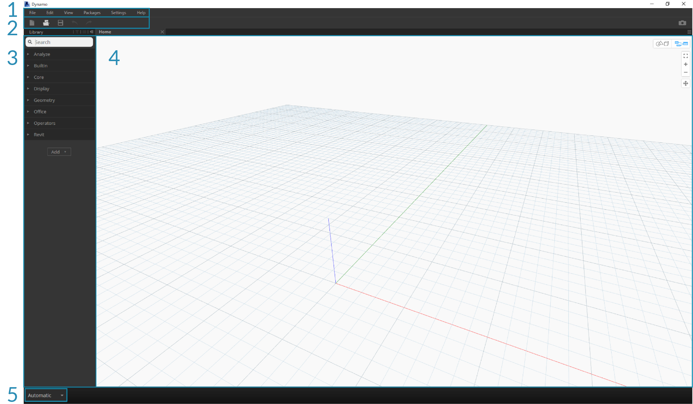
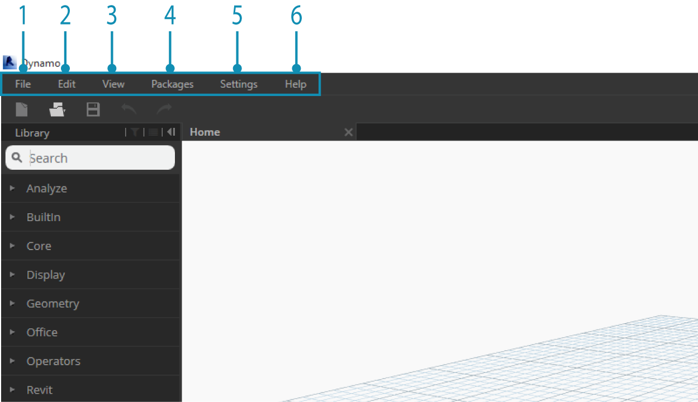
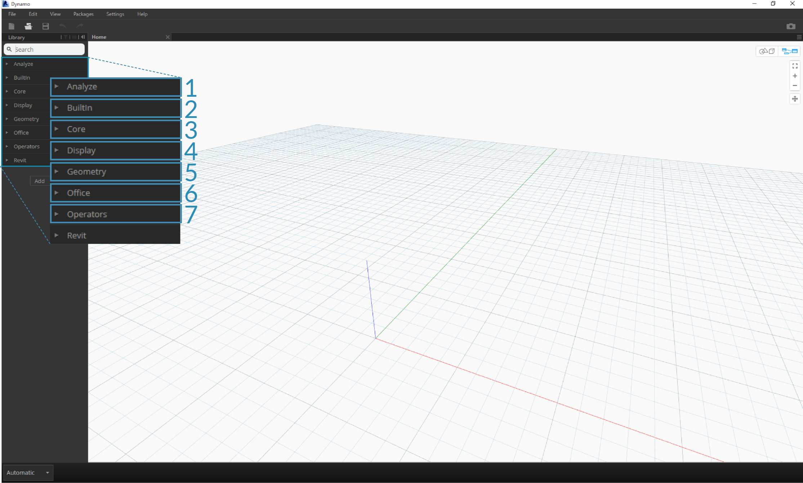
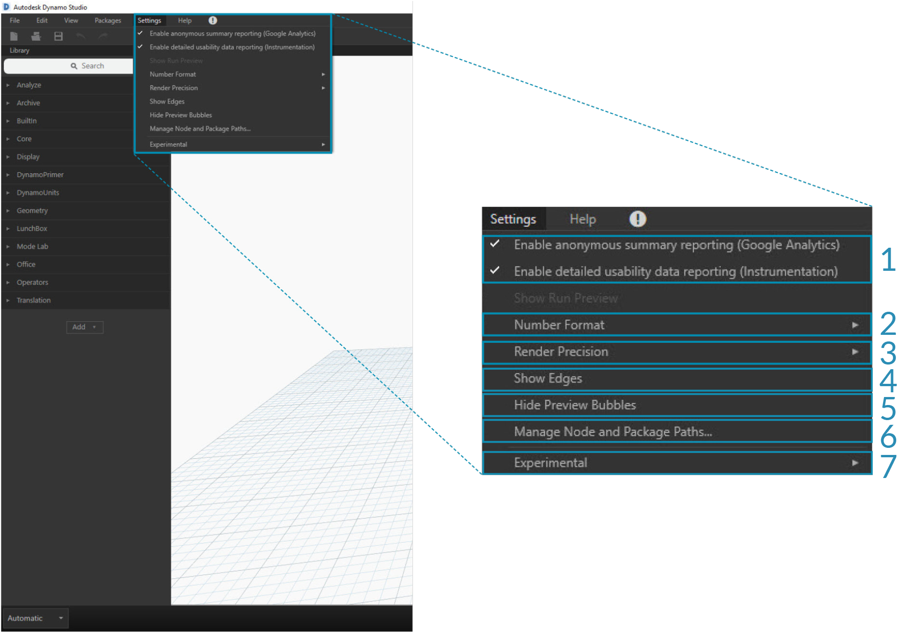
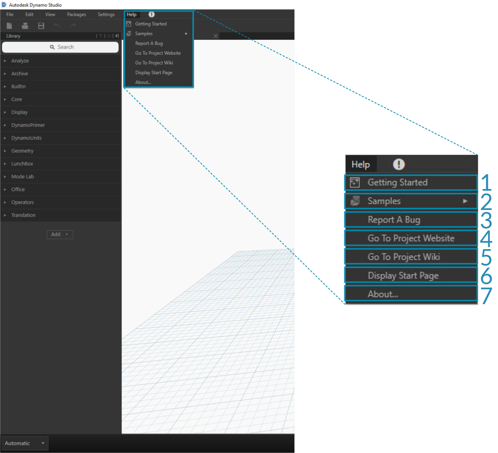

## Dynamo 使用者介面

Dynamo 的使用者介面 (UI) 分為五個主要區域，其中最大的區域是我們編寫視覺程式所在的工作區。

> 1. 功能表
2. 工具列
3. 資源庫
4. 工作區
5. 執行列

接下來我們將更深入地探索使用者介面以及每個區域的功能。

#### 功能表

下拉式功能表是很便利的位置，可以從中找到 Dynamo 應用程式的一些基本功能。與大多數 Windows 軟體類似，可以在前兩個功能表中找到與管理檔案相關的動作以及用於選取與內容編輯的作業。其餘的功能表包含 Dynamo 更具體的功能。

> 1. 檔案
2. 編輯
3. 檢視
4. 套件
5. 設定
6. 說明

#### 工具列

Dynamo 的工具列包含一系列按鈕，可快速存取以使用檔案及退回 [Ctrl + Z] 與重做 [Ctrl + Y] 指令。最右側是另一個按鈕，可以匯出工作區的快照，這對於文件及分享非常有用。

> 1. 新建 - 建立新 .dyn 檔案
2. 開啟 - 開啟既有 .dyn (工作區) 或 .dyf (自訂節點) 檔案
3. 儲存/另存新檔 - 儲存作用中的 .dyn 或 .dyf 檔案
4. 退回 - 退回上一個動作
5. 重做 - 重做下一個動作
6. 匯出工作區做為影像 - 將可見工作區匯出為 PNG 檔案

#### 資源庫

資源庫包含所有載入的節點，其中包括安裝隨附的預設節點，以及已載入的其他所有自訂節點或套件。在資源庫中，根據節點是**建立**資料、執行**動作**還是**查詢**資料，會將節點按階層歸入相應的資源庫、品類及子品類 (若適用) 內。

##### 瀏覽

依預設，**資源庫**包含八個節點品類。**「核心」**與**「幾何圖形」**功能表很適合在開始探索時使用，因為它們包含最大數量的節點。透過在這些品類中進行瀏覽，能以最快方式瞭解可以加入到工作區的項目所在的階層，並以最佳方式探索尚未使用的新節點。

> 現在我們將著重介紹預設節點集合，但請注意，我們稍後會使用自訂節點、其他資源庫及 Package Manager 延伸此資源庫。

> 1. Analyze
2. Built-in Functions
3. Core
4. Geometry
5. Migration
6. Office
7. Operators

在功能表中按一下以瀏覽資源庫。按一下「幾何圖形」>「圓」。請注意所顯示的新的功能表部分，尤其是**「建立」**與**「查詢」**標示。

> 1. 資源庫
2. 品類
3. 子品類：建立/動作/查詢
4. 節點
5. 節點描述與性質 - 將滑鼠懸停在節點圖示上時會顯示此內容。

從上述「圓」功能表中，將滑鼠懸停在 **ByCenterPointRadius** 上。此視窗將顯示除節點名稱與圖示之外的更多節點詳細資訊。我們由此可以快速瞭解節點的功能、所需的輸入及其提供的輸出。

> 1. 描述 - 節點的普通語言描述
2. 圖示 -「資源庫」功能表中更大版本的圖示
3. 輸入 - 名稱、資料類型與資料結構
4. 輸出 - 資料類型與結構

##### 搜尋

如果您知道希望加入至工作區的節點相關特性，**「搜尋」**欄位會為您提供極大幫助。您不在工作區內編輯設定或指定值時，游標會永遠顯示在此欄位中。若您開始鍵入，Dynamo 資源庫會顯示所選最適合的相符項 (具有軌跡，可指明在節點品類中的位置) 以及搜尋的備用相符項清單。若您按 Enter 或按一下所截短瀏覽器中的項目，會將亮顯的節點加入至工作區的中心。

> 1. 搜尋欄位
2. 最適合的結果/已選取
3. 備用相符項

### 設定

從幾何圖形到使用者設定，這些選項都位於**「設定」**功能表中。您可以在此選擇加入或退出共用使用者資料以改善 Dynamo，並定義應用程式的小數位數精確度與幾何圖形彩現品質。

> 注意事項：請記住 Dynamo 的單位是一般單位。

> 1. 啟用報告 - 這些選項用於共用使用者資料以提高 Dynamo。
2. 數字格式選項 - 變更小數的文件設定。
3. 彩現精確度 - 提高或降低文件的彩現品質。
4. 展示/隱藏幾何圖形的邊 - 切換 3D 幾何圖形的邊。
5. 展示/隱藏預覽標示圈 - 切換節點下方的資料預覽標示圈。
6. 管理節點和套件路徑 - 管理檔案路徑，以便讓節點與套件展示在資源庫中。
7. 啟用實驗功能 - 使用 Dynamo 中新的測試版功能。

### 說明

如果您遇到問題，請查閱**「說明」**功能表。在此您可以尋找安裝隨附的範例檔案，並透過網際網路瀏覽器存取其中一個 Dynamo 參考網站。如果需要，請透過**「關於」**選項檢查所安裝 Dynamo 的版本及其是否為最新。

> 1. 入門 - 使用 Dynamo 的簡要介紹。
2. 範例 - 參考範例檔案。
3. 報告錯誤 - 在 Github 開啟問題。
4. 移至專案網站 - 在 Github 上檢視 Dynamo 專案。
5. 移往專案 Wiki - 造訪 Wiki，以學習使用 Dynamo API 進行開發，支援資源庫與工具。
6. 顯示開始頁面 - 返回至文件中的 Dynamo 開始頁面。
7. 關於 - Dynamo 版本資料。

