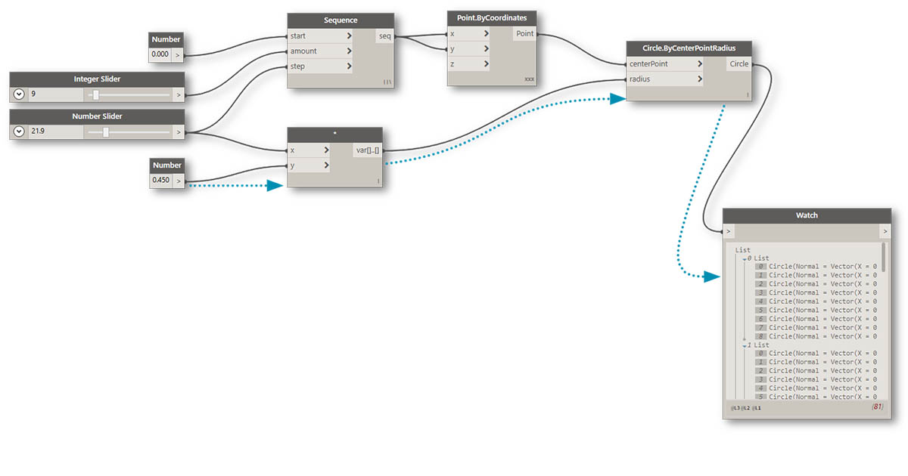
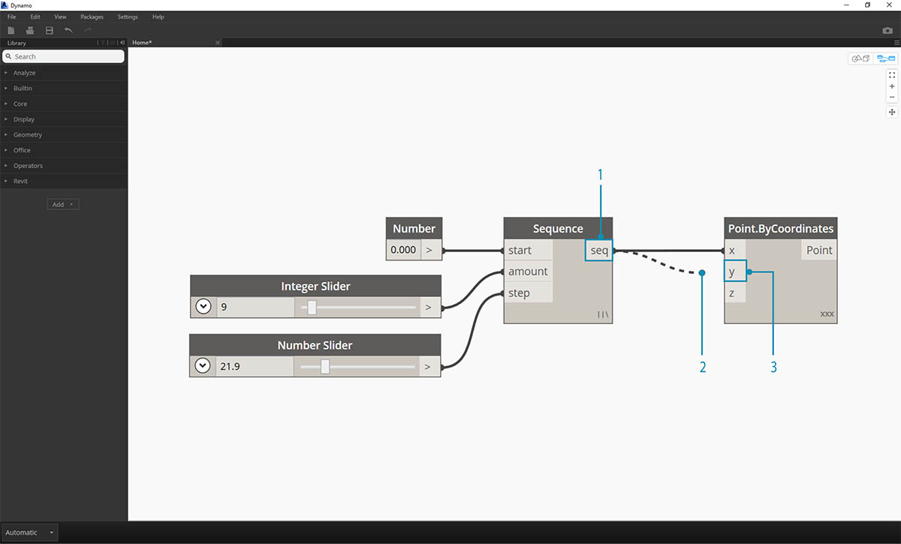

## 線路

線路用於連接節點以建立關係並建立視覺程式流。我們可以將其按字面意思視為電子線材，用於將資料脈衝從一個物件傳遞至另一個物件。

### 程式流

線路用於將一個節點的輸出埠連結至另一個節點的輸入埠。此定向性建立視覺程式中**的資料流**。 雖然我們可以在工作區中隨意排列節點，但由於輸出埠位於節點右側，而輸入埠位於左側，因此我們通常可以說程式流是從左到右。



### 建立線路

我們透過在埠上按一下滑鼠，然後在另一個節點的埠上按一下滑鼠來建立線路，從而建立連接。建立連接時，線路將顯示為虛線，當成功連結後，將變為實線。資料將一律透過此線路從輸出流向輸入 ； 但是，我們可透過改變點按所連結埠的順序，建立任何方向的線路。

> 提示： 在第二次點按以完成連結之前，允許線路連結至埠，並將滑鼠游標懸停在那裡， 以查看埠工具提示。



> 1. 按一下數字順序節點的```順序```輸出埠
2. 當您將滑鼠游標向另一個埠移動時，會建立虛線線路
3. 按一下 Point.ByCoordiantes 的```「Y」```輸入埠以完成連接

### 編輯線路

我們會經常需要透過編輯線路表示的連線來調整視覺程式中的程式流。若要編輯線路，請按一下已連結節點的輸入埠。您現在有兩個選項：


> 1. 既有線路
2. 若要變更指向輸入埠的連結，請按一下另一輸入埠
3. 若要移除線路，請將線路移開，然後按一下工作區

### 線路預覽

依預設，線路將以灰色線條進行預覽。選取節點後，它將使用與節點相同水藍色高亮顯示方法顯示任何連結線路。


> 1. 預設線路
2. 亮顯線路

Dynamo 還容許我們透過「檢視」>「連接器」功能表自訂工作區中線路的外觀。在此，我們可以在曲線或折線線路之間進行切換或關閉它們。


> 1. 連結器類型：曲線
2. 連結器類型：折線

