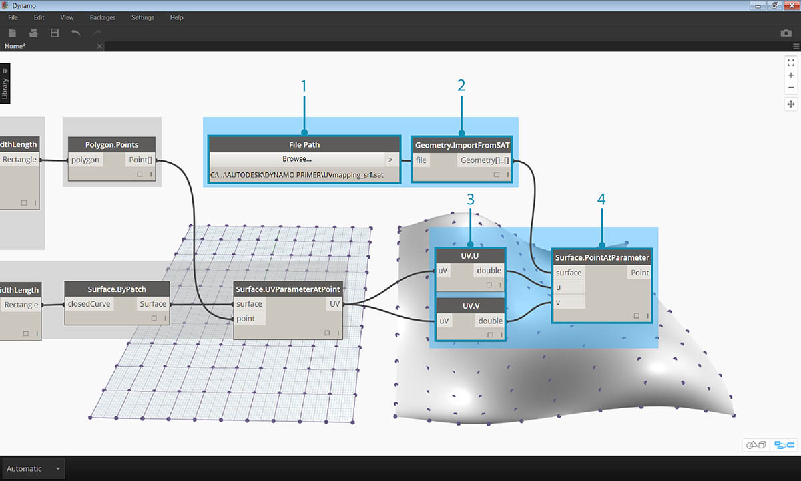
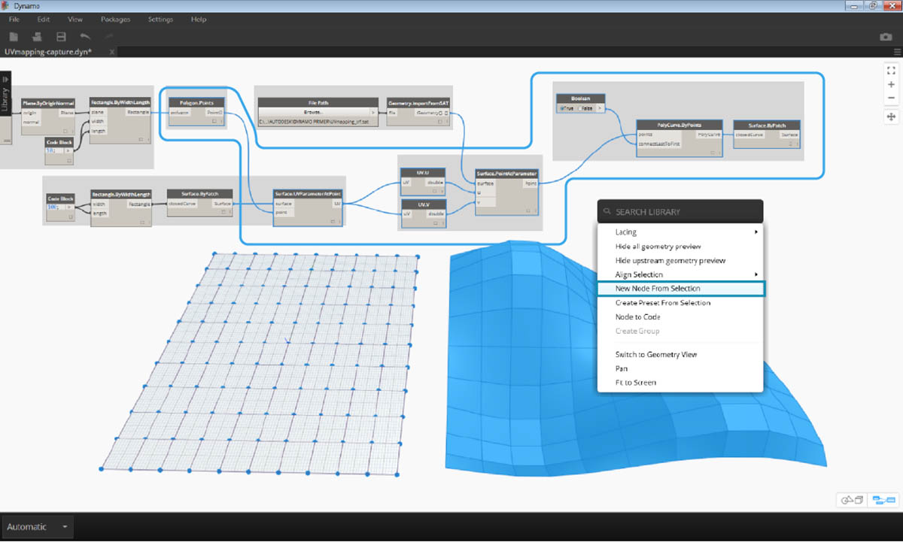
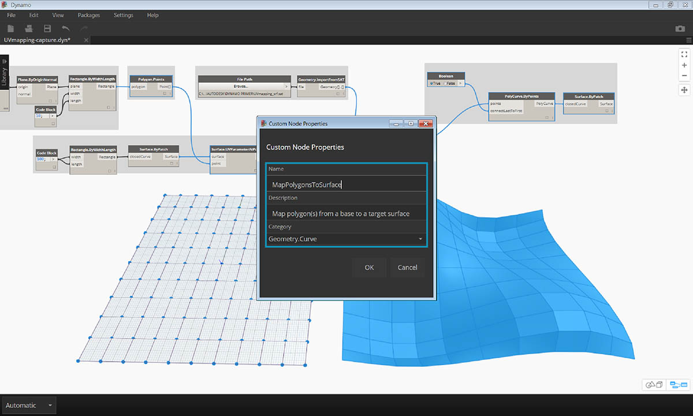
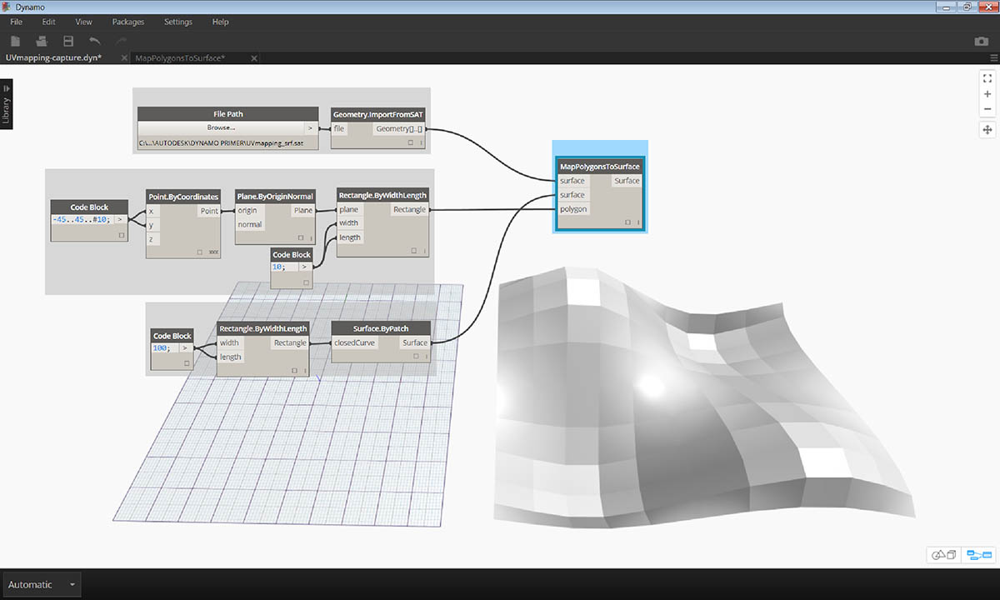
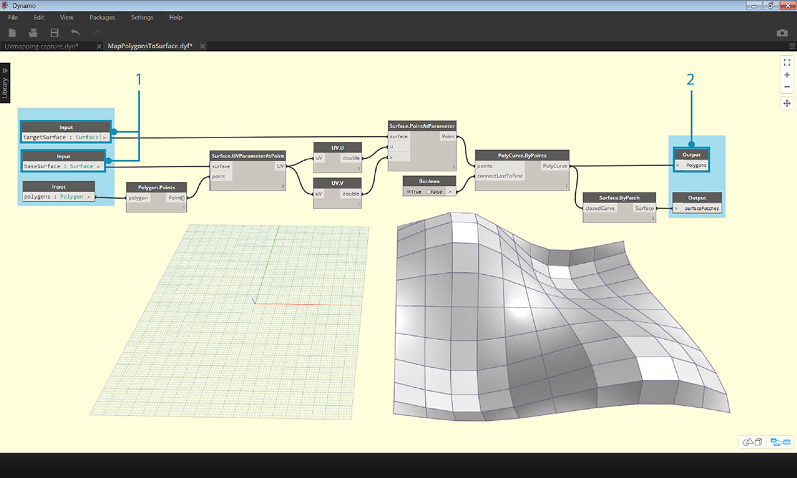
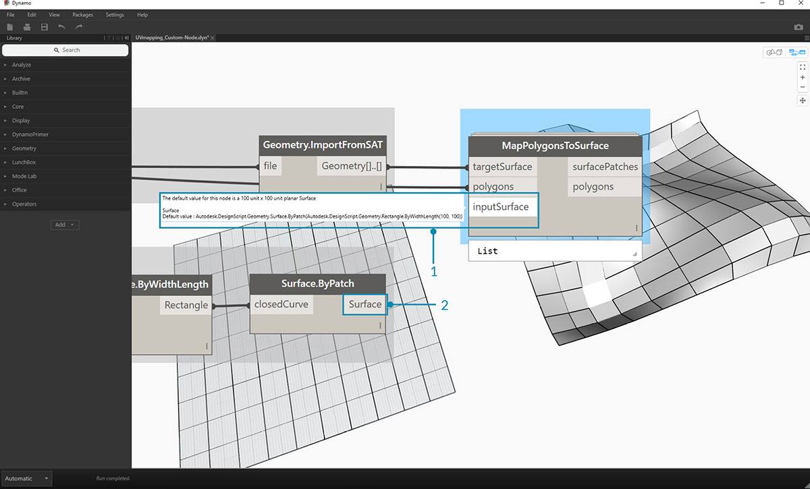

## 建立自訂節點

Dynamo 提供自訂節點的多種不同建立方法。您可以從頭開始建置自訂節點、從既有圖表建置自訂節點，或使用 C# 明確建置自訂節點。在本節中，我們將討論在 Dynamo 使用者介面內透過既有圖表建置自訂節點。此方法非常適用於清理工作區，以及封裝一系列節點以供在其他位置重複使用。

### UV 對映的自訂節點

在以下影像中，我們將使用 UV 座標在曲面之間對映點。我們將使用此概念建立對 XY 平面中的曲線進行參考的面板化曲面。在此，我們將建立四邊形面板以進行面板化，但運用相同邏輯，我們可以使用 UV 對映建立多種面板。這是開發自訂節點的好機會，因為我們在此圖表或在其他 Dynamo 工作流程中，可以更輕鬆地重複使用類似程序。

### 從既有圖表建立自訂節點

> 下載並解壓縮此練習的範例檔案 (按一下右鍵，然後按一下「連結另存為...」)。附錄中提供範例檔案的完整清單。[UV-CustomNode.zip](datasets/9-2/UV-CustomNode.zip)

接下來先建立我們希望巢狀插入到自訂節點中的圖表。在此範例中，我們將建立使用 UV 座標將多邊形從基準曲面對映至目標曲面的圖表。我們會經常使用此 UV 對映程序，因此該程序是建立自訂節點的良好備用程序。若要取得有關曲面與 UV 空間的更多資訊，請參閱第 5.5 節。在以上下載的 .zip 檔案中包含完整圖表 *UVmapping_Custom-Node.dyn*。

> 1. **Code Block：**使用程式碼塊建立介於 45 與 -45 之間的一系列 10 個數字。
2. **Point.ByCoordinates：**將 Code Block 的輸出連接至「x」與「y」輸入，並將鑲邊設定為「叉積」。現在應該已建立點的格線。
3. **Plane.ByOriginNormal：**將*「Point」*輸出連接至*「origin」*輸入，以便在每個點處建立平面。將使用預設的法線向量 (0,0,1)。
4. **Rectangle.ByWidthLength：**將上一步中的平面連接至*「plane」*輸入，並使用具有值 *10* 的 Code Block 指定寬度與長度。

現在應該能看到矩形的格線。接下來使用 UV 座標將這些矩形對映至目標曲面。

> 1. **Polygon.Points：**將上一步中的矩形輸出連接至*「polygon」*輸入，以萃取每個矩形的角點。這些是將要對映至目標曲面的點。
2. **Rectangle.ByWidthLength：**使用具有值 *100* 的 Code Block 指定矩形的長度與寬度。這將是基準曲面的邊界。
3. **Surface.ByPatch：**將上一步中的矩形連接至*「closedCurve」*輸入，以建立基準曲面。
4. **Surface.UVParameterAtPoint：**連接 *Polygon.Points* 節點的*「Point」*輸出與 *Surface.ByPatch* 節點的*「Surface」*輸出，以傳回每個點處的 UV 參數。

現在，我們已建立基準曲面與一組 UV 座標，可以匯入目標曲面並在曲面之間對映點。

> 1. **File Path：**選取要匯入的曲面的檔案路徑。檔案類型應是 .SAT。按一下*「瀏覽...」*按鈕，導覽至以上所下載 .zip 檔案中的 *UVmapping_srf.sat* 檔案。
2. **Geometry.ImportFromSAT：**連接檔案路徑以匯入曲面。您在幾何圖形預覽中應該能看到匯入的曲面。
3. **UV：**將 UV 參數輸出連接至 *UV.U* 與 *UV.V* 節點。
4. **Surface.PointAtParameter：**連接匯入的曲面以及 u 與 v 座標。現在，您應該能看到目標曲面上 3D 點的格線。

最後一步是使用 3D 點來建構矩形曲面修補。

> 1. **PolyCurve.ByPoints：**連接曲面上的點以建構通過點的 PolyCurve。
2. **Boolean：**加入布林值至工作區，將其連接至*「connectLastToFirst」*輸入，並切換至「True」以封閉 polycurve。現在，您應該能看到對映至曲面的矩形。
3. **Surface.ByPatch：**將 polycurve 連接至*「closedCurve」*輸入，以建構曲面修補。

現在選取要巢狀插入至自訂節點的節點，同時考慮希望採用的節點輸入與輸出。我們希望自訂節點盡可能靈活，因此該自訂節點應該能對映任何多邊形，而不僅僅是矩形。

> 選取以上節點 (從 *Polygon.Points* 開始)，在工作區上按一下右鍵，然後選取*「node from selection」*。

> 在「自訂節點性質」對話方塊中，指定自訂節點的名稱、描述及品類。

> 自訂節點已顯著清理工作區。請注意，已根據原始節點命名輸入與輸出。接下來編輯自訂節點，以便讓名稱更具描述性。

> 按兩下「自訂節點」以對其進行編輯。這將開啟工作區，並以黃色背景表示節點內部。

> 1. **Inputs：**將輸入名稱變更為 *baseSurface* 與 *targetSurface*。
2. **Outputs：**為對映的多邊形加入其他輸出。
> 儲存自訂節點，然後返回首頁工作區。

> **MapPolygonsToSurface** 節點將反映我們剛剛進行的變更。

我們也可以在**自訂註釋**中加入內容，以提高自訂節點的堅實性。註釋有助於提示輸入與輸出類型，或說明節點的功能。使用者將游標懸停在自訂節點的輸入或輸出上方時，將顯示註釋。

> 按兩下「自訂節點」以對其進行編輯。這會重新開啟黃色背景工作區。

> 1. 開始編輯輸入程式碼塊。若要開始註釋，請在註釋文字之前鍵入「//」。鍵入有助於說明節點的任何內容 - 在此我們將描述 *targetSurface*。
2. 接下來還要設定輸入類型等於某個值，以設定 *inputSurface* 的預設值。在此，我們將預設值設定為原始 Surface.ByPatch 設定。

> 也可以將註釋套用到 Outputs。開始編輯 Output Code Block 中的文字。若要開始註釋，請在註釋文字之前鍵入「//」。在此，我們將加入更深入的描述，以說明 *Polygons* 與 *surfacePatches* 輸出。

> 1. 將游標懸停在自訂節點輸入上方以查看註釋。
2. 設定 *inputSurface* 的預設值後，我們也可以執行定義，而不提供曲面輸入。

