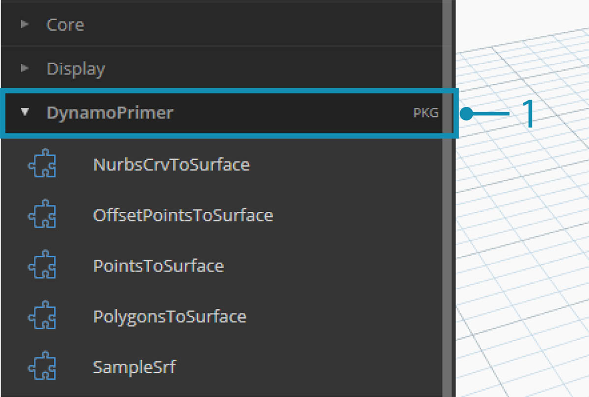
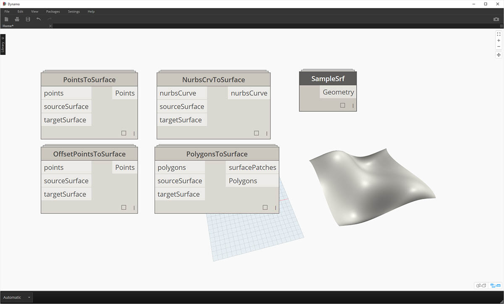
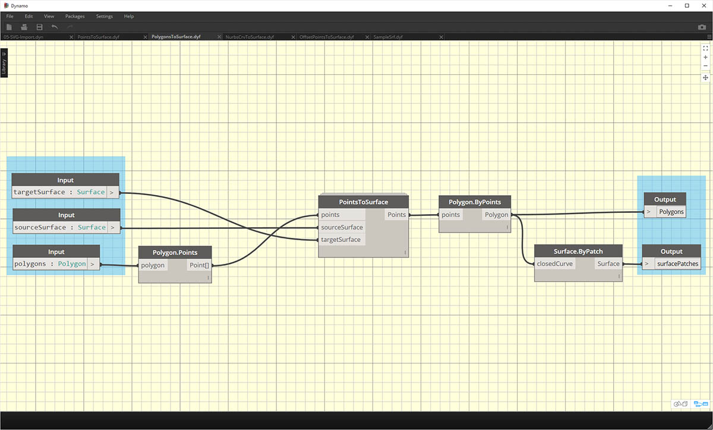
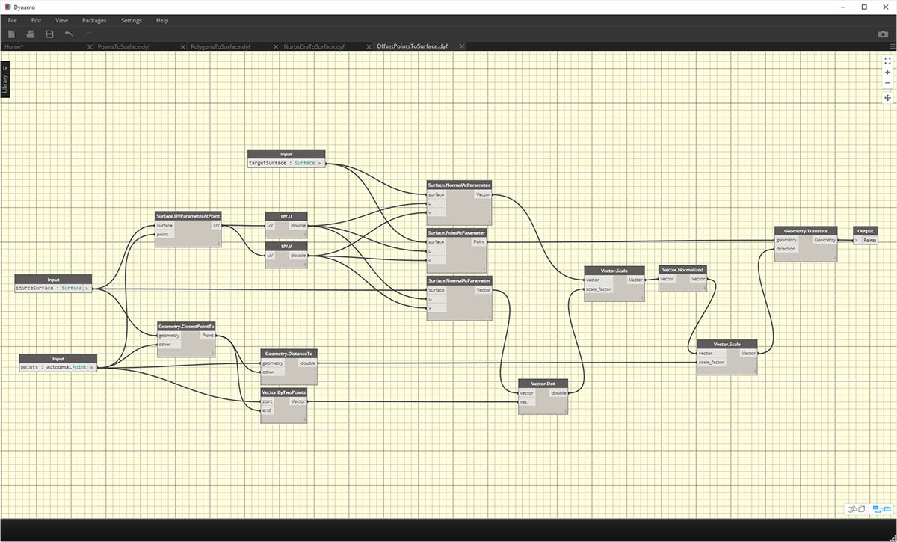
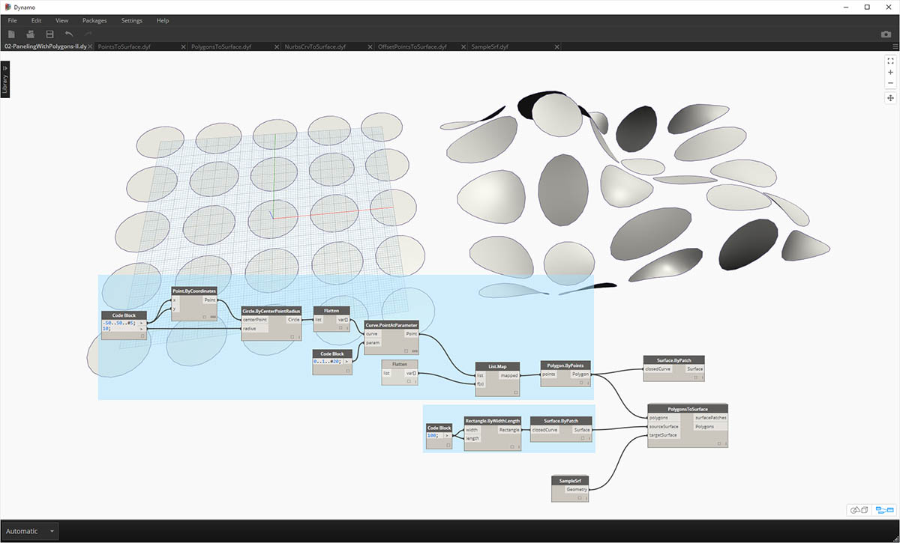
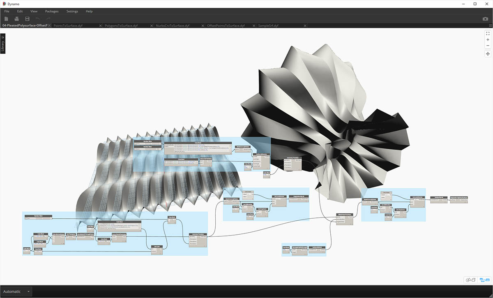
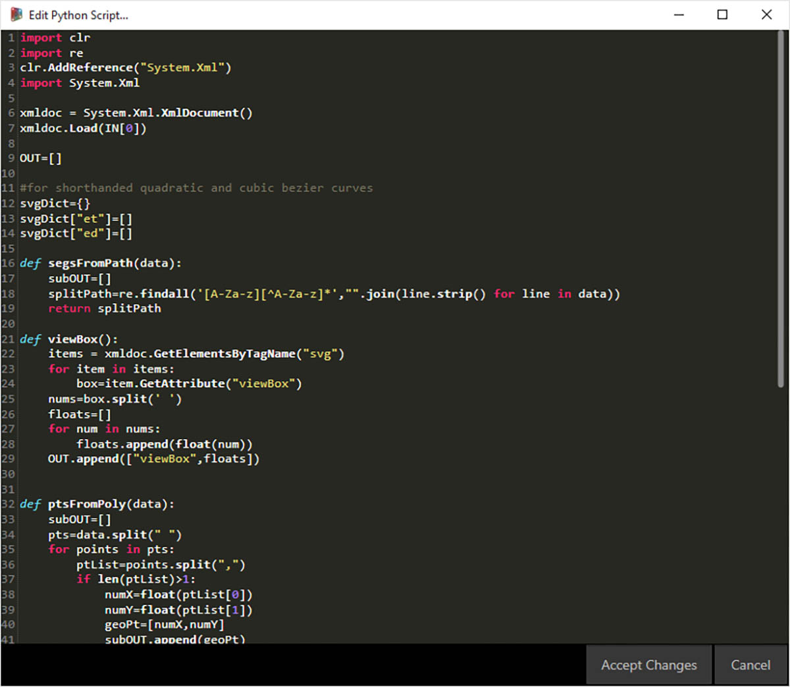
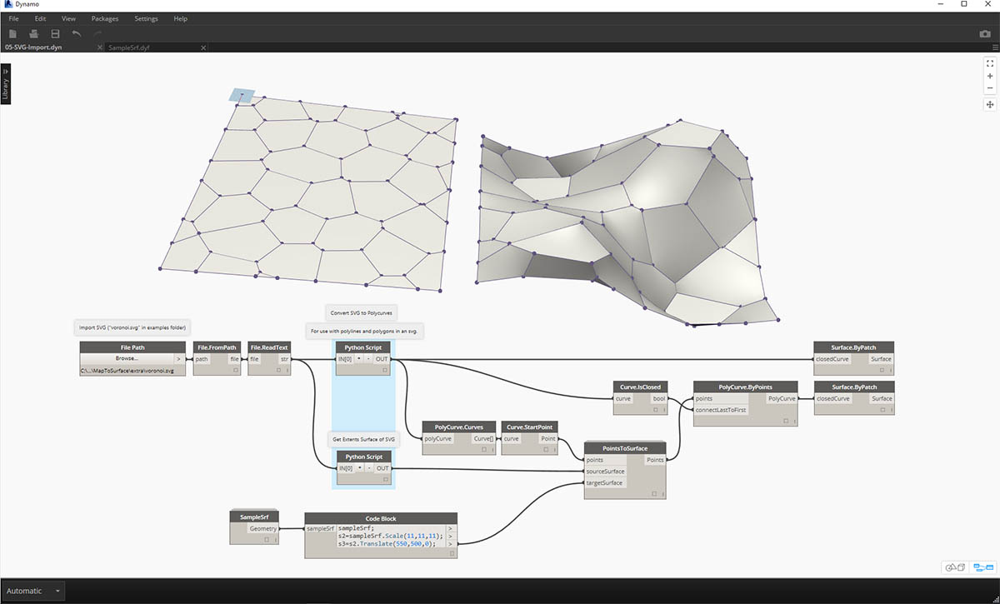

## 開發套件

Dynamo 提供了多種套件建立方式，供個人使用或與 Dynamo 社群分享。在以下研究的案例中，我們將瞭解如何透過解構既有的套件以設置套件。此案例研究以上一章的課程為基礎，會提供一組自訂節點，以便在 Dynamo 曲面之間依 UV 座標對映幾何圖形。

### MapToSurface

我們將使用的範例套件會演示曲面之間點的 UV 對映。我們已在此手冊的〈[建立自訂節點](../09_Custom-Nodes/9-2_Creating.md)〉一節中建置了工具的基礎內容。以下檔案將展示我們如何利用 UV 對映的概念，以及如何為可發佈資源庫開發一組工具。

> 在此影像中，我們將使用 UV 座標在曲面之間對映點。套件以此概念為基礎，但具有更複雜的幾何圖形。

### 安裝套件

在上一章中，我們探索了根據 XY 平面中定義的曲線在 Dynamo 中將曲面面板化的方式。此案例研究將針對幾何圖形的更多標註延伸這些概念。我們會將此套件安裝為已建置的套件，以演示其開發方式。在下一節，我們將演示此套件的發佈方式。

> 這部分內容很簡單。在 Dynamo 中，導覽至*「套件」>「搜尋套件...」*

> 搜尋套件*「MapToSurface」*(整體是一個單字)。

> 1. 找到套件後，按一下套件名稱左側的大下載箭頭。此作業會將套件安裝到 Dynamo 中。

> 1. 安裝後，在「DynamoPrimer」群組或 Dynamo 資源庫下應該會顯示自訂節點。現在已安裝套件，接下來瞭解其設置方式。

### 自訂節點

我們將建立的套件會使用已建置供參考的五個自訂節點。接下來瞭解每個節點的行為。某些自訂節點會建置其他自訂節點，圖表的配置可供其他使用者以簡單的方式進行瞭解。

> 這是具有五個自訂節點的簡單套件。在以下步驟中，我們將簡要討論每個自訂節點的設置。

> **PointsToSurface：**這是基本自訂節點，是所有其他對映節點的基礎。簡言之，節點會將來源曲面 UV 座標的點對映至目標曲面 UV 座標的位置。由於點是最基本的幾何圖形，以此為基礎會建置更複雜的幾何圖形，因此我們可以使用此邏輯在曲面之間對映 2D 甚至 3D 幾何圖形。

> **PolygonsToSurface：**只需使用這裡的多邊形，即可演示將對映點從 1D 幾何圖形延伸至 2D 幾何圖形的邏輯。請注意，我們已將*「PointsToSurface」*節點巢狀插入此自訂節點中。使用此方式，我們可以將每個多邊形的點對映至曲面，然後從這些對映的點重新產生多邊形。透過保持正確的資料結構 (點的清單的清單)，我們可以在多邊形精簡為一組點後保持多邊形的獨立性。

> **NurbsCrvtoSurface：**這裡套用的邏輯與*「PolygonsToSurface」*節點中相同。但不是對映多邊形點，而是對映 NURBS 曲線的控制點。

> **OffsetPointsToSurface：**此節點稍顯複雜，但概念很簡單：此節點與*「PointsToSurface」*節點類似，可在曲面之間對映點。但是，它也會考慮到不在原始來源曲面上的點，會取得這些點距最近 UV 參數的距離，並將此距離對映至對應 UV 座標處的目標曲面法線。在查看範例檔案時，這會更有意義。

> **SampleSrf：**這是簡單的節點，可建立參數式曲面，以便從來源格線對映至範例檔案中的波浪曲面。

### 範例檔案

在套件的根資料夾內可以找到範例檔案 (在 Dynamo 中，移至*「套件」>「管理套件...」*以導覽至該資料夾)。

> 在「管理套件」視窗中，按一下*「MapToSurface」*右側的三個垂直點，然後選擇*「展示根目錄」。*

在根目錄開啟的狀況下，導覽至*「extra」*資料夾，該資料夾包含套件中不是自訂節點的所有檔案。這是 Dynamo 套件的範例檔案 (若存在) 的儲存位置。以下螢幕擷取畫面將討論每個範例檔案中演示的概念。

> **01-PanelingWithPolygons：**此範例檔案將演示如何根據矩形的格線使用*「PointsToSurface」*將曲面面板化。這看上去應該很熟悉，因為我們在[上一章](../09_Custom-Nodes/9-2_Creating.md)演示了類似的工作流程。

> **02-PanelingWithPolygons-II：**此練習檔案使用類似的工作流程，將展示在曲面之間對映圓 (或表示圓的多邊形) 所用的設置。此練習檔案使用*「PolygonsToSurface」*節點。

> **03-NurbsCrvsAndSurface：**此範例檔案使用「NurbsCrvToSurface」節點，因此複雜性更高。會將目標曲面偏移指定的距離，並將 NURBS 曲線對映至原始目標曲面與偏移曲面。由此對對映的兩條曲線執行斷面混成以建立曲面，然後增厚該曲面。產生的這個實體具有代表目標曲面法線的波浪線。

> **04-PleatedPolysurface-OffsetPoints：**此範例檔案將演示如何將有褶 PolySurface 從來源曲面對映至目標曲面。來源曲面與目標曲面分別是跨格線的矩形曲面與迴轉曲面。

> **04-PleatedPolysurface-OffsetPoints：**從來源曲面對映至目標曲面的來源 PolySurface。

> **05-SVG-Import：**由於自訂節點可以對映不同類型的曲線，因此這最後一個檔案參考從 Illustrator 匯出的 SVG 檔案，並將匯入的曲線對映至目標曲面。

> **05-SVG-Import：**透過剖析 .svg 檔案的語法，將曲線從 .xml 格式轉換為 Dynamo polycurve。

> **05-SVG-Import：**將匯入的曲線對映至目標曲面。我們可藉此以明確方式 (點選) 在 Illustrator 中設計面板化，匯入至 Dynamo，然後套用至目標曲面。

